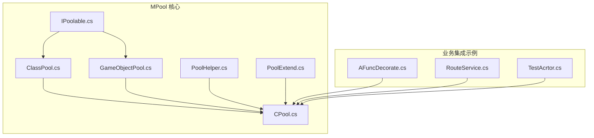
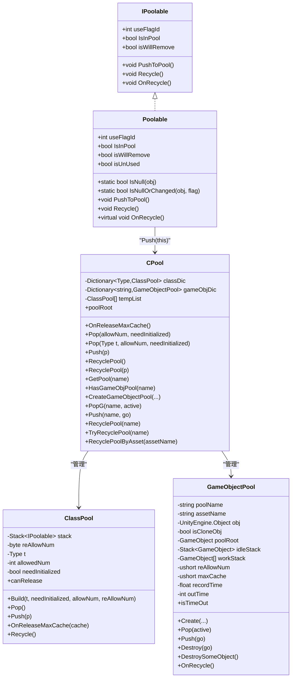
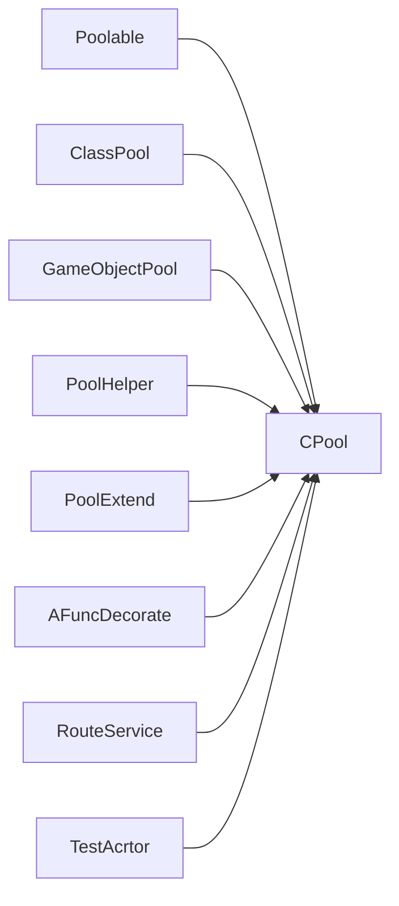
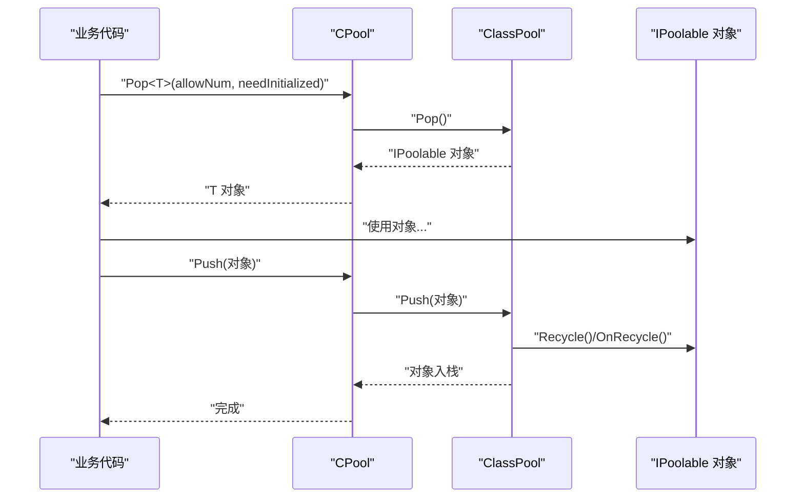

# 对象池系统 (MPool)

<cite>
**本文引用的文件**   
- [IPoolable.cs](file://Assets/Game/Framework/MPool/IPoolable.cs)
- [GameObjectPool.cs](file://Assets/Game/Framework/MPool/GameObjectPool.cs)
- [ClassPool.cs](file://Assets/Game/Framework/MPool/ClassPool.cs)
- [CPool.cs](file://Assets/Game/Framework/MPool/CPool.cs)
- [PoolHelper.cs](file://Assets/Game/Framework/MPool/PoolHelper.cs)
- [PoolExtend.cs](file://Assets/Game/Framework/MPool/PoolExtend.cs)
- [AFuncDecorate.cs](file://Assets/Game/Scripts/Game/Runtime/Logic/Decorate/AFuncDecorate.cs)
- [RouteService.cs](file://Assets/Game/Scripts/Game/Runtime/Logic/Router/RouteService.cs)
- [TestAcrtor.cs](file://Assets/Game/Scripts/Game/Runtime/Logic/Actor/GameActor/TestAcrtor.cs)
</cite>

## 目录
1. [简介](#简介)
2. [项目结构](#项目结构)
3. [核心组件](#核心组件)
4. [架构总览](#架构总览)
5. [详细组件分析](#详细组件分析)
6. [依赖关系分析](#依赖关系分析)
7. [性能与线程安全](#性能与线程安全)
8. [配置与容量控制](#配置与容量控制)
9. [使用示例与最佳实践](#使用示例与最佳实践)
10. [监控、调试与常见问题](#监控调试与常见问题)
11. [结论](#结论)

## 简介
本文件为 SimulationClient 的对象池系统（MPool）提供系统化文档。MPool 围绕三类对象池展开：
- GameObjectPool：用于 Unity GameObject 的复用管理，支持预分配、自动扩容、超时回收与最大缓存清理。
- ClassPool：用于实现 IPoolable 接口的引用类型实例复用，支持按需构造与未初始化构造两种模式。
- CPool：统一入口静态类，负责按类型或名称分发到具体池，并提供全局释放策略。

此外，IPoolable 接口与 Poolable 抽象基类定义了对象生命周期协议，确保对象在入池/出池时能正确重置状态，避免脏数据与内存泄漏。

## 项目结构
MPool 位于 Assets/Game/Framework/MPool 下，包含以下关键文件：
- IPoolable.cs：定义对象池化协议与默认实现
- ClassPool.cs：通用引用类型对象池
- GameObjectPool.cs：Unity GameObject 专用对象池
- CPool.cs：统一访问入口与全局回收策略
- PoolHelper.cs：常用池名常量与便捷方法
- PoolExtend.cs：扩展方法，简化调用

图表来源
- [IPoolable.cs:1-71](file://Assets/Game/Framework/MPool/IPoolable.cs#L1-L71)
- [ClassPool.cs:1-127](file://Assets/Game/Framework/MPool/ClassPool.cs#L1-L127)
- [GameObjectPool.cs:1-191](file://Assets/Game/Framework/MPool/GameObjectPool.cs#L1-L191)
- [CPool.cs:1-263](file://Assets/Game/Framework/MPool/CPool.cs#L1-L263)
- [PoolHelper.cs:1-66](file://Assets/Game/Framework/MPool/PoolHelper.cs#L1-L66)
- [PoolExtend.cs:1-25](file://Assets/Game/Framework/MPool/PoolExtend.cs#L1-L25)
- [AFuncDecorate.cs:1-361](file://Assets/Game/Scripts/Game/Runtime/Logic/Decorate/AFuncDecorate.cs#L1-L361)
- [RouteService.cs:1-53](file://Assets/Game/Scripts/Game/Runtime/Logic/Router/RouteService.cs#L1-L53)
- [TestAcrtor.cs:1-41](file://Assets/Game/Scripts/Game/Runtime/Logic/Actor/GameActor/TestAcrtor.cs#L1-L41)

章节来源
- [IPoolable.cs:1-71](file://Assets/Game/Framework/MPool/IPoolable.cs#L1-L71)
- [ClassPool.cs:1-127](file://Assets/Game/Framework/MPool/ClassPool.cs#L1-L127)
- [GameObjectPool.cs:1-191](file://Assets/Game/Framework/MPool/GameObjectPool.cs#L1-L191)
- [CPool.cs:1-263](file://Assets/Game/Framework/MPool/CPool.cs#L1-L263)
- [PoolHelper.cs:1-66](file://Assets/Game/Framework/MPool/PoolHelper.cs#L1-L66)
- [PoolExtend.cs:1-25](file://Assets/Game/Framework/MPool/PoolExtend.cs#L1-L25)

## 核心组件
- IPoolable 与 Poolable：定义对象进入/离开池时的生命周期钩子与状态标记，提供统一的 PushToPool/Recycle/OnRecycle 语义。
- ClassPool：基于 Stack<IPoolable> 的引用类型对象池，支持按需创建与未初始化创建，内置 useFlagId 防误用机制。
- GameObjectPool：基于 Stack<GameObject> 与 List<GameObject> 的双栈模型，维护空闲与工作集合，支持超时回收与最大缓存裁剪。
- CPool：静态门面，集中管理两类池的创建、获取、归还与全局回收；提供 poolRoot 作为 GameObject 池的统一父节点。
- PoolHelper：封装常用 Actor 根节点空对象池的创建与获取逻辑。
- PoolExtend：提供 AddChild_Pool、PopFromPool、PushToPool 等便捷扩展方法。

章节来源
- [IPoolable.cs:1-71](file://Assets/Game/Framework/MPool/IPoolable.cs#L1-L71)
- [ClassPool.cs:1-127](file://Assets/Game/Framework/MPool/ClassPool.cs#L1-L127)
- [GameObjectPool.cs:1-191](file://Assets/Game/Framework/MPool/GameObjectPool.cs#L1-L191)
- [CPool.cs:1-263](file://Assets/Game/Framework/MPool/CPool.cs#L1-L263)
- [PoolHelper.cs:1-66](file://Assets/Game/Framework/MPool/PoolHelper.cs#L1-L66)
- [PoolExtend.cs:1-25](file://Assets/Game/Framework/MPool/PoolExtend.cs#L1-L25)

## 架构总览
MPool 采用“协议 + 具体池 + 统一入口”的分层设计：
- 协议层：IPoolable/Poolable 约定对象生命周期。
- 池层：ClassPool 与 GameObjectPool 分别处理引用类型与 Unity 对象。
- 门面层：CPool 提供类型/名称维度的统一 API，并协调全局回收策略。
- 工具层：PoolHelper/PoolExtend 提供便捷方法与常用池名。

图表来源
- [IPoolable.cs:1-71](file://Assets/Game/Framework/MPool/IPoolable.cs#L1-L71)
- [ClassPool.cs:1-127](file://Assets/Game/Framework/MPool/ClassPool.cs#L1-L127)
- [GameObjectPool.cs:1-191](file://Assets/Game/Framework/MPool/GameObjectPool.cs#L1-L191)
- [CPool.cs:1-263](file://Assets/Game/Framework/MPool/CPool.cs#L1-L263)

## 详细组件分析

### IPoolable 与 Poolable：对象生命周期协议
- 设计要点
  - useFlagId：每次从池中取出的对象会获得新的唯一标识，便于检测对象是否被错误复用。
  - IsInPool/isWillRemove：标记对象当前是否在池中或即将被移除，配合 isUnUsed 快速判断可用性。
  - PushToPool/Recycle/OnRecycle：入池前由框架调用 Recycle，子类在 OnRecycle 中执行必要的重置逻辑。
- 复杂度与行为
  - PushToPool 内部委托给 CPool.Push，保证所有池化对象通过统一入口回收。
  - Recycle 会设置 IsInPool=true 并调用 OnRecycle，确保对象回到池中的状态一致性。
- 适用场景
  - 任何需要频繁创建销毁的引用类型均可实现该接口，从而享受零 GC 或低 GC 的复用收益。

章节来源
- [IPoolable.cs:1-71](file://Assets/Game/Framework/MPool/IPoolable.cs#L1-L71)

### ClassPool：引用类型对象池
- 数据结构
  - Stack<IPoolable>：存储可复用的对象。
  - allowedNum：累计已分配数量，用于判定是否可以整体释放该类池。
- 关键流程
  - Build：记录类型、是否需要构造函数初始化、初始预分配数量与自动扩容步长。
  - Pop：若池为空则按 reAllowNum 扩容；取出对象后清除 isWillRemove 并更新 useFlagId。
  - Push：去重检查，调用 Recycle 并将对象压栈。
  - canRelease：当允许释放且池中对象数等于已分配总数时，表示无外部引用，可整体回收。
- 性能考量
  - needInitialized=false 时使用非初始化构造，避免构造函数开销，但要求使用前完整赋值字段。
  - useFlagId 自增全局计数器，避免跨帧误用旧对象。
- 适用场景
  - 高频短生命周期的命令、路由、事件处理器等引用类型对象。

章节来源
- [ClassPool.cs:1-127](file://Assets/Game/Framework/MPool/ClassPool.cs#L1-L127)

### GameObjectPool：Unity GameObject 对象池
- 数据结构
  - Stack<GameObject> idleStack：空闲对象栈。
  - List<GameObject> workStack：工作对象列表，跟踪正在使用的对象。
  - poolRoot：统一挂载根节点，便于层级管理与批量销毁。
- 关键流程
  - Create：注册池名、资源名、克隆标志、根节点，并按 allowNum 预分配。
  - Pop：若空闲栈为空则按 reAllowNum 扩容；将对象加入 workStack 并记录使用时间。
  - Push：从 workStack 移除，挂回 poolRoot，压入 idleStack；若无工作对象则重置计时。
  - Destroy：强制激活后销毁，用于显式销毁场景。
  - DestroySomeObject：当空闲对象超过 maxCache 时销毁多余对象，控制内存峰值。
  - isTimeOut：当无工作对象且超过 outTime 时返回 true，供上层触发主动回收。
- 适用场景
  - UI 弹窗、特效、临时实体等需要频繁创建销毁的 Unity 对象。

章节来源
- [GameObjectPool.cs:1-191](file://Assets/Game/Framework/MPool/GameObjectPool.cs#L1-L191)

### CPool：统一入口与全局回收
- 职责
  - 按 Type 管理 ClassPool，按 string 管理 GameObjectPool。
  - 提供 Pop/Push 泛型与非泛型 API，以及 GameObject 的 PopG/Push。
  - 提供全局回收策略 OnReleaseMaxCache：对类池进行按类型释放或裁剪，对游戏对象池进行超缓存清理。
- 关键流程
  - Pop<T>/Pop(Type)：懒加载创建对应 ClassPool，必要时按 allowNum 预分配。
  - Push(IPoolable)：根据类型找到对应 ClassPool 入池，否则直接 Recycle。
  - CreateGameObjectPool/PopG/Push：按名称管理 GameObjectPool，不存在时警告或销毁。
  - TryRecyclePool：当无工作对象时可安全回收。
  - RecyclePoolByAsset：按资源名回收对应 GameObjectPool。
- 适用场景
  - 作为应用内对象池的唯一入口，屏蔽底层细节，统一管理生命周期。

章节来源
- [CPool.cs:1-263](file://Assets/Game/Framework/MPool/CPool.cs#L1-L263)

### PoolHelper 与 PoolExtend：便捷工具
- PoolHelper
  - 提供 Actor 根节点的空对象池名与获取方法，自动创建并缓存池。
- PoolExtend
  - AddChild_Pool：将子 Transform 添加到指定父节点并设置激活状态。
  - PopFromPool/PushToPool：对 IPoolable 与 GameObject 的便捷入池/出池方法。

章节来源
- [PoolHelper.cs:1-66](file://Assets/Game/Framework/MPool/PoolHelper.cs#L1-L66)
- [PoolExtend.cs:1-25](file://Assets/Game/Framework/MPool/PoolExtend.cs#L1-L25)

## 依赖关系分析
- 耦合关系
  - Poolable 依赖 CPool 完成 Push 操作，形成“对象 -> 门面”的单向依赖。
  - ClassPool 与 GameObjectPool 均被 CPool 管理，降低业务代码对具体池实现的感知。
- 外部依赖
  - GameObjectPool 依赖 Unity 的 GameObject.Instantiate、SetActive、Destroy 等 API。
  - ClassPool 在非初始化模式下使用 FormatterServices.GetUninitializedObject 提升性能。
- 潜在循环依赖
  - 未发现循环引用；Poolable 仅通过静态类 CPool 间接交互，避免强耦合。

图表来源
- [IPoolable.cs:1-71](file://Assets/Game/Framework/MPool/IPoolable.cs#L1-L71)
- [ClassPool.cs:1-127](file://Assets/Game/Framework/MPool/ClassPool.cs#L1-L127)
- [GameObjectPool.cs:1-191](file://Assets/Game/Framework/MPool/GameObjectPool.cs#L1-L191)
- [CPool.cs:1-263](file://Assets/Game/Framework/MPool/CPool.cs#L1-L263)
- [PoolHelper.cs:1-66](file://Assets/Game/Framework/MPool/PoolHelper.cs#L1-L66)
- [PoolExtend.cs:1-25](file://Assets/Game/Framework/MPool/PoolExtend.cs#L1-L25)
- [AFuncDecorate.cs:1-361](file://Assets/Game/Scripts/Game/Runtime/Logic/Decorate/AFuncDecorate.cs#L1-L361)
- [RouteService.cs:1-53](file://Assets/Game/Scripts/Game/Runtime/Logic/Router/RouteService.cs#L1-L53)
- [TestAcrtor.cs:1-41](file://Assets/Game/Scripts/Game/Runtime/Logic/Actor/GameActor/TestAcrtor.cs#L1-L41)

## 性能与线程安全
- 性能优化
  - 非初始化构造：ClassPool 支持 needInitialized=false，避免构造函数开销，适用于字段全量赋值的场景。
  - 预分配与自动扩容：通过 allowNum 与 reAllowNum 减少频繁分配带来的 GC 压力。
  - useFlagId：防止对象被错误复用导致的数据污染，提高稳定性。
  - 最大缓存裁剪：GameObjectPool.DestroySomeObject 与 ClassPool.OnReleaseMaxCache 控制内存峰值。
- 线程安全
  - 当前实现未引入锁或并发保护，假设单线程主循环使用。多线程环境需自行加锁或改用线程安全容器。
- 建议
  - 热点路径优先使用 needInitialized=false 并严格初始化字段。
  - 合理设置 reAllowNum 与 maxCache，平衡内存占用与分配频率。

[本节为通用指导，不直接分析具体文件]

## 配置与容量控制
- ClassPool 配置项
  - needInitialized：是否跳过构造函数以换取性能。
  - allowNum：首次预分配数量。
  - reAllowNum：自动扩容步长。
  - canRelease：当 allowedNum==stack.Count 时可整体释放该类池。
- GameObjectPool 配置项
  - allowNum：首次预分配数量。
  - reAllowNum：自动扩容步长。
  - maxCache：空闲对象最大缓存上限，超出部分将被销毁。
  - outTime：超时时间，当无工作对象超过该时间可视为空闲。
- 全局回收
  - CPool.OnReleaseMaxCache：遍历类池，按 canRelease 决定整体回收或裁剪至 2；遍历游戏对象池执行 DestroySomeObject。

章节来源
- [ClassPool.cs:1-127](file://Assets/Game/Framework/MPool/ClassPool.cs#L1-L127)
- [GameObjectPool.cs:1-191](file://Assets/Game/Framework/MPool/GameObjectPool.cs#L1-L191)
- [CPool.cs:1-263](file://Assets/Game/Framework/MPool/CPool.cs#L1-L263)

## 使用示例与最佳实践

### 获取与释放流程（序列图）

图表来源
- [CPool.cs:55-91](file://Assets/Game/Framework/MPool/CPool.cs#L55-L91)
- [ClassPool.cs:62-96](file://Assets/Game/Framework/MPool/ClassPool.cs#L62-L96)
- [IPoolable.cs:16-22](file://Assets/Game/Framework/MPool/IPoolable.cs#L16-L22)

### 使用示例（路径指引）
- 类对象池
  - 获取：参考 [AFuncDecorate.cs:73-77](file://Assets/Game/Scripts/Game/Runtime/Logic/Decorate/AFuncDecorate.cs#L73-L77)、[RouteService.cs:29-31](file://Assets/Game/Scripts/Game/Runtime/Logic/Router/RouteService.cs#L29-L31)、[TestAcrtor.cs:14](file://Assets/Game/Scripts/Game/Runtime/Logic/Actor/GameActor/TestAcrtor.cs#L14)
  - 释放：参考 [AFuncDecorate.cs:343-353](file://Assets/Game/Scripts/Game/Runtime/Logic/Decorate/AFuncDecorate.cs#L343-L353)、[RouteService.cs:11-21](file://Assets/Game/Scripts/Game/Runtime/Logic/Router/RouteService.cs#L11-L21)
- GameObject 对象池
  - 创建与获取：参考 [PoolHelper.cs:33-43](file://Assets/Game/Framework/MPool/PoolHelper.cs#L33-L43)、[PoolHelper.cs:45-54](file://Assets/Game/Framework/MPool/PoolHelper.cs#L45-L54)
  - 释放：参考 [PoolHelper.cs:56-65](file://Assets/Game/Framework/MPool/PoolHelper.cs#L56-L65)

### 最佳实践
- 始终在 OnRecycle 中重置对象状态，避免脏数据。
- 使用 useFlagId 校验对象有效性，防止跨帧误用。
- 合理设置 allowNum/reAllowNum/maxCache/outTime，结合业务峰值调整。
- 对于不需要构造函数的类，开启 needInitialized=false 以提升性能。
- 及时调用 TryRecyclePool/RecyclePool，避免长期持有无用池。

[本节为通用指导，不直接分析具体文件]

## 监控、调试与常见问题

### 常见问题与排查
- 问题：对象使用后未释放导致内存增长
  - 现象：workStack 持续增长，idleStack 无法回收。
  - 排查：确认业务侧是否正确调用 Push/Recycle；检查 OnRecycle 是否清空引用。
  - 参考：[GameObjectPool.cs:96-111](file://Assets/Game/Framework/MPool/GameObjectPool.cs#L96-L111)、[ClassPool.cs:62-77](file://Assets/Game/Framework/MPool/ClassPool.cs#L62-L77)
- 问题：对象复用后出现脏数据
  - 现象：对象状态异常，useFlagId 不一致。
  - 排查：确认 OnRecycle 是否重置所有字段；使用 Poolable.IsNull/IsNullOrChanged 辅助判断。
  - 参考：[IPoolable.cs:33-43](file://Assets/Game/Framework/MPool/IPoolable.cs#L33-L43)
- 问题：GameObject 未被正确挂载导致层级混乱
  - 现象：对象不在 poolRoot 下，难以批量销毁。
  - 排查：确认 Pop/Push 是否通过 PoolExtend.AddChild_Pool 与 CPool.Push 管理。
  - 参考：[PoolExtend.cs:7-11](file://Assets/Game/Framework/MPool/PoolExtend.cs#L7-L11)、[CPool.cs:196-213](file://Assets/Game/Framework/MPool/CPool.cs#L196-L213)
- 问题：池未释放导致内存泄漏
  - 现象：场景切换后仍有大量对象驻留。
  - 排查：调用 CPool.OnReleaseMaxCache 或 TryRecyclePool；检查 canRelease 条件。
  - 参考：[CPool.cs:14-42](file://Assets/Game/Framework/MPool/CPool.cs#L14-L42)、[ClassPool.cs:98-114](file://Assets/Game/Framework/MPool/ClassPool.cs#L98-L114)

### 调试技巧
- 打印池统计：在 OnReleaseMaxCache 前后输出 classDic/gameObjDic 计数，观察释放效果。
- 使用 isTimeOut：在每帧检查 GameObjectPool.isTimeOut，触发 DestroySomeObject 或 TryRecyclePool。
- 日志告警：CPool 在池不存在或重复创建时会发出警告，关注控制台输出。

章节来源
- [GameObjectPool.cs:127-145](file://Assets/Game/Framework/MPool/GameObjectPool.cs#L127-L145)
- [CPool.cs:14-42](file://Assets/Game/Framework/MPool/CPool.cs#L14-L42)
- [ClassPool.cs:98-114](file://Assets/Game/Framework/MPool/ClassPool.cs#L98-L114)
- [PoolExtend.cs:7-11](file://Assets/Game/Framework/MPool/PoolExtend.cs#L7-L11)
- [CPool.cs:196-213](file://Assets/Game/Framework/MPool/CPool.cs#L196-L213)

## 结论
MPool 通过清晰的协议与分层设计，实现了高效、可控的对象复用体系。IPoolable/Poolable 规范了生命周期，ClassPool 与 GameObjectPool 分别覆盖引用类型与 Unity 对象场景，CPool 提供统一入口与全局回收策略。配合合理的配置与最佳实践，可在复杂业务中显著降低 GC 压力与内存峰值，同时保障对象状态一致性与安全性。

[本节为总结性内容，不直接分析具体文件]