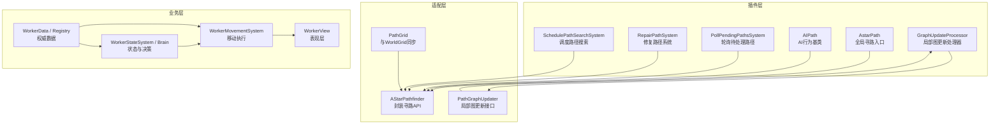
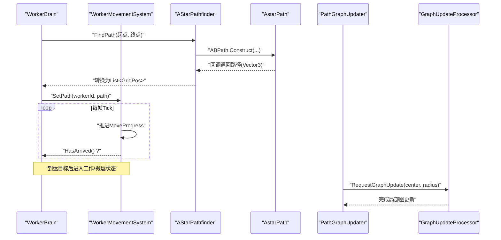
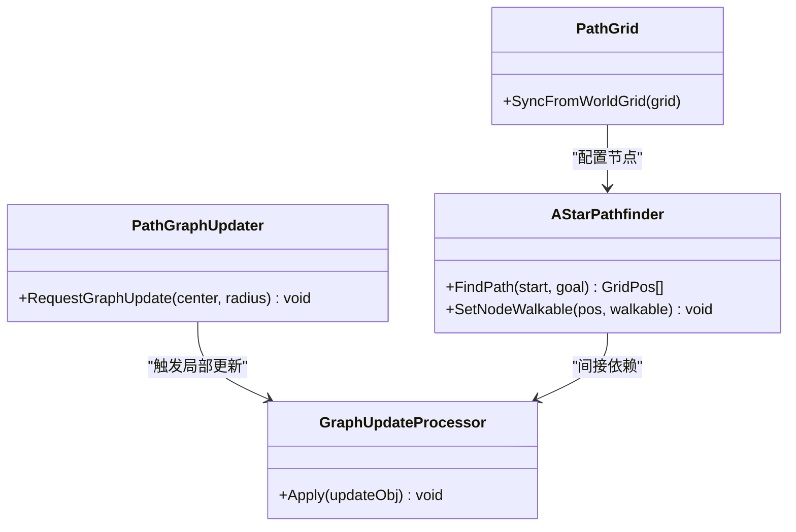
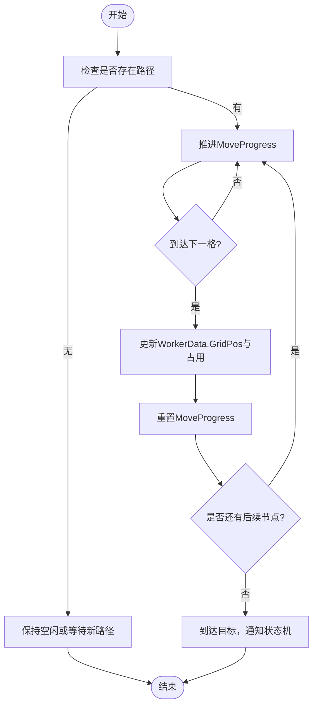
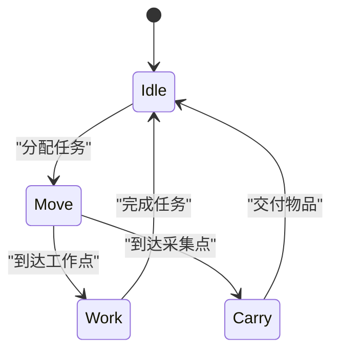
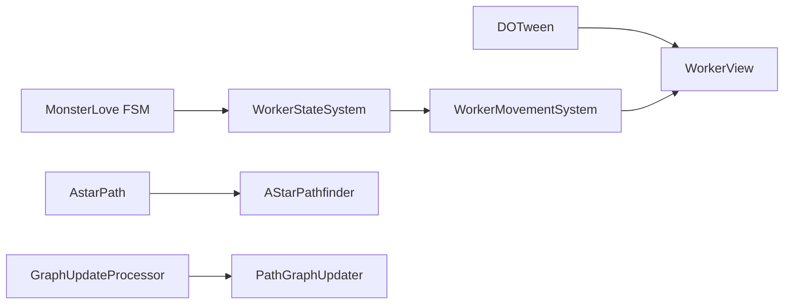

# 工人寻路系统

<cite>
**本文引用的文件**   
- [04-phase-3-worker-pathfinding.md](file://.simulationdoc/specs/04-phase-3-worker-pathfinding.md)
- [AstarPath.cs](file://Assets/Plugins/Astar/Core/AstarPath.cs)
- [AIPath.cs](file://Assets/Plugins/Astar/Core/AI/AIPath.cs)
- [GraphUpdateProcessor.cs](file://Assets/Plugins/Astar/Core/Pathfinding/GraphUpdateProcessor.cs)
- [GlobalNodeStorage.cs](file://Assets/Plugins/Astar/Core/Pathfinding/GlobalNodeStorage.cs)
- [PathInterpolator.cs](file://Assets/Plugins/Astar/Core/Misc/PathInterpolator.cs)
- [PathRequestSettings.cs](file://Assets/Plugins/Astar/Core/Misc/PathRequestSettings.cs)
- [PollPendingPathsSystem.cs](file://Assets/Plugins/Astar/Core/ECS/Systems/PollPendingPathsSystem.cs)
- [RepairPathSystem.cs](file://Assets/Plugins/Astar/Core/ECS/Systems/RepairPathSystem.cs)
- [SchedulePathSearchSystem.cs](file://Assets/Plugins/Astar/Core/ECS/Systems/SchedulePathSearchSystem.cs)
</cite>

## 目录
1. [简介](#简介)
2. [项目结构](#项目结构)
3. [核心组件](#核心组件)
4. [架构总览](#架构总览)
5. [详细组件分析](#详细组件分析)
6. [依赖关系分析](#依赖关系分析)
7. [性能考量](#性能考量)
8. [故障排查指南](#故障排查指南)
9. [结论](#结论)
10. [附录](#附录)

## 简介
本文件聚焦于“工人寻路系统”的设计与实现说明。该系统基于已集成的 A* Pathfinding Project，结合世界网格（WorldGrid）与 Worker 数据模型，提供从路径规划、局部图更新到移动执行与状态机切换的完整闭环。目标是让工人在 Grid 世界中高效、稳定地移动并执行任务。

## 项目结构
本项目采用分层组织：
- 插件层：A* Pathfinding Project 提供图管理、寻路与 ECS 调度等能力
- 适配层：将 WorldGrid 与 A* 图对齐，封装寻路 API
- 业务层：Worker 数据、视图、移动系统与状态机
- 基础设施：FSM 状态机、动画插值、事件与池化等框架复用

图表来源
- [AstarPath.cs](file://Assets/Plugins/Astar/Core/AstarPath.cs)
- [AIPath.cs](file://Assets/Plugins/Astar/Core/AI/AIPath.cs)
- [GraphUpdateProcessor.cs](file://Assets/Plugins/Astar/Core/Pathfinding/GraphUpdateProcessor.cs)
- [PollPendingPathsSystem.cs](file://Assets/Plugins/Astar/Core/ECS/Systems/PollPendingPathsSystem.cs)
- [RepairPathSystem.cs](file://Assets/Plugins/Astar/Core/ECS/Systems/RepairPathSystem.cs)
- [SchedulePathSearchSystem.cs](file://Assets/Plugins/Astar/Core/ECS/Systems/SchedulePathSearchSystem.cs)

章节来源
- [04-phase-3-worker-pathfinding.md:1-282](file://.simulationdoc/specs/04-phase-3-worker-pathfinding.md#L1-L282)

## 核心组件
- 寻路适配层
  - PathGrid：负责将 WorldGrid 的节点可行走性同步至 A* 图
  - AStarPathfinder：封装 A* 插件的异步寻路调用，返回 GridPos 序列
  - PathGraphUpdater：订阅世界实体变化，触发局部 Graph Update
- 移动与状态
  - WorkerMovementSystem：消费路径队列，推进 MoveProgress，到达目标后通知上层
  - WorkerStateSystem / WorkerBrain：基于 FSM 的状态管理与任务请求
- 表现层
  - WorkerView：平滑插值跟随数据位置，播放对应动画

章节来源
- [04-phase-3-worker-pathfinding.md:46-116](file://.simulationdoc/specs/04-phase-3-worker-pathfinding.md#L46-L116)
- [04-phase-3-worker-pathfinding.md:117-189](file://.simulationdoc/specs/04-phase-3-worker-pathfinding.md#L117-L189)
- [04-phase-3-worker-pathfinding.md:191-266](file://.simulationdoc/specs/04-phase-3-worker-pathfinding.md#L191-L266)

## 架构总览
下图展示从“发起寻路”到“移动执行”的关键流程，以及局部图更新的触发点。

图表来源
- [AstarPath.cs](file://Assets/Plugins/Astar/Core/AstarPath.cs)
- [GraphUpdateProcessor.cs](file://Assets/Plugins/Astar/Core/Pathfinding/GraphUpdateProcessor.cs)
- [04-phase-3-worker-pathfinding.md:117-189](file://.simulationdoc/specs/04-phase-3-worker-pathfinding.md#L117-L189)
- [04-phase-3-worker-pathfinding.md:191-224](file://.simulationdoc/specs/04-phase-3-worker-pathfinding.md#L191-L224)

## 详细组件分析

### 寻路适配层（PathGrid / AStarPathfinder / PathGraphUpdater）
- PathGrid
  - 职责：初始化时根据 WorldGrid 设置 A* 图的节点可行走性；提供 SyncFromWorldGrid 方法
  - 关键点：确保 Grid 原点与格大小一致，避免坐标偏差
- AStarPathfinder
  - 职责：封装 ABPath.Construct 发起异步寻路；将 Vector3 路径转为 List<GridPos>；支持不可达返回空列表
  - 关键点：统一错误处理与超时策略；对外暴露 SetNodeWalkable 以配合局部更新
- PathGraphUpdater
  - 职责：订阅 WorldData 实体增删改事件；使用 GraphUpdateObject 仅更新受影响区域；提供 RequestGraphUpdate(center, radius) 批量更新接口
  - 关键点：避免全图重建，降低 GC 与 CPU 峰值

图表来源
- [GraphUpdateProcessor.cs](file://Assets/Plugins/Astar/Core/Pathfinding/GraphUpdateProcessor.cs)
- [04-phase-3-worker-pathfinding.md:117-189](file://.simulationdoc/specs/04-phase-3-worker-pathfinding.md#L117-L189)

章节来源
- [04-phase-3-worker-pathfinding.md:117-189](file://.simulationdoc/specs/04-phase-3-worker-pathfinding.md#L117-L189)

### 移动系统（WorkerMovementSystem）
- 职责：消费 A* 返回的路径队列；每 Tick 推进 MoveProgress；速度受道路类型影响；到达下一格时更新 WorkerData.GridPos 与占用信息；路径结束后通知状态机
- 关键流程

图表来源
- [04-phase-3-worker-pathfinding.md:191-224](file://.simulationdoc/specs/04-phase-3-worker-pathfinding.md#L191-L224)

章节来源
- [04-phase-3-worker-pathfinding.md:191-224](file://.simulationdoc/specs/04-phase-3-worker-pathfinding.md#L191-L224)

### 状态机（WorkerStateSystem / WorkerBrain）
- 职责：基于 MonsterLove FSM 定义 Idle/Move/Work/Carry 状态；管理状态转换与回调；Idle 时向 JobManager 请求任务；不主动全局搜索资源
- 关键约束：状态转换顺序正确，不允许非法跳转；与 View 动画联动

图表来源
- [04-phase-3-worker-pathfinding.md:225-266](file://.simulationdoc/specs/04-phase-3-worker-pathfinding.md#L225-L266)

章节来源
- [04-phase-3-worker-pathfinding.md:225-266](file://.simulationdoc/specs/04-phase-3-worker-pathfinding.md#L225-L266)

### 表现层（WorkerView）
- 职责：只处理视觉；平滑插值跟随 WorkerData.Position；根据状态播放 Idle/Walk/Work/Carry 动画；朝向移动方向
- 关键点：不存储逻辑状态；通过 Initialize/Refresh/SetState 与数据层解耦

章节来源
- [04-phase-3-worker-pathfinding.md:86-116](file://.simulationdoc/specs/04-phase-3-worker-pathfinding.md#L86-L116)

## 依赖关系分析
- 外部依赖
  - A* Pathfinding Project：提供 AstarPath、AIPath、GraphUpdateProcessor、ECS 系统等
  - MonsterLove FSM：用于 Worker 状态机
  - DOTween：用于平滑移动与动画过渡
- 内部耦合
  - WorkerMovementSystem 依赖 AStarPathfinder 输出路径
  - WorkerStateSystem 驱动 Movement 与 View 的协同
  - PathGraphUpdater 与 GraphUpdateProcessor 协作进行局部更新

图表来源
- [AIPath.cs](file://Assets/Plugins/Astar/Core/AI/AIPath.cs)
- [AstarPath.cs](file://Assets/Plugins/Astar/Core/AstarPath.cs)
- [GraphUpdateProcessor.cs](file://Assets/Plugins/Astar/Core/Pathfinding/GraphUpdateProcessor.cs)
- [04-phase-3-worker-pathfinding.md:27-34](file://.simulationdoc/specs/04-phase-3-worker-pathfinding.md#L27-L34)

章节来源
- [04-phase-3-worker-pathfinding.md:27-34](file://.simulationdoc/specs/04-phase-3-worker-pathfinding.md#L27-L34)

## 性能考量
- 局部图更新优先：仅在实体变化区域触发 GraphUpdateObject，避免全图重建
- 路径缓存与去重：对相同起止点的重复请求进行缓存与合并，减少 A* 计算压力
- 批量更新：提供 RequestGraphUpdate(center, radius) 聚合多次变更
- 线程与作业：利用 A* ECS 系统（如 PollPendingPathsSystem、RepairPathSystem、SchedulePathSearchSystem）分摊路径计算与修复负载
- 插值与动画：使用 PathInterpolator 与 DOTween 平滑移动，避免抖动与卡顿

章节来源
- [04-phase-3-worker-pathfinding.md:159-189](file://.simulationdoc/specs/04-phase-3-worker-pathfinding.md#L159-L189)
- [PollPendingPathsSystem.cs](file://Assets/Plugins/Astar/Core/ECS/Systems/PollPendingPathsSystem.cs)
- [RepairPathSystem.cs](file://Assets/Plugins/Astar/Core/ECS/Systems/RepairPathSystem.cs)
- [SchedulePathSearchSystem.cs](file://Assets/Plugins/Astar/Core/ECS/Systems/SchedulePathSearchSystem.cs)
- [PathInterpolator.cs](file://Assets/Plugins/Astar/Core/Misc/PathInterpolator.cs)

## 故障排查指南
- 寻路失败或路径为空
  - 检查 AstarPath 与 Grid Graph 的原点、格大小是否与 WorldGrid 一致
  - 确认 PathGrid.SyncFromWorldGrid 已正确调用
  - 查看 AStarPathfinder 的错误回调与超时设置
- 工人穿墙或卡住
  - 验证 PathGraphUpdater 是否正确触发局部更新
  - 检查 SetNodeWalkable 在建筑/树木变化时的调用时机
  - 使用 A* 可视化调试工具观察节点权重与障碍标记
- 状态异常
  - 确认 WorkerStateSystem 的状态转换规则，避免非法跳转
  - 核对 WorkerBrain 的任务请求逻辑，避免全局搜索破坏设计原则
- 性能问题
  - 统计每秒寻路次数与平均耗时，评估是否需要路径缓存
  - 监控 GraphUpdateProcessor 的更新频率与范围，避免过大半径导致开销上升

章节来源
- [04-phase-3-worker-pathfinding.md:277-282](file://.simulationdoc/specs/04-phase-3-worker-pathfinding.md#L277-L282)
- [GlobalNodeStorage.cs](file://Assets/Plugins/Astar/Core/Pathfinding/GlobalNodeStorage.cs)
- [PathRequestSettings.cs](file://Assets/Plugins/Astar/Core/Misc/PathRequestSettings.cs)

## 结论
工人寻路系统通过“适配层 + 移动执行 + 状态机 + 局部图更新”的分层设计，将 A* 插件能力与游戏世界网格有效对接。该方案在保证可维护性的同时，兼顾了性能与稳定性，为后续 Job 系统与更复杂的交互打下坚实基础。

## 附录
- 契约摘要
  - WorkerData / WorkerRegistry：工人权威数据
  - AStarPathfinder：路径计算（基于 A* Pathfinding Project）
  - PathGraphUpdater：局部寻路图更新
  - WorkerMovementSystem：工人移动执行
  - WorkerStateSystem / WorkerBrain：状态管理与任务请求

章节来源
- [04-phase-3-worker-pathfinding.md:267-276](file://.simulationdoc/specs/04-phase-3-worker-pathfinding.md#L267-L276)