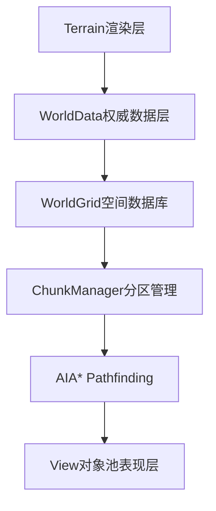
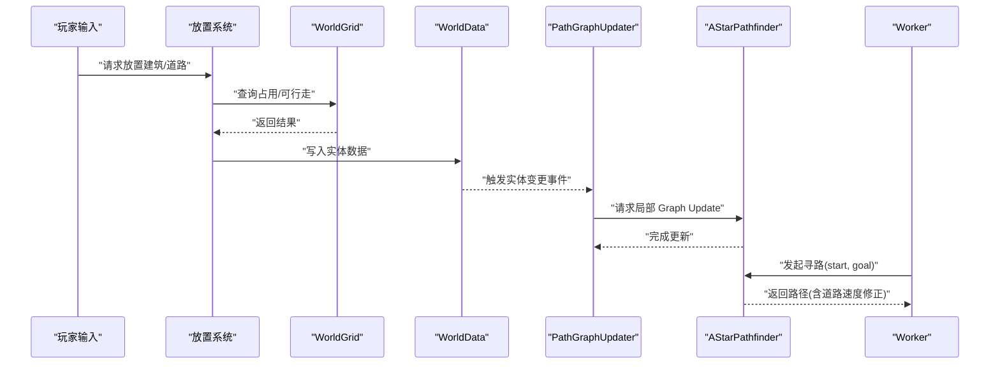
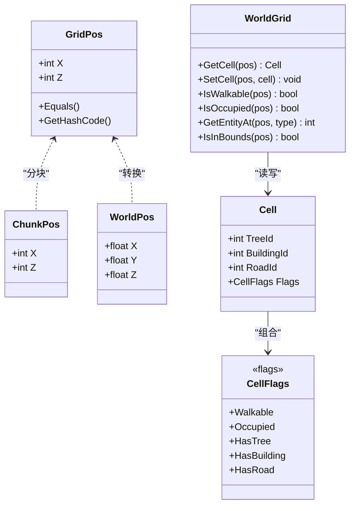
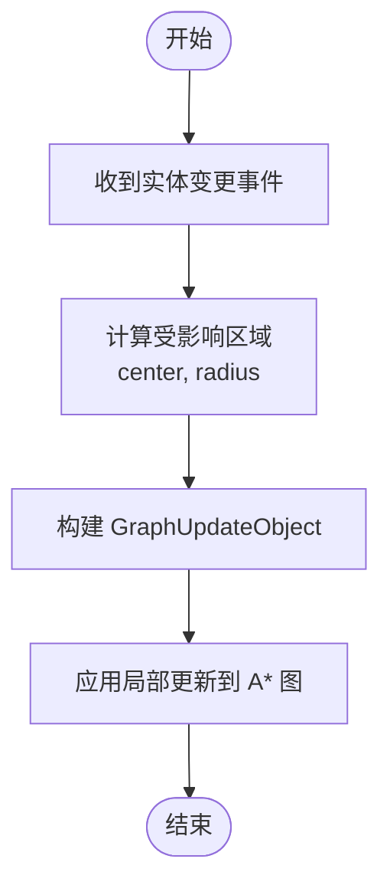
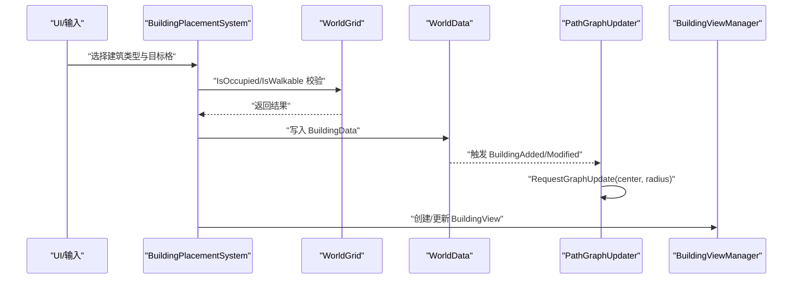
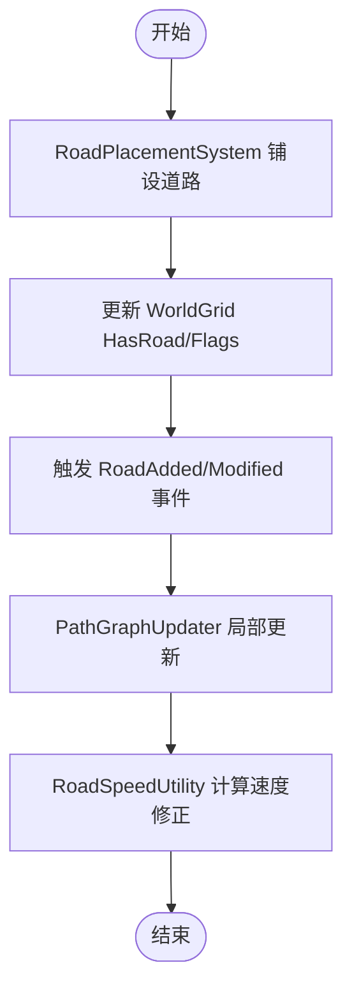
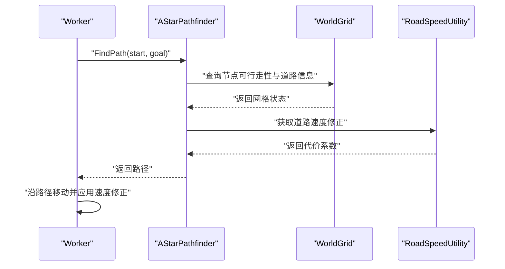
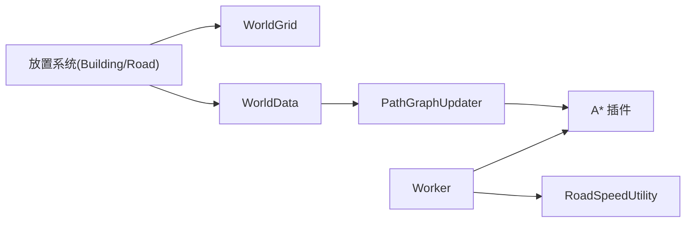

# 建筑道路系统

<cite>
**本文引用的文件**   
- [unity_simulation_design_v1.md](file://.simulationdoc/unity_simulation_design_v1.md)
- [02-phase-1-world-grid.md](file://.simulationdoc/specs/02-phase-1-world-grid.md)
- [04-phase-3-worker-pathfinding.md](file://.simulationdoc/specs/04-phase-3-worker-pathfinding.md)
- [05-phase-4-building-road.md](file://.simulationdoc/specs/05-phase-4-building-road.md)
- [KNOWLEDGE_BASE_INDEX.md](file://.simulationdoc/specs/KNOWLEDGE_BASE_INDEX.md)
</cite>

## 目录
1. [引言](#引言)
2. [项目结构](#项目结构)
3. [核心组件](#核心组件)
4. [架构总览](#架构总览)
5. [详细组件分析](#详细组件分析)
6. [依赖分析](#依赖分析)
7. [性能考虑](#性能考虑)
8. [故障排查指南](#故障排查指南)
9. [结论](#结论)
10. [附录](#附录)

## 引言
本文件聚焦于“建筑与道路系统”的设计与实现要点，围绕数据模型、放置与占用、寻路图同步、速度修正以及生命周期管理展开。系统遵循“数据与表现分离”的原则：WorldGrid 负责空间逻辑，A* 仅负责寻路，GameObject 仅用于表现层；道路通过影响移动速度参与寻路成本计算，建筑则通过占用网格单元影响可行走性。

## 项目结构
从设计文档可知，建筑与道路系统处于 Phase 4，依赖 Phase 1（WorldGrid/WorldData）与 Phase 3（A* 与局部 Graph Update）。整体分层如下：
- Terrain（渲染层）
- WorldData（树/建筑/资源数据）
- WorldGrid（空间数据库）
- ChunkManager（分区管理）
- AI（A* Pathfinding）
- View（对象池表现层）

图表来源
- [unity_simulation_design_v1.md:20-33](file://.simulationdoc/unity_simulation_design_v1.md#L20-L33)

章节来源
- [unity_simulation_design_v1.md:20-33](file://.simulationdoc/unity_simulation_design_v1.md#L20-L33)

## 核心组件
- 世界坐标与网格
  - GridPos/ChunkPos/WorldPos 提供零分配的双向转换，支撑后续占用与寻路计算。
- 空间数据库
  - CellFlags 标记 Walkable/Occupied/HasTree/HasBuilding/HasRoad 等状态。
  - Cell 记录 TreeId/BuildingId/RoadId 及 Flags。
  - WorldGrid 提供 GetCell/SetCell/IsWalkable/IsOccupied/GetEntityAt 等接口。
- 权威数据层
  - WorldData 持有 Trees/Buildings/Roads/Workers 的字典索引，并提供实体增删改事件。
- 寻路与更新
  - PathGraphUpdater 订阅 WorldData 事件，使用 A* 插件的 GraphUpdateObject 进行局部更新。
  - AStarPathfinder 封装寻路调用，返回 List<GridPos> 路径。
- 建筑与道路
  - BuildingData/RoadData 及其类型注册表。
  - 放置系统负责碰撞检测、幽灵预览、写入 Grid 并触发寻路图更新。
  - RoadSpeedUtility 根据道路类型修正移动速度。
  - LifecycleSystem 负责拆除后释放 Grid 单元并更新寻路。

章节来源
- [02-phase-1-world-grid.md:45-125](file://.simulationdoc/specs/02-phase-1-world-grid.md#L45-L125)
- [02-phase-1-world-grid.md:133-159](file://.simulationdoc/specs/02-phase-1-world-grid.md#L133-L159)
- [04-phase-3-worker-pathfinding.md:126-189](file://.simulationdoc/specs/04-phase-3-worker-pathfinding.md#L126-L189)
- [05-phase-4-building-road.md:1-37](file://.simulationdoc/specs/05-phase-4-building-road.md#L1-L37)

## 架构总览
建筑与道路系统在运行时的工作流：
- 玩家操作触发放置流程（建筑或道路）
- 放置系统校验占用与可行性
- 写入 WorldGrid 与 WorldData
- 订阅事件驱动 PathGraphUpdater 执行局部 Graph Update
- 工人寻路时读取 WorldGrid 与道路速度修正，得到更优路径
- 生命周期系统处理拆除与回收

图表来源
- [05-phase-4-building-road.md:1-37](file://.simulationdoc/specs/05-phase-4-building-road.md#L1-L37)
- [04-phase-3-worker-pathfinding.md:126-189](file://.simulationdoc/specs/04-phase-3-worker-pathfinding.md#L126-L189)
- [02-phase-1-world-grid.md:45-125](file://.simulationdoc/specs/02-phase-1-world-grid.md#L45-L125)

## 详细组件分析

### 世界网格与坐标系统
- 坐标与分块
  - GridPos/ChunkPos/WorldPos 提供整数格索引与浮点世界坐标之间的零分配转换，便于快速定位与边界判断。
- 单元格与标志位
  - CellFlags 使用位标记表示 Walkable/Occupied/HasTree/HasBuilding/HasRoad 等状态。
  - Cell 包含 TreeId/BuildingId/RoadId 与 Flags，作为空间查询的最小单位。
- 世界网格接口
  - WorldGrid 提供 GetCell/SetCell/IsWalkable/IsOccupied/GetEntityAt/IsInBounds 等方法，对外暴露空间查询与占用管理能力。

图表来源
- [02-phase-1-world-grid.md:45-125](file://.simulationdoc/specs/02-phase-1-world-grid.md#L45-L125)

章节来源
- [02-phase-1-world-grid.md:45-125](file://.simulationdoc/specs/02-phase-1-world-grid.md#L45-L125)

### 权威数据层与事件
- WorldData 维护 Trees/Buildings/Roads/Workers 的字典索引，提供统一 ID 生成器。
- 实体增删改事件用于通知其他子系统（如寻路图更新、UI 刷新等）。
- 在 Tick 热路径优先使用 C# 原生事件以避免 GC 压力。

章节来源
- [02-phase-1-world-grid.md:133-159](file://.simulationdoc/specs/02-phase-1-world-grid.md#L133-L159)

### 寻路与局部图更新
- 与 A* 集成
  - 配置 Grid Graph 与 WorldGrid 对齐（相同格大小与原点）。
  - 使用 ABPath.Construct 发起异步寻路，将 Vector3 路径转换为 List<GridPos>。
- 局部 Graph Update
  - 订阅 WorldData 事件，当树木/建筑/道路变化时，使用 GraphUpdateObject 只更新受影响区域。
  - 提供 RequestGraphUpdate(center, radius) 批量更新接口。

图表来源
- [04-phase-3-worker-pathfinding.md:126-189](file://.simulationdoc/specs/04-phase-3-worker-pathfinding.md#L126-L189)

章节来源
- [04-phase-3-worker-pathfinding.md:126-189](file://.simulationdoc/specs/04-phase-3-worker-pathfinding.md#L126-L189)

### 建筑系统
- 数据与类型
  - BuildingData 描述位置、尺寸、类型；BuildingTypeSO 与 BuildingRegistry 支持多尺寸注册。
- 放置与占用
  - BuildingPlacementSystem 负责碰撞检测、幽灵预览（红/绿）、确认后写入 Grid。
- 建造状态与视图
  - BuildingView/BuildingViewManager 管理脚手架到完成模型的切换。
- 生命周期
  - BuildingLifecycleSystem 在拆除后释放 Grid 单元并触发寻路图更新。

图表来源
- [05-phase-4-building-road.md:1-37](file://.simulationdoc/specs/05-phase-4-building-road.md#L1-L37)
- [04-phase-3-worker-pathfinding.md:126-189](file://.simulationdoc/specs/04-phase-3-worker-pathfinding.md#L126-L189)

章节来源
- [05-phase-4-building-road.md:1-37](file://.simulationdoc/specs/05-phase-4-building-road.md#L1-L37)

### 道路系统与速度修正
- 数据与类型
  - RoadData 与 RoadType/RoadTypeSO/RoadRegistry 按格注册道路类型。
- 铺设与寻路同步
  - RoadPlacementSystem 铺设道路后更新 Grid 与寻路图。
- 速度修正
  - RoadSpeedUtility 根据道路类型对移动速度进行修正，影响寻路代价。

图表来源
- [05-phase-4-building-road.md:1-37](file://.simulationdoc/specs/05-phase-4-building-road.md#L1-L37)

章节来源
- [05-phase-4-building-road.md:1-37](file://.simulationdoc/specs/05-phase-4-building-road.md#L1-L37)

### 工人寻路与移动
- 寻路适配层
  - AStarPathfinder 封装 A* 插件调用，返回 List<GridPos>。
- 移动系统
  - Worker 基于路径步进，结合道路速度修正调整移动速率。
- 状态机
  - Idle/Move/Work/Carry 状态流转由 Worker 状态机管理。

图表来源
- [04-phase-3-worker-pathfinding.md:126-189](file://.simulationdoc/specs/04-phase-3-worker-pathfinding.md#L126-L189)
- [05-phase-4-building-road.md:1-37](file://.simulationdoc/specs/05-phase-4-building-road.md#L1-L37)

章节来源
- [04-phase-3-worker-pathfinding.md:126-189](file://.simulationdoc/specs/04-phase-3-worker-pathfinding.md#L126-L189)
- [05-phase-4-building-road.md:1-37](file://.simulationdoc/specs/05-phase-4-building-road.md#L1-L37)

## 依赖分析
- 内部依赖
  - 建筑与道路系统依赖 WorldGrid/WorldData 的空间与数据能力。
  - 寻路与移动依赖 A* 插件与 PathGraphUpdater 的局部更新机制。
- 外部依赖
  - A* Pathfinding Project（Grid Graph、ABPath、GraphUpdateObject）。
- 耦合与内聚
  - 放置系统与 WorldGrid 强耦合（占用/可行走），但与 View 弱耦合（仅触发创建/更新）。
  - RoadSpeedUtility 与寻路模块解耦，通过代价系数间接影响路径选择。

图表来源
- [05-phase-4-building-road.md:1-37](file://.simulationdoc/specs/05-phase-4-building-road.md#L1-L37)
- [04-phase-3-worker-pathfinding.md:126-189](file://.simulationdoc/specs/04-phase-3-worker-pathfinding.md#L126-L189)
- [02-phase-1-world-grid.md:45-125](file://.simulationdoc/specs/02-phase-1-world-grid.md#L45-L125)

章节来源
- [05-phase-4-building-road.md:1-37](file://.simulationdoc/specs/05-phase-4-building-road.md#L1-L37)
- [04-phase-3-worker-pathfinding.md:126-189](file://.simulationdoc/specs/04-phase-3-worker-pathfinding.md#L126-L189)
- [02-phase-1-world-grid.md:45-125](file://.simulationdoc/specs/02-phase-1-world-grid.md#L45-L125)

## 性能考虑
- 局部更新优于全图重建：仅在实体变化区域使用 GraphUpdateObject 更新。
- 零分配转换：GridPos/ChunkPos/WorldPos 转换避免 GC。
- 对象池：TreeView/BuildingView 等表现层实例复用，减少 Instantiate/Destroy。
- 事件策略：Tick 热路径优先使用 C# 原生事件，降低 GC 压力。

章节来源
- [04-phase-3-worker-pathfinding.md:126-189](file://.simulationdoc/specs/04-phase-3-worker-pathfinding.md#L126-L189)
- [02-phase-1-world-grid.md:45-125](file://.simulationdoc/specs/02-phase-1-world-grid.md#L45-L125)
- [unity_simulation_design_v1.md:89-95](file://.simulationdoc/unity_simulation_design_v1.md#L89-L95)

## 故障排查指南
- 寻路失败或路径异常
  - 检查 WorldGrid 的 IsWalkable/IsOccupied 是否正确设置。
  - 确认 PathGraphUpdater 是否收到实体变更事件并执行了局部更新。
  - 验证 A* 的 Grid Graph 是否与 WorldGrid 对齐（格大小与原点一致）。
- 道路未生效
  - 确认 RoadPlacementSystem 已更新 Grid 的 HasRoad 标志。
  - 检查 RoadSpeedUtility 的速度修正是否被寻路代价计算使用。
- 建筑占用冲突
  - 在放置前使用 IsOccupied 与尺寸包围盒检测，确保无重叠。
  - 拆除后需释放对应 Grid 单元并触发更新。

章节来源
- [04-phase-3-worker-pathfinding.md:126-189](file://.simulationdoc/specs/04-phase-3-worker-pathfinding.md#L126-L189)
- [05-phase-4-building-road.md:1-37](file://.simulationdoc/specs/05-phase-4-building-road.md#L1-L37)
- [02-phase-1-world-grid.md:45-125](file://.simulationdoc/specs/02-phase-1-world-grid.md#L45-L125)

## 结论
建筑与道路系统以 WorldGrid 为核心，结合 WorldData 的事件驱动与 A* 的局部图更新，实现了高效、可扩展的空间管理与寻路体系。道路通过速度修正优化移动效率，建筑通过占用控制影响可行走性。该设计在保证性能的同时，具备良好的可维护性与扩展性。

## 附录
- 关键接口速查（WorldGrid）
  - GetCell/SetCell/IsWalkable/IsOccupied/GetEntityAt/IsInBounds

章节来源
- [KNOWLEDGE_BASE_INDEX.md:86-99](file://.simulationdoc/specs/KNOWLEDGE_BASE_INDEX.md#L86-L99)