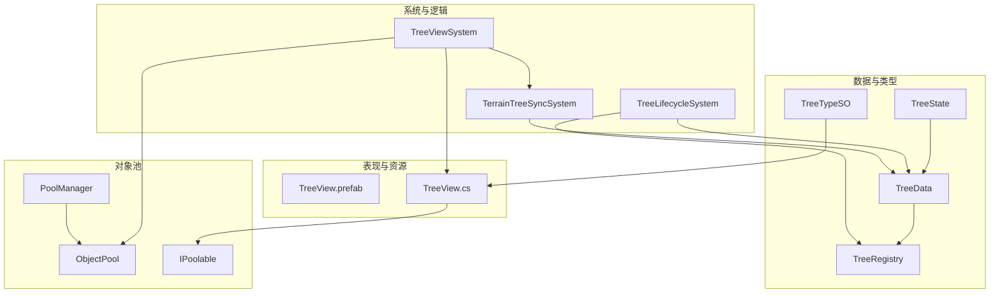
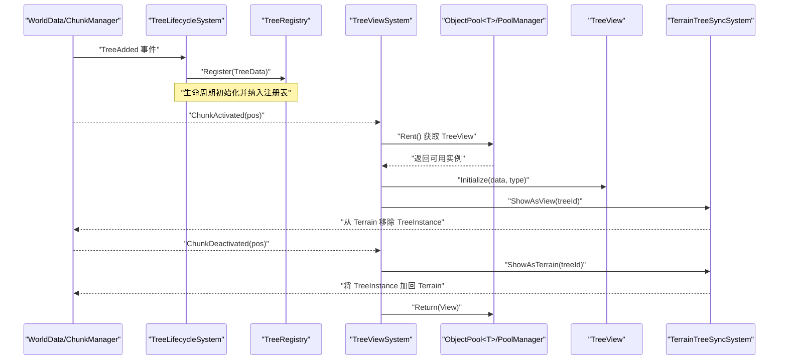
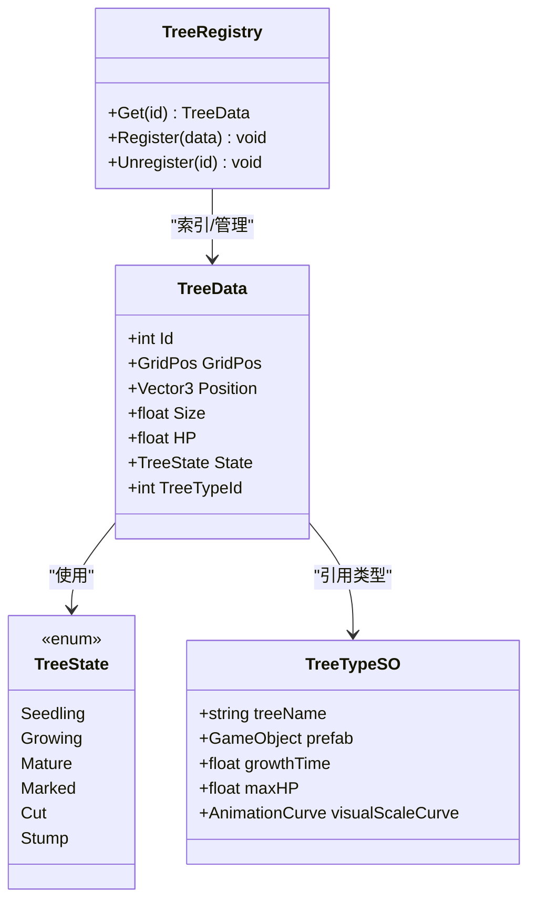
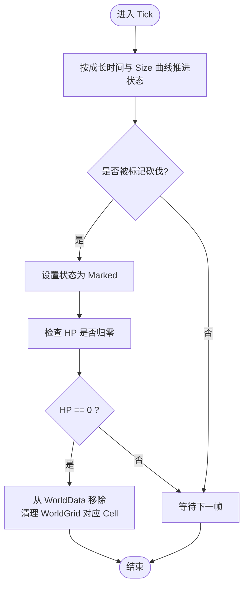
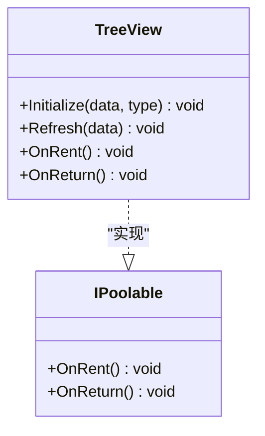
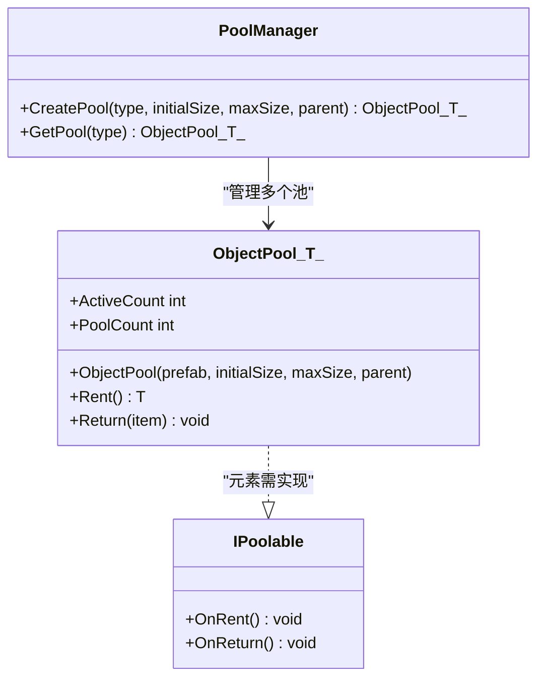
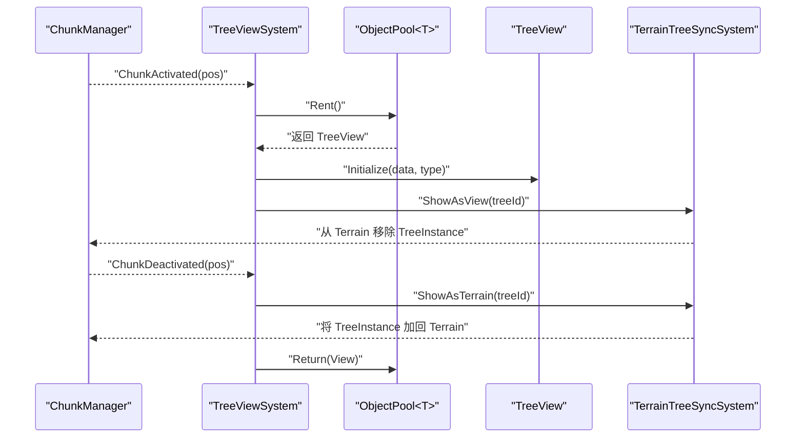
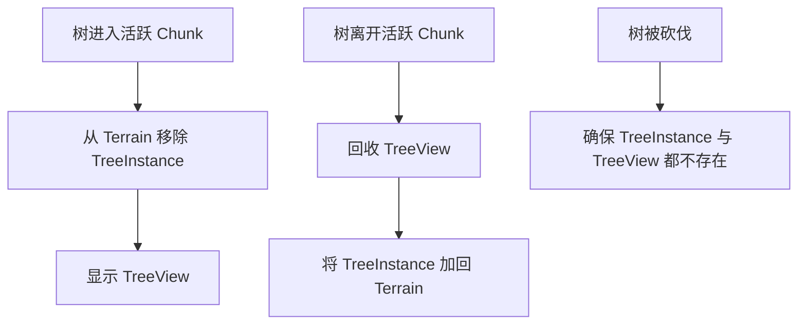
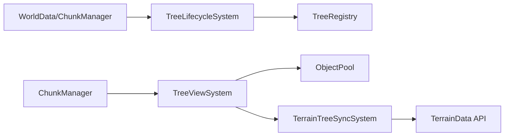

# 树木视图系统

<cite>
**本文引用的文件**   
- [03-phase-2-tree-view.md](file://.simulationdoc/specs/03-phase-2-tree-view.md)
</cite>

## 目录
1. [简介](#简介)
2. [项目结构](#项目结构)
3. [核心组件](#核心组件)
4. [架构总览](#架构总览)
5. [详细组件分析](#详细组件分析)
6. [依赖分析](#依赖分析)
7. [性能考虑](#性能考虑)
8. [故障排查指南](#故障排查指南)
9. [结论](#结论)
10. [附录](#附录)

## 简介
本文件围绕“Phase 2：Tree + View”的树木视图系统，梳理数据模型、生命周期管理、对象池与基于 Chunk 的视图激活策略，以及与 Terrain TreeInstance 的运行时同步方案。目标是确保在大规模场景（10000+ 棵树）下，以可控的性能预算完成显示与同步。

## 项目结构
根据设计文档，Phase 2 的关键产出位于以下路径（按模块划分）：
- 数据与类型注册
  - Assets/Game/Scripts/Simulation/Trees/TreeData.cs
  - Assets/Game/Scripts/Simulation/Trees/TreeState.cs
  - Assets/Game/Scripts/Simulation/Trees/TreeRegistry.cs
  - Assets/Game/MiniGame_Res/ScriptableObjects/TreeTypes/TreeTypeSO.cs
- 生命周期系统
  - Assets/Game/Scripts/MiniGame_Scripts/System/TreeLifecycleSystem.cs
- 表现层（View）
  - Assets/Game/MiniGame_Res/Prefabs/Trees/TreeView.prefab
  - Assets/Game/Scripts/Simulation/Trees/TreeView.cs
- 通用对象池
  - Assets/Game/Scripts/Simulation/View/Pool/ObjectPool.cs
  - Assets/Game/Scripts/Simulation/View/Pool/IPoolable.cs
  - Assets/Game/Scripts/Simulation/View/Pool/PoolManager.cs
- Chunk 驱动的视图激活
  - Assets/Game/Scripts/MiniGame_Scripts/System/TreeViewSystem.cs
- Terrain 同步
  - Assets/Game/Scripts/MiniGame_Scripts/System/TerrainTreeSyncSystem.cs

图表来源
- [03-phase-2-tree-view.md:45-94](file://.simulationdoc/specs/03-phase-2-tree-view.md#L45-L94)
- [03-phase-2-tree-view.md:95-131](file://.simulationdoc/specs/03-phase-2-tree-view.md#L95-L131)
- [03-phase-2-tree-view.md:132-164](file://.simulationdoc/specs/03-phase-2-tree-view.md#L132-L164)
- [03-phase-2-tree-view.md:165-214](file://.simulationdoc/specs/03-phase-2-tree-view.md#L165-L214)
- [03-phase-2-tree-view.md:215-250](file://.simulationdoc/specs/03-phase-2-tree-view.md#L215-L250)
- [03-phase-2-tree-view.md:251-285](file://.simulationdoc/specs/03-phase-2-tree-view.md#L251-L285)

章节来源
- [03-phase-2-tree-view.md:34-44](file://.simulationdoc/specs/03-phase-2-tree-view.md#L34-L44)

## 核心组件
- TreeData / TreeState / TreeRegistry / TreeTypeSO
  - 负责树木权威数据、状态枚举、类型配置与全局索引。
- TreeLifecycleSystem
  - 订阅世界事件，推进生长、标记砍伐、HP 归零清理等生命周期流程。
- TreeView / TreeView.prefab
  - 纯表现层，仅处理缩放、材质切换与动画；不持有逻辑状态。
- ObjectPool<T> / IPoolable / PoolManager
  - 提供预生成、借还无分配的对象池能力，支撑大量 TreeView 实例复用。
- TreeViewSystem
  - 基于 Chunk 激活/停用事件，驱动 TreeView 的生成与回收，并控制活跃数量上限。
- TerrainTreeSyncSystem
  - 维护 Terrain TreeInstance 与 TreeView 的互斥显示，并在砍伐后从 Terrain 移除。

章节来源
- [03-phase-2-tree-view.md:45-94](file://.simulationdoc/specs/03-phase-2-tree-view.md#L45-L94)
- [03-phase-2-tree-view.md:95-131](file://.simulationdoc/specs/03-phase-2-tree-view.md#L95-L131)
- [03-phase-2-tree-view.md:132-164](file://.simulationdoc/specs/03-phase-2-tree-view.md#L132-L164)
- [03-phase-2-tree-view.md:165-214](file://.simulationdoc/specs/03-phase-2-tree-view.md#L165-L214)
- [03-phase-2-tree-view.md:215-250](file://.simulationdoc/specs/03-phase-2-tree-view.md#L215-L250)
- [03-phase-2-tree-view.md:251-285](file://.simulationdoc/specs/03-phase-2-tree-view.md#L251-L285)

## 架构总览
下图展示了 Phase 2 中各子系统之间的交互关系与数据流向。

图表来源
- [03-phase-2-tree-view.md:95-131](file://.simulationdoc/specs/03-phase-2-tree-view.md#L95-L131)
- [03-phase-2-tree-view.md:215-250](file://.simulationdoc/specs/03-phase-2-tree-view.md#L215-L250)
- [03-phase-2-tree-view.md:251-285](file://.simulationdoc/specs/03-phase-2-tree-view.md#L251-L285)

## 详细组件分析

### 数据与类型注册（TreeData / TreeState / TreeRegistry / TreeTypeSO）
- TreeState 定义种子、生长、成熟、标记砍伐、砍伐、树桩等状态。
- TreeData 承载 ID、网格位置、世界坐标、尺寸、HP、状态与类型 ID。
- TreeTypeSO 作为 ScriptableObject，描述名称、预制体引用、生长时间、最大 HP、视觉缩放曲线等。
- TreeRegistry 提供按 ID 索引的增删查接口，并与 WorldData 保持同步。

图表来源
- [03-phase-2-tree-view.md:45-94](file://.simulationdoc/specs/03-phase-2-tree-view.md#L45-L94)

章节来源
- [03-phase-2-tree-view.md:45-94](file://.simulationdoc/specs/03-phase-2-tree-view.md#L45-L94)

### 树木生命周期（TreeLifecycleSystem）
- 订阅 WorldData.TreeAdded，将新树注册到 TreeRegistry。
- 每 Tick 推进生长：Seedling → Growing → Mature，依据 TreeTypeSO.growthTime 与 Size 曲线更新。
- 标记砍伐：设置状态为 Marked，可选更新 WorldGrid 对应 Cell 标记。
- 砍伐完成：HP 降至 0 时从 WorldData 移除，清理 WorldGrid 中 Cell 的 TreeId 与占用标记，预留物品产出事件。

图表来源
- [03-phase-2-tree-view.md:95-131](file://.simulationdoc/specs/03-phase-2-tree-view.md#L95-L131)

章节来源
- [03-phase-2-tree-view.md:95-131](file://.simulationdoc/specs/03-phase-2-tree-view.md#L95-L131)

### 表现层（TreeView / TreeView.prefab）
- 职责边界：仅处理视觉（缩放、材质/颜色切换、风吹摇摆动画），不存储逻辑状态。
- 对外接口：Initialize(data, type)、Refresh(data)、OnRent()/OnReturn()。
- 与对象池集成：实现 IPoolable，配合 PoolManager 进行预生成与复用。

图表来源
- [03-phase-2-tree-view.md:132-164](file://.simulationdoc/specs/03-phase-2-tree-view.md#L132-L164)

章节来源
- [03-phase-2-tree-view.md:132-164](file://.simulationdoc/specs/03-phase-2-tree-view.md#L132-L164)

### 通用对象池（ObjectPool<T> / IPoolable / PoolManager）
- 目标：预生成 300~500 个 TreeView 实例，Rent/Return 无 GC 分配。
- 关键能力：初始容量、最大容量、拒绝或复用最旧实例的策略、ActiveCount/PoolCount 统计。
- 复用建议：优先评估 MPool 或 UniFramework.Pooling 是否满足需求，若不满足则自建 ObjectPool<T>。

图表来源
- [03-phase-2-tree-view.md:165-214](file://.simulationdoc/specs/03-phase-2-tree-view.md#L165-L214)

章节来源
- [03-phase-2-tree-view.md:165-214](file://.simulationdoc/specs/03-phase-2-tree-view.md#L165-L214)

### Chunk 驱动的 TreeView 激活（TreeViewSystem）
- 订阅 ChunkManager.ChunkActivated/ChunkDeactivated。
- 激活时遍历 Chunk 内所有 Cell，对成熟树 Rent TreeView，设置位置与数据，并从 Terrain 移除对应 TreeInstance。
- 停用时回收 TreeView，恢复 Terrain TreeInstance。
- 约束：活跃 TreeView 数量 ≤ 500。

图表来源
- [03-phase-2-tree-view.md:215-250](file://.simulationdoc/specs/03-phase-2-tree-view.md#L215-L250)
- [03-phase-2-tree-view.md:251-285](file://.simulationdoc/specs/03-phase-2-tree-view.md#L251-L285)

章节来源
- [03-phase-2-tree-view.md:215-250](file://.simulationdoc/specs/03-phase-2-tree-view.md#L215-L250)

### Terrain TreeInstance ↔ TreeData 运行时同步（TerrainTreeSyncSystem）
- 当树进入活跃 Chunk：从 Terrain 移除 TreeInstance，显示 TreeView。
- 当树离开活跃 Chunk：回收 TreeView，将 TreeInstance 加回 Terrain。
- 当树被砍伐：确保 TreeInstance 与 TreeView 均不存在。
- 使用 TerrainData.SetTreeInstances 或类似 API 批量修改 Terrain。

图表来源
- [03-phase-2-tree-view.md:251-285](file://.simulationdoc/specs/03-phase-2-tree-view.md#L251-L285)

章节来源
- [03-phase-2-tree-view.md:251-285](file://.simulationdoc/specs/03-phase-2-tree-view.md#L251-L285)

## 依赖分析
- 内部依赖
  - TreeLifecycleSystem 依赖 WorldData 事件与 TreeRegistry。
  - TreeViewSystem 依赖 ChunkManager 事件、对象池与 TerrainTreeSyncSystem。
  - TerrainTreeSyncSystem 依赖 TerrainData 相关 API 与 TreeRegistry。
- 外部依赖
  - 动画：MOYVDoTween（用于缩放与风吹摇摆）。
  - 对象池：MPool 或 UniFramework.Pooling（可复用）。
- 耦合与内聚
  - 数据与表现解耦：TreeData 与 TreeView 通过 Initialize/Refresh 传递只读信息。
  - 生命周期与渲染分离：TreeLifecycleSystem 不直接操作 View，由 TreeViewSystem 响应 Chunk 事件驱动渲染。

图表来源
- [03-phase-2-tree-view.md:95-131](file://.simulationdoc/specs/03-phase-2-tree-view.md#L95-L131)
- [03-phase-2-tree-view.md:215-250](file://.simulationdoc/specs/03-phase-2-tree-view.md#L215-L250)
- [03-phase-2-tree-view.md:251-285](file://.simulationdoc/specs/03-phase-2-tree-view.md#L251-L285)

章节来源
- [03-phase-2-tree-view.md:95-131](file://.simulationdoc/specs/03-phase-2-tree-view.md#L95-L131)
- [03-phase-2-tree-view.md:215-250](file://.simulationdoc/specs/03-phase-2-tree-view.md#L215-L250)
- [03-phase-2-tree-view.md:251-285](file://.simulationdoc/specs/03-phase-2-tree-view.md#L251-L285)

## 性能考虑
- 对象池容量与分配
  - 预生成 300~500 个 TreeView，确保 Rent/Return 无分配，避免 GC 抖动。
- 活跃数量上限
  - 限制活跃 TreeView 数 ≤ 500，防止渲染压力过大。
- Terrain 同步开销
  - 使用批量 API 修改 Terrain TreeInstance，减少频繁调用带来的性能损耗。
- 动画与着色器
  - 优先使用轻量级动画（如 DOTween）或 Shader 实现风吹效果，避免复杂 Animator 状态机。

[本节为通用指导，无需列出具体文件来源]

## 故障排查指南
- 现象：树木丢失或重复显示
  - 可能原因：Terrain 同步逻辑异常导致 TreeInstance 与 TreeView 同时存在或同时缺失。
  - 排查要点：确认 ShowAsView/ShowAsTerrain 成对调用；砍伐后确保两者均不存在。
- 现象：性能不达标（卡顿、GC 峰值）
  - 可能原因：对象池容量不足或 Rent/Return 产生分配。
  - 排查要点：检查 PoolManager 初始化参数；验证 ActiveCount 变化是否符合预期。
- 现象：砍伐后寻路或建筑放置错误
  - 可能原因：未正确清理 WorldGrid 中 Cell 的 TreeId 与占用标记。
  - 排查要点：确认生命周期系统在 HP 归零时执行清理逻辑。

章节来源
- [03-phase-2-tree-view.md:295-299](file://.simulationdoc/specs/03-phase-2-tree-view.md#L295-L299)

## 结论
Phase 2 的树木视图系统通过清晰的数据-逻辑-表现分层、基于 Chunk 的视图激活与严格的对象池策略，实现了大规模树木的高效显示与同步。关键在于：
- 数据权威性与一致性（TreeRegistry 与 WorldData 同步）
- 生命周期与渲染解耦（TreeLifecycleSystem 与 TreeViewSystem 协作）
- 稳定的对象池与活跃数量上限（保障性能预算）
- 可靠的 Terrain 同步（避免重复/丢失）

[本节为总结性内容，无需列出具体文件来源]

## 附录
- 验收标准摘要
  - 数据与类型：可创建/修改/删除 TreeData，状态枚举可用。
  - 生命周期：按时间生长、标记砍伐、HP 归零清理。
  - 表现层：缩放/材质/动画正确，不存逻辑状态。
  - 对象池：预生成 300~500 实例，Rent/Return 无分配。
  - Chunk 驱动：相机移动时正确生成/回收，活跃数 ≤ 500。
  - Terrain 同步：近处 View、远处 Terrain，砍伐后两者都消失。

章节来源
- [03-phase-2-tree-view.md:89-94](file://.simulationdoc/specs/03-phase-2-tree-view.md#L89-L94)
- [03-phase-2-tree-view.md:126-131](file://.simulationdoc/specs/03-phase-2-tree-view.md#L126-L131)
- [03-phase-2-tree-view.md:160-164](file://.simulationdoc/specs/03-phase-2-tree-view.md#L160-L164)
- [03-phase-2-tree-view.md:209-214](file://.simulationdoc/specs/03-phase-2-tree-view.md#L209-L214)
- [03-phase-2-tree-view.md:245-250](file://.simulationdoc/specs/03-phase-2-tree-view.md#L245-L250)
- [03-phase-2-tree-view.md:280-285](file://.simulationdoc/specs/03-phase-2-tree-view.md#L280-L285)