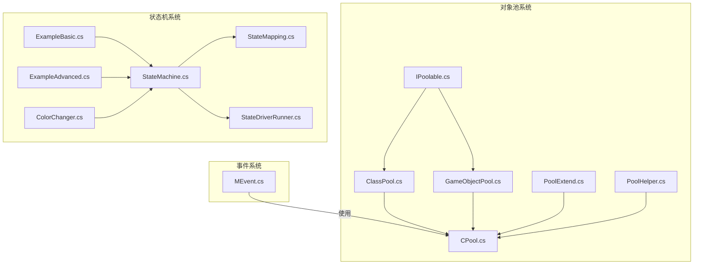
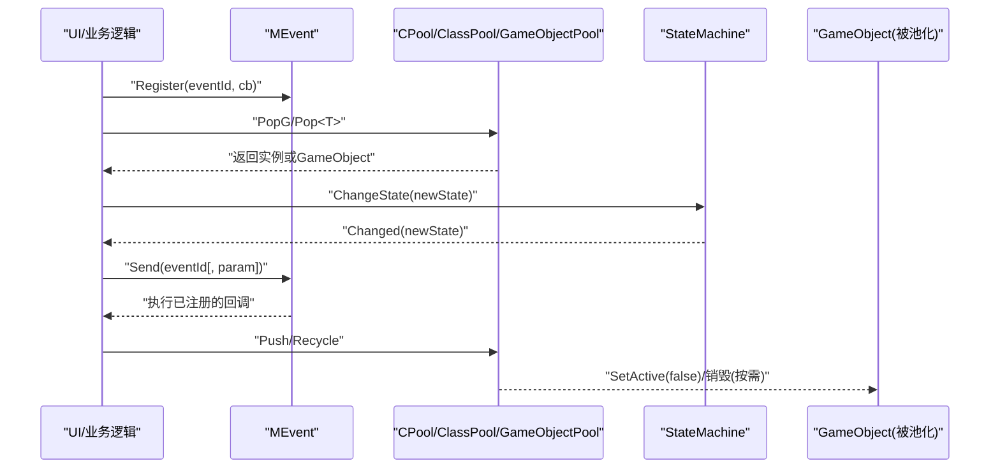
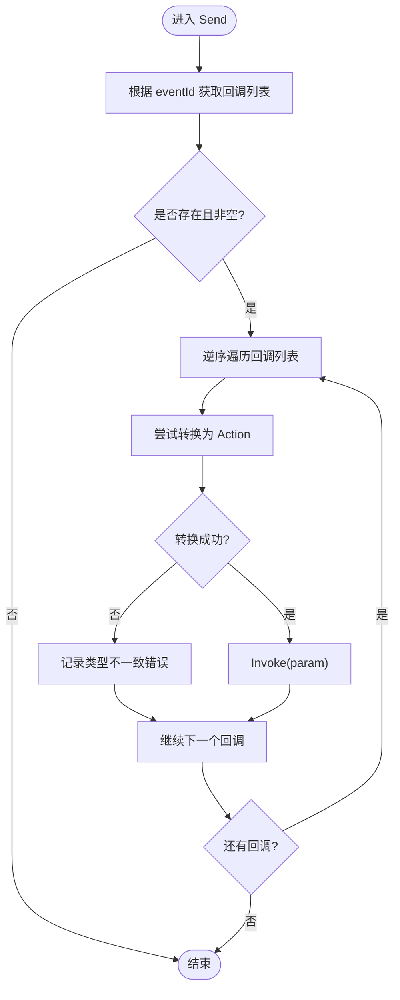
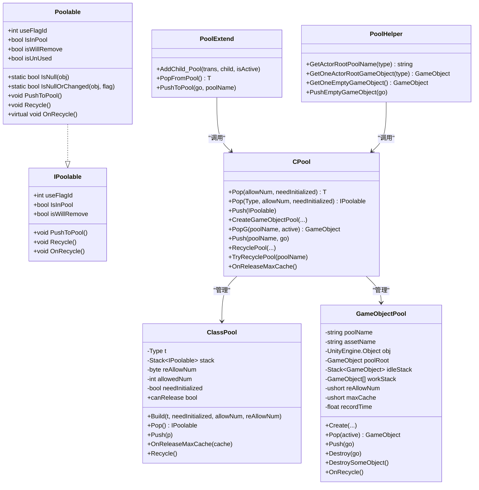
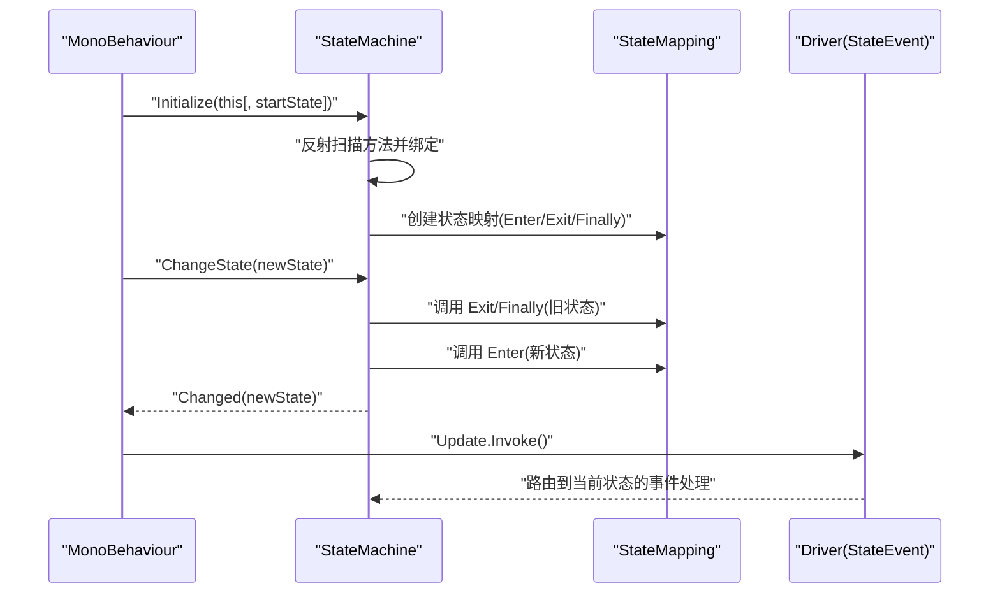
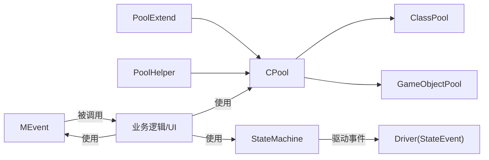

# 核心系统

<cite>
**本文引用的文件**
- [MEvent.cs](file://Assets/Game/Framework/MEvent/MEvent.cs)
- [IPoolable.cs](file://Assets/Game/Framework/MPool/IPoolable.cs)
- [ClassPool.cs](file://Assets/Game/Framework/MPool/ClassPool.cs)
- [GameObjectPool.cs](file://Assets/Game/Framework/MPool/GameObjectPool.cs)
- [CPool.cs](file://Assets/Game/Framework/MPool/CPool.cs)
- [PoolExtend.cs](file://Assets/Game/Framework/MPool/PoolExtend.cs)
- [PoolHelper.cs](file://Assets/Game/Framework/MPool/PoolHelper.cs)
- [StateMachine.cs](file://Assets/Game/Framework/FSM/Runtime/StateMachine.cs)
- [StateMapping.cs](file://Assets/Game/Framework/FSM/Runtime/StateMapping.cs)
- [StateDriverRunner.cs](file://Assets/Game/Framework/FSM/Runtime/Drivers/StateDriverRunner.cs)
- [ExampleBasic.cs](file://Assets/Samples/FSM/Scripts/ExampleBasic.cs)
- [ExampleAdvanced.cs](file://Assets/Samples/FSM/Scripts/ExampleAdvanced.cs)
- [ColorChanger.cs](file://Assets/Samples/FSM/Scripts/ColorChanger.cs)
</cite>

## 目录
1. [简介](#简介)
2. [项目结构](#项目结构)
3. [核心组件](#核心组件)
4. [架构总览](#架构总览)
5. [详细组件分析](#详细组件分析)
6. [依赖关系分析](#依赖关系分析)
7. [性能考量](#性能考量)
8. [故障排查指南](#故障排查指南)
9. [结论](#结论)
10. [附录：常用用法与示例路径](#附录常用用法与示例路径)

## 简介
本文件面向 SimulationClient 的核心系统，聚焦三大子系统：
- 事件系统 MEvent：轻量、基于整型 ID 的发布/订阅机制，支持无参与单参数回调。
- 对象池系统 MPool：包含类对象池与 GameObject 对象池，提供统一的 CPool 门面与便捷扩展方法。
- 状态机系统 MonsterLove.StateMachine：基于枚举的状态机，支持 Enter/Exit/Finally 生命周期与 Driver 事件总线。

文档将阐述各系统的架构设计、核心接口与扩展点，给出常见用例与高级用法的代码片段路径，说明配置项、参数与返回值，并解释与其他组件的关系和集成方式。同时提供常见问题与解决方案，兼顾初学者与有经验的开发者。

## 项目结构
以下图展示了三个核心系统在仓库中的位置与关键文件：

图表来源
- [MEvent.cs:1-288](file://Assets/Game/Framework/MEvent/MEvent.cs#L1-L288)
- [IPoolable.cs:1-71](file://Assets/Game/Framework/MPool/IPoolable.cs#L1-L71)
- [ClassPool.cs:1-127](file://Assets/Game/Framework/MPool/ClassPool.cs#L1-L127)
- [GameObjectPool.cs:1-191](file://Assets/Game/Framework/MPool/GameObjectPool.cs#L1-L191)
- [CPool.cs:1-263](file://Assets/Game/Framework/MPool/CPool.cs#L1-L263)
- [PoolExtend.cs:1-25](file://Assets/Game/Framework/MPool/PoolExtend.cs#L1-L25)
- [PoolHelper.cs:1-66](file://Assets/Game/Framework/MPool/PoolHelper.cs#L1-L66)
- [StateMachine.cs:1-659](file://Assets/Game/Framework/FSM/Runtime/StateMachine.cs#L1-L659)
- [StateMapping.cs:1-56](file://Assets/Game/Framework/FSM/Runtime/StateMapping.cs#L1-L56)
- [StateDriverRunner.cs](file://Assets/Game/Framework/FSM/Runtime/Drivers/StateDriverRunner.cs)
- [ExampleBasic.cs:1-83](file://Assets/Samples/FSM/Scripts/ExampleBasic.cs#L1-L83)
- [ExampleAdvanced.cs:1-62](file://Assets/Samples/FSM/Scripts/ExampleAdvanced.cs#L1-L62)
- [ColorChanger.cs:1-61](file://Assets/Samples/FSM/Scripts/ColorChanger.cs#L1-L61)

章节来源
- [MEvent.cs:1-288](file://Assets/Game/Framework/MEvent/MEvent.cs#L1-L288)
- [IPoolable.cs:1-71](file://Assets/Game/Framework/MPool/IPoolable.cs#L1-L71)
- [ClassPool.cs:1-127](file://Assets/Game/Framework/MPool/ClassPool.cs#L1-L127)
- [GameObjectPool.cs:1-191](file://Assets/Game/Framework/MPool/GameObjectPool.cs#L1-L191)
- [CPool.cs:1-263](file://Assets/Game/Framework/MPool/CPool.cs#L1-L263)
- [PoolExtend.cs:1-25](file://Assets/Game/Framework/MPool/PoolExtend.cs#L1-L25)
- [PoolHelper.cs:1-66](file://Assets/Game/Framework/MPool/PoolHelper.cs#L1-L66)
- [StateMachine.cs:1-659](file://Assets/Game/Framework/FSM/Runtime/StateMachine.cs#L1-L659)
- [StateMapping.cs:1-56](file://Assets/Game/Framework/FSM/Runtime/StateMapping.cs#L1-L56)
- [ExampleBasic.cs:1-83](file://Assets/Samples/FSM/Scripts/ExampleBasic.cs#L1-L83)
- [ExampleAdvanced.cs:1-62](file://Assets/Samples/FSM/Scripts/ExampleAdvanced.cs#L1-L62)
- [ColorChanger.cs:1-61](file://Assets/Samples/FSM/Scripts/ColorChanger.cs#L1-L61)

## 核心组件
- 事件系统 MEvent
  - 职责：以整型 eventId 为键，维护 Action/Action<T> 回调列表；提供注册、注销、发送能力。
  - 关键点：重复注册会告警；Send<T> 时若类型不匹配会报错；OnReset 用于全局清理。
  - 适用场景：跨模块解耦通信、UI 与逻辑层解耦、简单广播。

- 对象池系统 MPool
  - 职责：统一管理类对象与 GameObject 对象的复用，降低 GC 压力与 Instantiate/Destroy 开销。
  - 关键点：
    - IPoolable/Poolable：统一入池/出池生命周期（PushToPool/Recycle/OnRecycle）。
    - ClassPool：按 Type 管理栈式池，支持按需扩容与释放策略。
    - GameObjectPool：管理空闲与工作集合，支持超时回收与最大缓存控制。
    - CPool：全局门面，提供 Pop/Push/创建/回收等 API。
    - PoolExtend/PoolHelper：便捷扩展方法与常用 Actor 根节点池工具。

- 状态机系统 MonsterLove.StateMachine
  - 职责：基于枚举的状态机，自动绑定 Enter/Exit/Finally 与 Driver 事件，支持协程生命周期与安全/覆盖切换。
  - 关键点：
    - StateMachine<TState, TDriver>：核心引擎，反射扫描命名约定方法并绑定。
    - StateMapping：封装每个状态的 Enter/Exit/Finally 委托。
    - Driver：通过 StateEvent 暴露 Update/OnGUI 等事件，供状态内调用。
    - 安全切换与覆盖切换：Safe 模式下可排队等待过渡完成；Overwrite 模式直接中断当前过渡。

章节来源
- [MEvent.cs:1-288](file://Assets/Game/Framework/MEvent/MEvent.cs#L1-L288)
- [IPoolable.cs:1-71](file://Assets/Game/Framework/MPool/IPoolable.cs#L1-L71)
- [ClassPool.cs:1-127](file://Assets/Game/Framework/MPool/ClassPool.cs#L1-L127)
- [GameObjectPool.cs:1-191](file://Assets/Game/Framework/MPool/GameObjectPool.cs#L1-L191)
- [CPool.cs:1-263](file://Assets/Game/Framework/MPool/CPool.cs#L1-L263)
- [PoolExtend.cs:1-25](file://Assets/Game/Framework/MPool/PoolExtend.cs#L1-L25)
- [PoolHelper.cs:1-66](file://Assets/Game/Framework/MPool/PoolHelper.cs#L1-L66)
- [StateMachine.cs:1-659](file://Assets/Game/Framework/FSM/Runtime/StateMachine.cs#L1-L659)
- [StateMapping.cs:1-56](file://Assets/Game/Framework/FSM/Runtime/StateMapping.cs#L1-L56)

## 架构总览
下图展示三大系统之间的协作关系与典型数据流：

图表来源
- [MEvent.cs:1-288](file://Assets/Game/Framework/MEvent/MEvent.cs#L1-L288)
- [CPool.cs:1-263](file://Assets/Game/Framework/MPool/CPool.cs#L1-L263)
- [ClassPool.cs:1-127](file://Assets/Game/Framework/MPool/ClassPool.cs#L1-L127)
- [GameObjectPool.cs:1-191](file://Assets/Game/Framework/MPool/GameObjectPool.cs#L1-L191)
- [StateMachine.cs:1-659](file://Assets/Game/Framework/FSM/Runtime/StateMachine.cs#L1-L659)

## 详细组件分析

### 事件系统 MEvent
- 架构设计
  - 静态字典维护 eventId -> List<Delegate>。
  - Register/UnRegister 支持无参与单参数泛型重载。
  - Send 遍历回调列表并按类型强转后 Invoke；类型不一致会记录错误日志。
  - OnReset 清空所有事件映射，适合场景切换或重置时使用。

- 核心接口与行为
  - Register(int, Action/Action<T>)：注册回调，重复注册会警告。
  - UnRegister(int, Action/Action<T>)：移除指定回调。
  - Send(int), Send<T>(int, T)：分发事件，T 必须与注册签名一致。
  - OnReset()：全量清理。

- 复杂度与注意事项
  - 时间复杂度：注册 O(1)，发送 O(n)（n 为监听者数量）。
  - 内存：字典与列表常驻，需确保在合适时机调用 OnReset 避免泄漏。
  - 线程：未做并发保护，建议在 Unity 主线程使用。

- 常见用例与示例路径
  - 基础注册与发送：[MEvent.cs:25-165](file://Assets/Game/Framework/MEvent/MEvent.cs#L25-L165)
  - 类型一致性校验与错误提示：[MEvent.cs:144-165](file://Assets/Game/Framework/MEvent/MEvent.cs#L144-L165)
  - 全局重置：[MEvent.cs:15-23](file://Assets/Game/Framework/MEvent/MEvent.cs#L15-L23)

图表来源
- [MEvent.cs:144-165](file://Assets/Game/Framework/MEvent/MEvent.cs#L144-L165)

章节来源
- [MEvent.cs:1-288](file://Assets/Game/Framework/MEvent/MEvent.cs#L1-L288)

### 对象池系统 MPool
- 架构设计
  - 统一协议：IPoolable 定义 useFlagId、IsInPool、isWillRemove、PushToPool、Recycle、OnRecycle。
  - 基类实现：Poolable 提供默认 PushToPool/Recycle/OnRecycle 行为，简化子类实现。
  - 类对象池：ClassPool 按 Type 管理 Stack<IPoolable>，支持按需扩容、标记是否需初始化构造函数。
  - GameObject 对象池：GameObjectPool 管理 idleStack/workStack，支持超时回收与最大缓存。
  - 门面：CPool 聚合两类池，提供统一 API 与资源根节点管理。
  - 扩展与助手：PoolExtend 提供 AddChild_Pool 与快捷 Pop/Push 扩展；PoolHelper 提供常用 Actor 根节点池工具。

- 核心接口与行为
  - IPoolable/Poolable
    - useFlagId：每次从池中取出的唯一标识，便于检测对象是否被替换。
    - IsInPool/isWillRemove：池内状态与待删除标记。
    - PushToPool/Recycle/OnRecycle：入池、框架回收、用户自定义回收逻辑。
  - ClassPool
    - Build(Type, needInitialized, allowNum, reAllowNum)：构建池并预分配。
    - Pop/Push：出栈/入栈，必要时扩容。
    - canRelease：当允许释放且全部对象都在池中时可整体回收。
    - OnReleaseMaxCache(cache)：切场景后限制缓存上限。
  - GameObjectPool
    - Create(poolName, assetName, obj, isCloneObj, poolRoot, allowNum, reAllowNum, maxCache)：初始化池。
    - Pop(active)/Push(go)/Destroy(go)：取出、归还、销毁。
    - DestroySomeObject()/OnRecycle()：清理多余对象与彻底回收。
  - CPool
    - Pop<T>/Pop(Type)/Push(IPoolable)：类对象出入池。
    - CreateGameObjectPool/PopG/Push/RecyclePool/TryRecyclePool/RecyclePoolByAsset：GameObject 池管理。
    - OnReleaseMaxCache：全局释放策略。

- 复杂度与注意事项
  - 时间复杂度：Pop/Push 近似 O(1)；Contains 检查在某些实现中可能引入额外开销。
  - 空间复杂度：与活跃对象数及最大缓存相关。
  - 线程：建议仅在 Unity 主线程操作。
  - 生命周期：务必在 OnRecycle 中重置引用与状态，避免脏数据。

- 常见用例与示例路径
  - 自定义池化对象：[IPoolable.cs:7-71](file://Assets/Game/Framework/MPool/IPoolable.cs#L7-L71)
  - 类对象池构建与使用：[ClassPool.cs:24-96](file://Assets/Game/Framework/MPool/ClassPool.cs#L24-L96)
  - GameObject 池创建与使用：[GameObjectPool.cs:55-111](file://Assets/Game/Framework/MPool/GameObjectPool.cs#L55-L111)
  - 统一门面 API：[CPool.cs:55-114](file://Assets/Game/Framework/MPool/CPool.cs#L55-L114)
  - 便捷扩展方法：[PoolExtend.cs:7-22](file://Assets/Game/Framework/MPool/PoolExtend.cs#L7-L22)
  - Actor 根节点池工具：[PoolHelper.cs:19-66](file://Assets/Game/Framework/MPool/PoolHelper.cs#L19-L66)

图表来源
- [IPoolable.cs:1-71](file://Assets/Game/Framework/MPool/IPoolable.cs#L1-L71)
- [ClassPool.cs:1-127](file://Assets/Game/Framework/MPool/ClassPool.cs#L1-L127)
- [GameObjectPool.cs:1-191](file://Assets/Game/Framework/MPool/GameObjectPool.cs#L1-L191)
- [CPool.cs:1-263](file://Assets/Game/Framework/MPool/CPool.cs#L1-L263)
- [PoolExtend.cs:1-25](file://Assets/Game/Framework/MPool/PoolExtend.cs#L1-L25)
- [PoolHelper.cs:1-66](file://Assets/Game/Framework/MPool/PoolHelper.cs#L1-L66)

章节来源
- [IPoolable.cs:1-71](file://Assets/Game/Framework/MPool/IPoolable.cs#L1-L71)
- [ClassPool.cs:1-127](file://Assets/Game/Framework/MPool/ClassPool.cs#L1-L127)
- [GameObjectPool.cs:1-191](file://Assets/Game/Framework/MPool/GameObjectPool.cs#L1-L191)
- [CPool.cs:1-263](file://Assets/Game/Framework/MPool/CPool.cs#L1-L263)
- [PoolExtend.cs:1-25](file://Assets/Game/Framework/MPool/PoolExtend.cs#L1-L25)
- [PoolHelper.cs:1-66](file://Assets/Game/Framework/MPool/PoolHelper.cs#L1-L66)

### 状态机系统 MonsterLove.StateMachine
- 架构设计
  - StateMachine<TState, TDriver>：核心引擎，构造时反射扫描 MonoBehaviour 的方法，按“状态名_事件名”约定绑定 Enter/Exit/Finally 与 Driver 事件。
  - StateMapping<TState, TDriver>：保存每个状态的 Enter/Exit/Finally 委托与协程版本。
  - Driver：由 StateEvent 组成，可在状态内触发 Update/OnGUI 等事件。
  - 切换流程：ChangeState 支持 Safe/Overwrite 两种模式，内部协调 Exit/Enter 协程与 Finally 钩子。

- 核心接口与行为
  - Initialize(component[, startState])：静态工厂，自动装配并返回 StateMachine。
  - ChangeState(newState[, transition])：切换状态，支持重入控制与队列等待。
  - Driver.Update/OnGUI：驱动事件，需在外部循环中调用（如 Update/OnGUI）。
  - Changed(TState)：状态变更事件。
  - State/LastState/NextState/IsInTransition：运行时查询属性。

- 复杂度与注意事项
  - 初始化阶段反射绑定，仅一次；运行时切换主要为委托调用与协程调度，开销较低。
  - 注意在 Overwrite 模式下会中断正在执行的协程，需保证状态逻辑幂等或具备恢复能力。
  - 必须在 ChangeState 至少一次后才能访问 State/LastState。

- 常见用例与示例路径
  - 基本用法（无 Driver）：[ColorChanger.cs:1-61](file://Assets/Samples/FSM/Scripts/ColorChanger.cs#L1-L61)
  - 带 Driver 的高级用法：[ExampleAdvanced.cs:1-62](file://Assets/Samples/FSM/Scripts/ExampleAdvanced.cs#L1-L62)
  - 手动构造与入口设置：[ExampleBasic.cs:24-31](file://Assets/Samples/FSM/Scripts/ExampleBasic.cs#L24-L31)
  - 状态切换与生命周期：[StateMachine.cs:344-509](file://Assets/Game/Framework/FSM/Runtime/StateMachine.cs#L344-L509)
  - 状态映射与委托绑定：[StateMapping.cs:30-54](file://Assets/Game/Framework/FSM/Runtime/StateMapping.cs#L30-L54)

图表来源
- [StateMachine.cs:78-149](file://Assets/Game/Framework/FSM/Runtime/StateMachine.cs#L78-L149)
- [StateMachine.cs:344-509](file://Assets/Game/Framework/FSM/Runtime/StateMachine.cs#L344-L509)
- [StateMapping.cs:30-54](file://Assets/Game/Framework/FSM/Runtime/StateMapping.cs#L30-L54)

章节来源
- [StateMachine.cs:1-659](file://Assets/Game/Framework/FSM/Runtime/StateMachine.cs#L1-L659)
- [StateMapping.cs:1-56](file://Assets/Game/Framework/FSM/Runtime/StateMapping.cs#L1-L56)
- [ExampleBasic.cs:1-83](file://Assets/Samples/FSM/Scripts/ExampleBasic.cs#L1-L83)
- [ExampleAdvanced.cs:1-62](file://Assets/Samples/FSM/Scripts/ExampleAdvanced.cs#L1-L62)
- [ColorChanger.cs:1-61](file://Assets/Samples/FSM/Scripts/ColorChanger.cs#L1-L61)

## 依赖关系分析
- 事件系统 MEvent 独立运行，不依赖其他核心系统，但常被业务逻辑与 UI 广泛使用。
- 对象池系统 MPool 内部耦合度较高：
  - CPool 聚合 ClassPool 与 GameObjectPool。
  - PoolExtend/PoolHelper 作为上层便捷 API 依赖 CPool。
  - IPoolable/Poolable 是所有池化对象的契约。
- 状态机系统 MonsterLove.StateMachine 与 Unity 生命周期紧密集成，通常与事件系统配合使用（例如在状态切换时发送事件通知）。

图表来源
- [CPool.cs:1-263](file://Assets/Game/Framework/MPool/CPool.cs#L1-L263)
- [ClassPool.cs:1-127](file://Assets/Game/Framework/MPool/ClassPool.cs#L1-L127)
- [GameObjectPool.cs:1-191](file://Assets/Game/Framework/MPool/GameObjectPool.cs#L1-L191)
- [PoolExtend.cs:1-25](file://Assets/Game/Framework/MPool/PoolExtend.cs#L1-L25)
- [PoolHelper.cs:1-66](file://Assets/Game/Framework/MPool/PoolHelper.cs#L1-L66)
- [StateMachine.cs:1-659](file://Assets/Game/Framework/FSM/Runtime/StateMachine.cs#L1-L659)

章节来源
- [CPool.cs:1-263](file://Assets/Game/Framework/MPool/CPool.cs#L1-L263)
- [ClassPool.cs:1-127](file://Assets/Game/Framework/MPool/ClassPool.cs#L1-L127)
- [GameObjectPool.cs:1-191](file://Assets/Game/Framework/MPool/GameObjectPool.cs#L1-L191)
- [PoolExtend.cs:1-25](file://Assets/Game/Framework/MPool/PoolExtend.cs#L1-L25)
- [PoolHelper.cs:1-66](file://Assets/Game/Framework/MPool/PoolHelper.cs#L1-L66)
- [StateMachine.cs:1-659](file://Assets/Game/Framework/FSM/Runtime/StateMachine.cs#L1-L659)

## 性能考量
- 事件系统
  - 高频事件建议减少监听者数量，避免每帧大量回调。
  - 使用 OnReset 在场景切换时清理，防止内存泄漏。
- 对象池系统
  - 合理设置初始 allowNum 与 reAllowNum，减少频繁扩容。
  - 对 GameObject 池设置合适的 maxCache 与 outTime，避免过多闲置对象占用内存。
  - 在 OnRecycle 中及时置空引用，避免悬挂引用导致 GC 无法回收。
- 状态机系统
  - 尽量避免在 Enter/Exit 协程中进行昂贵计算，必要时拆分到状态逻辑中。
  - 使用 Overwrite 切换需谨慎，确保状态逻辑具备幂等性。

## 故障排查指南
- 事件系统
  - 现象：Send<T> 时报错类型不一致。
    - 原因：注册与发送的参数类型不同。
    - 解决：确保 Register<T> 与 Send<T> 的 T 一致。
    - 参考：[MEvent.cs:144-165](file://Assets/Game/Framework/MEvent/MEvent.cs#L144-L165)
  - 现象：回调重复注册。
    - 原因：多次调用 Register 同一回调。
    - 解决：在注册前判断或统一在对象销毁时 UnRegister。
    - 参考：[MEvent.cs:60-79](file://Assets/Game/Framework/MEvent/MEvent.cs#L60-L79)

- 对象池系统
  - 现象：对象使用后状态异常。
    - 原因：未在 OnRecycle 中重置字段。
    - 解决：在 OnRecycle 中清空引用与状态。
    - 参考：[IPoolable.cs:15-22](file://Assets/Game/Framework/MPool/IPoolable.cs#L15-L22)
  - 现象：GameObject 未被正确回收。
    - 原因：Push 时未传入正确的 poolName 或未加入工作集。
    - 解决：使用 CPool.Push(poolName, go) 并确保 poolName 存在。
    - 参考：[CPool.cs:196-213](file://Assets/Game/Framework/MPool/CPool.cs#L196-L213)

- 状态机系统
  - 现象：访问 State/LastState 抛空引用。
    - 原因：尚未调用 ChangeState 或仅调用一次。
    - 解决：确保先 ChangeState 再访问；LastState 需至少两次切换。
    - 参考：[StateMachine.cs:528-575](file://Assets/Game/Framework/FSM/Runtime/StateMachine.cs#L528-L575)
  - 现象：状态切换未生效或被中断。
    - 原因：Overwrite 模式中断了正在执行的协程。
    - 解决：评估是否需要 Overwrite，或在状态逻辑中处理中断恢复。
    - 参考：[StateMachine.cs:403-421](file://Assets/Game/Framework/FSM/Runtime/StateMachine.cs#L403-L421)

章节来源
- [MEvent.cs:60-79](file://Assets/Game/Framework/MEvent/MEvent.cs#L60-L79)
- [MEvent.cs:144-165](file://Assets/Game/Framework/MEvent/MEvent.cs#L144-L165)
- [IPoolable.cs:15-22](file://Assets/Game/Framework/MPool/IPoolable.cs#L15-L22)
- [CPool.cs:196-213](file://Assets/Game/Framework/MPool/CPool.cs#L196-L213)
- [StateMachine.cs:528-575](file://Assets/Game/Framework/FSM/Runtime/StateMachine.cs#L528-L575)
- [StateMachine.cs:403-421](file://Assets/Game/Framework/FSM/Runtime/StateMachine.cs#L403-L421)

## 结论
- MEvent 提供了简洁高效的事件通道，适合解耦通信，但需注意类型一致性与生命周期管理。
- MPool 通过统一协议与门面 API，显著降低 GC 与 Instantiate/Destroy 开销，适用于高频对象创建与销毁场景。
- MonsterLove.StateMachine 以约定优于配置的方式组织状态逻辑，结合 Driver 事件与协程生命周期，易于维护复杂状态流转。
- 三者协同可实现高内聚、低耦合的系统架构，提升可测试性与可扩展性。

## 附录：常用用法与示例路径
- 事件系统
  - 注册与发送：[MEvent.cs:25-165](file://Assets/Game/Framework/MEvent/MEvent.cs#L25-L165)
  - 全局重置：[MEvent.cs:15-23](file://Assets/Game/Framework/MEvent/MEvent.cs#L15-L23)

- 对象池系统
  - 自定义池化对象：[IPoolable.cs:7-71](file://Assets/Game/Framework/MPool/IPoolable.cs#L7-L71)
  - 类对象池使用：[ClassPool.cs:24-96](file://Assets/Game/Framework/MPool/ClassPool.cs#L24-L96)
  - GameObject 池使用：[GameObjectPool.cs:55-111](file://Assets/Game/Framework/MPool/GameObjectPool.cs#L55-L111)
  - 门面 API：[CPool.cs:55-114](file://Assets/Game/Framework/MPool/CPool.cs#L55-L114)
  - 便捷扩展：[PoolExtend.cs:7-22](file://Assets/Game/Framework/MPool/PoolExtend.cs#L7-L22)
  - Actor 根节点工具：[PoolHelper.cs:19-66](file://Assets/Game/Framework/MPool/PoolHelper.cs#L19-L66)

- 状态机系统
  - 基本用法：[ColorChanger.cs:1-61](file://Assets/Samples/FSM/Scripts/ColorChanger.cs#L1-L61)
  - 高级用法（Driver）：[ExampleAdvanced.cs:1-62](file://Assets/Samples/FSM/Scripts/ExampleAdvanced.cs#L1-L62)
  - 手动构造与初始状态：[ExampleBasic.cs:24-31](file://Assets/Samples/FSM/Scripts/ExampleBasic.cs#L24-L31)
  - 状态切换流程：[StateMachine.cs:344-509](file://Assets/Game/Framework/FSM/Runtime/StateMachine.cs#L344-L509)