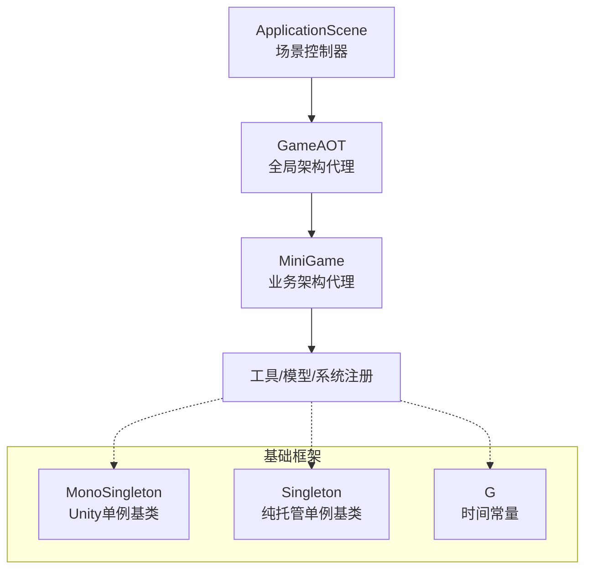
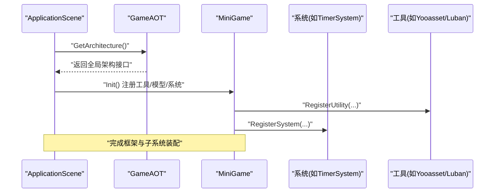
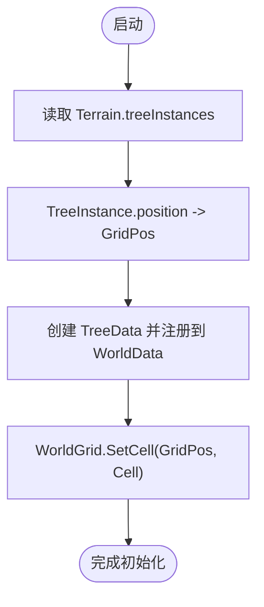
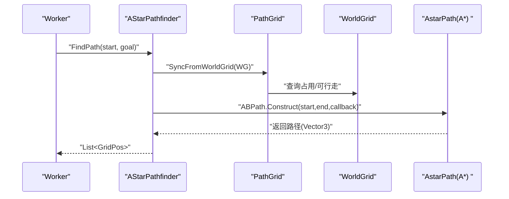
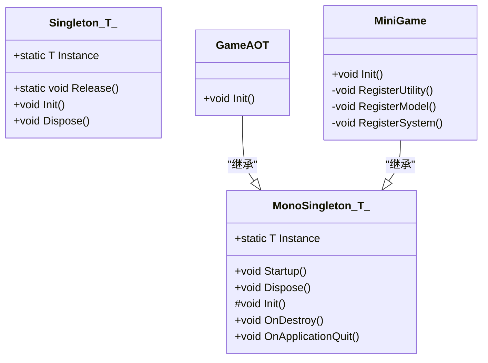
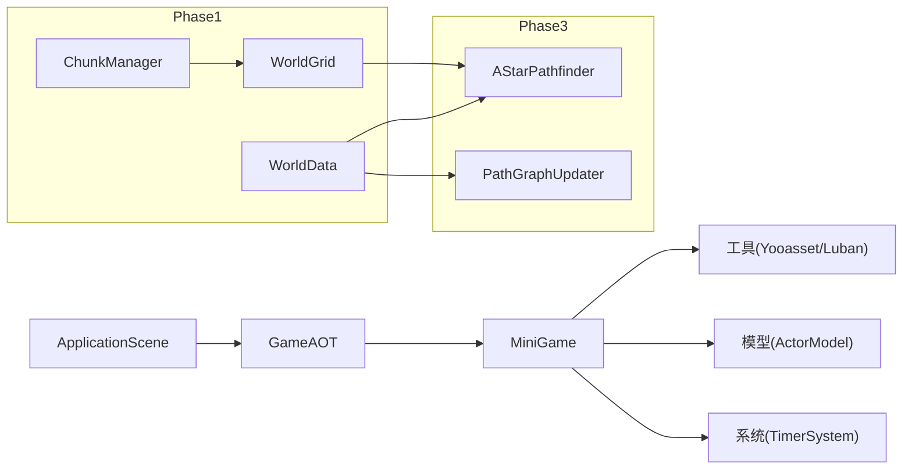

# 模拟核心系统

<cite>
**本文引用的文件**   
- [MiniGame.cs](file://Assets/Game/Scripts/MiniGame_Scripts/MiniGame.cs)
- [ApplicationScene.cs](file://Assets/Game/Scripts/ApplicationScene.cs)
- [GameAOT.cs](file://Assets/Game/Scripts/GameAOT.cs)
- [MonoSingleton.cs](file://Assets/Game/Framework/Base/Common/MonoSingleton.cs)
- [Singleton.cs](file://Assets/Game/Framework/Base/Common/Singleton.cs)
- [G.cs](file://Assets/Game/Framework/Base/G.cs)
- [unity_simulation_design_v1.md](file://.simulationdoc/unity_simulation_design_v1.md)
- [02-phase-1-world-grid.md](file://.simulationdoc/specs/02-phase-1-world-grid.md)
- [04-phase-3-worker-pathfinding.md](file://.simulationdoc/specs/04-phase-3-worker-pathfinding.md)
- [KNOWLEDGE_BASE_INDEX.md](file://.simulationdoc/specs/KNOWLEDGE_BASE_INDEX.md)
</cite>

## 目录
1. [简介](#简介)
2. [项目结构](#项目结构)
3. [核心组件](#核心组件)
4. [架构总览](#架构总览)
5. [详细组件分析](#详细组件分析)
6. [依赖关系分析](#依赖关系分析)
7. [性能考量](#性能考量)
8. [故障排查指南](#故障排查指南)
9. [结论](#结论)
10. [附录](#附录)

## 简介
本项目为基于 Unity 的“模拟经营”客户端，目标构建大地图、大量树木与工人、斜45°视角、建筑/道路/农田等系统的可演算世界。整体遵循“数据与表现分离”的原则：Terrain 仅负责渲染，WorldGrid 负责空间逻辑，ChunkManager 管理分区激活，A* 仅负责寻路，GameObject 仅用于表现层。

## 项目结构
- 应用启动与框架入口
  - ApplicationScene：场景控制器，初始化并获取全局架构接口
  - GameAOT：全局架构代理，注册系统（如计时器）
  - MiniGame：业务架构代理，注册工具、模型与系统
- 基础框架
  - MonoSingleton/Singleton：单例基类，提供运行时与纯托管单例能力
  - G：常用协程等待常量
- 设计文档与阶段规范
  - unity_simulation_design_v1.md：总体设计与原则
  - 02-phase-1-world-grid.md：Phase1 世界网格、坐标、Chunk、地形同步契约
  - 04-phase-3-worker-pathfinding.md：Phase3 寻路与局部图更新
  - KNOWLEDGE_BASE_INDEX.md：知识索引与关键接口速查

图表来源
- [ApplicationScene.cs:1-36](file://Assets/Game/Scripts/ApplicationScene.cs#L1-L36)
- [GameAOT.cs:1-13](file://Assets/Game/Scripts/GameAOT.cs#L1-L13)
- [MiniGame.cs:1-30](file://Assets/Game/Scripts/MiniGame_Scripts/MiniGame.cs#L1-L30)
- [MonoSingleton.cs:1-141](file://Assets/Game/Framework/Base/Common/MonoSingleton.cs#L1-L141)
- [Singleton.cs:1-40](file://Assets/Game/Framework/Base/Common/Singleton.cs#L1-L40)
- [G.cs:1-14](file://Assets/Game/Framework/Base/G.cs#L1-L14)

章节来源
- [ApplicationScene.cs:1-36](file://Assets/Game/Scripts/ApplicationScene.cs#L1-L36)
- [GameAOT.cs:1-13](file://Assets/Game/Scripts/GameAOT.cs#L1-L13)
- [MiniGame.cs:1-30](file://Assets/Game/Scripts/MiniGame_Scripts/MiniGame.cs#L1-L30)
- [MonoSingleton.cs:1-141](file://Assets/Game/Framework/Base/Common/MonoSingleton.cs#L1-L141)
- [Singleton.cs:1-40](file://Assets/Game/Framework/Base/Common/Singleton.cs#L1-L40)
- [G.cs:1-14](file://Assets/Game/Framework/Base/G.cs#L1-L14)

## 核心组件
- 架构代理与生命周期
  - GameAOT：在 Init 中注册系统（示例：TimerSystem），作为全局入口
  - MiniGame：注册工具（YooassetUtility、LubanUtility）、模型（ActorModel）与系统
  - ApplicationScene：Awake 时初始化，并通过 GetArchitecture 返回全局架构接口
- 单例基础设施
  - MonoSingleton<T>：Unity 对象单例，自动创建 Boot 节点、去重、DontDestroyOnLoad、销毁清理
  - Singleton<T>：纯托管单例，惰性创建与释放
- 通用常量
  - G：提供 WaitForSeconds 与 YieldInstruction 的常用时长常量，便于统一调度

章节来源
- [GameAOT.cs:1-13](file://Assets/Game/Scripts/GameAOT.cs#L1-L13)
- [MiniGame.cs:1-30](file://Assets/Game/Scripts/MiniGame_Scripts/MiniGame.cs#L1-L30)
- [ApplicationScene.cs:1-36](file://Assets/Game/Scripts/ApplicationScene.cs#L1-L36)
- [MonoSingleton.cs:1-141](file://Assets/Game/Framework/Base/Common/MonoSingleton.cs#L1-L141)
- [Singleton.cs:1-40](file://Assets/Game/Framework/Base/Common/Singleton.cs#L1-L40)
- [G.cs:1-14](file://Assets/Game/Framework/Base/G.cs#L1-L14)

## 架构总览
从渲染到逻辑再到表现的典型调用链如下：

图表来源
- [ApplicationScene.cs:1-36](file://Assets/Game/Scripts/ApplicationScene.cs#L1-L36)
- [GameAOT.cs:1-13](file://Assets/Game/Scripts/GameAOT.cs#L1-L13)
- [MiniGame.cs:1-30](file://Assets/Game/Scripts/MiniGame_Scripts/MiniGame.cs#L1-L30)

## 详细组件分析

### 世界与网格（Phase 1）
- 坐标体系
  - GridPos：整数格坐标
  - ChunkPos：Chunk 索引（GridPos / chunkSize）
  - WorldPos：浮点世界坐标，Y 由 Terrain 高度采样
  - 要求零分配的双向转换与边界处理
- 空间数据库
  - CellFlags：占用/可行走/实体标记位
  - Cell：记录 TreeId/BuildingId/RoadId 与 Flags
  - WorldGrid：提供 Get/SetCell、IsWalkable、IsOccupied、GetEntityAt、IsInBounds
- 权威数据层
  - WorldData：按 ID 索引的 Trees/Buildings/Roads/Workers 字典
  - IdGenerator：统一递增 ID
  - 事件：增删改事件通知（Tick 热路径优先原生事件避免 GC）
- Chunk 与 ChunkManager
  - 固定 32×32 尺寸
  - 以焦点为中心的 3×3 激活窗口，触发激活/停用事件
- 地形初始同步
  - TerrainDataReader：读取 Terrain.treeInstances → TreeData → WorldGrid 写入

图表来源
- [02-phase-1-world-grid.md:45-132](file://.simulationdoc/specs/02-phase-1-world-grid.md#L45-L132)
- [02-phase-1-world-grid.md:133-182](file://.simulationdoc/specs/02-phase-1-world-grid.md#L133-L182)
- [02-phase-1-world-grid.md:183-223](file://.simulationdoc/specs/02-phase-1-world-grid.md#L183-L223)
- [02-phase-1-world-grid.md:224-252](file://.simulationdoc/specs/02-phase-1-world-grid.md#L224-L252)

章节来源
- [02-phase-1-world-grid.md:45-132](file://.simulationdoc/specs/02-phase-1-world-grid.md#L45-L132)
- [02-phase-1-world-grid.md:133-182](file://.simulationdoc/specs/02-phase-1-world-grid.md#L133-L182)
- [02-phase-1-world-grid.md:183-223](file://.simulationdoc/specs/02-phase-1-world-grid.md#L183-L223)
- [02-phase-1-world-grid.md:224-252](file://.simulationdoc/specs/02-phase-1-world-grid.md#L224-L252)

### 寻路与工人（Phase 3）
- 与 A* Pathfinding Project 集成
  - 配置 Grid Graph 与 WorldGrid 对齐
  - 使用 ABPath.Construct 发起异步寻路
- 适配层
  - PathGrid：根据 WorldGrid 设置节点可行走性
  - AStarPathfinder：封装寻路，将 Vector3 路径转为 List<GridPos>
- 局部图更新
  - PathGraphUpdater：订阅 WorldData 事件，使用 GraphUpdateObject 局部刷新
- Worker 移动与状态机
  - 状态：Idle/Move/Work/Carry
  - 不全局搜索，只执行任务

图表来源
- [04-phase-3-worker-pathfinding.md:126-158](file://.simulationdoc/specs/04-phase-3-worker-pathfinding.md#L126-L158)
- [04-phase-3-worker-pathfinding.md:159-189](file://.simulationdoc/specs/04-phase-3-worker-pathfinding.md#L159-L189)

章节来源
- [04-phase-3-worker-pathfinding.md:126-158](file://.simulationdoc/specs/04-phase-3-worker-pathfinding.md#L126-L158)
- [04-phase-3-worker-pathfinding.md:159-189](file://.simulationdoc/specs/04-phase-3-worker-pathfinding.md#L159-L189)

### 单例与生命周期
- MonoSingleton<T>
  - 首次访问时查找或创建实例，挂载到 Boot 节点并 DontDestroyOnLoad
  - Awake 去重，OnDestroy/OnApplicationQuit 清理状态
- Singleton<T>
  - 惰性创建，支持 Release 释放
- 适用场景
  - 需要 Unity 生命周期的系统用 MonoSingleton<T>
  - 纯数据/工具可用 Singleton<T>

图表来源
- [MonoSingleton.cs:1-141](file://Assets/Game/Framework/Base/Common/MonoSingleton.cs#L1-L141)
- [Singleton.cs:1-40](file://Assets/Game/Framework/Base/Common/Singleton.cs#L1-L40)
- [GameAOT.cs:1-13](file://Assets/Game/Scripts/GameAOT.cs#L1-L13)
- [MiniGame.cs:1-30](file://Assets/Game/Scripts/MiniGame_Scripts/MiniGame.cs#L1-L30)

章节来源
- [MonoSingleton.cs:1-141](file://Assets/Game/Framework/Base/Common/MonoSingleton.cs#L1-L141)
- [Singleton.cs:1-40](file://Assets/Game/Framework/Base/Common/Singleton.cs#L1-L40)
- [GameAOT.cs:1-13](file://Assets/Game/Scripts/GameAOT.cs#L1-L13)
- [MiniGame.cs:1-30](file://Assets/Game/Scripts/MiniGame_Scripts/MiniGame.cs#L1-L30)

## 依赖关系分析
- 启动链路
  - ApplicationScene 通过 GetArchitecture 获取 GameAOT 接口，随后 MiniGame 完成工具/模型/系统注册
- 子系统依赖
  - 世界与网格（Phase1）为寻路（Phase3）提供空间数据与可行走信息
  - 寻路依赖 A* 插件，但通过适配层屏蔽实现细节
- 基础设施
  - 单例贯穿各模块，保证全局访问一致性

图表来源
- [ApplicationScene.cs:1-36](file://Assets/Game/Scripts/ApplicationScene.cs#L1-L36)
- [GameAOT.cs:1-13](file://Assets/Game/Scripts/GameAOT.cs#L1-L13)
- [MiniGame.cs:1-30](file://Assets/Game/Scripts/MiniGame_Scripts/MiniGame.cs#L1-L30)
- [02-phase-1-world-grid.md:45-132](file://.simulationdoc/specs/02-phase-1-world-grid.md#L45-L132)
- [04-phase-3-worker-pathfinding.md:126-189](file://.simulationdoc/specs/04-phase-3-worker-pathfinding.md#L126-L189)

章节来源
- [ApplicationScene.cs:1-36](file://Assets/Game/Scripts/ApplicationScene.cs#L1-L36)
- [GameAOT.cs:1-13](file://Assets/Game/Scripts/GameAOT.cs#L1-L13)
- [MiniGame.cs:1-30](file://Assets/Game/Scripts/MiniGame_Scripts/MiniGame.cs#L1-L30)
- [02-phase-1-world-grid.md:45-132](file://.simulationdoc/specs/02-phase-1-world-grid.md#L45-L132)
- [04-phase-3-worker-pathfinding.md:126-189](file://.simulationdoc/specs/04-phase-3-worker-pathfinding.md#L126-L189)

## 性能考量
- 对象池
  - TreeView 最大 300~500 实例，避免 Instantiate/Destroy
- 内存与 GC
  - Tick 热路径优先使用原生事件，减少委托分配
  - 坐标转换方法零分配
- 寻路更新
  - 局部 Graph Update，避免全图重建
- 目标预算
  - TreeView ≤ 500；Worker ≤ 100；CPU < 10ms；GPU < 8ms

章节来源
- [unity_simulation_design_v1.md:89-95](file://.simulationdoc/unity_simulation_design_v1.md#L89-L95)
- [unity_simulation_design_v1.md:173-179](file://.simulationdoc/unity_simulation_design_v1.md#L173-L179)
- [04-phase-3-worker-pathfinding.md:159-189](file://.simulationdoc/specs/04-phase-3-worker-pathfinding.md#L159-L189)
- [02-phase-1-world-grid.md:45-78](file://.simulationdoc/specs/02-phase-1-world-grid.md#L45-L78)

## 故障排查指南
- 单例重复或多实例
  - 检查 MonoSingleton 的 Awake 去重逻辑与 Boot 节点挂载
  - 确认 Destroy 后 Initializer 状态是否被正确清理
- 寻路失败或不可达
  - 校验 PathGrid 与 WorldGrid 的对齐与可行走标记
  - 确认局部图更新范围是否覆盖变化区域
- 世界坐标异常
  - 验证 GridPos/ChunkPos/WorldPos 转换边界条件
  - 检查 Terrain 高度采样与 Y 值处理
- 性能抖动
  - 关注 Tick 热路径中的事件与分配
  - 监控对象池上限与频繁生成/销毁

章节来源
- [MonoSingleton.cs:51-108](file://Assets/Game/Framework/Base/Common/MonoSingleton.cs#L51-L108)
- [04-phase-3-worker-pathfinding.md:126-189](file://.simulationdoc/specs/04-phase-3-worker-pathfinding.md#L126-L189)
- [02-phase-1-world-grid.md:45-78](file://.simulationdoc/specs/02-phase-1-world-grid.md#L45-L78)

## 结论
本方案以“数据与表现分离”为核心，通过 WorldGrid/WorldData/ChunkManager 构建高性能空间与数据层，结合 A* 适配层与局部图更新保障寻路效率，配合对象池与零分配坐标转换满足大规模世界的性能目标。当前代码已具备启动与装配骨架，后续可按 Phase 逐步落地世界、寻路、工人、建筑与模拟系统。

## 附录
- 关键接口速查
  - WorldGrid：GetCell/SetCell/IsWalkable/IsOccupied/GetEntityAt/IsInBounds
  - AStarPathfinder：FindPath/SetNodeWalkable
  - PathGraphUpdater：RequestGraphUpdate(center, radius)

章节来源
- [KNOWLEDGE_BASE_INDEX.md:86-99](file://.simulationdoc/specs/KNOWLEDGE_BASE_INDEX.md#L86-L99)