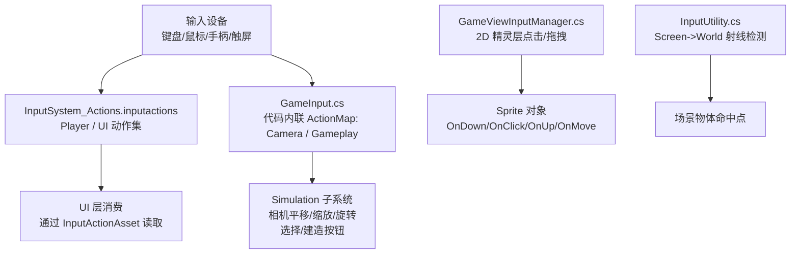
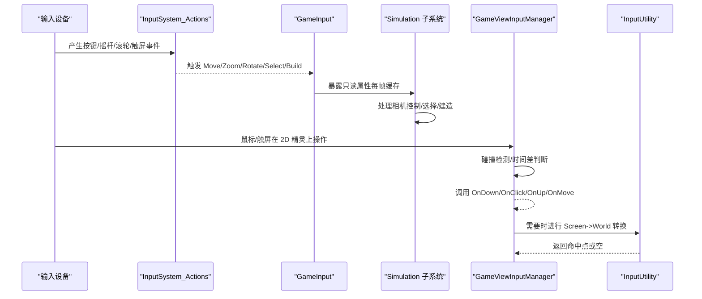
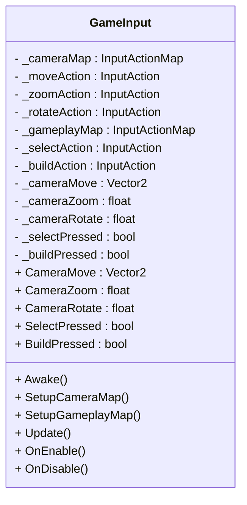
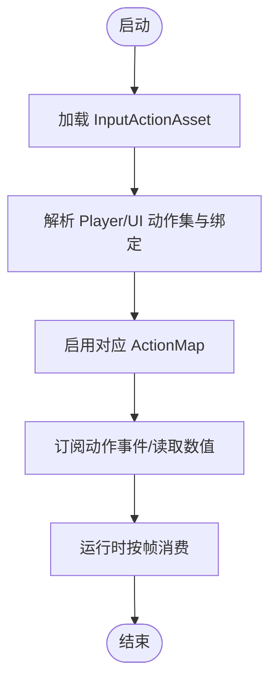
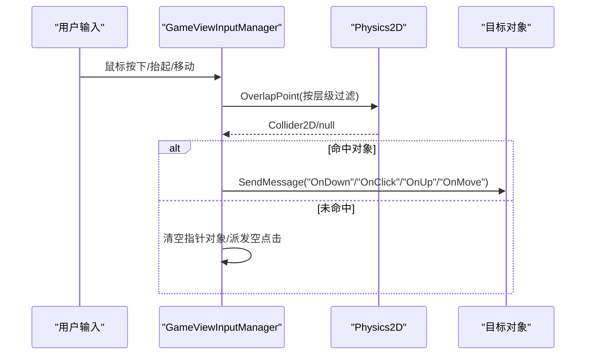
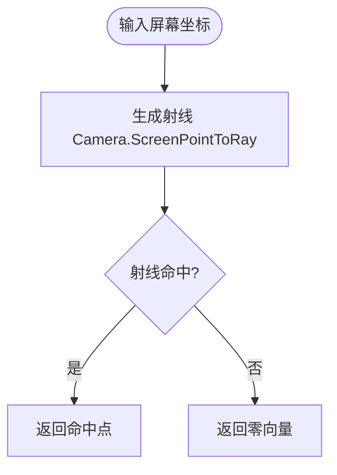
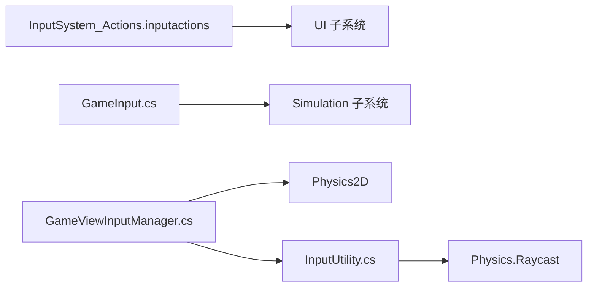

# 游戏输入系统

<cite>
**本文引用的文件**   
- [Assets/InputSystem_Actions.inputactions](file://Assets/InputSystem_Actions.inputactions)
- [Assets/Game/Scripts/Simulation/Input/GameInput.cs](file://Assets/Game/Scripts/Simulation/Input/GameInput.cs)
- [Assets/Game/Scripts/MiniGame_Scripts/Utility/InputUtility.cs](file://Assets/Game/Scripts/MiniGame_Scripts/Utility/InputUtility.cs)
- [Assets/Game/Framework/Ugui/Runtime/GameViewScripts/GameViewInputManager.cs](file://Assets/Game/Framework/Ugui/Runtime/GameViewScripts/GameViewInputManager.cs)
</cite>

## 目录
1. [简介](#简介)
2. [项目结构](#项目结构)
3. [核心组件](#核心组件)
4. [架构总览](#架构总览)
5. [详细组件分析](#详细组件分析)
6. [依赖关系分析](#依赖关系分析)
7. [性能考量](#性能考量)
8. [故障排查指南](#故障排查指南)
9. [结论](#结论)

## 简介
本文件围绕“游戏输入系统”展开，聚焦于 Unity New Input System 与旧版 Input API 的混合使用方式。项目同时包含：
- 基于代码内联定义的 GameInput（New Input System），用于相机控制与基础交互；
- 基于 .inputactions 资源的 Player/UI 动作集配置；
- 面向 UI 与 2D 精灵层的触摸/鼠标事件分发器 GameViewInputManager；
- 屏幕坐标到世界坐标转换工具 InputUtility。

目标是帮助开发者理解输入系统的整体设计、数据流向、关键实现细节以及扩展与维护建议。

## 项目结构
与输入相关的核心位置如下：
- 资源层：Assets/InputSystem_Actions.inputactions（定义 Player 与 UI 两套动作映射）
- 运行时逻辑：
  - Assets/Game/Scripts/Simulation/Input/GameInput.cs（New Input System 代码内联定义）
  - Assets/Game/Scripts/MiniGame_Scripts/Utility/InputUtility.cs（屏幕/世界坐标转换）
  - Assets/Game/Framework/Ugui/Runtime/GameViewScripts/GameViewInputManager.cs（2D 精灵层点击/拖拽分发）

图表来源
- [Assets/InputSystem_Actions.inputactions:1-800](file://Assets/InputSystem_Actions.inputactions#L1-L800)
- [Assets/Game/Scripts/Simulation/Input/GameInput.cs:1-109](file://Assets/Game/Scripts/Simulation/Input/GameInput.cs#L1-L109)
- [Assets/Game/Framework/Ugui/Runtime/GameViewScripts/GameViewInputManager.cs:1-173](file://Assets/Game/Framework/Ugui/Runtime/GameViewScripts/GameViewInputManager.cs#L1-L173)
- [Assets/Game/Scripts/MiniGame_Scripts/Utility/InputUtility.cs:1-31](file://Assets/Game/Scripts/MiniGame_Scripts/Utility/InputUtility.cs#L1-L31)

章节来源
- [Assets/InputSystem_Actions.inputactions:1-800](file://Assets/InputSystem_Actions.inputactions#L1-L800)
- [Assets/Game/Scripts/Simulation/Input/GameInput.cs:1-109](file://Assets/Game/Scripts/Simulation/Input/GameInput.cs#L1-L109)
- [Assets/Game/Framework/Ugui/Runtime/GameViewScripts/GameViewInputManager.cs:1-173](file://Assets/Game/Framework/Ugui/Runtime/GameViewScripts/GameViewInputManager.cs#L1-L173)
- [Assets/Game/Scripts/MiniGame_Scripts/Utility/InputUtility.cs:1-31](file://Assets/Game/Scripts/MiniGame_Scripts/Utility/InputUtility.cs#L1-L31)

## 核心组件
- GameInput：以代码内联方式创建并启用两个 InputActionMap（Camera、Gameplay），提供每帧缓存的只读属性，供 Simulation 子系统消费。
- InputSystem_Actions.inputactions：集中定义 Player 与 UI 两套动作集，绑定多种设备（键盘、鼠标、手柄、XR、触屏等）。
- GameViewInputManager：针对 2D 精灵层的事件分发器，封装按下、抬起、移动、点击判定，并通过消息机制通知目标对象或统一接收者。
- InputUtility：提供屏幕坐标转世界坐标、屏幕中心转世界坐标、射线命中计算等常用工具方法。

章节来源
- [Assets/Game/Scripts/Simulation/Input/GameInput.cs:1-109](file://Assets/Game/Scripts/Simulation/Input/GameInput.cs#L1-L109)
- [Assets/InputSystem_Actions.inputactions:1-800](file://Assets/InputSystem_Actions.inputactions#L1-L800)
- [Assets/Game/Framework/Ugui/Runtime/GameViewScripts/GameViewInputManager.cs:1-173](file://Assets/Game/Framework/Ugui/Runtime/GameViewScripts/GameViewInputManager.cs#L1-L173)
- [Assets/Game/Scripts/MiniGame_Scripts/Utility/InputUtility.cs:1-31](file://Assets/Game/Scripts/MiniGame_Scripts/Utility/InputUtility.cs#L1-L31)

## 架构总览
从输入采集到业务消费的典型路径：
- 设备输入 → Input System（Actions 资源或代码内联）→ 动作值/事件 → 各子系统消费
- 2D 精灵层点击/拖拽 → GameViewInputManager → 目标对象回调
- 屏幕坐标 → 射线检测 → 世界坐标命中点 → 业务逻辑

图表来源
- [Assets/InputSystem_Actions.inputactions:1-800](file://Assets/InputSystem_Actions.inputactions#L1-L800)
- [Assets/Game/Scripts/Simulation/Input/GameInput.cs:1-109](file://Assets/Game/Scripts/Simulation/Input/GameInput.cs#L1-L109)
- [Assets/Game/Framework/Ugui/Runtime/GameViewScripts/GameViewInputManager.cs:1-173](file://Assets/Game/Framework/Ugui/Runtime/GameViewScripts/GameViewInputManager.cs#L1-L173)
- [Assets/Game/Scripts/MiniGame_Scripts/Utility/InputUtility.cs:1-31](file://Assets/Game/Scripts/MiniGame_Scripts/Utility/InputUtility.cs#L1-L31)

## 详细组件分析

### GameInput（New Input System 代码内联）
- 职责
  - 在 Awake 中创建并配置 Camera 与 Gameplay 两个 ActionMap
  - Update 中一次性读取所有输入并缓存为只读属性，避免重复 ReadValue 开销
  - OnEnable/OnDisable 管理 ActionMap 的启用/禁用
- 关键行为
  - Camera 平移：WASD 复合绑定为 2DVector
  - Camera 缩放：Mouse scroll Y
  - Camera 旋转：Q/E 复合绑定为 1DAxis
  - 选择/建造：鼠标左键/右键 Button 事件
- 复杂度
  - 每帧 O(1) 读取固定数量 Action，空间占用稳定
- 错误处理
  - 对可能为 null 的 Action 使用安全访问，避免空引用异常
- 优化点
  - 已采用每帧缓存策略，减少多次 ReadValue 带来的 GC 与 CPU 开销
  - 可考虑将高频属性暴露为 readonly struct 或仅由订阅方按需拉取

图表来源
- [Assets/Game/Scripts/Simulation/Input/GameInput.cs:1-109](file://Assets/Game/Scripts/Simulation/Input/GameInput.cs#L1-L109)

章节来源
- [Assets/Game/Scripts/Simulation/Input/GameInput.cs:1-109](file://Assets/Game/Scripts/Simulation/Input/GameInput.cs#L1-L109)

### InputSystem_Actions.inputactions（Player 与 UI 动作集）
- 作用
  - 集中维护 Player 与 UI 两套动作集，支持多设备绑定（键盘、鼠标、手柄、XR、触屏等）
  - 提供标准导航与交互动作（如 Navigate、Submit、Cancel、Point、Click 等）
- 关键内容
  - Player 地图：Move、Look、Attack、Interact、Crouch、Jump、Previous、Next、Sprint 等
  - UI 地图：Navigate、Submit、Cancel、Point、Click、RightClick、MiddleClick、ScrollWheel 等
- 适用场景
  - 适合通过 PlayerInput 组件或 InputActionAsset 在运行时加载并订阅事件
  - 便于策划/美术在编辑器中调整绑定与组合

图表来源
- [Assets/InputSystem_Actions.inputactions:1-800](file://Assets/InputSystem_Actions.inputactions#L1-L800)

章节来源
- [Assets/InputSystem_Actions.inputactions:1-800](file://Assets/InputSystem_Actions.inputactions#L1-L800)

### GameViewInputManager（2D 精灵层事件分发）
- 职责
  - 监听鼠标/触屏事件，结合 2D 碰撞体进行命中检测
  - 根据是否位于 UI 上方、点击时长阈值等条件，派发 OnDown/OnClick/OnUp/OnMove 消息
  - 支持全局 messageReceiver 或直接发送到 hit 对象
- 关键流程
  - Update 中判断是否在 UI 上且触控数小于 2
  - 按下时记录 pressPosition、pressObject、时间戳
  - 抬起时判断 clickDelta 与 pressObject == pointerOnObject，决定是否派发 Click
  - 移动时更新 delta 与当前指针对象，派发 Move
- 注意事项
  - 使用 SendMessage 进行回调，需确保目标对象存在相应方法名
  - isCheckOnUGUI 与 layerMask 影响命中范围与 UI 穿透行为

图表来源
- [Assets/Game/Framework/Ugui/Runtime/GameViewScripts/GameViewInputManager.cs:1-173](file://Assets/Game/Framework/Ugui/Runtime/GameViewScripts/GameViewInputManager.cs#L1-L173)

章节来源
- [Assets/Game/Framework/Ugui/Runtime/GameViewScripts/GameViewInputManager.cs:1-173](file://Assets/Game/Framework/Ugui/Runtime/GameViewScripts/GameViewInputManager.cs#L1-L173)

### InputUtility（屏幕/世界坐标工具）
- 职责
  - 获取鼠标在世界空间的坐标
  - 获取屏幕中心在世界空间的坐标
  - 将屏幕坐标转换为世界坐标（基于射线与物理命中）
- 关键点
  - 兼容新旧输入系统（ENABLE_INPUT_SYSTEM 宏）
  - 使用 Physics.Raycast 返回命中点，否则返回零向量

图表来源
- [Assets/Game/Scripts/MiniGame_Scripts/Utility/InputUtility.cs:1-31](file://Assets/Game/Scripts/MiniGame_Scripts/Utility/InputUtility.cs#L1-L31)

章节来源
- [Assets/Game/Scripts/MiniGame_Scripts/Utility/InputUtility.cs:1-31](file://Assets/Game/Scripts/MiniGame_Scripts/Utility/InputUtility.cs#L1-L31)

## 依赖关系分析
- GameInput 依赖 UnityEngine.InputSystem 提供的 InputActionMap/InputAction，不依赖 .inputactions 资源
- GameViewInputManager 依赖旧版 Input API（GetMouseButton*、Input.touchCount）与 2D 物理（Physics2D.OverlapPoint）
- InputUtility 兼容新旧输入系统，并在命中时使用 Physics.Raycast
- InputSystem_Actions.inputactions 作为资源被其他模块（例如 PlayerInput 或自定义加载器）消费

图表来源
- [Assets/InputSystem_Actions.inputactions:1-800](file://Assets/InputSystem_Actions.inputactions#L1-L800)
- [Assets/Game/Scripts/Simulation/Input/GameInput.cs:1-109](file://Assets/Game/Scripts/Simulation/Input/GameInput.cs#L1-L109)
- [Assets/Game/Framework/Ugui/Runtime/GameViewScripts/GameViewInputManager.cs:1-173](file://Assets/Game/Framework/Ugui/Runtime/GameViewScripts/GameViewInputManager.cs#L1-L173)
- [Assets/Game/Scripts/MiniGame_Scripts/Utility/InputUtility.cs:1-31](file://Assets/Game/Scripts/MiniGame_Scripts/Utility/InputUtility.cs#L1-L31)

章节来源
- [Assets/InputSystem_Actions.inputactions:1-800](file://Assets/InputSystem_Actions.inputactions#L1-L800)
- [Assets/Game/Scripts/Simulation/Input/GameInput.cs:1-109](file://Assets/Game/Scripts/Simulation/Input/GameInput.cs#L1-L109)
- [Assets/Game/Framework/Ugui/Runtime/GameViewScripts/GameViewInputManager.cs:1-173](file://Assets/Game/Framework/Ugui/Runtime/GameViewScripts/GameViewInputManager.cs#L1-L173)
- [Assets/Game/Scripts/MiniGame_Scripts/Utility/InputUtility.cs:1-31](file://Assets/Game/Scripts/MiniGame_Scripts/Utility/InputUtility.cs#L1-L31)

## 性能考量
- 每帧缓存：GameInput 在 Update 中一次性读取所有输入并缓存，降低重复 ReadValue 的开销
- 事件分发：GameViewInputManager 使用 SendMessage，频繁调用会产生反射开销，建议在热点路径改用委托或接口
- 射线检测：InputUtility 与 GameViewInputManager 均涉及射线/碰撞检测，注意层级掩码与命中距离裁剪，避免不必要的深射线
- 输入系统切换：若全面迁移至 New Input System，可减少旧 API 分支判断，提升一致性与可维护性

[本节为通用指导，无需特定文件来源]

## 故障排查指南
- 现象：GameInput 无响应
  - 检查 GameObject 是否启用，OnEnable/OnDisable 是否正确执行
  - 确认 ActionMap 是否成功创建与启用
  - 验证 Update 中是否出现空引用保护导致始终返回默认值
- 现象：2D 精灵点击无效
  - 确认 Sprite 所在对象具有 Collider2D
  - 检查 LayerMask 是否包含目标层
  - 确认 isCheckOnUGUI 设置与 UI 遮挡情况
  - 检查目标对象是否存在 OnDown/OnClick/OnUp/OnMove 方法名
- 现象：屏幕坐标转世界坐标不正确
  - 确认传入的 Camera 是否为期望的主相机
  - 检查射线命中平面与 farClipPlane 设置
  - 当未命中时，返回值应为零向量，需在业务侧做判空处理

章节来源
- [Assets/Game/Scripts/Simulation/Input/GameInput.cs:1-109](file://Assets/Game/Scripts/Simulation/Input/GameInput.cs#L1-L109)
- [Assets/Game/Framework/Ugui/Runtime/GameViewScripts/GameViewInputManager.cs:1-173](file://Assets/Game/Framework/Ugui/Runtime/GameViewScripts/GameViewInputManager.cs#L1-L173)
- [Assets/Game/Scripts/MiniGame_Scripts/Utility/InputUtility.cs:1-31](file://Assets/Game/Scripts/MiniGame_Scripts/Utility/InputUtility.cs#L1-L31)

## 结论
本项目在游戏输入方面采用了“资源驱动 + 代码内联 + 2D 事件分发”的组合方案：
- 对于复杂跨设备交互，优先使用 InputSystem_Actions.inputactions 集中管理；
- 对于轻量、稳定的相机与基础交互，GameInput 的代码内联方式简洁高效；
- 对于 2D 精灵层交互，GameViewInputManager 提供了开箱即用的事件分发能力；
- InputUtility 则屏蔽了新旧输入系统与坐标转换的差异，便于上层复用。

建议后续逐步统一至 New Input System，并将 SendMessage 替换为更高效的委托/事件总线，以提升性能与可维护性。