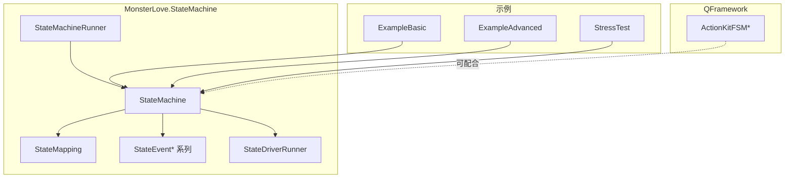
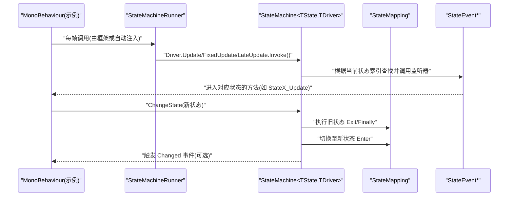
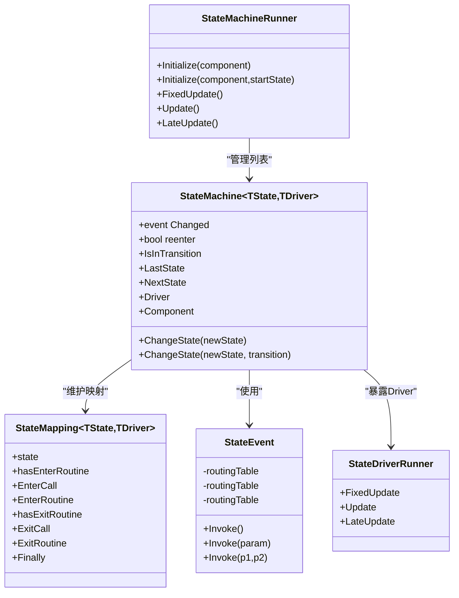
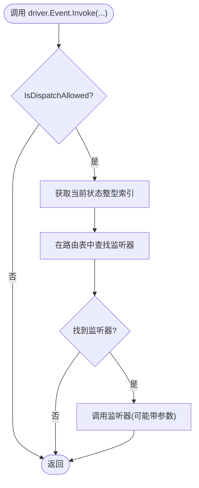
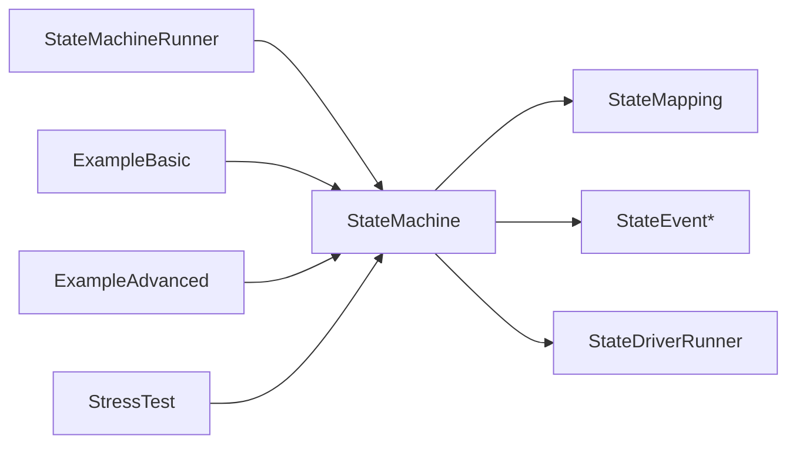

# 状态机系统 (MonsterLove.StateMachine)

<cite>
**本文引用的文件**   
- [Assets/Game/Framework/FSM/Runtime/StateMachine.cs](file://Assets/Game/Framework/FSM/Runtime/StateMachine.cs)
- [Assets/Game/Framework/FSM/Runtime/StateMapping.cs](file://Assets/Game/Framework/FSM/Runtime/StateMapping.cs)
- [Assets/Game/Framework/FSM/Runtime/Events/StateEvent.cs](file://Assets/Game/Framework/FSM/Runtime/Events/StateEvent.cs)
- [Assets/Game/Framework/FSM/Runtime/Drivers/StateDriverRunner.cs](file://Assets/Game/Framework/FSM/Runtime/Drivers/StateDriverRunner.cs)
- [Assets/Game/Framework/FSM/Runtime/StateMachineRunner.cs](file://Assets/Game/Framework/FSM/Runtime/StateMachineRunner.cs)
- [Assets/Samples/FSM/Scripts/ExampleBasic.cs](file://Assets/Samples/FSM/Scripts/ExampleBasic.cs)
- [Assets/Samples/FSM/Scripts/ExampleAdvanced.cs](file://Assets/Samples/FSM/Scripts/ExampleAdvanced.cs)
- [Assets/Samples/FSM/Scripts/Perf/StressTest.cs](file://Assets/Samples/FSM/Scripts/Perf/StressTest.cs)
- [Assets/Game/Framework/Qframework/Runtime/Toolkits/ActionKit.cs](file://Assets/Game/Framework/Qframework/Runtime/Toolkits/ActionKit.cs)
</cite>

## 目录
1. [简介](#简介)
2. [项目结构](#项目结构)
3. [核心组件](#核心组件)
4. [架构总览](#架构总览)
5. [详细组件分析](#详细组件分析)
6. [依赖关系分析](#依赖关系分析)
7. [性能考量](#性能考量)
8. [故障排查指南](#故障排查指南)
9. [结论](#结论)
10. [附录：示例与最佳实践](#附录示例与最佳实践)

## 简介
本文件面向 SimulationClient 中基于 MonsterLove.StateMachine 的状态机系统，系统性阐述其设计、API 与使用模式。内容覆盖：
- 状态定义、状态转换与事件驱动机制
- StateMachine 核心 API（初始化、转换控制、事件处理）
- 简单与复杂状态机的实现范式
- 自定义事件与数据传递
- 与 QFramework ActionKit 的集成思路
- 设计模式、性能优化与调试技巧
- 常见问题（状态循环、内存泄漏、状态同步）解决方案

## 项目结构
MonsterLove.StateMachine 在项目中以运行时库形式提供，核心位于 FSM/Runtime 目录；示例位于 Samples/FSM/Scripts；QFramework 的 ActionKit 位于 Framework/Qframework/...。



图表来源
- [Assets/Game/Framework/FSM/Runtime/StateMachine.cs:30-120](file://Assets/Game/Framework/FSM/Runtime/StateMachine.cs#L30-L120)
- [Assets/Game/Framework/FSM/Runtime/StateMapping.cs:30-56](file://Assets/Game/Framework/FSM/Runtime/StateMapping.cs#L30-L56)
- [Assets/Game/Framework/FSM/Runtime/Events/StateEvent.cs:31-132](file://Assets/Game/Framework/FSM/Runtime/Events/StateEvent.cs#L31-L132)
- [Assets/Game/Framework/FSM/Runtime/Drivers/StateDriverRunner.cs:25-31](file://Assets/Game/Framework/FSM/Runtime/Drivers/StateDriverRunner.cs#L25-L31)
- [Assets/Game/Framework/FSM/Runtime/StateMachineRunner.cs:30-110](file://Assets/Game/Framework/FSM/Runtime/StateMachineRunner.cs#L30-L110)
- [Assets/Samples/FSM/Scripts/ExampleBasic.cs:1-136](file://Assets/Samples/FSM/Scripts/ExampleBasic.cs#L1-L136)
- [Assets/Samples/FSM/Scripts/ExampleAdvanced.cs:1-161](file://Assets/Samples/FSM/Scripts/ExampleAdvanced.cs#L1-L161)
- [Assets/Samples/FSM/Scripts/Perf/StressTest.cs:1-82](file://Assets/Samples/FSM/Scripts/Perf/StressTest.cs#L1-L82)
- [Assets/Game/Framework/Qframework/Runtime/Toolkits/ActionKit.cs:1147-1291](file://Assets/Game/Framework/Qframework/Runtime/Toolkits/ActionKit.cs#L1147-L1291)

章节来源
- [Assets/Game/Framework/FSM/Runtime/StateMachine.cs:30-120](file://Assets/Game/Framework/FSM/Runtime/StateMachine.cs#L30-L120)
- [Assets/Game/Framework/FSM/Runtime/StateMachineRunner.cs:30-110](file://Assets/Game/Framework/FSM/Runtime/StateMachineRunner.cs#L30-L110)

## 核心组件
- StateMachine<TState, TDriver>：状态机核心，负责状态映射、生命周期回调绑定、转换流程控制、事件分发。
- StateMapping<TState, TDriver>：每个枚举状态的元数据与回调委托集合（Enter/Exit/Finally）。
- StateEvent*：按当前状态路由的事件总线，支持无参与带参事件。
- StateDriverRunner：内置固定帧事件（FixedUpdate/Update/LateUpdate）的 Driver 模板。
- StateMachineRunner：MonoBehaviour 挂载点，统一调度所有已注册状态机的每帧事件。

章节来源
- [Assets/Game/Framework/FSM/Runtime/StateMachine.cs:52-120](file://Assets/Game/Framework/FSM/Runtime/StateMachine.cs#L52-L120)
- [Assets/Game/Framework/FSM/Runtime/StateMapping.cs:30-56](file://Assets/Game/Framework/FSM/Runtime/StateMapping.cs#L30-L56)
- [Assets/Game/Framework/FSM/Runtime/Events/StateEvent.cs:31-132](file://Assets/Game/Framework/FSM/Runtime/Events/StateEvent.cs#L31-L132)
- [Assets/Game/Framework/FSM/Runtime/Drivers/StateDriverRunner.cs:25-31](file://Assets/Game/Framework/FSM/Runtime/Drivers/StateDriverRunner.cs#L25-L31)
- [Assets/Game/Framework/FSM/Runtime/StateMachineRunner.cs:30-110](file://Assets/Game/Framework/FSM/Runtime/StateMachineRunner.cs#L30-L110)

## 架构总览
下图展示了从 MonoBehaviour 到状态机引擎、再到具体状态回调的调用链。



图表来源
- [Assets/Game/Framework/FSM/Runtime/StateMachineRunner.cs:65-99](file://Assets/Game/Framework/FSM/Runtime/StateMachineRunner.cs#L65-L99)
- [Assets/Game/Framework/FSM/Runtime/StateMachine.cs:344-509](file://Assets/Game/Framework/FSM/Runtime/StateMachine.cs#L344-L509)
- [Assets/Game/Framework/FSM/Runtime/Events/StateEvent.cs:49-96](file://Assets/Game/Framework/FSM/Runtime/Events/StateEvent.cs#L49-L96)

## 详细组件分析

### StateMachine<TState, TDriver> 核心 API
- 初始化
  - 静态 Initialize(component) / Initialize(component, startState)：自动发现并绑定状态方法，创建并返回状态机实例。
  - 构造器 new StateMachine<TState, TDriver>(component)：直接创建实例，需自行设置初始状态。
- 状态转换
  - ChangeState(newState) / ChangeState(newState, transition)：支持 Safe/Overwrite 两种转换策略。
  - reenter 字段：是否允许重复进入同一状态。
  - IsInTransition、LastState、NextState、Changed 事件：用于外部观察与协调。
- 事件系统
  - 通过 Driver 中的 StateEvent* 字段声明事件，并在目标组件中以“状态名_事件名”命名约定绑定回调。
  - 支持 0/1/2 个参数的泛型事件类型。
- 生命周期
  - 支持 Enter/Exit/Finally 三种回调，可为普通方法或协程。

章节来源
- [Assets/Game/Framework/FSM/Runtime/StateMachine.cs:635-655](file://Assets/Game/Framework/FSM/Runtime/StateMachine.cs#L635-L655)
- [Assets/Game/Framework/FSM/Runtime/StateMachine.cs:344-453](file://Assets/Game/Framework/FSM/Runtime/StateMachine.cs#L344-L453)
- [Assets/Game/Framework/FSM/Runtime/StateMachine.cs:527-590](file://Assets/Game/Framework/FSM/Runtime/StateMachine.cs#L527-L590)
- [Assets/Game/Framework/FSM/Runtime/StateMachine.cs:277-311](file://Assets/Game/Framework/FSM/Runtime/StateMachine.cs#L277-L311)
- [Assets/Game/Framework/FSM/Runtime/StateMachine.cs:220-275](file://Assets/Game/Framework/FSM/Runtime/StateMachine.cs#L220-L275)

#### 类图（代码级）


图表来源
- [Assets/Game/Framework/FSM/Runtime/StateMachine.cs:52-120](file://Assets/Game/Framework/FSM/Runtime/StateMachine.cs#L52-L120)
- [Assets/Game/Framework/FSM/Runtime/StateMapping.cs:30-56](file://Assets/Game/Framework/FSM/Runtime/StateMapping.cs#L30-L56)
- [Assets/Game/Framework/FSM/Runtime/Events/StateEvent.cs:31-132](file://Assets/Game/Framework/FSM/Runtime/Events/StateEvent.cs#L31-L132)
- [Assets/Game/Framework/FSM/Runtime/Drivers/StateDriverRunner.cs:25-31](file://Assets/Game/Framework/FSM/Runtime/Drivers/StateDriverRunner.cs#L25-L31)
- [Assets/Game/Framework/FSM/Runtime/StateMachineRunner.cs:30-110](file://Assets/Game/Framework/FSM/Runtime/StateMachineRunner.cs#L30-L110)

### 状态事件系统工作原理
- 事件注册：在 Driver 中声明 StateEvent* 字段，状态机启动时反射扫描目标组件，将“状态名_事件名”方法与对应 StateEvent 建立路由表项。
- 事件派发：调用 driver.Event.Invoke(...) 时，先检查 IsDispatchAllowed（非过渡期且已有当前状态），再根据当前状态整型索引查表并调用监听器。
- 参数传递：支持 0/1/2 个参数的事件类型，便于携带上下文数据。



图表来源
- [Assets/Game/Framework/FSM/Runtime/Events/StateEvent.cs:49-96](file://Assets/Game/Framework/FSM/Runtime/Events/StateEvent.cs#L49-L96)
- [Assets/Game/Framework/FSM/Runtime/StateMachine.cs:609-622](file://Assets/Game/Framework/FSM/Runtime/StateMachine.cs#L609-L622)

章节来源
- [Assets/Game/Framework/FSM/Runtime/Events/StateEvent.cs:31-132](file://Assets/Game/Framework/FSM/Runtime/Events/StateEvent.cs#L31-L132)
- [Assets/Game/Framework/FSM/Runtime/StateMachine.cs:220-275](file://Assets/Game/Framework/FSM/Runtime/StateMachine.cs#L220-L275)

### 状态转换流程与策略
- Safe 模式：若已在过渡中，则尝试覆盖目标状态或排队等待前一次过渡完成。
- Overwrite 模式：中断当前过渡，立即开始新的过渡。
- 过渡期间会依次执行：旧状态 Exit -> Finally -> 切换 -> 新状态 Enter -> 触发 Changed。

```mermaid
flowchart TD
A["ChangeState(newState, transition)"] --> B{"reenter 且同状态?"}
B --> |是| Z["忽略"]
B --> |否| C{"transition=Safe?"}
C --> |是| D{"isInTransition?"}
D --> |是| E{"是否有 Exit 或 Enter 协程?"}
E --> |Exit 中| F["destinationState = newState"]
E --> |Enter 中| G["排队 WaitForPreviousTransition"]
D --> |否| H["继续"]
C --> |否(Overwrite)| I["停止当前过渡/Exit/Enter 协程"]
H --> J{"是否存在协程化 Enter/Exit?"}
I --> J
J --> |是| K["StartCoroutine(ChangeToNewStateRoutine)"]
J --> |否| L["同步执行 Exit/Finally/Enter/Changed"]
K --> M["完成后 isInTransition=false"]
L --> N["结束"]
M --> N
```

图表来源
- [Assets/Game/Framework/FSM/Runtime/StateMachine.cs:344-509](file://Assets/Game/Framework/FSM/Runtime/StateMachine.cs#L344-L509)

章节来源
- [Assets/Game/Framework/FSM/Runtime/StateMachine.cs:344-509](file://Assets/Game/Framework/FSM/Runtime/StateMachine.cs#L344-L509)

### 与 Unity 生命周期的集成
- 使用 StateMachineRunner 作为 MonoBehaviour 挂载点，统一管理多个状态机实例的每帧事件。
- 也可手动在 Update/FixedUpdate/LateUpdate 中调用 fsm.Driver.Xxx.Invoke()。

章节来源
- [Assets/Game/Framework/FSM/Runtime/StateMachineRunner.cs:65-99](file://Assets/Game/Framework/FSM/Runtime/StateMachineRunner.cs#L65-L99)
- [Assets/Samples/FSM/Scripts/ExampleBasic.cs:24-45](file://Assets/Samples/FSM/Scripts/ExampleBasic.cs#L24-L45)

### 简单状态机示例（基础）
- 场景：Init -> Countdown -> Play -> Win/Lose，包含 OnGUI 交互与协程倒计时。
- 要点：
  - 使用 StateMachine<TState, StateDriverUnity> 或直接 new StateMachine<TState>() 并手动 Invoke。
  - 通过 Init_Enter/Play_Update 等命名约定绑定生命周期。
  - 在 UI 事件中调用 ChangeState 进行状态切换。

章节来源
- [Assets/Samples/FSM/Scripts/ExampleBasic.cs:1-136](file://Assets/Samples/FSM/Scripts/ExampleBasic.cs#L1-L136)

### 复杂状态机示例（高级）
- 场景：Idle -> Play -> GameWin/GameLose，结合外部对象事件（Item.Triggered）驱动状态机。
- 要点：
  - 自定义 Driver，声明 StateEvent<Item> OnItemSelected 等事件。
  - 在 Play_Enter 中订阅外部事件，并将外部事件转发为状态机事件。
  - 在 GameWin/GameLose_Enter 中清理资源与取消订阅，避免内存泄漏。

章节来源
- [Assets/Samples/FSM/Scripts/ExampleAdvanced.cs:1-161](file://Assets/Samples/FSM/Scripts/ExampleAdvanced.cs#L1-L161)

### 与 QFramework ActionKit 的集成思路
- ActionKitFSM 提供另一套基于类的状态机实现，适合与动作系统组合。
- 常见做法：
  - 在 MonsterLove 状态的生命周期（Enter/Exit）中启动/停止 ActionKit 动画或动作序列。
  - 或将外部输入经 MonsterLove 事件路由后，触发 ActionKitFSM 的 ChangeState/HandleEvent。
- 注意：两套状态机职责分离，避免在同一逻辑层同时驱动相同行为。

章节来源
- [Assets/Game/Framework/Qframework/Runtime/Toolkits/ActionKit.cs:1147-1291](file://Assets/Game/Framework/Qframework/Runtime/Toolkits/ActionKit.cs#L1147-L1291)

## 依赖关系分析
- StateMachine 依赖：
  - StateMapping：保存各状态回调与协程入口。
  - StateEvent*：按状态索引路由事件。
  - StateDriverRunner：默认每帧事件容器。
  - StateMachineRunner：生命周期调度器。
- 示例依赖：
  - ExampleBasic/Advanced/StressTest 均依赖 StateMachine 与 StateEvent。



图表来源
- [Assets/Game/Framework/FSM/Runtime/StateMachine.cs:52-120](file://Assets/Game/Framework/FSM/Runtime/StateMachine.cs#L52-L120)
- [Assets/Game/Framework/FSM/Runtime/StateMapping.cs:30-56](file://Assets/Game/Framework/FSM/Runtime/StateMapping.cs#L30-L56)
- [Assets/Game/Framework/FSM/Runtime/Events/StateEvent.cs:31-132](file://Assets/Game/Framework/FSM/Runtime/Events/StateEvent.cs#L31-L132)
- [Assets/Game/Framework/FSM/Runtime/Drivers/StateDriverRunner.cs:25-31](file://Assets/Game/Framework/FSM/Runtime/Drivers/StateDriverRunner.cs#L25-L31)
- [Assets/Game/Framework/FSM/Runtime/StateMachineRunner.cs:30-110](file://Assets/Game/Framework/FSM/Runtime/StateMachineRunner.cs#L30-L110)
- [Assets/Samples/FSM/Scripts/ExampleBasic.cs:1-136](file://Assets/Samples/FSM/Scripts/ExampleBasic.cs#L1-L136)
- [Assets/Samples/FSM/Scripts/ExampleAdvanced.cs:1-161](file://Assets/Samples/FSM/Scripts/ExampleAdvanced.cs#L1-L161)
- [Assets/Samples/FSM/Scripts/Perf/StressTest.cs:1-82](file://Assets/Samples/FSM/Scripts/Perf/StressTest.cs#L1-L82)

## 性能考量
- 事件派发路径短：StateEvent 使用数组路由表，按状态整型索引 O(1) 访问，开销低。
- 过渡协程：当存在协程化 Enter/Exit 时会引入协程调度成本，尽量保持轻量。
- 批量调用对比：StressTest 演示了通过 Driver.Invoke 与直接调用状态方法的性能差异，可用于基准测试与热点定位。
- 建议：
  - 高频路径优先使用 StateDriverRunner 的 Update/FixedUpdate/LateUpdate 事件，减少分支判断。
  - 避免在 Enter/Exit 中做重型操作，必要时拆分为多帧协程。
  - 合理设置 reenter 与 transition 策略，减少不必要的过渡。

章节来源
- [Assets/Samples/FSM/Scripts/Perf/StressTest.cs:44-82](file://Assets/Samples/FSM/Scripts/Perf/StressTest.cs#L44-L82)
- [Assets/Game/Framework/FSM/Runtime/Events/StateEvent.cs:49-96](file://Assets/Game/Framework/FSM/Runtime/Events/StateEvent.cs#L49-L96)

## 故障排查指南
- 未配置状态即调用 ChangeState
  - 现象：抛出异常提示未初始化。
  - 解决：确保先 Initialize 或 new 后再调用 ChangeState。
- 找不到状态名称
  - 现象：抛出异常提示无法找到指定状态。
  - 解决：确认泛型 TState 与实际枚举一致，且包含该成员。
- LastState 空引用
  - 现象：首次访问 LastState 抛空引用。
  - 解决：至少调用两次 ChangeState 后再读取 LastState。
- 状态循环
  - 现象：状态间互相触发导致死循环。
  - 解决：使用 IsInTransition 保护；谨慎使用 reenter；采用队列式变更或条件门控。
- 内存泄漏
  - 现象：退出状态后仍持有外部引用或事件订阅。
  - 解决：在 Exit/Finally 中移除订阅与释放引用（参考高级示例）。
- 状态不同步
  - 现象：UI 显示与内部状态不一致。
  - 解决：监听 Changed 事件更新 UI；或在 Enter 中刷新视图。

章节来源
- [Assets/Game/Framework/FSM/Runtime/StateMachine.cs:344-453](file://Assets/Game/Framework/FSM/Runtime/StateMachine.cs#L344-L453)
- [Assets/Game/Framework/FSM/Runtime/StateMachine.cs:527-590](file://Assets/Game/Framework/FSM/Runtime/StateMachine.cs#L527-L590)
- [Assets/Samples/FSM/Scripts/ExampleAdvanced.cs:33-37](file://Assets/Samples/FSM/Scripts/ExampleAdvanced.cs#L33-L37)

## 结论
MonsterLove.StateMachine 提供了简洁高效的状态管理模式：通过枚举驱动、命名约定绑定、轻量事件路由与灵活的过渡策略，既能满足简单场景的快速上手，也能支撑复杂业务的高内聚状态编排。结合 QFramework ActionKit，可在动画与动作层面形成良好分工，提升整体可维护性与性能表现。

## 附录：示例与最佳实践
- 快速上手
  - 使用 StateMachine.Initialize 自动发现并绑定状态方法，随后调用 ChangeState 进入初始状态。
- 事件驱动
  - 在 Driver 中声明 StateEvent*，在目标组件中以“状态名_事件名”命名绑定回调。
  - 外部事件通过 fsm.Driver.Event.Invoke(...) 注入状态机。
- 过渡控制
  - 需要严格顺序时使用 Safe；需要抢占时使用 Overwrite。
  - 利用 IsInTransition 与 NextState 做防护与预判。
- 与动画/动作系统协作
  - 在 Enter/Exit 中启动/停止 ActionKit 动作序列，保证生命周期一致性。
- 调试技巧
  - 监听 Changed 事件输出日志；在关键路径加入 Profiler 采样（参考 StressTest）。
  - 对频繁调用的事件派发路径进行基准测试，必要时替换为直接方法调用。

章节来源
- [Assets/Samples/FSM/Scripts/ExampleBasic.cs:1-136](file://Assets/Samples/FSM/Scripts/ExampleBasic.cs#L1-L136)
- [Assets/Samples/FSM/Scripts/ExampleAdvanced.cs:1-161](file://Assets/Samples/FSM/Scripts/ExampleAdvanced.cs#L1-L161)
- [Assets/Samples/FSM/Scripts/Perf/StressTest.cs:1-82](file://Assets/Samples/FSM/Scripts/Perf/StressTest.cs#L1-L82)
- [Assets/Game/Framework/Qframework/Runtime/Toolkits/ActionKit.cs:1147-1291](file://Assets/Game/Framework/Qframework/Runtime/Toolkits/ActionKit.cs#L1147-L1291)