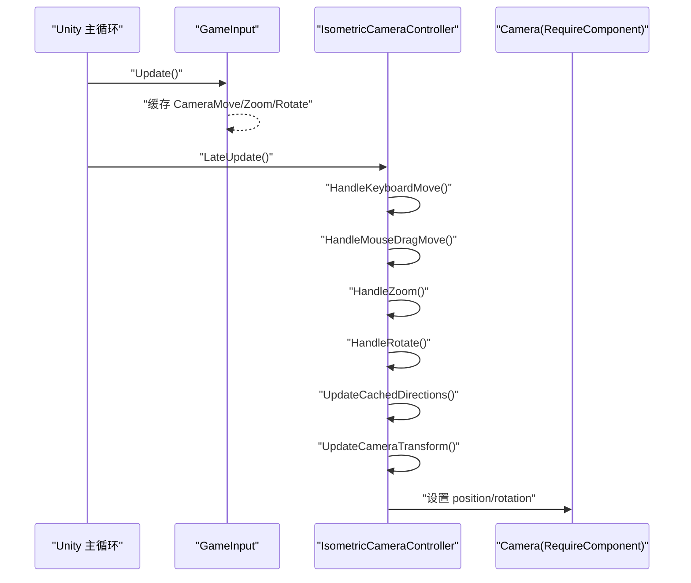
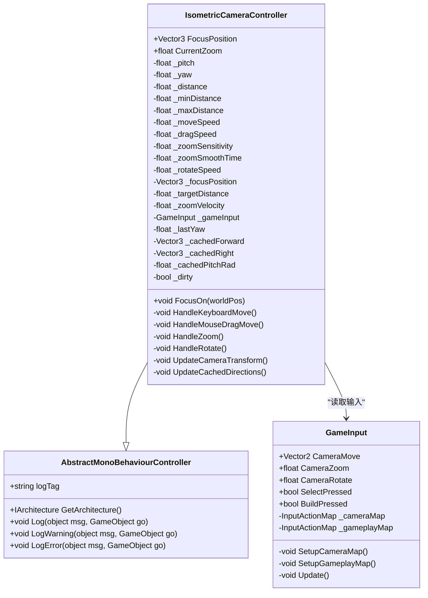
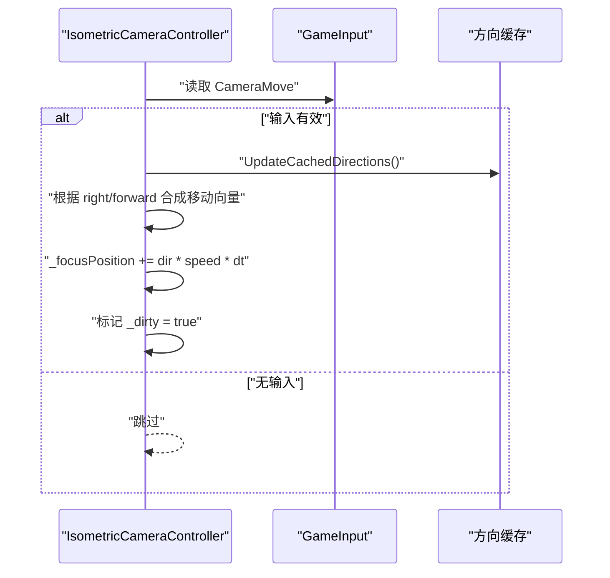
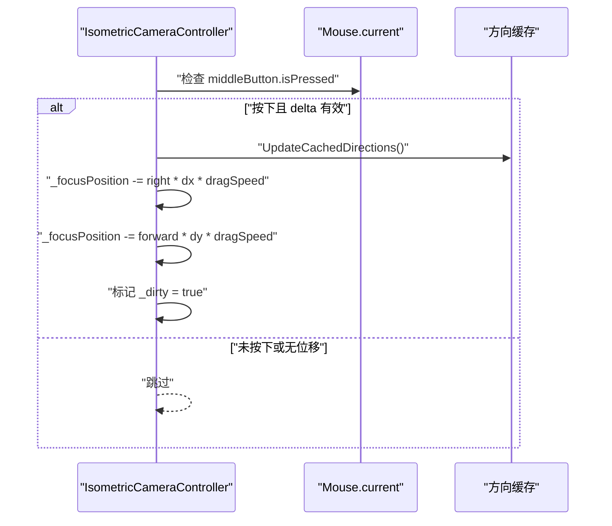
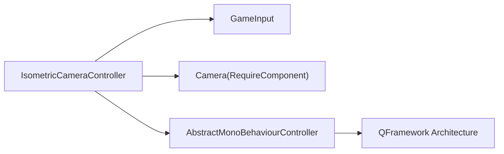

# 等距相机系统

<cite>
**本文引用的文件**   
- [IsometricCameraController.cs](file://Assets/Game/Scripts/MiniGame_Scripts/Controller/Camera/IsometricCameraController.cs)
- [GameInput.cs](file://Assets/Game/Scripts/Simulation/Input/GameInput.cs)
- [GameScene.unity](file://Assets/Game/MiniGame_Res/Scene/GameScene.unity)
</cite>

## 更新摘要
**所做更改**   
- 更新了文件路径引用，反映 IsometricCameraController 从 Simulation/Camera 移动到 MiniGame_Scripts/Controller/Camera
- 新增 QFramework 架构集成相关内容
- 增强性能优化章节，详细说明方向缓存和脏标记机制
- 更新依赖关系分析，反映新的架构模式

## 目录
1. [简介](#简介)
2. [项目结构](#项目结构)
3. [核心组件](#核心组件)
4. [架构总览](#架构总览)
5. [详细组件分析](#详细组件分析)
6. [依赖关系分析](#依赖关系分析)
7. [性能考量](#性能考量)
8. [故障排查指南](#故障排查指南)
9. [结论](#结论)

## 简介
本文件面向"等距相机系统"的实现与使用，聚焦于斜 45° 等轴视角的摄像机控制方案。该系统通过球坐标（俯仰角 pitch、方位角 yaw、距离 distance）围绕焦点定位相机，提供 WASD 平移、鼠标中键拖拽平移、滚轮缩放、Q/E 旋转等交互能力。相机逻辑与模拟逻辑完全解耦，不依赖任何模拟子系统，便于在多种场景复用。

**更新** 系统现已集成到 QFramework 架构中，继承 AbstractMonoBehaviourController 基类，提供更好的生命周期管理和日志支持。

## 项目结构
等距相机相关代码已迁移至 MiniGame_Scripts 模块下的 Controller/Camera 子目录，输入由统一的 GameInput 管理，场景挂载示例见 GameScene。

```mermaid
graph TB
subgraph "MiniGame_Scripts"
subgraph "Controller"
subgraph "Camera"
Camera["IsometricCameraController.cs"]
end
end
subgraph "Simulation"
Input["GameInput.cs"]
end
end
Scene["GameScene.unity"]
Camera --> Input
Scene --> Camera
```

**图表来源**
- [IsometricCameraController.cs:1-205](file://Assets/Game/Scripts/MiniGame_Scripts/Controller/Camera/IsometricCameraController.cs#L1-L205)
- [GameInput.cs:1-109](file://Assets/Game/Scripts/Simulation/Input/GameInput.cs#L1-L109)
- [GameScene.unity:228-278](file://Assets/Game/MiniGame_Res/Scene/GameScene.unity#L228-L278)

**章节来源**
- [IsometricCameraController.cs:1-205](file://Assets/Game/Scripts/MiniGame_Scripts/Controller/Camera/IsometricCameraController.cs#L1-L205)
- [GameInput.cs:1-109](file://Assets/Game/Scripts/Simulation/Input/GameInput.cs#L1-L109)
- [GameScene.unity:228-278](file://Assets/Game/MiniGame_Res/Scene/GameScene.unity#L228-L278)

## 核心组件
- **IsometricCameraController**：等轴视角控制器，负责读取输入、更新焦点与距离、计算相机位置与朝向。现继承自 AbstractMonoBehaviourController，集成 QFramework 架构系统。
- **GameInput**：基于 New Input System 的统一输入管理器，定义 Camera 与 Gameplay 两个 Action Map，并在 Update 中缓存每帧输入值。

**章节来源**
- [IsometricCameraController.cs:1-205](file://Assets/Game/Scripts/MiniGame_Scripts/Controller/Camera/IsometricCameraController.cs#L1-L205)
- [GameInput.cs:1-109](file://Assets/Game/Scripts/Simulation/Input/GameInput.cs#L1-L109)

## 架构总览
整体流程为：GameInput 在 Update 中采集并缓存输入；IsometricCameraController 在 LateUpdate 中消费输入，更新焦点与缩放目标，按需平滑距离并刷新 Transform。系统现已集成 QFramework 架构，提供更强的生命周期管理。



**图表来源**
- [GameInput.cs:86-94](file://Assets/Game/Scripts/Simulation/Input/GameInput.cs#L86-L94)
- [IsometricCameraController.cs:90-110](file://Assets/Game/Scripts/MiniGame_Scripts/Controller/Camera/IsometricCameraController.cs#L90-L110)
- [IsometricCameraController.cs:170-186](file://Assets/Game/Scripts/MiniGame_Scripts/Controller/Camera/IsometricCameraController.cs#L170-L186)

## 详细组件分析

### 类图：IsometricCameraController 与 GameInput


**图表来源**
- [AbstractMonoBehaviourController.cs:376-396](file://Assets/Game/Framework/Qframework/Runtime/QFramework.cs#L376-L396)
- [GameInput.cs:1-109](file://Assets/Game/Scripts/Simulation/Input/GameInput.cs#L1-L109)
- [IsometricCameraController.cs:1-205](file://Assets/Game/Scripts/MiniGame_Scripts/Controller/Camera/IsometricCameraController.cs#L1-L205)

**章节来源**
- [IsometricCameraController.cs:1-205](file://Assets/Game/Scripts/MiniGame_Scripts/Controller/Camera/IsometricCameraController.cs#L1-L205)
- [GameInput.cs:1-109](file://Assets/Game/Scripts/Simulation/Input/GameInput.cs#L1-L109)

### 输入处理序列：WASD 平移


**图表来源**
- [IsometricCameraController.cs:112-122](file://Assets/Game/Scripts/MiniGame_Scripts/Controller/Camera/IsometricCameraController.cs#L112-L122)
- [IsometricCameraController.cs:188-197](file://Assets/Game/Scripts/MiniGame_Scripts/Controller/Camera/IsometricCameraController.cs#L188-L197)
- [GameInput.cs:32-33](file://Assets/Game/Scripts/Simulation/Input/GameInput.cs#L32-L33)

**章节来源**
- [IsometricCameraController.cs:112-122](file://Assets/Game/Scripts/MiniGame_Scripts/Controller/Camera/IsometricCameraController.cs#L112-L122)
- [GameInput.cs:32-33](file://Assets/Game/Scripts/Simulation/Input/GameInput.cs#L32-L33)

### 输入处理序列：鼠标中键拖拽平移


**图表来源**
- [IsometricCameraController.cs:124-139](file://Assets/Game/Scripts/MiniGame_Scripts/Controller/Camera/IsometricCameraController.cs#L124-L139)
- [IsometricCameraController.cs:188-197](file://Assets/Game/Scripts/MiniGame_Scripts/Controller/Camera/IsometricCameraController.cs#L188-L197)

**章节来源**
- [IsometricCameraController.cs:124-139](file://Assets/Game/Scripts/MiniGame_Scripts/Controller/Camera/IsometricCameraController.cs#L124-L139)

### 缩放算法流程图：滚轮缩放 + SmoothDamp


**图表来源**
- [IsometricCameraController.cs:141-157](file://Assets/Game/Scripts/MiniGame_Scripts/Controller/Camera/IsometricCameraController.cs#L141-L157)

**章节来源**
- [IsometricCameraController.cs:141-157](file://Assets/Game/Scripts/MiniGame_Scripts/Controller/Camera/IsometricCameraController.cs#L141-L157)

### 旋转处理：Q/E 旋转方位角
- 读取 CameraRotate 输入，按 rotateSpeed 累加 yaw，并对 360 取模，确保角度范围正确。
- 更新后标记 dirty，以便下次 transform 更新生效。

**章节来源**
- [IsometricCameraController.cs:159-168](file://Assets/Game/Scripts/MiniGame_Scripts/Controller/Camera/IsometricCameraController.cs#L159-L168)
- [GameInput.cs:38-39](file://Assets/Game/Scripts/Simulation/Input/GameInput.cs#L38-L39)

### 变换更新：从球坐标到世界位置
- 依据 pitch、yaw、distance 计算 offset，并以 focusPosition 为基准设置相机位置，随后 LookAt 焦点。
- 方向向量（forward/right）按 yaw 缓存，避免每帧重复三角函数计算。

**章节来源**
- [IsometricCameraController.cs:170-186](file://Assets/Game/Scripts/MiniGame_Scripts/Controller/Camera/IsometricCameraController.cs#L170-L186)
- [IsometricCameraController.cs:188-197](file://Assets/Game/Scripts/MiniGame_Scripts/Controller/Camera/IsometricCameraController.cs#L188-L197)

### 场景集成：挂载与默认参数
- 在 GameScene 的主相机上挂载 IsometricCameraController，并配置 pitch/yaw/distance 等参数。
- 该组件要求同对象存在 Camera 组件。

**章节来源**
- [GameScene.unity:228-278](file://Assets/Game/MiniGame_Res/Scene/GameScene.unity#L228-L278)
- [IsometricCameraController.cs:12-13](file://Assets/Game/Scripts/MiniGame_Scripts/Controller/Camera/IsometricCameraController.cs#L12-L13)

## 依赖关系分析
- IsometricCameraController 依赖 GameInput 提供的统一输入接口，实现松耦合。
- 运行时通过 FindFirstObjectByType<GameInput>() 获取输入实例，若不存在则跳过当帧处理，具备容错性。
- 组件自身通过 RequireComponent(typeof(Camera)) 保证必要渲染组件存在。
- **新增** 组件继承自 AbstractMonoBehaviourController，集成 QFramework 架构系统，提供统一的日志管理和生命周期控制。



**图表来源**
- [IsometricCameraController.cs:12-13](file://Assets/Game/Scripts/MiniGame_Scripts/Controller/Camera/IsometricCameraController.cs#L12-L13)
- [IsometricCameraController.cs:15-18](file://Assets/Game/Scripts/MiniGame_Scripts/Controller/Camera/IsometricCameraController.cs#L15-L18)
- [IsometricCameraController.cs:82-88](file://Assets/Game/Scripts/MiniGame_Scripts/Controller/Camera/IsometricCameraController.cs#L82-L88)
- [GameInput.cs:1-109](file://Assets/Game/Scripts/Simulation/Input/GameInput.cs#L1-L109)

**章节来源**
- [IsometricCameraController.cs:77-91](file://Assets/Game/Scripts/MiniGame_Scripts/Controller/Camera/IsometricCameraController.cs#L77-L91)
- [GameInput.cs:1-109](file://Assets/Game/Scripts/Simulation/Input/GameInput.cs#L1-L109)

## 性能考量
- **方向缓存**：仅在 yaw 变化时重新计算 forward/right，减少每帧 Sin/Cos 开销。通过 `_lastYaw` 比较和 `_cachedForward`、`_cachedRight` 缓存实现。
- **增量更新**：仅当状态脏或距离仍在平滑过渡时更新 Transform，降低不必要的矩阵重建。通过 `_dirty` 标志位控制。
- **输入缓存**：GameInput 在 Update 中一次性读取并缓存输入，避免多次 ReadValue 调用。
- **缩放平滑**：使用 SmoothDamp 将离散滚轮输入转化为连续距离变化，提升视觉稳定性。
- **预计算优化**：`_cachedPitchRad` 预先计算俯仰角的弧度值，避免重复转换。
- **条件更新**：在 LateUpdate 中检查 `_dirty || Mathf.Abs(_distance - _targetDistance) > 0.001f` 条件，只在必要时更新变换。

**更新** 新增的性能优化包括：
- 方向向量缓存机制，避免每帧重复计算三角函数
- 脏标记系统，智能控制 Transform 更新频率
- 预计算的弧度值缓存，减少数学运算开销

**章节来源**
- [IsometricCameraController.cs:58-63](file://Assets/Game/Scripts/MiniGame_Scripts/Controller/Camera/IsometricCameraController.cs#L58-L63)
- [IsometricCameraController.cs:105-109](file://Assets/Game/Scripts/MiniGame_Scripts/Controller/Camera/IsometricCameraController.cs#L105-L109)
- [IsometricCameraController.cs:188-197](file://Assets/Game/Scripts/MiniGame_Scripts/Controller/Camera/IsometricCameraController.cs#L188-L197)
- [IsometricCameraController.cs:85](file://Assets/Game/Scripts/MiniGame_Scripts/Controller/Camera/IsometricCameraController.cs#L85)
- [GameInput.cs:86-94](file://Assets/Game/Scripts/Simulation/Input/GameInput.cs#L86-L94)
- [IsometricCameraController.cs:141-157](file://Assets/Game/Scripts/MiniGame_Scripts/Controller/Camera/IsometricCameraController.cs#L141-L157)

## 故障排查指南
- 相机无响应
  - 确认场景中已存在 GameInput 实例，否则 IsometricCameraController 会在 LateUpdate 中跳过处理。
  - 检查是否缺少 Camera 组件（RequireComponent 约束）。
  - **新增** 确认 QFramework 架构是否正确初始化，AbstractMonoBehaviourController 的 GetArchitecture() 方法返回正确的架构实例。
- 平移异常
  - 检查 WASD 绑定是否正确，以及 CameraMove 返回值是否接近零向量。
  - 确认鼠标中键拖拽未被其他输入拦截。
  - 验证方向缓存机制是否正常工作，检查 `_cachedForward` 和 `_cachedRight` 的值。
- 缩放抖动或不平滑
  - 调整 zoomSensitivity 与 zoomSmoothTime，观察 SmoothDamp 效果。
  - 校验 min/max 距离限制是否符合预期。
  - 检查 `_dirty` 标志位的更新逻辑是否正常。
- 旋转无效
  - 检查 Q/E 绑定与 CameraRotate 返回值符号约定（左旋为负、右旋为正）。
  - 验证 `_lastYaw` 比较逻辑，确保方向缓存能正确触发更新。

**章节来源**
- [IsometricCameraController.cs:90-110](file://Assets/Game/Scripts/MiniGame_Scripts/Controller/Camera/IsometricCameraController.cs#L90-L110)
- [IsometricCameraController.cs:112-168](file://Assets/Game/Scripts/MiniGame_Scripts/Controller/Camera/IsometricCameraController.cs#L112-L168)
- [IsometricCameraController.cs:188-197](file://Assets/Game/Scripts/MiniGame_Scripts/Controller/Camera/IsometricCameraController.cs#L188-L197)
- [GameInput.cs:53-73](file://Assets/Game/Scripts/Simulation/Input/GameInput.cs#L53-L73)

## 结论
该等距相机系统以简洁的球坐标模型和清晰的输入分层实现了稳定、可配置的等轴视角控制。其关键优势在于：
- 与模拟层解耦，易于移植与测试
- 输入集中管理，扩展性强
- 方向缓存与增量更新保障运行效率
- 平滑缩放提升用户体验
- **新增** 集成 QFramework 架构，提供更好的生命周期管理和日志支持
- **新增** 性能优化机制，包括方向缓存、脏标记系统和预计算优化

建议在后续迭代中结合 ChunkManager 的激活中心使用 FocusPosition，以实现视锥外区域动态加载与卸载，进一步提升大规模场景的性能表现。同时可以利用 QFramework 的架构特性，实现更复杂的相机状态管理和事件通信。