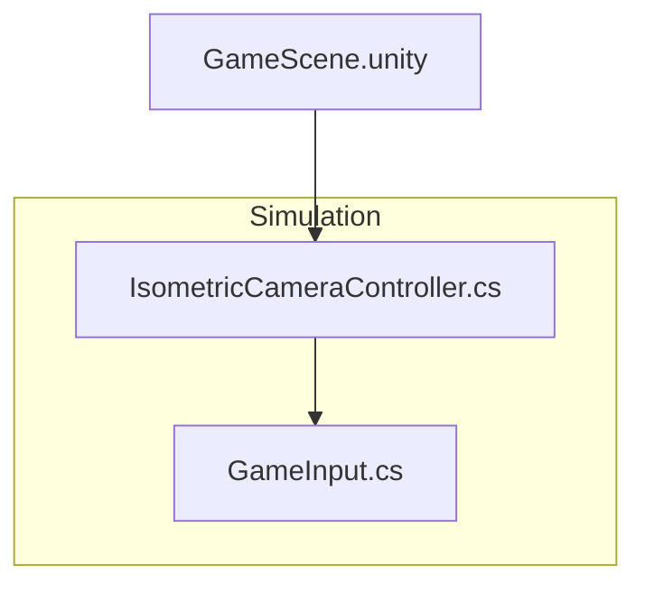
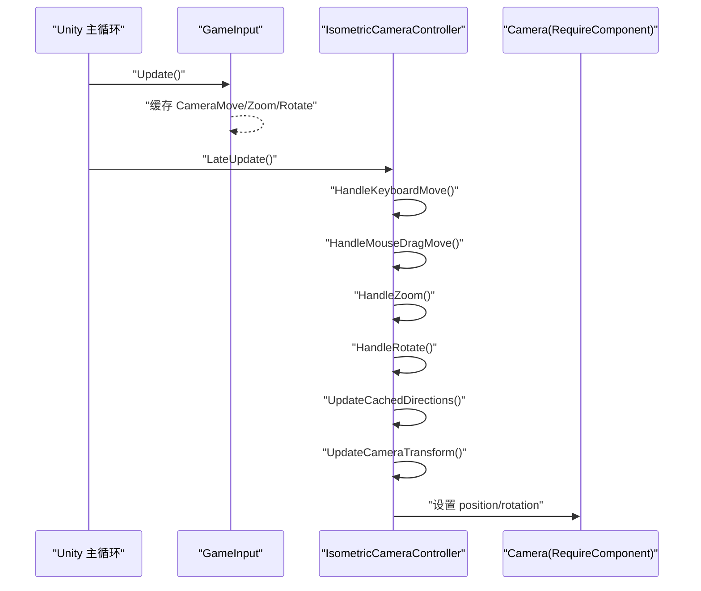
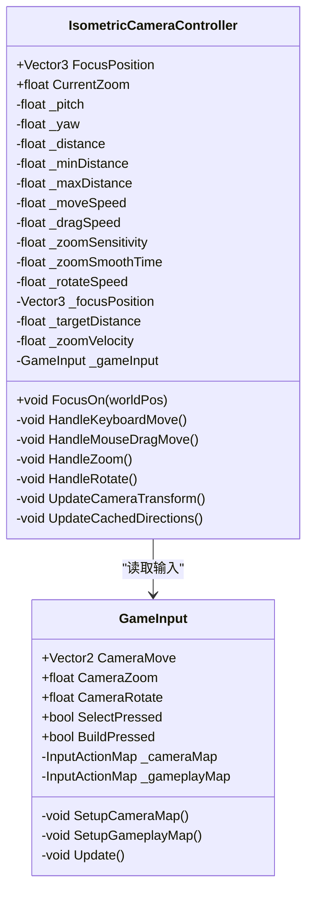
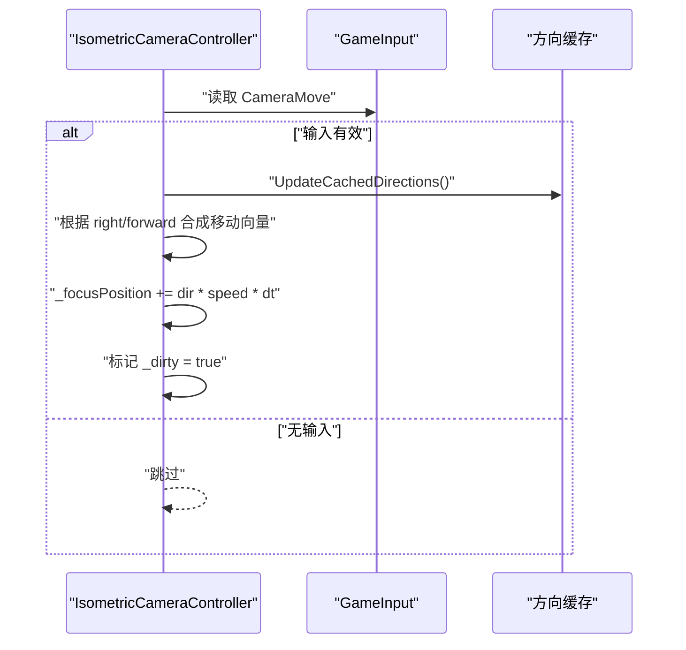
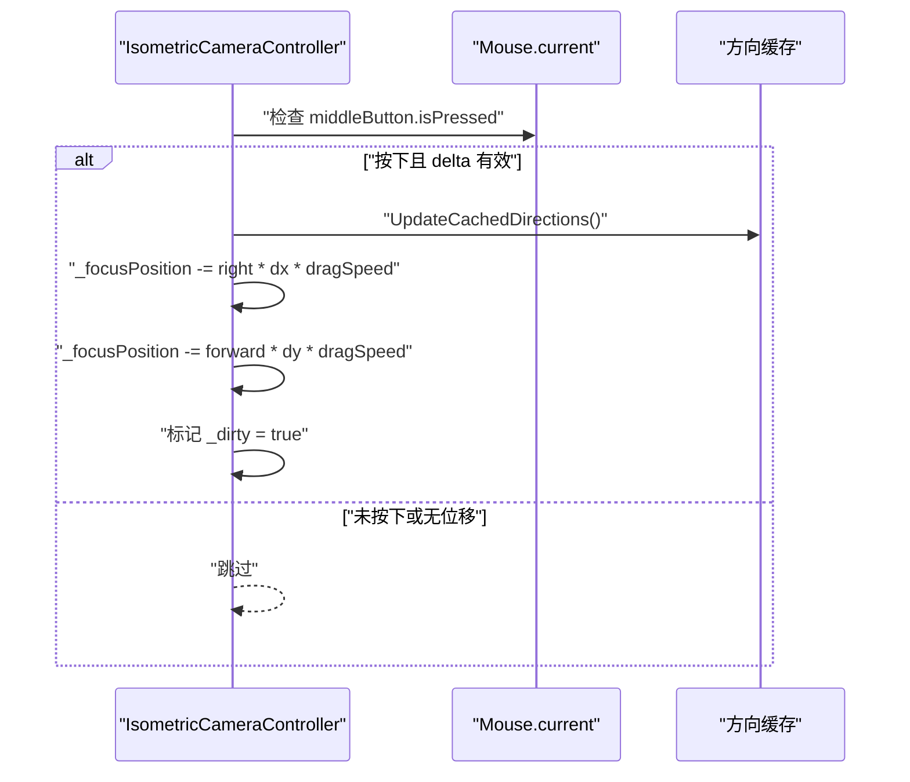
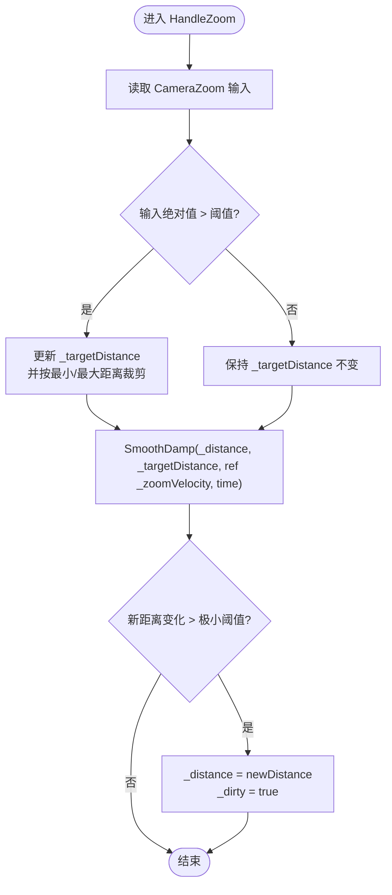
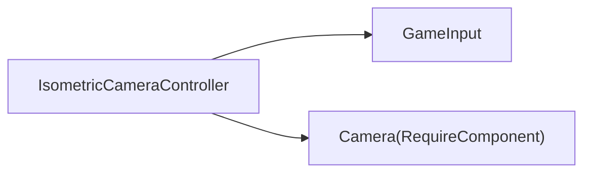

# 等距相机系统

<cite>
**本文引用的文件**   
- [IsometricCameraController.cs](file://Assets/Game/Scripts/MiniGame_Scripts/Controller/Camera/IsometricCameraController.cs)
- [GameInput.cs](file://Assets/Game/Scripts/Simulation/Input/GameInput.cs)
- [GameScene.unity](file://Assets/Game/MiniGame_Res/Scene/GameScene.unity)
- [input-camera-system.md](file://.simulationdoc/wiki/input-camera-system.md)
</cite>

## 更新摘要
**变更内容**   
- 新增了详细的球坐标数学原理章节，包含完整的数学公式和推导过程
- 增强了性能优化章节，详细说明了5项关键优化技术
- 扩展了对外接口契约定义，明确了下游系统的依赖关系
- 完善了场景配置指南，提供了更详细的组件挂载说明
- 新增了操作说明表格，清晰列出所有交互方式
- 增强了故障排查指南，提供了更多常见问题解决方案

## 目录
1. [简介](#简介)
2. [项目结构](#项目结构)
3. [核心组件](#核心组件)
4. [架构总览](#架构总览)
5. [详细组件分析](#详细组件分析)
6. [球坐标数学原理](#球坐标数学原理)
7. [对外接口契约](#对外接口契约)
8. [性能优化](#性能优化)
9. [场景配置指南](#场景配置指南)
10. [操作说明](#操作说明)
11. [依赖关系分析](#依赖关系分析)
12. [故障排查指南](#故障排查指南)
13. [结论](#结论)

## 简介
本文件面向"等距相机系统"的实现与使用，聚焦于斜 45° 等轴视角的摄像机控制方案。该系统通过球坐标（俯仰角 pitch、方位角 yaw、距离 distance）围绕焦点定位相机，提供 WASD 平移、鼠标中键拖拽平移、滚轮缩放、Q/E 旋转等交互能力。相机逻辑与模拟逻辑完全解耦，不依赖任何模拟子系统，便于在多种场景复用。

**核心特性：**
- 使用 Unity New Input System（1.17.0），代码内联定义 InputAction，无需 `.inputactions` 资源文件
- 球坐标（pitch / yaw / distance）定位相机，支持 45° 等轴视角
- WASD 平移、鼠标中键拖拽平移、滚轮缩放、Q/E 旋转
- 相机逻辑与模拟逻辑完全分离，不依赖任何模拟系统
- 针对每帧 CPU 开销做了 5 项优化（缓存输入值、缓存方向向量、脏标记跳过等）

## 项目结构
等距相机相关代码位于 Simulation 子模块下，输入由统一的 GameInput 管理，场景挂载示例见 GameScene。



**图表来源**
- [IsometricCameraController.cs:1-199](file://Assets/Game/Scripts/MiniGame_Scripts/Controller/Camera/IsometricCameraController.cs#L1-L199)
- [GameInput.cs:1-109](file://Assets/Game/Scripts/Simulation/Input/GameInput.cs#L1-L109)
- [GameScene.unity:255-276](file://Assets/Game/MiniGame_Res/Scene/GameScene.unity#L255-L276)

**章节来源**
- [IsometricCameraController.cs:1-199](file://Assets/Game/Scripts/MiniGame_Scripts/Controller/Camera/IsometricCameraController.cs#L1-L199)
- [GameInput.cs:1-109](file://Assets/Game/Scripts/Simulation/Input/GameInput.cs#L1-L109)
- [GameScene.unity:255-276](file://Assets/Game/MiniGame_Res/Scene/GameScene.unity#L255-L276)

## 核心组件
- **IsometricCameraController**：等轴视角控制器，负责读取输入、更新焦点与距离、计算相机位置与朝向。
- **GameInput**：基于 New Input System 的统一输入管理器，定义 Camera 与 Gameplay 两个 Action Map，并在 Update 中缓存每帧输入值。

**章节来源**
- [IsometricCameraController.cs:1-199](file://Assets/Game/Scripts/MiniGame_Scripts/Controller/Camera/IsometricCameraController.cs#L1-L199)
- [GameInput.cs:1-109](file://Assets/Game/Scripts/Simulation/Input/GameInput.cs#L1-L109)

## 架构总览
整体流程为：GameInput 在 Update 中采集并缓存输入；IsometricCameraController 在 LateUpdate 中消费输入，更新焦点与缩放目标，按需平滑距离并刷新 Transform。



**图表来源**
- [GameInput.cs:86-94](file://Assets/Game/Scripts/Simulation/Input/GameInput.cs#L86-L94)
- [IsometricCameraController.cs:84-104](file://Assets/Game/Scripts/MiniGame_Scripts/Controller/Camera/IsometricCameraController.cs#L84-L104)
- [IsometricCameraController.cs:164-180](file://Assets/Game/Scripts/MiniGame_Scripts/Controller/Camera/IsometricCameraController.cs#L164-L180)

## 详细组件分析

### 类图：IsometricCameraController 与 GameInput


**图表来源**
- [GameInput.cs:1-109](file://Assets/Game/Scripts/Simulation/Input/GameInput.cs#L1-L109)
- [IsometricCameraController.cs:1-199](file://Assets/Game/Scripts/MiniGame_Scripts/Controller/Camera/IsometricCameraController.cs#L1-L199)

**章节来源**
- [IsometricCameraController.cs:1-199](file://Assets/Game/Scripts/MiniGame_Scripts/Controller/Camera/IsometricCameraController.cs#L1-L199)
- [GameInput.cs:1-109](file://Assets/Game/Scripts/Simulation/Input/GameInput.cs#L1-L109)

### 输入处理序列：WASD 平移


**图表来源**
- [IsometricCameraController.cs:106-116](file://Assets/Game/Scripts/MiniGame_Scripts/Controller/Camera/IsometricCameraController.cs#L106-L116)
- [IsometricCameraController.cs:182-191](file://Assets/Game/Scripts/MiniGame_Scripts/Controller/Camera/IsometricCameraController.cs#L182-L191)
- [GameInput.cs:32-33](file://Assets/Game/Scripts/Simulation/Input/GameInput.cs#L32-L33)

**章节来源**
- [IsometricCameraController.cs:106-116](file://Assets/Game/Scripts/MiniGame_Scripts/Controller/Camera/IsometricCameraController.cs#L106-L116)
- [GameInput.cs:32-33](file://Assets/Game/Scripts/Simulation/Input/GameInput.cs#L32-L33)

### 输入处理序列：鼠标中键拖拽平移


**图表来源**
- [IsometricCameraController.cs:118-133](file://Assets/Game/Scripts/MiniGame_Scripts/Controller/Camera/IsometricCameraController.cs#L118-L133)
- [IsometricCameraController.cs:182-191](file://Assets/Game/Scripts/MiniGame_Scripts/Controller/Camera/IsometricCameraController.cs#L182-L191)

**章节来源**
- [IsometricCameraController.cs:118-133](file://Assets/Game/Scripts/MiniGame_Scripts/Controller/Camera/IsometricCameraController.cs#L118-L133)

### 缩放算法流程图：滚轮缩放 + SmoothDamp


**图表来源**
- [IsometricCameraController.cs:135-151](file://Assets/Game/Scripts/MiniGame_Scripts/Controller/Camera/IsometricCameraController.cs#L135-L151)

**章节来源**
- [IsometricCameraController.cs:135-151](file://Assets/Game/Scripts/MiniGame_Scripts/Controller/Camera/IsometricCameraController.cs#L135-L151)

### 旋转处理：Q/E 旋转方位角
- 读取 CameraRotate 输入，按 rotateSpeed 累加 yaw，并对 360 取模，确保角度范围正确。
- 更新后标记 dirty，以便下次 transform 更新生效。

**章节来源**
- [IsometricCameraController.cs:153-162](file://Assets/Game/Scripts/MiniGame_Scripts/Controller/Camera/IsometricCameraController.cs#L153-L162)
- [GameInput.cs:38-39](file://Assets/Game/Scripts/Simulation/Input/GameInput.cs#L38-L39)

### 变换更新：从球坐标到世界位置
- 依据 pitch、yaw、distance 计算 offset，并以 focusPosition 为基准设置相机位置，随后 LookAt 焦点。
- 方向向量（forward/right）按 yaw 缓存，避免每帧重复三角函数计算。

**章节来源**
- [IsometricCameraController.cs:164-180](file://Assets/Game/Scripts/MiniGame_Scripts/Controller/Camera/IsometricCameraController.cs#L164-L180)
- [IsometricCameraController.cs:182-191](file://Assets/Game/Scripts/MiniGame_Scripts/Controller/Camera/IsometricCameraController.cs#L182-L191)

### 场景集成：挂载与默认参数
- 在 GameScene 的主相机上挂载 IsometricCameraController，并配置 pitch/yaw/distance 等参数。
- 该组件要求同对象存在 Camera 组件。

**章节来源**
- [GameScene.unity:255-276](file://Assets/Game/MiniGame_Res/Scene/GameScene.unity#L255-L276)
- [IsometricCameraController.cs:11-12](file://Assets/Game/Scripts/MiniGame_Scripts/Controller/Camera/IsometricCameraController.cs#L11-L12)

## 球坐标数学原理

### 相机位置计算
```
offset.x = distance * cos(pitch) * sin(yaw)
offset.y = distance * sin(pitch)
offset.z = distance * cos(pitch) * cos(yaw)

camera.position = focus + offset
camera.LookAt(focus)
```

### 方向向量
**Forward（W 键方向 = 相机看向方向在 XZ 平面的投影）：**
```
forward = (-sin(yaw), 0, -cos(yaw))
```

**Right（D 键方向 = Cross(up, forward)）：**
```
right = (-cos(yaw), 0, sin(yaw))
```

> **注意：** Right 向量使用 `Cross(up, forward)` 计算，不是简单的 `(cos, 0, -sin)`。方向反了会导致 A/D 键反转。

### 平移方向
```
moveDir = right * input.x + forward * input.y
focus += moveDir * speed * deltaTime
```

- W → focus 沿 forward 移动 → 相机前进 → 场景向屏幕下方移动
- D → focus 沿 right 移动 → 相机右移 → 场景向屏幕左方移动

### 鼠标拖拽方向
```
focus -= right * mouseDelta.x * dragSpeed
focus -= forward * mouseDelta.y * dragSpeed
```

取反实现"抓住地面"效果：鼠标向右拖 → 场景向右移 → focus 向左移。

### 默认视角 (yaw=45°, pitch=45°)
```
offset = (dist * 0.5, dist * 0.707, dist * 0.5)
```

相机在焦点的 **东北上方**，看向西南下方。这是经典的等轴视角。

## 对外接口契约

### IsometricCameraController
| 接口 | 类型 | 下游使用方 |
|------|------|-----------|
| `FocusPosition` | `Vector3` (get) | Phase 1: ChunkManager 作为激活中心 |
| `CurrentZoom` | `float` (get) | Phase 2: 根据缩放级别调整 LOD |
| `FocusOn(Vector3)` | void | Phase 1: 初始定位 / Phase 3: 跟随工人 |

### GameInput
| 接口 | 类型 | 下游使用方 |
|------|------|-----------|
| `SelectPressed` | `bool` (get) | Phase 4: 选择树木/建筑/工人 |
| `BuildPressed` | `bool` (get) | Phase 5: 放置建筑/道路 |

## 性能优化

### 优化清单
| # | 优化项 | 修改前 | 修改后 | 效果 |
|---|--------|--------|--------|------|
| 1 | 输入值缓存 | getter 每次调 `ReadValue`（3-5 次/帧） | `Update` 中一次性读取 | 减少 Input System 内部调用 |
| 2 | LateUpdate | `Update` 中读输入 | `LateUpdate` 确保在 `GameInput.Update` 之后 | 消除 1 帧延迟 |
| 3 | 方向向量缓存 | 每帧 4 次 `Sin/Cos` | yaw 不变时 0 次 | 减少数学运算 |
| 4 | 脏标记跳过 | 每帧执行 `UpdateCameraTransform` | 无变化时跳过 | 减少 transform 操作 |
| 5 | pitch 弧度缓存 | 每帧 `pitch * Deg2Rad` | `Start` 中缓存一次 | 微优化 |

### Profiler 诊断
如果仍有 CPU 延迟，用 Profiler（Window → Analysis → Profiler）排查：

| 开销来源 | 可能原因 | 解决方案 |
|---------|---------|---------|
| `InputSystem.Update` | Input System 处理开销 | 减少同时启用的 Action |
| `Camera.Render` | 渲染开销 | 检查场景 Renderer 数量、Shadow |
| `EditorOverhead` | Editor Play Mode 额外开销 | Build 后运行对比 |

## 场景配置指南

### 在 GameScene 中配置
1. 打开 `Assets/Game/MiniGame_Res/Scene/GameScene.unity`
2. 创建 GameObject，命名 `GameCenter`
   - Add Component → 搜索 `GameInput` 并添加
3. 选中场景中的 Camera GameObject
   - Add Component → 搜索 `IsometricCameraController` 并添加
   - `[RequireComponent(typeof(Camera))]` 确保有 Camera 组件

### 组件关系
```
GameScene
├── GameCenter (GameObject)
│   └── GameInput.cs
└── Main Camera (GameObject)
    ├── Camera.cs
    └── IsometricCameraController.cs
```

- `GameInput` 和 `IsometricCameraController` **不需要**挂在同一个 GameObject 上
- Controller 通过 `FindFirstObjectByType<GameInput>()` 自动查找
- `GameInput` 必须在场景中存在，否则 Controller 不工作

### 注意事项
- **不要修改 ApplicationScene.unity** — 它仅作初始化入口
- `Active Input Handling` 必须为 `Both`（Project Settings → Player）
- Camera 建议使用透视相机（Perspective），Field of View 按需调整

## 操作说明
| 操作 | 按键 | 效果 |
|------|------|------|
| 平移（前进/后退） | W / S | 相机沿焦点前后移动 |
| 平移（左/右） | A / D | 相机沿焦点左右移动 |
| 平移（拖拽） | 鼠标中键拖拽 | "抓住地面"模式平移 |
| 缩放（拉近） | 滚轮上滚 | 相机靠近焦点 |
| 缩放（拉远） | 滚轮下滚 | 相机远离焦点 |
| 旋转（左旋） | Q | 相机围绕焦点逆时针旋转 |
| 旋转（右旋） | E | 相机围绕焦点顺时针旋转 |
| 选择 | 鼠标左键 | （供 Phase 4/5 使用，当前无效果） |
| 建造 | 鼠标右键 | （供 Phase 4/5 使用，当前无效果） |

**调试：** 在 Scene 视图中选中 Camera，可看到绿色线框球表示焦点位置。

## 依赖关系分析
- IsometricCameraController 依赖 GameInput 提供的统一输入接口，实现松耦合。
- 运行时通过 FindFirstObjectByType<GameInput>() 获取输入实例，若不存在则跳过当帧处理，具备容错性。
- 组件自身通过 RequireComponent(typeof(Camera)) 保证必要渲染组件存在。



**图表来源**
- [IsometricCameraController.cs:11-12](file://Assets/Game/Scripts/MiniGame_Scripts/Controller/Camera/IsometricCameraController.cs#L11-L12)
- [IsometricCameraController.cs:76-82](file://Assets/Game/Scripts/MiniGame_Scripts/Controller/Camera/IsometricCameraController.cs#L76-L82)
- [GameInput.cs:1-109](file://Assets/Game/Scripts/Simulation/Input/GameInput.cs#L1-L109)

**章节来源**
- [IsometricCameraController.cs:76-90](file://Assets/Game/Scripts/MiniGame_Scripts/Controller/Camera/IsometricCameraController.cs#L76-L90)
- [GameInput.cs:1-109](file://Assets/Game/Scripts/Simulation/Input/GameInput.cs#L1-L109)

## 故障排查指南
- **相机无响应**
  - 确认场景中已存在 GameInput 实例，否则 IsometricCameraController 会在 LateUpdate 中跳过处理。
  - 检查是否缺少 Camera 组件（RequireComponent 约束）。
- **平移异常**
  - 检查 WASD 绑定是否正确，以及 CameraMove 返回值是否接近零向量。
  - 确认鼠标中键拖拽未被其他输入拦截。
- **缩放抖动或不平滑**
  - 调整 zoomSensitivity 与 zoomSmoothTime，观察 SmoothDamp 效果。
  - 校验 min/max 距离限制是否符合预期。
- **旋转无效**
  - 检查 Q/E 绑定与 CameraRotate 返回值符号约定（左旋为负、右旋为正）。
- **A/D 方向反了？**
  - 检查 `UpdateCachedDirections()` 中的 `_cachedRight` 计算：
    ```csharp
    // 正确（Cross(up, forward)）：
    _cachedRight = new Vector3(-Mathf.Cos(yawRad), 0f, Mathf.Sin(yawRad));
    
    // 错误（方向相反）：
    // _cachedRight = new Vector3(Mathf.Cos(yawRad), 0f, -Mathf.Sin(yawRad));
    ```
- **如何修改默认视角？**
  - 在 Inspector 中调整 `Pitch`（俯仰角）和 `Yaw`（方位角）。常见组合：
    | 风格 | Pitch | Yaw |
    |------|-------|-----|
    | 标准等轴 | 45° | 45° |
    | 低角度 | 30° | 45° |
    | 高角度 | 60° | 45° |
    | 正面 | 45° | 0° |

**章节来源**
- [IsometricCameraController.cs:84-104](file://Assets/Game/Scripts/MiniGame_Scripts/Controller/Camera/IsometricCameraController.cs#L84-L104)
- [IsometricCameraController.cs:106-162](file://Assets/Game/Scripts/MiniGame_Scripts/Controller/Camera/IsometricCameraController.cs#L106-L162)
- [GameInput.cs:53-73](file://Assets/Game/Scripts/Simulation/Input/GameInput.cs#L53-L73)
- [IsometricCameraController.cs:182-191](file://Assets/Game/Scripts/MiniGame_Scripts/Controller/Camera/IsometricCameraController.cs#L182-L191)

## 结论
该等距相机系统以简洁的球坐标模型和清晰的输入分层实现了稳定、可配置的等轴视角控制。其关键优势在于：
- 与模拟层解耦，易于移植与测试
- 输入集中管理，扩展性强
- 方向缓存与增量更新保障运行效率
- 平滑缩放提升用户体验

建议在后续迭代中结合 ChunkManager 的激活中心使用 FocusPosition，以实现视锥外区域动态加载与卸载，进一步提升大规模场景的性能表现。