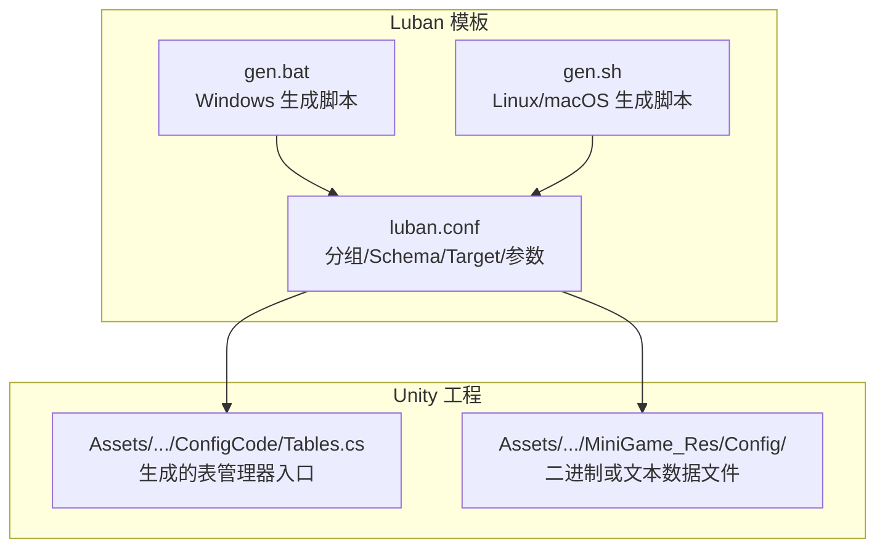
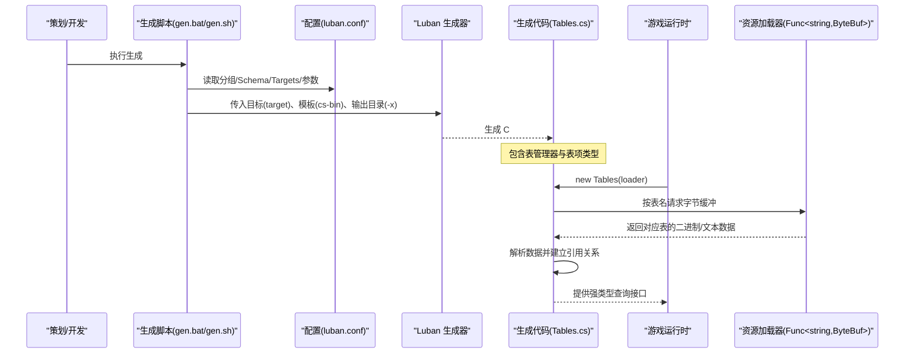
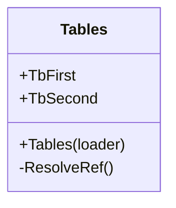
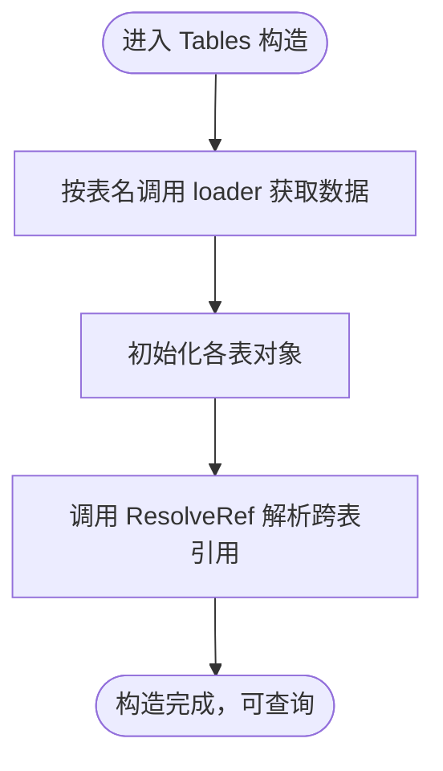
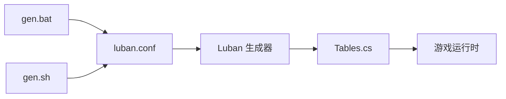

# Luban 配置系统

<cite>
**本文引用的文件**   
- [luban.conf](file://LubanConfig\Template\luban.conf)
- [gen.bat](file://LubanConfig\Template\gen.bat)
- [gen.sh](file://LubanConfig\Template\gen.sh)
- [Tables.cs](file://Assets\Game\Scripts\ConfigCode\Tables.cs)
</cite>

## 目录
1. [简介](#简介)
2. [项目结构](#项目结构)
3. [核心组件](#核心组件)
4. [架构总览](#架构总览)
5. [详细组件分析](#详细组件分析)
6. [依赖关系分析](#依赖关系分析)
7. [性能考虑](#性能考虑)
8. [故障排除指南](#故障排除指南)
9. [结论](#结论)
10. [附录](#附录)

## 简介
本文件面向使用 Luban 的配置系统与代码生成流程，提供从 Excel 表格设计到类型安全 C# 代码生成的完整工作流说明。文档涵盖配置文件结构、数据类型映射、表关系设计与验证规则设置思路；模板自定义与多语言输出（C#、Java、Go、Python 等）方法；运行时配置加载机制（序列化/反序列化与缓存策略）；热更新与数据迁移方案；版本管理、冲突解决与团队协作最佳实践；以及常见错误排查与性能优化建议。

## 项目结构
本项目在 Luban 模板目录下提供了完整的配置与生成脚本，并在 Unity 工程中输出了由 Luban 生成的 C# 访问层代码。关键路径如下：
- 配置与脚本
  - LubanConfig\Template\luban.conf：定义分组、Schema 文件、目标平台与参数
  - LubanConfig\Template\gen.bat / gen.sh：Windows/Linux 一键生成入口
- 生成的 C# 代码
  - Assets\Game\Scripts\ConfigCode\Tables.cs：由 Luban 生成的表管理器入口，负责按名称加载各表并解析引用

图表来源
- [luban.conf:1-27](file://LubanConfig\Template\luban.conf#L1-L27)
- [gen.bat:1-12](file://LubanConfig\Template\gen.bat#L1-L12)
- [gen.sh:1-11](file://LubanConfig\Template\gen.sh#L1-L11)
- [Tables.cs:1-34](file://Assets\Game\Scripts\ConfigCode\Tables.cs#L1-L34)

章节来源
- [luban.conf:1-27](file://LubanConfig\Template\luban.conf#L1-L27)
- [gen.bat:1-12](file://LubanConfig\Template\gen.bat#L1-L12)
- [gen.sh:1-11](file://LubanConfig\Template\gen.sh#L1-L11)
- [Tables.cs:1-34](file://Assets\Game\Scripts\ConfigCode\Tables.cs#L1-L34)

## 核心组件
- 配置中心（luban.conf）
  - groups：将表划分为不同组（如客户端 c、服务端 s、通用 e），便于按需生成与加载
  - schemaFiles：声明 Schema 源文件（Defines、__tables__.xlsx、__beans__.xlsx、__enums__.xlsx）
  - dataDir：数据表根目录
  - targets：为不同运行环境生成不同的“表管理器”实例（manager/topModule）
  - xargs：向生成器传递额外参数（例如输出目录）
- 生成脚本（gen.bat/gen.sh）
  - 指定目标 target（all）、数据格式（bin/json）、模板（cs-bin 等）
  - 通过 --conf 指向 luban.conf
  - 通过 -x 注入输出目录（outputDataDir/outputCodeDir）
- 生成产物（Tables.cs）
  - 暴露 Tables 类，构造时按表名加载数据，随后统一解析跨表引用

章节来源
- [luban.conf:1-27](file://LubanConfig\Template\luban.conf#L1-L27)
- [gen.bat:1-12](file://LubanConfig\Template\gen.bat#L1-L12)
- [gen.sh:1-11](file://LubanConfig\Template\gen.sh#L1-L11)
- [Tables.cs:1-34](file://Assets\Game\Scripts\ConfigCode\Tables.cs#L1-L34)

## 架构总览
下图展示了从“Excel 设计 → Luban 生成 → 运行时加载”的端到端流程。

图表来源
- [gen.bat:1-12](file://LubanConfig\Template\gen.bat#L1-L12)
- [gen.sh:1-11](file://LubanConfig\Template\gen.sh#L1-L11)
- [luban.conf:1-27](file://LubanConfig\Template\luban.conf#L1-L27)
- [Tables.cs:1-34](file://Assets\Game\Scripts\ConfigCode\Tables.cs#L1-L34)

## 详细组件分析

### 配置中心（luban.conf）
- 分组（groups）
  - names：逻辑分组标识（c/s/e）
  - default：是否默认参与生成
- Schema 文件（schemaFiles）
  - fileName：相对 dataDir 的路径
  - type：Defines/bean/table/enum 等
- 数据目录（dataDir）
  - 所有表与 Bean/Enum 定义所在根目录
- 目标（targets）
  - name：目标名（server/client/all）
  - manager：生成的表管理器类名
  - groups：该目标包含的分组
  - topModule：命名空间顶层模块名
- 扩展参数（xargs）
  - 用于向生成器注入自定义变量（如输出目录）

章节来源
- [luban.conf:1-27](file://LubanConfig\Template\luban.conf#L1-L27)

### 生成脚本（gen.bat / gen.sh）
- Windows（gen.bat）
  - 设置工作区与工作 DLL 路径
  - 调用 dotnet 执行 Luban
  - 指定 -t all、-d bin、-c cs-bin
  - 通过 --conf 指定配置文件
  - 通过 -x 注入 outputDataDir 与 outputCodeDir
- Linux/macOS（gen.sh）
  - 类似逻辑，但默认以 json 作为数据格式示例

章节来源
- [gen.bat:1-12](file://LubanConfig\Template\gen.bat#L1-L12)
- [gen.sh:1-11](file://LubanConfig\Template\gen.sh#L1-L11)

### 生成代码（Tables.cs）
- 命名空间与类
  - 命名空间 cfg
  - 类 Tables：表管理器入口
- 构造函数
  - 接收 System.Func<string, ByteBuf> loader
  - 根据表名（如 test_tbfirst/test_tbsecond）调用 loader 获取数据
- 引用解析
  - ResolveRef()：在全部表加载完成后进行跨表引用解析

图表来源
- [Tables.cs:1-34](file://Assets\Game\Scripts\ConfigCode\Tables.cs#L1-L34)

章节来源
- [Tables.cs:1-34](file://Assets\Game\Scripts\ConfigCode\Tables.cs#L1-L34)

### 运行时加载流程（基于生成代码）
- 外部提供 loader：Func<string, ByteBuf>，按表名返回字节缓冲
- Tables 构造阶段：
  - 逐个表调用 loader 获取数据
  - 初始化各表对象
  - 调用 ResolveRef 完成引用解析
- 业务侧通过 Tables 提供的强类型接口访问配置

图表来源
- [Tables.cs:1-34](file://Assets\Game\Scripts\ConfigCode\Tables.cs#L1-L34)

章节来源
- [Tables.cs:1-34](file://Assets\Game\Scripts\ConfigCode\Tables.cs#L1-L34)

### 模板与多语言输出
- 内置模板
  - 提供 cs-bin、cs-dotnet-json、cs-simple-json、cs-newtonsoft-json、java-bin、go-bin、python-json 等多种模板
- 选择模板
  - 通过生成脚本的 -c 参数指定模板（如 cs-bin）
- 自定义模板
  - 在模板目录中复制现有模板并修改 .sbn 模板文件
  - 通过 -c 指定自定义模板名
  - 结合 xargs 注入语言特定变量（如命名空间、包名、枚举风格等）

章节来源
- [gen.bat:1-12](file://LubanConfig\Template\gen.bat#L1-L12)
- [gen.sh:1-11](file://LubanConfig\Template\gen.sh#L1-L11)

### 数据类型映射与表关系设计
- 数据类型映射
  - 在 __beans__.xlsx 中定义基础数据结构（Bean）
  - 在 __enums__.xlsx 中定义枚举
  - 在 __tables__.xlsx 中声明表及其字段类型（支持基本类型、集合、Bean、枚举、跨表引用等）
- 表关系设计
  - 通过“跨表引用”字段表达一对多/一对一关系
  - 在生成后由 Tables.ResolveRef 统一解析引用，保证一致性
- 验证规则
  - 可在 Bean/表字段上附加校验规则（如非空、范围、唯一性等）
  - 生成期对数据进行校验，失败则中断生成，避免脏数据进入运行期

章节来源
- [luban.conf:1-27](file://LubanConfig\Template\luban.conf#L1-L27)
- [Tables.cs:1-34](file://Assets\Game\Scripts\ConfigCode\Tables.cs#L1-L34)

### 运行时配置加载机制
- 序列化/反序列化
  - 二进制（bin）：高性能、体积较小，适合移动端
  - JSON：可读性强，便于调试与热更
- 加载方式
  - 通过 Func<string, ByteBuf> loader 抽象数据源（本地文件、网络下载、AssetBundle/YooAsset 等）
- 缓存策略
  - 建议在 loader 上层实现 LRU/内存池缓存，避免重复 IO
  - 可按表粒度缓存，或在 Tables 外层维护全局缓存字典

章节来源
- [Tables.cs:1-34](file://Assets\Game\Scripts\ConfigCode\Tables.cs#L1-L34)

### 配置热更新与数据迁移
- 热更新方案
  - 将配置数据打包为独立资源包（如 YooAsset/AB），运行时按需拉取
  - 版本号管理：每个配置包附带版本号，客户端比较后增量更新
- 数据迁移策略
  - 向后兼容：新增字段保持默认值，删除字段保留占位
  - 版本桥接：在旧版本与新版本之间提供转换脚本或中间态
  - 灰度发布：先小流量验证，再全量推送

[本节为概念性内容，不直接分析具体文件]

### 版本管理、冲突解决与协作最佳实践
- 版本管理
  - 以 Git 分支管理不同版本（feature/dev/release）
  - 每次变更提交附带变更说明与影响面评估
- 冲突解决
  - 优先合并 Bean/Enum 定义，再合并表定义
  - 跨表引用变更需同步检查上下游
- 协作规范
  - 统一的命名约定（表名、字段名、枚举值）
  - 强制走生成脚本与 CI 校验，禁止手动改动生成代码

[本节为概念性内容，不直接分析具体文件]

## 依赖关系分析
- 生成脚本依赖
  - gen.bat/gen.sh 依赖 dotnet 运行时与 Luban.dll
  - 通过 --conf 读取 luban.conf 中的分组、Schema、Targets 与参数
- 生成代码依赖
  - Tables.cs 依赖外部 loader 提供数据，自身不包含数据持久化逻辑
  - 通过 ResolveRef 完成跨表引用解析

图表来源
- [gen.bat:1-12](file://LubanConfig\Template\gen.bat#L1-L12)
- [gen.sh:1-11](file://LubanConfig\Template\gen.sh#L1-L11)
- [luban.conf:1-27](file://LubanConfig\Template\luban.conf#L1-L27)
- [Tables.cs:1-34](file://Assets\Game\Scripts\ConfigCode\Tables.cs#L1-L34)

章节来源
- [gen.bat:1-12](file://LubanConfig\Template\gen.bat#L1-L12)
- [gen.sh:1-11](file://LubanConfig\Template\gen.sh#L1-L11)
- [luban.conf:1-27](file://LubanConfig\Template\luban.conf#L1-L27)
- [Tables.cs:1-34](file://Assets\Game\Scripts\ConfigCode\Tables.cs#L1-L34)

## 性能考虑
- 数据格式选择
  - 二进制（bin）：序列化/反序列化更快、体积更小，适合大规模配置
  - JSON：便于调试，但体积与解析开销更大
- 加载与缓存
  - 使用 LRU 或固定容量缓存减少重复 IO
  - 预加载热点表，冷表按需加载
- 引用解析
  - 尽量在构造阶段一次性完成引用解析，避免运行时频繁查找
- 并发与线程
  - 大表加载可异步并行，注意线程安全与顺序依赖

[本节为通用指导，不直接分析具体文件]

## 故障排除指南
- 生成失败
  - 检查 luban.conf 中 schemaFiles 路径是否正确
  - 确认 gen.bat/gen.sh 的 -c 模板与 -d 数据格式匹配
  - 查看生成日志，定位校验失败的表或字段
- 运行时崩溃
  - 确认 loader 能正确返回表名对应的数据
  - 检查跨表引用是否存在缺失或 ID 不一致
  - 确保 ResolveRef 已执行且无异常
- 性能问题
  - 增加缓存命中率，减少重复加载
  - 将大表拆分为多个子表，按需加载
  - 使用二进制格式替代 JSON

章节来源
- [luban.conf:1-27](file://LubanConfig\Template\luban.conf#L1-L27)
- [gen.bat:1-12](file://LubanConfig\Template\gen.bat#L1-L12)
- [gen.sh:1-11](file://LubanConfig\Template\gen.sh#L1-L11)
- [Tables.cs:1-34](file://Assets\Game\Scripts\ConfigCode\Tables.cs#L1-L34)

## 结论
Luban 在本项目中提供了从 Excel 设计到类型安全 C# 代码生成的完整闭环。通过分组与 Target 机制，可以灵活地为不同平台生成适配的代码与数据；借助模板与 xargs，可实现多语言与多格式的定制输出。配合合理的运行时加载与缓存策略，能够兼顾性能与可维护性。建议团队在版本管理与协作流程中引入自动化校验与热更新能力，进一步提升交付效率与稳定性。

[本节为总结性内容，不直接分析具体文件]

## 附录
- 快速上手清单
  - 编辑 __beans__/__enums__/__tables__ 定义
  - 调整 luban.conf 的 groups/schemaFiles/targets/xargs
  - 运行 gen.bat/gen.sh 生成代码与数据
  - 在运行时提供 loader 并构造 Tables 实例
- 常用命令参考
  - Windows：dotnet Luban.dll -t all -d bin -c cs-bin --conf luban.conf -x outputDataDir=... -x outputCodeDir=...
  - Linux/macOS：dotnet Luban.dll -t all -d json --conf luban.conf -x outputDataDir=output

章节来源
- [gen.bat:1-12](file://LubanConfig\Template\gen.bat#L1-L12)
- [gen.sh:1-11](file://LubanConfig\Template\gen.sh#L1-L11)
- [luban.conf:1-27](file://LubanConfig\Template\luban.conf#L1-L27)
- [Tables.cs:1-34](file://Assets\Game\Scripts\ConfigCode\Tables.cs#L1-L34)