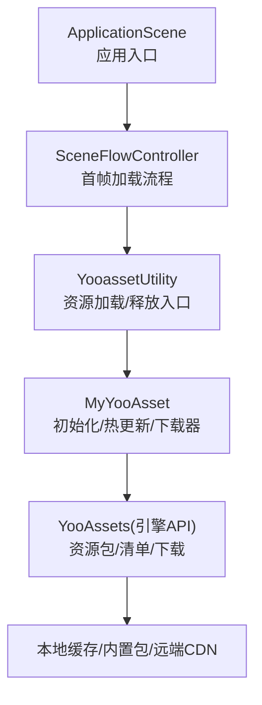
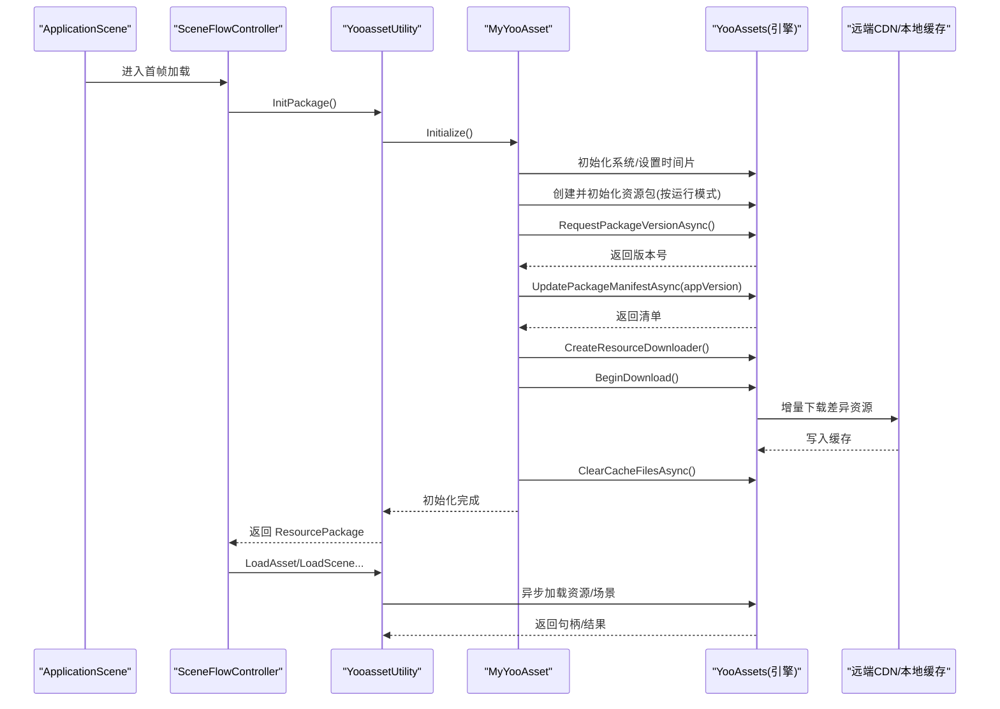
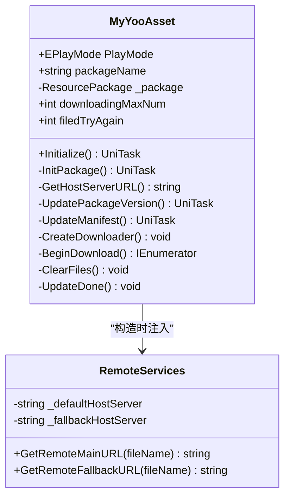
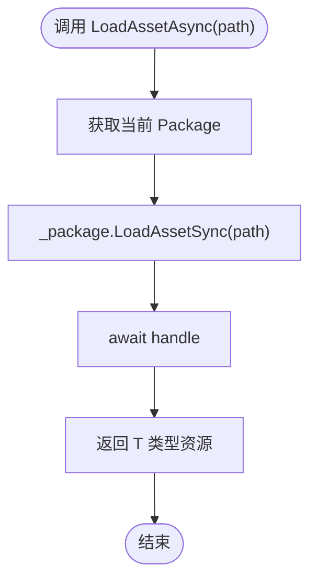
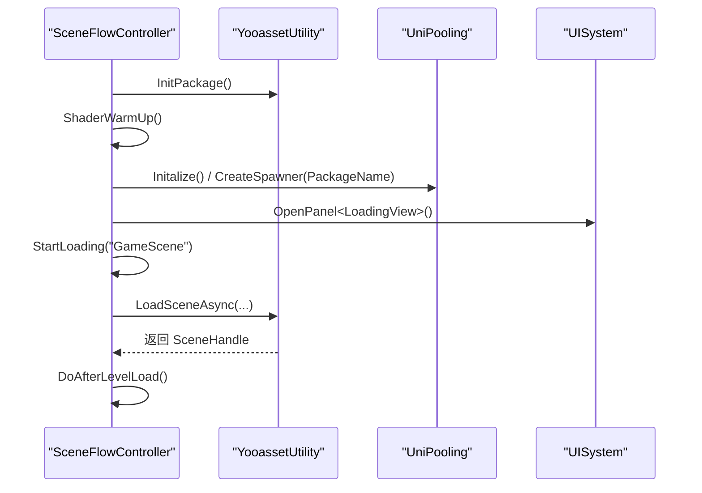
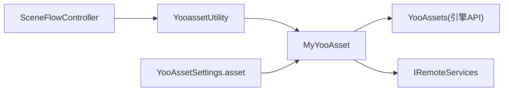

# YooAsset 资源管理

<cite>
**本文引用的文件列表**
- [YooAssetSettings.asset](file://Assets/Game/Resources/YooAssetSettings.asset)
- [MyYooAsset.cs](file://Assets/Game/Scripts/MiniGame_Scripts/Utility/MyYooAsset.cs)
- [YooassetUtility.cs](file://Assets/Game/Scripts/MiniGame_Scripts/Utility/YooassetUtility.cs)
- [SceneFlowController.cs](file://Assets/Game/Scripts/MiniGame_Scripts/Controller/SceneFlowController.cs)
- [ApplicationScene.cs](file://Assets/Game/Scripts/ApplicationScene.cs)
</cite>

## 目录
1. [简介](#简介)
2. [项目结构](#项目结构)
3. [核心组件](#核心组件)
4. [架构总览](#架构总览)
5. [详细组件分析](#详细组件分析)
6. [依赖关系分析](#依赖关系分析)
7. [性能与优化](#性能与优化)
8. [故障排查指南](#故障排查指南)
9. [结论](#结论)
10. [附录：使用示例路径](#附录使用示例路径)

## 简介
本技术文档围绕项目中基于 YooAsset 的资源管理系统，系统阐述其集成架构、初始化流程、多平台运行模式配置（编辑器模拟、离线、联机、WebGL）、资源包生命周期管理（创建、初始化、版本更新、清单管理）、异步加载机制（UniTask 使用与错误处理）、热更新工作原理（版本检查、增量下载、缓存管理与回滚策略），并提供打包配置、CDN 部署与性能优化建议，以及常见问题排查方法与调试工具使用指南。

## 项目结构
本项目将 YooAsset 的运行时初始化、资源包管理与加载封装在 Utility 层，并通过场景控制器协调启动流程。关键位置如下：
- 资源系统全局设置：Assets/Game/Resources/YooAssetSettings.asset
- 资源系统初始化与热更新流程：Assets/Game/Scripts/MiniGame_Scripts/Utility/MyYooAsset.cs
- 资源加载与释放统一入口：Assets/Game/Scripts/MiniGame_Scripts/Utility/YooassetUtility.cs
- 应用启动与首帧加载流程：Assets/Game/Scripts/MiniGame_Scripts/Controller/SceneFlowController.cs
- 应用入口挂载点：Assets/Game/Scripts/ApplicationScene.cs

图表来源
- [ApplicationScene.cs:1-36](file://Assets/Game/Scripts/ApplicationScene.cs#L1-L36)
- [SceneFlowController.cs:169-214](file://Assets/Game/Scripts/MiniGame_Scripts/Controller/SceneFlowController.cs#L169-L214)
- [YooassetUtility.cs:1-121](file://Assets/Game/Scripts/MiniGame_Scripts/Utility/YooassetUtility.cs#L1-L121)
- [MyYooAsset.cs:36-146](file://Assets/Game/Scripts/MiniGame_Scripts/Utility/MyYooAsset.cs#L36-L146)

章节来源
- [ApplicationScene.cs:1-36](file://Assets/Game/Scripts/ApplicationScene.cs#L1-L36)
- [SceneFlowController.cs:169-214](file://Assets/Game/Scripts/MiniGame_Scripts/Controller/SceneFlowController.cs#L169-L214)
- [YooassetUtility.cs:1-121](file://Assets/Game/Scripts/MiniGame_Scripts/Utility/YooassetUtility.cs#L1-L121)
- [MyYooAsset.cs:36-146](file://Assets/Game/Scripts/MiniGame_Scripts/Utility/MyYooAsset.cs#L36-L146)

## 核心组件
- MyYooAsset：负责 YooAsset 系统初始化、资源包创建与初始化、版本与清单更新、下载器创建与下载、缓存清理等。
- YooassetUtility：对外暴露统一的资源加载/卸载接口，封装 UniTask 异步调用，提供场景加载、子资源加载、批量配置加载等方法。
- SceneFlowController：编排首次启动流程，包括资源包初始化、着色器预热、对象池生成、场景加载等。
- ApplicationScene：应用级入口，用于框架初始化与生命周期事件转发。
- YooAssetSettings.asset：YooAsset 全局设置（默认文件夹名、包清单前缀）。

章节来源
- [MyYooAsset.cs:1-330](file://Assets/Game/Scripts/MiniGame_Scripts/Utility/MyYooAsset.cs#L1-L330)
- [YooassetUtility.cs:1-121](file://Assets/Game/Scripts/MiniGame_Scripts/Utility/YooassetUtility.cs#L1-L121)
- [SceneFlowController.cs:169-214](file://Assets/Game/Scripts/MiniGame_Scripts/Controller/SceneFlowController.cs#L169-L214)
- [ApplicationScene.cs:1-36](file://Assets/Game/Scripts/ApplicationScene.cs#L1-L36)
- [YooAssetSettings.asset:1-17](file://Assets/Game/Resources/YooAssetSettings.asset#L1-L17)

## 架构总览
下图展示了从应用启动到资源可用、再到资源加载与释放的整体流程，以及与 YooAsset 各阶段的交互。

图表来源
- [SceneFlowController.cs:169-214](file://Assets/Game/Scripts/MiniGame_Scripts/Controller/SceneFlowController.cs#L169-L214)
- [YooassetUtility.cs:27-87](file://Assets/Game/Scripts/MiniGame_Scripts/Utility/YooassetUtility.cs#L27-L87)
- [MyYooAsset.cs:36-146](file://Assets/Game/Scripts/MiniGame_Scripts/Utility/MyYooAsset.cs#L36-L146)
- [MyYooAsset.cs:212-322](file://Assets/Game/Scripts/MiniGame_Scripts/Utility/MyYooAsset.cs#L212-L322)

## 详细组件分析

### 组件一：MyYooAsset（初始化与热更新）
职责
- 根据运行模式初始化资源包（编辑器模拟、离线、联机、WebGL）
- 版本检查与清单更新
- 下载器创建与增量下载
- 缓存清理与热更新结束回调

运行模式与初始化参数
- 编辑器模拟模式：使用 EditorSimulateModeParameters，指定包根目录与文件系统参数，设置最大并发加载数
- 离线模式：使用 OfflinePlayModeParameters，绑定内置文件系统参数
- 联机模式：使用 HostPlayModeParameters，构建 RemoteServices 指向默认与备用服务器，设置缓存文件系统参数与并发加载数
- WebGL 模式：使用 WebPlayModeParameters，区分微信小游戏环境与非微信环境的 WebServerFileSystemParameters

版本与清单
- 通过 RequestPackageVersionAsync 获取远程最新版本号
- 通过 UpdatePackageManifestAsync(appVersion) 拉取对应版本的清单

下载与缓存
- 使用 CreateResourceDownloader(maxNum, retryCount) 创建下载器
- 监听 DownloadErrorCallback 与 DownloadUpdateCallback 进行错误与进度反馈
- 使用 ClearCacheFilesAsync(ClearUnusedBundleFiles) 清理未使用的缓存文件

图表来源
- [MyYooAsset.cs:9-330](file://Assets/Game/Scripts/MiniGame_Scripts/Utility/MyYooAsset.cs#L9-L330)

章节来源
- [MyYooAsset.cs:36-146](file://Assets/Game/Scripts/MiniGame_Scripts/Utility/MyYooAsset.cs#L36-L146)
- [MyYooAsset.cs:212-322](file://Assets/Game/Scripts/MiniGame_Scripts/Utility/MyYooAsset.cs#L212-L322)

### 组件二：YooassetUtility（资源加载与释放）
职责
- 封装对 MyYooAsset 的初始化调用，持有 ResourcePackage 引用
- 提供同步/异步加载 API：单资源、子资源、批量配置、场景加载
- 提供卸载 API：卸载未引用资源、强制卸载全部、尝试卸载指定资源

异步加载与错误处理
- 所有加载方法均返回 UniTask，便于与业务逻辑无缝衔接
- 场景加载支持 onError 回调与 onProgress 进度回调
- 内部使用 await handle 等待句柄完成，确保线程安全与顺序可控

图表来源
- [YooassetUtility.cs:54-59](file://Assets/Game/Scripts/MiniGame_Scripts/Utility/YooassetUtility.cs#L54-L59)

章节来源
- [YooassetUtility.cs:27-87](file://Assets/Game/Scripts/MiniGame_Scripts/Utility/YooassetUtility.cs#L27-L87)
- [YooassetUtility.cs:96-121](file://Assets/Game/Scripts/MiniGame_Scripts/Utility/YooassetUtility.cs#L96-L121)

### 组件三：SceneFlowController（启动流程编排）
职责
- 首次启动时调用资源包初始化
- 着色器变体预热，减少运行时卡顿
- 对象池初始化与孵化器创建
- 场景加载状态机驱动与进度上报

图表来源
- [SceneFlowController.cs:169-214](file://Assets/Game/Scripts/MiniGame_Scripts/Controller/SceneFlowController.cs#L169-L214)
- [SceneFlowController.cs:129-156](file://Assets/Game/Scripts/MiniGame_Scripts/Controller/SceneFlowController.cs#L129-L156)

章节来源
- [SceneFlowController.cs:169-214](file://Assets/Game/Scripts/MiniGame_Scripts/Controller/SceneFlowController.cs#L169-L214)
- [SceneFlowController.cs:129-156](file://Assets/Game/Scripts/MiniGame_Scripts/Controller/SceneFlowController.cs#L129-L156)

### 组件四：ApplicationScene（应用入口）
职责
- 在 Awake 中触发框架初始化
- 转发应用暂停/恢复事件

章节来源
- [ApplicationScene.cs:1-36](file://Assets/Game/Scripts/ApplicationScene.cs#L1-L36)

## 依赖关系分析
- YooassetUtility 依赖 MyYooAsset 完成资源包初始化，并持有 ResourcePackage 以执行加载/卸载操作
- SceneFlowController 依赖 YooassetUtility 提供的统一接口，完成首帧加载与场景切换
- MyYooAsset 直接依赖 YooAssets 引擎 API 与 IRemoteServices 实现远端访问
- 配置文件 YooAssetSettings.asset 影响包清单前缀与默认目录

图表来源
- [SceneFlowController.cs:169-214](file://Assets/Game/Scripts/MiniGame_Scripts/Controller/SceneFlowController.cs#L169-L214)
- [YooassetUtility.cs:1-121](file://Assets/Game/Scripts/MiniGame_Scripts/Utility/YooassetUtility.cs#L1-L121)
- [MyYooAsset.cs:36-146](file://Assets/Game/Scripts/MiniGame_Scripts/Utility/MyYooAsset.cs#L36-L146)
- [YooAssetSettings.asset:1-17](file://Assets/Game/Resources/YooAssetSettings.asset#L1-L17)

章节来源
- [SceneFlowController.cs:169-214](file://Assets/Game/Scripts/MiniGame_Scripts/Controller/SceneFlowController.cs#L169-L214)
- [YooassetUtility.cs:1-121](file://Assets/Game/Scripts/MiniGame_Scripts/Utility/YooassetUtility.cs#L1-L121)
- [MyYooAsset.cs:36-146](file://Assets/Game/Scripts/MiniGame_Scripts/Utility/MyYooAsset.cs#L36-L146)
- [YooAssetSettings.asset:1-17](file://Assets/Game/Resources/YooAssetSettings.asset#L1-L17)

## 性能与优化
- 并发控制
  - 编辑器模拟与联机模式下设置 BundleLoadingMaxConcurrency，避免过多并发导致卡顿或带宽拥塞
- 下载策略
  - 合理设置 downloadingMaxNum 与重试次数，平衡速度与稳定性
- 缓存管理
  - 使用 ClearUnusedBundleFiles 定期清理无用缓存，降低磁盘占用
- 着色器预热
  - 启动阶段加载 ShaderVariantCollection 并 WarmUp，减少运行时首次编译开销
- 对象池
  - 结合 UniPooling 为高频实例化对象提供池化能力，降低 GC 压力
- 资源分组与按需加载
  - 将大资源拆分为小包，配合清单与版本控制，仅下载必要内容

[本节为通用指导，不直接分析具体文件]

## 故障排查指南
- 初始化失败
  - 检查运行模式参数是否正确（EditorSimulateMode/Offline/Host/Web）
  - 确认 RemoteServices 的主备地址可达
  - 查看 InitializationOperation.Status 与 Error 信息
- 版本与清单异常
  - 确认 RequestPackageVersionAsync 成功且 appVersion 正确
  - 检查 UpdatePackageManifestAsync 的状态与错误信息
- 下载问题
  - 关注 DownloadErrorCallback 中的文件名与错误信息
  - 检查网络连通性与 CDN 目录结构是否匹配 GetHostServerURL 规则
- 资源加载失败
  - 确认资源路径与包内命名一致
  - 检查是否已正确初始化并获取到 ResourcePackage
- 内存与卡顿
  - 使用 UnloadUnusedAssets/ForceUnloadAllAssets 在合适时机释放
  - 开启对象池与着色器预热，减少峰值内存与卡顿

章节来源
- [MyYooAsset.cs:137-146](file://Assets/Game/Scripts/MiniGame_Scripts/Utility/MyYooAsset.cs#L137-L146)
- [MyYooAsset.cs:212-247](file://Assets/Game/Scripts/MiniGame_Scripts/Utility/MyYooAsset.cs#L212-L247)
- [MyYooAsset.cs:270-308](file://Assets/Game/Scripts/MiniGame_Scripts/Utility/MyYooAsset.cs#L270-L308)
- [YooassetUtility.cs:96-121](file://Assets/Game/Scripts/MiniGame_Scripts/Utility/YooassetUtility.cs#L96-L121)

## 结论
本项目通过 MyYooAsset 与 YooassetUtility 将 YooAsset 的初始化、热更新与资源加载解耦为可复用的模块，并在 SceneFlowController 中编排了完整的启动流程。该方案在多平台下具备良好扩展性，支持编辑器模拟、离线、联机与 WebGL 模式，同时提供了完善的异步加载与错误处理机制。配合合理的打包与 CDN 策略，可实现高效的热更新与稳定的运行时体验。

[本节为总结，不直接分析具体文件]

## 附录：使用示例路径
以下给出常见资源加载与场景加载的代码片段路径，便于快速定位与参考：
- 初始化资源包与获取包对象
  - [YooassetUtility.cs:27-31](file://Assets/Game/Scripts/MiniGame_Scripts/Utility/YooassetUtility.cs#L27-L31)
- 加载单个资源（异步）
  - [YooassetUtility.cs:54-59](file://Assets/Game/Scripts/MiniGame_Scripts/Utility/YooassetUtility.cs#L54-L59)
- 加载子资源
  - [YooassetUtility.cs:61-66](file://Assets/Game/Scripts/MiniGame_Scripts/Utility/YooassetUtility.cs#L61-L66)
- 批量加载配置（TextAsset）
  - [YooassetUtility.cs:35-46](file://Assets/Game/Scripts/MiniGame_Scripts/Utility/YooassetUtility.cs#L35-L46)
- 加载场景（异步）
  - [YooassetUtility.cs:68-87](file://Assets/Game/Scripts/MiniGame_Scripts/Utility/YooassetUtility.cs#L68-L87)
- 卸载未引用资源
  - [YooassetUtility.cs:96-101](file://Assets/Game/Scripts/MiniGame_Scripts/Utility/YooassetUtility.cs#L96-L101)
- 强制卸载全部资源
  - [YooassetUtility.cs:105-110](file://Assets/Game/Scripts/MiniGame_Scripts/Utility/YooassetUtility.cs#L105-L110)
- 尝试卸载指定资源
  - [YooassetUtility.cs:114-118](file://Assets/Game/Scripts/MiniGame_Scripts/Utility/YooassetUtility.cs#L114-L118)
- 首帧加载流程（包含着色器预热与对象池）
  - [SceneFlowController.cs:169-214](file://Assets/Game/Scripts/MiniGame_Scripts/Controller/SceneFlowController.cs#L169-L214)
- 场景加载调用与错误处理
  - [SceneFlowController.cs:129-156](file://Assets/Game/Scripts/MiniGame_Scripts/Controller/SceneFlowController.cs#L129-L156)

章节来源
- [YooassetUtility.cs:27-121](file://Assets/Game/Scripts/MiniGame_Scripts/Utility/YooassetUtility.cs#L27-L121)
- [SceneFlowController.cs:129-214](file://Assets/Game/Scripts/MiniGame_Scripts/Controller/SceneFlowController.cs#L129-L214)