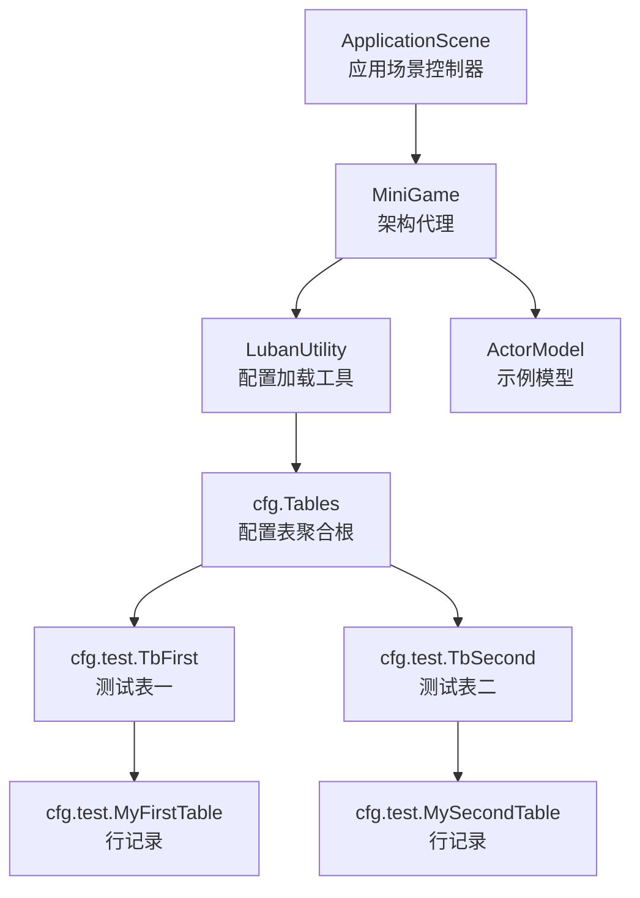
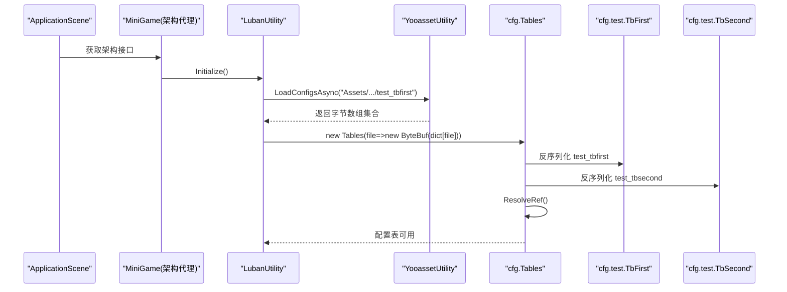
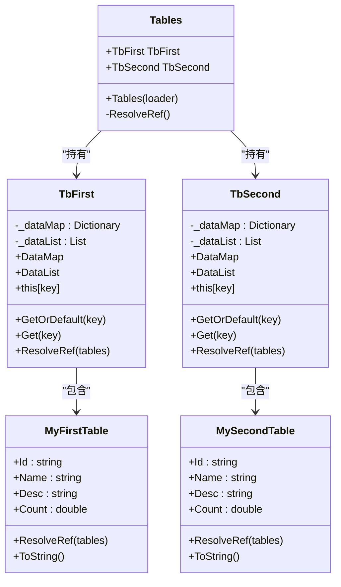
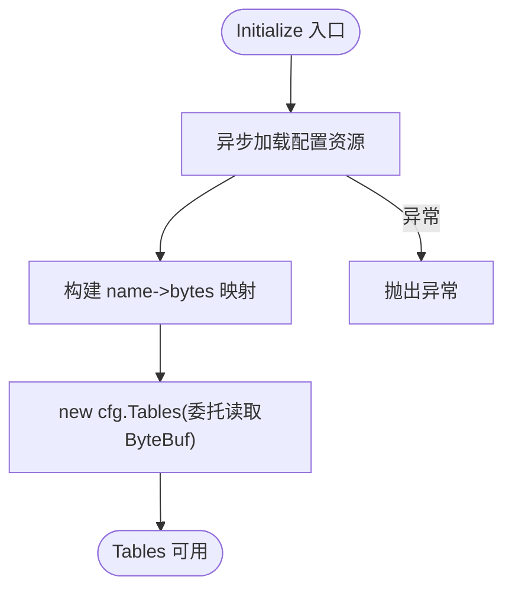
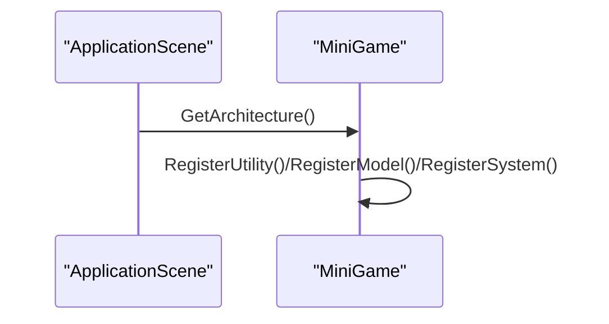
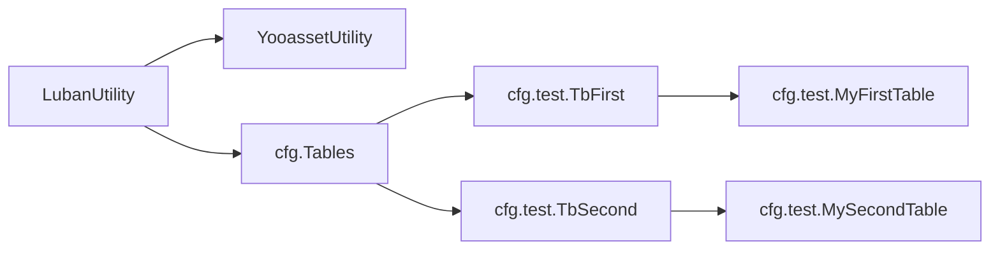

# 数据驱动架构

<cite>
**本文引用的文件**   
- [ApplicationScene.cs](file://Assets/Game/Scripts/ApplicationScene.cs)
- [MiniGame.cs](file://Assets/Game/Scripts/MiniGame_Scripts/MiniGame.cs)
- [LubanUtility.cs](file://Assets/Game/Scripts/MiniGame_Scripts/Utility/LubanUtility.cs)
- [Tables.cs](file://Assets/Game/Scripts/ConfigCode/Tables.cs)
- [TbFirst.cs](file://Assets/Game/Scripts/ConfigCode/test/TbFirst.cs)
- [TbSecond.cs](file://Assets/Game/Scripts/ConfigCode/test/TbSecond.cs)
- [MyFirstTable.cs](file://Assets/Game/Scripts/ConfigCode/test/MyFirstTable.cs)
- [MySecondTable.cs](file://Assets/Game/Scripts/ConfigCode/test/MySecondTable.cs)
- [ActorModel.cs](file://Assets/Game/Scripts/MiniGame_Scripts/Model/ActorModel.cs)
</cite>

## 目录
1. [简介](#简介)
2. [项目结构](#项目结构)
3. [核心组件](#核心组件)
4. [架构总览](#架构总览)
5. [详细组件分析](#详细组件分析)
6. [依赖关系分析](#依赖关系分析)
7. [性能考量](#性能考量)
8. [故障排查指南](#故障排查指南)
9. [结论](#结论)
10. [附录](#附录)

## 简介
本项目采用“数据驱动”的架构思想，将配置与运行时逻辑解耦：通过代码生成工具（Luban）从配置表定义生成强类型访问层，在运行时由资源加载器提供二进制流，再由生成的反序列化器构建内存数据结构。业务模块仅依赖这些只读的数据模型进行决策与表现更新，从而实现高内聚、低耦合、易扩展的数据驱动体系。

## 项目结构
围绕数据驱动的核心路径如下：
- 应用启动入口负责初始化框架并获取全局接口
- 架构代理负责注册工具、模型与系统
- 工具层负责加载配置资源并构造配置表对象
- 配置表对象由生成代码提供，包含按主键索引的查找能力与引用解析钩子
- 业务模型与系统消费配置数据，不关心数据来源

图表来源
- [ApplicationScene.cs:1-36](file://Assets/Game/Scripts/ApplicationScene.cs#L1-L36)
- [MiniGame.cs:1-30](file://Assets/Game/Scripts/MiniGame_Scripts/MiniGame.cs#L1-L30)
- [LubanUtility.cs:1-40](file://Assets/Game/Scripts/MiniGame_Scripts/Utility/LubanUtility.cs#L1-L40)
- [Tables.cs:1-34](file://Assets/Game/Scripts/ConfigCode/Tables.cs#L1-L34)
- [TbFirst.cs:1-53](file://Assets/Game/Scripts/ConfigCode/test/TbFirst.cs#L1-L53)
- [TbSecond.cs:1-53](file://Assets/Game/Scripts/ConfigCode/test/TbSecond.cs#L1-L53)
- [MyFirstTable.cs:1-66](file://Assets/Game/Scripts/ConfigCode/test/MyFirstTable.cs#L1-L66)
- [MySecondTable.cs:1-66](file://Assets/Game/Scripts/ConfigCode/test/MySecondTable.cs#L1-L66)

章节来源
- [ApplicationScene.cs:1-36](file://Assets/Game/Scripts/ApplicationScene.cs#L1-L36)
- [MiniGame.cs:1-30](file://Assets/Game/Scripts/MiniGame_Scripts/MiniGame.cs#L1-L30)

## 核心组件
- 应用启动与架构接入
  - ApplicationScene 作为场景控制器，负责初始化并暴露架构接口
  - MiniGame 作为架构代理，集中注册工具、模型与系统
- 配置加载与装配
  - LubanUtility 异步加载配置资源，构造 cfg.Tables 实例，并通过委托注入 ByteBuf 读取器
- 配置表与行记录
  - Tables 聚合各表并提供引用解析入口
  - TbFirst/TbSecond 维护 DataMap/DataList，提供按主键查询与索引
  - MyFirstTable/MySecondTable 为行级数据模型，支持 ToString 与引用解析钩子

章节来源
- [ApplicationScene.cs:1-36](file://Assets/Game/Scripts/ApplicationScene.cs#L1-L36)
- [MiniGame.cs:1-30](file://Assets/Game/Scripts/MiniGame_Scripts/MiniGame.cs#L1-L30)
- [LubanUtility.cs:1-40](file://Assets/Game/Scripts/MiniGame_Scripts/Utility/LubanUtility.cs#L1-L40)
- [Tables.cs:1-34](file://Assets/Game/Scripts/ConfigCode/Tables.cs#L1-L34)
- [TbFirst.cs:1-53](file://Assets/Game/Scripts/ConfigCode/test/TbFirst.cs#L1-L53)
- [TbSecond.cs:1-53](file://Assets/Game/Scripts/ConfigCode/test/TbSecond.cs#L1-L53)
- [MyFirstTable.cs:1-66](file://Assets/Game/Scripts/ConfigCode/test/MyFirstTable.cs#L1-L66)
- [MySecondTable.cs:1-66](file://Assets/Game/Scripts/ConfigCode/test/MySecondTable.cs#L1-L66)

## 架构总览
下图展示了从应用启动到配置表可用的关键调用链，以及数据流向。

图表来源
- [ApplicationScene.cs:1-36](file://Assets/Game/Scripts/ApplicationScene.cs#L1-L36)
- [MiniGame.cs:1-30](file://Assets/Game/Scripts/MiniGame_Scripts/MiniGame.cs#L1-L30)
- [LubanUtility.cs:1-40](file://Assets/Game/Scripts/MiniGame_Scripts/Utility/LubanUtility.cs#L1-L40)
- [Tables.cs:1-34](file://Assets/Game/Scripts/ConfigCode/Tables.cs#L1-L34)
- [TbFirst.cs:1-53](file://Assets/Game/Scripts/ConfigCode/test/TbFirst.cs#L1-L53)
- [TbSecond.cs:1-53](file://Assets/Game/Scripts/ConfigCode/test/TbSecond.cs#L1-L53)

## 详细组件分析

### 配置表聚合根与表容器
- Tables 负责：
  - 根据文件名委托加载 ByteBuf
  - 构造各表实例
  - 统一触发引用解析
- TbFirst/TbSecond 负责：
  - 维护字典与列表双索引
  - 提供 GetOrDefault/Get/[] 等便捷访问
  - 遍历行记录执行 ResolveRef

图表来源
- [Tables.cs:1-34](file://Assets/Game/Scripts/ConfigCode/Tables.cs#L1-L34)
- [TbFirst.cs:1-53](file://Assets/Game/Scripts/ConfigCode/test/TbFirst.cs#L1-L53)
- [TbSecond.cs:1-53](file://Assets/Game/Scripts/ConfigCode/test/TbSecond.cs#L1-L53)
- [MyFirstTable.cs:1-66](file://Assets/Game/Scripts/ConfigCode/test/MyFirstTable.cs#L1-L66)
- [MySecondTable.cs:1-66](file://Assets/Game/Scripts/ConfigCode/test/MySecondTable.cs#L1-L66)

章节来源
- [Tables.cs:1-34](file://Assets/Game/Scripts/ConfigCode/Tables.cs#L1-L34)
- [TbFirst.cs:1-53](file://Assets/Game/Scripts/ConfigCode/test/TbFirst.cs#L1-L53)
- [TbSecond.cs:1-53](file://Assets/Game/Scripts/ConfigCode/test/TbSecond.cs#L1-L53)
- [MyFirstTable.cs:1-66](file://Assets/Game/Scripts/ConfigCode/test/MyFirstTable.cs#L1-L66)
- [MySecondTable.cs:1-66](file://Assets/Game/Scripts/ConfigCode/test/MySecondTable.cs#L1-L66)

### 配置加载流程（LubanUtility）
- 通过 YooassetUtility 异步加载配置资源
- 将结果转为 name->bytes 映射
- 以委托方式构造 cfg.Tables，实现按需反序列化
- 清理中间集合，避免内存泄漏

图表来源
- [LubanUtility.cs:1-40](file://Assets/Game/Scripts/MiniGame_Scripts/Utility/LubanUtility.cs#L1-L40)

章节来源
- [LubanUtility.cs:1-40](file://Assets/Game/Scripts/MiniGame_Scripts/Utility/LubanUtility.cs#L1-L40)

### 应用启动与架构注册
- ApplicationScene 在 Awake 中初始化并暴露架构接口
- MiniGame 作为架构代理，注册工具（含 LubanUtility）、模型与系统

图表来源
- [ApplicationScene.cs:1-36](file://Assets/Game/Scripts/ApplicationScene.cs#L1-L36)
- [MiniGame.cs:1-30](file://Assets/Game/Scripts/MiniGame_Scripts/MiniGame.cs#L1-L30)

章节来源
- [ApplicationScene.cs:1-36](file://Assets/Game/Scripts/ApplicationScene.cs#L1-L36)
- [MiniGame.cs:1-30](file://Assets/Game/Scripts/MiniGame_Scripts/MiniGame.cs#L1-L30)

### 模型层（ActorModel）
- ActorModel 作为示例模型，预留 OnInit 生命周期，用于后续接入配置或持久化逻辑

章节来源
- [ActorModel.cs:1-13](file://Assets/Game/Scripts/MiniGame_Scripts/Model/ActorModel.cs#L1-L13)

## 依赖关系分析
- 组件耦合
  - LubanUtility 依赖 YooassetUtility 与 cfg.Tables
  - cfg.Tables 依赖具体表类（TbFirst/TbSecond）
  - 表类依赖行记录（MyFirstTable/MySecondTable）
- 外部依赖
  - Luban 运行时（ByteBuf、BeanBase 等）
  - Newtonsoft.Json（用于 JSON 相关处理）
  - UniTask（异步任务）
- 可能的循环依赖
  - 当前未见直接循环；若未来在 ResolveRef 中引入跨表引用，需确保引用解析顺序正确

图表来源
- [LubanUtility.cs:1-40](file://Assets/Game/Scripts/MiniGame_Scripts/Utility/LubanUtility.cs#L1-L40)
- [Tables.cs:1-34](file://Assets/Game/Scripts/ConfigCode/Tables.cs#L1-L34)
- [TbFirst.cs:1-53](file://Assets/Game/Scripts/ConfigCode/test/TbFirst.cs#L1-L53)
- [TbSecond.cs:1-53](file://Assets/Game/Scripts/ConfigCode/test/TbSecond.cs#L1-L53)
- [MyFirstTable.cs:1-66](file://Assets/Game/Scripts/ConfigCode/test/MyFirstTable.cs#L1-L66)
- [MySecondTable.cs:1-66](file://Assets/Game/Scripts/ConfigCode/test/MySecondTable.cs#L1-L66)

章节来源
- [LubanUtility.cs:1-40](file://Assets/Game/Scripts/MiniGame_Scripts/Utility/LubanUtility.cs#L1-L40)
- [Tables.cs:1-34](file://Assets/Game/Scripts/ConfigCode/Tables.cs#L1-L34)

## 性能考量
- 反序列化与索引
  - 表容器在构造时一次性构建字典与列表，查询 O(1)，适合高频随机访问
- 内存占用
  - 配置数据常驻内存，建议对超大表考虑分片加载或延迟加载策略
- 资源加载
  - 使用异步加载与 UniTask，避免阻塞主线程
- 引用解析
  - ResolveRef 在表级别统一执行，避免重复计算；跨表引用应尽量减少深度嵌套

## 故障排查指南
- 配置未找到或加载失败
  - 检查 YooassetUtility 的资源路径与打包清单是否一致
  - 确认配置文件名与生成输出目录匹配
- 反序列化异常
  - 校验配置表定义与生成代码版本一致性
  - 检查 ByteBuf 读取顺序与字段类型是否匹配
- 引用解析错误
  - 确认 ResolveRef 中的键值存在性，必要时增加空值保护
- 架构初始化问题
  - 确认 MiniGame 已正确注册 LubanUtility 并在需要时调用 Initialize

章节来源
- [LubanUtility.cs:1-40](file://Assets/Game/Scripts/MiniGame_Scripts/Utility/LubanUtility.cs#L1-L40)
- [Tables.cs:1-34](file://Assets/Game/Scripts/ConfigCode/Tables.cs#L1-L34)
- [TbFirst.cs:1-53](file://Assets/Game/Scripts/ConfigCode/test/TbFirst.cs#L1-L53)
- [TbSecond.cs:1-53](file://Assets/Game/Scripts/ConfigCode/test/TbSecond.cs#L1-L53)

## 结论
该项目通过“生成代码 + 运行时反序列化 + 资源异步加载”的组合，实现了清晰的数据驱动架构。配置与逻辑解耦，便于热更与多端复用；表容器提供高效查询与统一的引用解析入口，有利于复杂配置的关联管理。建议在后续迭代中完善错误处理、监控与可观测性，并对大规模配置引入分片与懒加载策略。

## 附录
- 术语
  - 配置表：由设计期定义、运行期反序列化的结构化数据
  - 表容器：聚合多个表并提供统一访问与引用解析的对象
  - 行记录：配置表中单条数据的强类型表示
- 最佳实践
  - 保持配置表与生成代码版本同步
  - 在 ResolveRef 中谨慎处理跨表引用，避免循环依赖
  - 对大表采用分表或分页加载，降低峰值内存