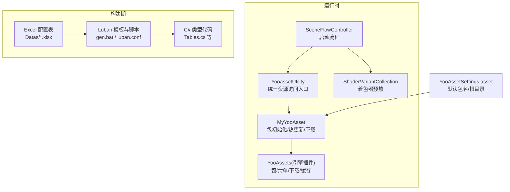
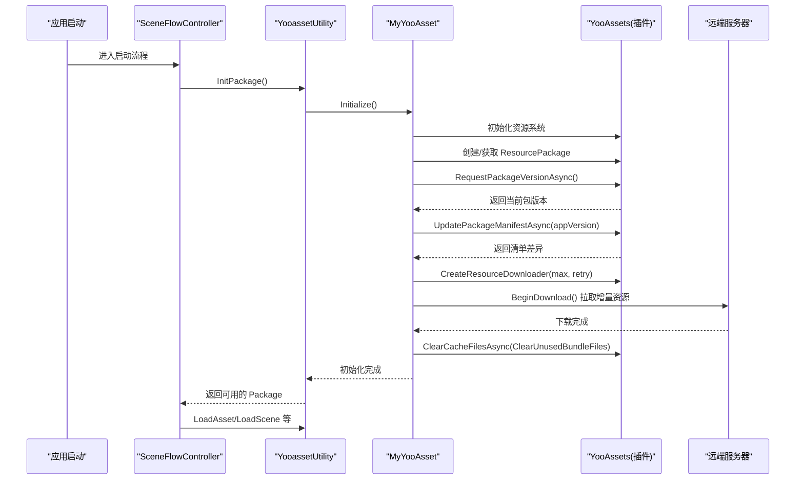
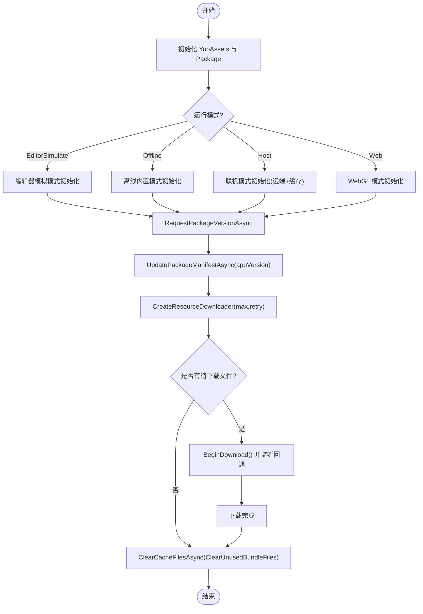
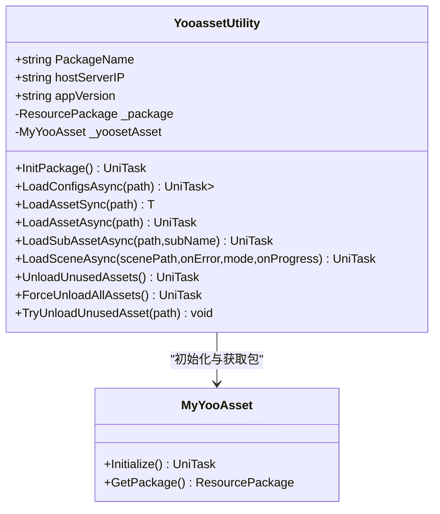
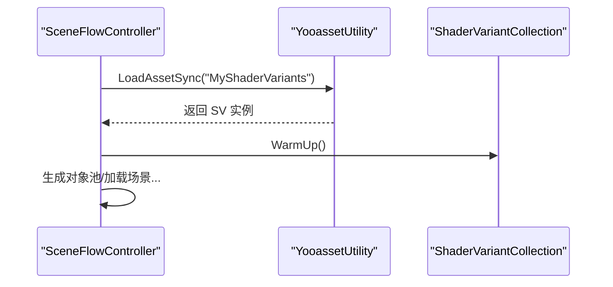
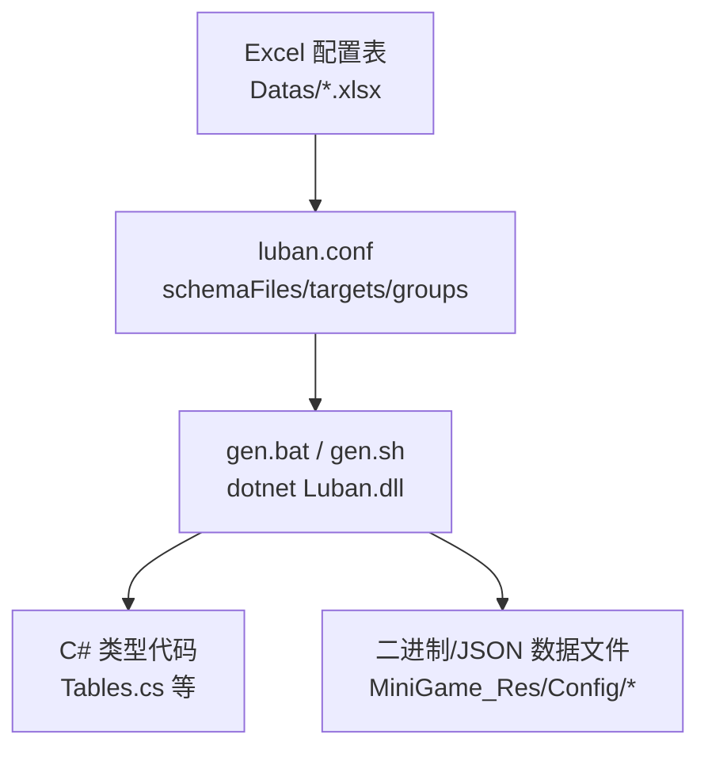
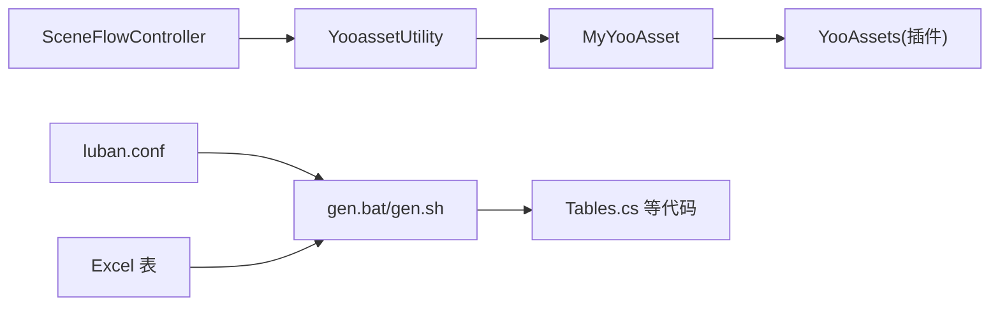

# 资源管理

<cite>
**本文引用的文件列表**
- [MyYooAsset.cs](file://Assets/Game/Scripts/MiniGame_Scripts/Utility/MyYooAsset.cs)
- [YooassetUtility.cs](file://Assets/Game/Scripts/MiniGame_Scripts/Utility/YooassetUtility.cs)
- [SceneFlowController.cs](file://Assets/Game/Scripts/MiniGame_Scripts/Controller/SceneFlowController.cs)
- [YooAssetSettings.asset](file://Assets/Game/Resources/YooAssetSettings.asset)
- [gen.bat](file://LubanConfig/Template/gen.bat)
- [luban.conf](file://LubanConfig/Template/luban.conf)
- [Tables.cs](file://Assets/Game/Scripts/ConfigCode/Tables.cs)
</cite>

## 目录
1. [简介](#简介)
2. [项目结构](#项目结构)
3. [核心组件](#核心组件)
4. [架构总览](#架构总览)
5. [详细组件分析](#详细组件分析)
6. [依赖关系分析](#依赖关系分析)
7. [性能与内存优化](#性能与内存优化)
8. [故障排查指南](#故障排查指南)
9. [结论](#结论)
10. [附录：配置与使用示例](#附录配置与使用示例)

## 简介
本文件面向 SimulationClient 的资源管理系统，系统性说明以下主题：
- YooAsset 资源管理的集成与使用：包管理、热更新流程、异步加载策略
- Luban 配置系统从 Excel 到类型安全代码的生成流程
- 资源生命周期管理、缓存策略与内存优化
- 打包、部署与版本管理的最佳实践
- 常见资源加载问题与性能优化技巧
- 结合现有代码路径的使用指引（以“代码片段路径”形式提供）

## 项目结构
本项目在 Unity 工程内通过 YooAsset 进行资源管理与热更，并通过 Luban 将 Excel 配置表转换为 C# 类型化代码。关键位置如下：
- YooAsset 初始化与运行模式参数位于资源设置文件中
- 资源包初始化、版本检查、清单更新、下载器创建与清理逻辑封装在自定义类中
- 统一资源访问入口暴露于工具类，供业务层调用
- 场景启动流程中整合了着色器预热与对象池初始化
- Luban 模板与脚本定义了从 Excel 到 C# 的代码生成流程

图表来源
- [YooassetUtility.cs:12-31](file://Assets/Game/Scripts/MiniGame_Scripts/Utility/YooassetUtility.cs#L12-L31)
- [MyYooAsset.cs:36-62](file://Assets/Game/Scripts/MiniGame_Scripts/Utility/MyYooAsset.cs#L36-L62)
- [SceneFlowController.cs:189-204](file://Assets/Game/Scripts/MiniGame_Scripts/Controller/SceneFlowController.cs#L189-L204)
- [YooAssetSettings.asset:13-16](file://Assets/Game/Resources/YooAssetSettings.asset#L13-L16)
- [gen.bat:1-12](file://LubanConfig/Template/gen.bat#L1-L12)
- [luban.conf:1-27](file://LubanConfig/Template/luban.conf#L1-L27)

章节来源
- [YooAssetSettings.asset:13-16](file://Assets/Game/Resources/YooAssetSettings.asset#L13-L16)
- [YooassetUtility.cs:12-31](file://Assets/Game/Scripts/MiniGame_Scripts/Utility/YooassetUtility.cs#L12-L31)
- [MyYooAsset.cs:36-62](file://Assets/Game/Scripts/MiniGame_Scripts/Utility/MyYooAsset.cs#L36-L62)
- [SceneFlowController.cs:189-204](file://Assets/Game/Scripts/MiniGame_Scripts/Controller/SceneFlowController.cs#L189-L204)
- [gen.bat:1-12](file://LubanConfig/Template/gen.bat#L1-L12)
- [luban.conf:1-27](file://LubanConfig/Template/luban.conf#L1-L27)

## 核心组件
- MyYooAsset：封装 YooAsset 初始化、多平台运行模式选择、版本与清单更新、下载器创建与进度回调、未使用缓存清理等
- YooassetUtility：对外暴露统一的资源加载 API（同步/异步/子资源/场景），以及卸载接口；内部持有并驱动 MyYooAsset
- SceneFlowController：负责应用启动流程中的资源准备（如着色器预热）、对象池初始化、场景加载协调
- YooAssetSettings.asset：定义 YooAsset 默认包名与根目录前缀
- Luban 模板与脚本：定义数据源、目标语言与输出路径，驱动生成类型安全的 C# 代码

章节来源
- [MyYooAsset.cs:36-62](file://Assets/Game/Scripts/MiniGame_Scripts/Utility/MyYooAsset.cs#L36-L62)
- [YooassetUtility.cs:33-88](file://Assets/Game/Scripts/MiniGame_Scripts/Utility/YooassetUtility.cs#L33-L88)
- [SceneFlowController.cs:189-204](file://Assets/Game/Scripts/MiniGame_Scripts/Controller/SceneFlowController.cs#L189-L204)
- [YooAssetSettings.asset:13-16](file://Assets/Game/Resources/YooAssetSettings.asset#L13-L16)
- [gen.bat:1-12](file://LubanConfig/Template/gen.bat#L1-L12)
- [luban.conf:1-27](file://LubanConfig/Template/luban.conf#L1-L27)

## 架构总览
下图展示了从应用启动到资源可用、再到场景加载的整体时序，包括热更新与清单更新的关键步骤。

图表来源
- [MyYooAsset.cs:36-62](file://Assets/Game/Scripts/MiniGame_Scripts/Utility/MyYooAsset.cs#L36-L62)
- [MyYooAsset.cs:213-248](file://Assets/Game/Scripts/MiniGame_Scripts/Utility/MyYooAsset.cs#L213-L248)
- [MyYooAsset.cs:250-322](file://Assets/Game/Scripts/MiniGame_Scripts/Utility/MyYooAsset.cs#L250-L322)
- [YooassetUtility.cs:27-31](file://Assets/Game/Scripts/MiniGame_Scripts/Utility/YooassetUtility.cs#L27-L31)
- [SceneFlowController.cs:175-187](file://Assets/Game/Scripts/MiniGame_Scripts/Controller/SceneFlowController.cs#L175-L187)

## 详细组件分析

### YooAsset 资源包与热更新
- 运行模式支持：编辑器模拟、离线内置、联机 Host、WebGL 等，分别对应不同的文件系统与远程服务参数
- 版本与清单：先请求包版本，再根据版本更新清单，随后创建下载器执行增量下载
- 下载器：可配置最大并发与重试次数，提供单文件失败回调与整体进度回调
- 缓存清理：下载完成后按策略清理未使用的 Bundle 文件，释放磁盘空间

图表来源
- [MyYooAsset.cs:66-146](file://Assets/Game/Scripts/MiniGame_Scripts/Utility/MyYooAsset.cs#L66-L146)
- [MyYooAsset.cs:213-248](file://Assets/Game/Scripts/MiniGame_Scripts/Utility/MyYooAsset.cs#L213-L248)
- [MyYooAsset.cs:250-322](file://Assets/Game/Scripts/MiniGame_Scripts/Utility/MyYooAsset.cs#L250-L322)

章节来源
- [MyYooAsset.cs:66-146](file://Assets/Game/Scripts/MiniGame_Scripts/Utility/MyYooAsset.cs#L66-L146)
- [MyYooAsset.cs:213-248](file://Assets/Game/Scripts/MiniGame_Scripts/Utility/MyYooAsset.cs#L213-L248)
- [MyYooAsset.cs:250-322](file://Assets/Game/Scripts/MiniGame_Scripts/Utility/MyYooAsset.cs#L250-L322)

### 统一资源访问入口（YooassetUtility）
- 提供配置文本批量加载、通用资源同步/异步加载、子资源加载、场景异步加载等方法
- 提供资源卸载能力：卸载引用计数为 0 的资源、强制卸载全部、尝试卸载指定路径资源
- 内部通过 MyYooAsset 完成初始化并持有 ResourcePackage

图表来源
- [YooassetUtility.cs:12-31](file://Assets/Game/Scripts/MiniGame_Scripts/Utility/YooassetUtility.cs#L12-L31)
- [YooassetUtility.cs:33-88](file://Assets/Game/Scripts/MiniGame_Scripts/Utility/YooassetUtility.cs#L33-L88)
- [YooassetUtility.cs:96-118](file://Assets/Game/Scripts/MiniGame_Scripts/Utility/YooassetUtility.cs#L96-L118)
- [MyYooAsset.cs:36-62](file://Assets/Game/Scripts/MiniGame_Scripts/Utility/MyYooAsset.cs#L36-L62)
- [MyYooAsset.cs:200-208](file://Assets/Game/Scripts/MiniGame_Scripts/Utility/MyYooAsset.cs#L200-L208)

章节来源
- [YooassetUtility.cs:33-88](file://Assets/Game/Scripts/MiniGame_Scripts/Utility/YooassetUtility.cs#L33-L88)
- [YooassetUtility.cs:96-118](file://Assets/Game/Scripts/MiniGame_Scripts/Utility/YooassetUtility.cs#L96-L118)
- [MyYooAsset.cs:200-208](file://Assets/Game/Scripts/MiniGame_Scripts/Utility/MyYooAsset.cs#L200-L208)

### 启动流程与着色器预热
- 启动流程中会加载配置、初始化模型数据、生成对象池、预热着色器变体集合，然后进入主场景加载
- 着色器预热通过加载 ShaderVariantCollection 并调用 WarmUp，减少运行时首次编译卡顿

图表来源
- [SceneFlowController.cs:189-204](file://Assets/Game/Scripts/MiniGame_Scripts/Controller/SceneFlowController.cs#L189-L204)

章节来源
- [SceneFlowController.cs:175-187](file://Assets/Game/Scripts/MiniGame_Scripts/Controller/SceneFlowController.cs#L175-L187)
- [SceneFlowController.cs:189-204](file://Assets/Game/Scripts/MiniGame_Scripts/Controller/SceneFlowController.cs#L189-L204)

### Luban 配置系统：从 Excel 到类型安全代码
- 配置文件定义数据源、分组与目标（客户端/服务端/全量），并指定输出目录
- 生成脚本通过命令行参数指定数据格式、目标语言模板、输出目录（数据与代码分离）
- 生成的 C# 代码包含表格管理器与类型化 Bean/Enum，便于在运行时强类型访问

图表来源
- [luban.conf:1-27](file://LubanConfig/Template/luban.conf#L1-L27)
- [gen.bat:1-12](file://LubanConfig/Template/gen.bat#L1-L12)
- [Tables.cs](file://Assets/Game/Scripts/ConfigCode/Tables.cs)

章节来源
- [luban.conf:1-27](file://LubanConfig/Template/luban.conf#L1-L27)
- [gen.bat:1-12](file://LubanConfig/Template/gen.bat#L1-L12)
- [Tables.cs](file://Assets/Game/Scripts/ConfigCode/Tables.cs)

## 依赖关系分析
- 运行时依赖
  - YooassetUtility 依赖 MyYooAsset 完成包初始化与热更新
  - MyYooAsset 依赖 YooAssets 插件提供的包、清单、下载与缓存能力
  - SceneFlowController 依赖 YooassetUtility 进行资源加载与场景切换
- 构建期依赖
  - Luban 模板与脚本依赖 Excel 数据源，生成 C# 代码与数据文件

图表来源
- [YooassetUtility.cs:12-31](file://Assets/Game/Scripts/MiniGame_Scripts/Utility/YooassetUtility.cs#L12-L31)
- [MyYooAsset.cs:36-62](file://Assets/Game/Scripts/MiniGame_Scripts/Utility/MyYooAsset.cs#L36-L62)
- [SceneFlowController.cs:175-187](file://Assets/Game/Scripts/MiniGame_Scripts/Controller/SceneFlowController.cs#L175-L187)
- [luban.conf:1-27](file://LubanConfig/Template/luban.conf#L1-L27)
- [gen.bat:1-12](file://LubanConfig/Template/gen.bat#L1-L12)

章节来源
- [YooassetUtility.cs:12-31](file://Assets/Game/Scripts/MiniGame_Scripts/Utility/YooassetUtility.cs#L12-L31)
- [MyYooAsset.cs:36-62](file://Assets/Game/Scripts/MiniGame_Scripts/Utility/MyYooAsset.cs#L36-L62)
- [SceneFlowController.cs:175-187](file://Assets/Game/Scripts/MiniGame_Scripts/Controller/SceneFlowController.cs#L175-L187)
- [luban.conf:1-27](file://LubanConfig/Template/luban.conf#L1-L27)
- [gen.bat:1-12](file://LubanConfig/Template/gen.bat#L1-L12)

## 性能与内存优化
- 并发控制
  - 编辑器模拟与联机模式下均设置了 Bundle 加载最大并发数，避免 IO 与 CPU 抖动
- 下载策略
  - 合理设置最大并发下载数与失败重试次数，降低网络波动影响
- 缓存清理
  - 下载完成后清理未使用的 Bundle 文件，减少磁盘占用
- 资源卸载
  - 场景切换或空闲时调用卸载接口，及时回收不再使用的资源
- 着色器预热
  - 启动阶段预热 ShaderVariantCollection，减少运行时首次编译导致的卡顿
- 对象池
  - 启动阶段初始化对象池，复用频繁创建销毁的对象，降低 GC 压力

章节来源
- [MyYooAsset.cs:82-84](file://Assets/Game/Scripts/MiniGame_Scripts/Utility/MyYooAsset.cs#L82-L84)
- [MyYooAsset.cs:250-322](file://Assets/Game/Scripts/MiniGame_Scripts/Utility/MyYooAsset.cs#L250-L322)
- [YooassetUtility.cs:96-118](file://Assets/Game/Scripts/MiniGame_Scripts/Utility/YooassetUtility.cs#L96-L118)
- [SceneFlowController.cs:189-204](file://Assets/Game/Scripts/MiniGame_Scripts/Controller/SceneFlowController.cs#L189-L204)

## 故障排查指南
- 资源包未初始化
  - 现象：调用 GetPackage 返回空或报错
  - 处理：确保在调用任何资源加载前已调用 InitPackage/Initialize
- 清单更新失败
  - 现象：UpdatePackageManifestAsync 状态非成功
  - 处理：检查 appVersion 与远端清单是否匹配，确认网络可达与路径正确
- 下载失败
  - 现象：单个文件下载失败回调触发
  - 处理：记录文件名与错误信息，必要时重试或提示用户
- 资源路径无效
  - 现象：加载返回空或异常
  - 处理：核对资源路径是否与打包一致，注意区分包内路径与文件系统路径
- 场景加载异常
  - 现象：LoadSceneAsync 抛出异常
  - 处理：捕获异常并回退，检查场景是否在包内且路径正确

章节来源
- [MyYooAsset.cs:213-248](file://Assets/Game/Scripts/MiniGame_Scripts/Utility/MyYooAsset.cs#L213-L248)
- [MyYooAsset.cs:291-307](file://Assets/Game/Scripts/MiniGame_Scripts/Utility/MyYooAsset.cs#L291-L307)
- [YooassetUtility.cs:68-87](file://Assets/Game/Scripts/MiniGame_Scripts/Utility/YooassetUtility.cs#L68-L87)

## 结论
SimulationClient 的资源管理以 YooAsset 为核心，通过分层封装实现了多平台运行模式、版本与清单管理、增量下载与缓存清理；同时借助 Luban 将 Excel 配置转化为类型安全的 C# 代码，提升开发效率与运行期安全性。配合启动阶段的着色器预热与对象池机制，可在保证用户体验的同时有效控制内存与性能开销。

## 附录：配置与使用示例
- YooAsset 设置
  - 默认包名与根目录前缀由资源设置文件定义
  - 参考路径：[YooAssetSettings.asset:13-16](file://Assets/Game/Resources/YooAssetSettings.asset#L13-L16)
- 初始化与热更新
  - 统一入口初始化与包获取
    - 参考路径：[YooassetUtility.cs:27-31](file://Assets/Game/Scripts/MiniGame_Scripts/Utility/YooassetUtility.cs#L27-L31)
  - 包初始化、版本与清单更新、下载与清理
    - 参考路径：[MyYooAsset.cs:36-62](file://Assets/Game/Scripts/MiniGame_Scripts/Utility/MyYooAsset.cs#L36-L62)
    - 参考路径：[MyYooAsset.cs:213-248](file://Assets/Game/Scripts/MiniGame_Scripts/Utility/MyYooAsset.cs#L213-L248)
    - 参考路径：[MyYooAsset.cs:250-322](file://Assets/Game/Scripts/MiniGame_Scripts/Utility/MyYooAsset.cs#L250-L322)
- 资源加载 API
  - 配置批量加载、通用资源加载、子资源加载、场景加载
    - 参考路径：[YooassetUtility.cs:33-88](file://Assets/Game/Scripts/MiniGame_Scripts/Utility/YooassetUtility.cs#L33-L88)
- 资源卸载
  - 卸载未使用资源、强制卸载全部、尝试卸载指定路径
    - 参考路径：[YooassetUtility.cs:96-118](file://Assets/Game/Scripts/MiniGame_Scripts/Utility/YooassetUtility.cs#L96-L118)
- 启动流程与着色器预热
  - 参考路径：[SceneFlowController.cs:175-187](file://Assets/Game/Scripts/MiniGame_Scripts/Controller/SceneFlowController.cs#L175-L187)
  - 参考路径：[SceneFlowController.cs:189-204](file://Assets/Game/Scripts/MiniGame_Scripts/Controller/SceneFlowController.cs#L189-L204)
- Luban 配置与生成
  - 配置数据源与目标
    - 参考路径：[luban.conf:1-27](file://LubanConfig/Template/luban.conf#L1-L27)
  - 生成脚本（Windows）
    - 参考路径：[gen.bat:1-12](file://LubanConfig/Template/gen.bat#L1-L12)
  - 生成的 C# 代码入口
    - 参考路径：[Tables.cs](file://Assets/Game/Scripts/ConfigCode/Tables.cs)