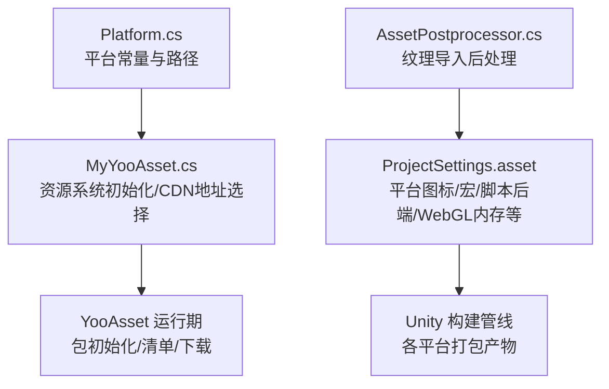
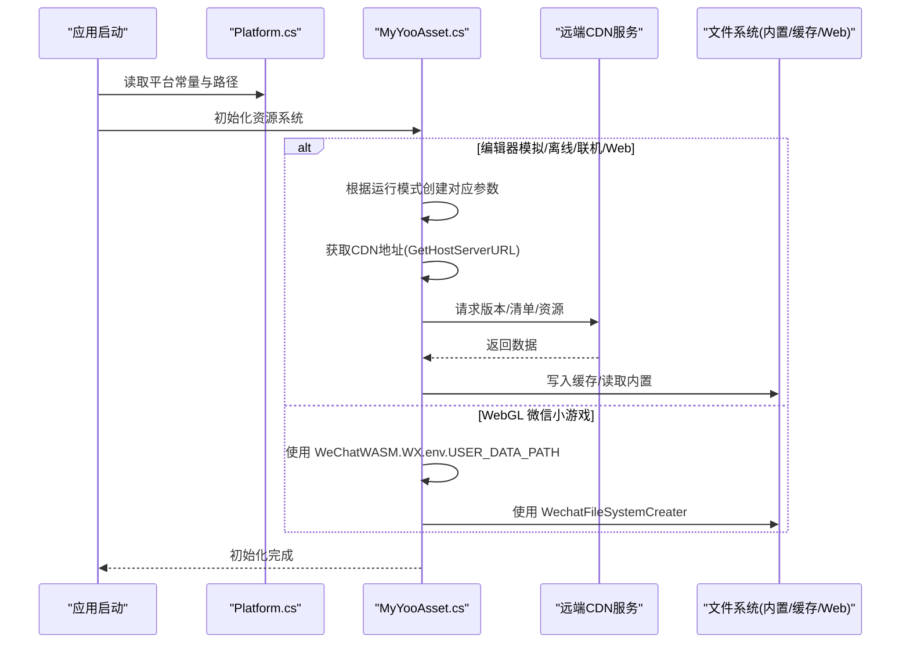
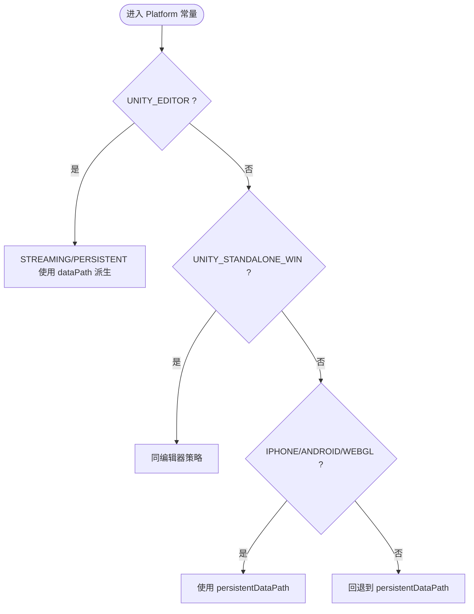
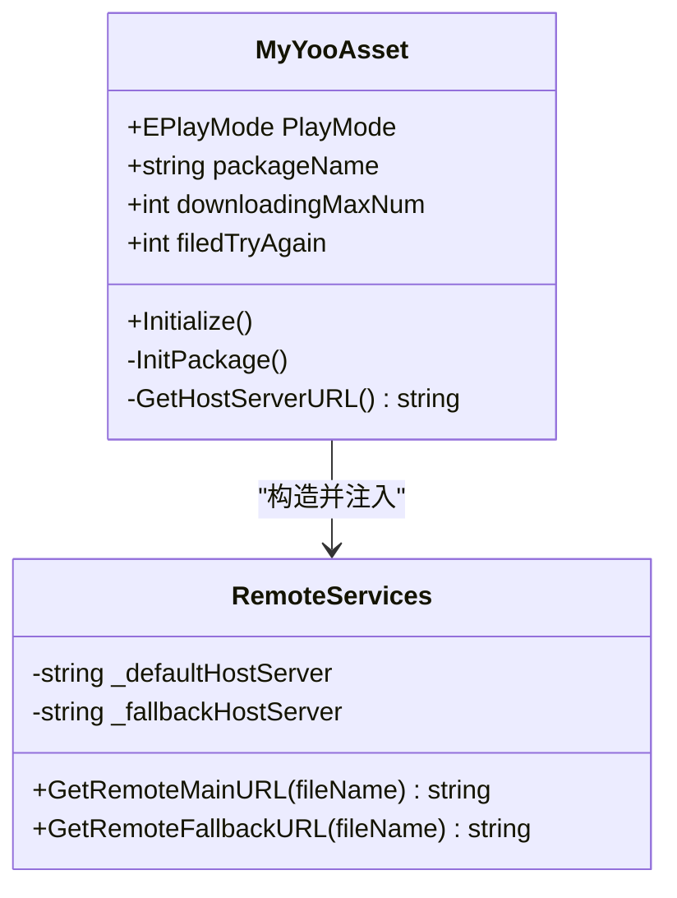
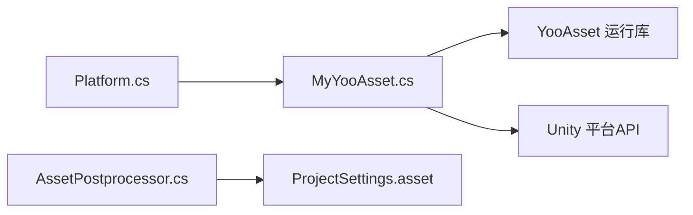

# 平台适配

<cite>
**本文引用的文件**   
- [Platform.cs](file://Assets/Game/Framework/Base/Platform.cs)
- [MyYooAsset.cs](file://Assets/Game/Scripts/MiniGame_Scripts/Utility/MyYooAsset.cs)
- [AssetPostprocessor.cs](file://Assets/Game/Framework/Base/Editor/AssetPostprocessor.cs)
- [ProjectSettings.asset](file://ProjectSettings/ProjectSettings.asset)
</cite>

## 目录
1. [简介](#简介)
2. [项目结构](#项目结构)
3. [核心组件](#核心组件)
4. [架构总览](#架构总览)
5. [详细组件分析](#详细组件分析)
6. [依赖关系分析](#依赖关系分析)
7. [性能与优化](#性能与优化)
8. [构建与发布配置](#构建与发布配置)
9. [常见问题与排错](#常见问题与排错)
10. [结论](#结论)

## 简介
本文件面向 SimulationClient Unity 项目的多平台适配，聚焦以下目标：
- 说明 Android、iOS、WebGL 等平台的特定配置差异
- 文档化 Platform.cs 的平台检测逻辑与条件编译使用方式
- 解释不同平台的资源加载差异与性能优化策略
- 汇总平台特定的构建参数与发布配置要点
- 提供跨平台开发最佳实践与注意事项
- 梳理平台适配过程中的兼容性问题与技术挑战

## 项目结构
本项目在“平台相关”能力上主要涉及以下位置：
- 运行时平台常量与路径选择：Assets/Game/Framework/Base/Platform.cs
- 资源系统初始化与远端地址选择（含 WebGL 特殊分支）：Assets/Game/Scripts/MiniGame_Scripts/Utility/MyYooAsset.cs
- 编辑器阶段纹理导入后处理（如 iOS ASTC 强制）：Assets/Game/Framework/Base/Editor/AssetPostprocessor.cs
- 全局平台相关设置（图标、脚本后端、WebGL 内存、宏定义等）：ProjectSettings/ProjectSettings.asset

图表来源
- [Platform.cs:19-40](file://Assets/Game/Framework/Base/Platform.cs#L19-L40)
- [MyYooAsset.cs:96-133](file://Assets/Game/Scripts/MiniGame_Scripts/Utility/MyYooAsset.cs#L96-L133)
- [AssetPostprocessor.cs:6-22](file://Assets/Game/Framework/Base/Editor/AssetPostprocessor.cs#L6-L22)
- [ProjectSettings.asset:831-848](file://ProjectSettings/ProjectSettings.asset#L831-L848)

章节来源
- [Platform.cs:19-40](file://Assets/Game/Framework/Base/Platform.cs#L19-L40)
- [MyYooAsset.cs:96-133](file://Assets/Game/Scripts/MiniGame_Scripts/Utility/MyYooAsset.cs#L96-L133)
- [AssetPostprocessor.cs:6-22](file://Assets/Game/Framework/Base/Editor/AssetPostprocessor.cs#L6-L22)
- [ProjectSettings.asset:831-848](file://ProjectSettings/ProjectSettings.asset#L831-L848)

## 核心组件
- 平台常量与路径选择器
  - 通过条件编译为不同平台提供 STREAMING_ASSETS_PATH 与 PERSISTENT_DATA_PATH 的默认值。
  - 编辑器与桌面平台使用 dataPath 下的持久化目录；移动端与 WebGL 使用 persistentDataPath。
- 资源系统与 CDN 地址选择
  - 根据编辑器当前 BuildTarget 或运行期 Application.platform 动态拼接 CDN 根路径，区分 Android/iOS/WebGL/PC。
  - 支持多种运行模式：编辑器模拟、离线内置、联机缓存、Web 服务器模式，并在 WebGL 下对微信小游戏环境做特殊处理。
- 纹理导入后处理
  - 在 MANAGE_IMPORT 宏开启时，自动将 iOS 纹理格式设置为 ASTC_6x6，确保移动端压缩格式一致。
- 项目级平台设置
  - 包含各平台图标、脚本后端、WebGL 内存与模块、宏定义等关键构建选项。

章节来源
- [Platform.cs:19-40](file://Assets/Game/Framework/Base/Platform.cs#L19-L40)
- [MyYooAsset.cs:151-173](file://Assets/Game/Scripts/MiniGame_Scripts/Utility/MyYooAsset.cs#L151-L173)
- [AssetPostprocessor.cs:6-22](file://Assets/Game/Framework/Base/Editor/AssetPostprocessor.cs#L6-L22)
- [ProjectSettings.asset:831-848](file://ProjectSettings/ProjectSettings.asset#L831-L848)

## 架构总览
下图展示了从平台检测到资源加载的关键流程，以及 WebGL 的特殊分支。

图表来源
- [MyYooAsset.cs:96-133](file://Assets/Game/Scripts/MiniGame_Scripts/Utility/MyYooAsset.cs#L96-L133)
- [MyYooAsset.cs:151-173](file://Assets/Game/Scripts/MiniGame_Scripts/Utility/MyYooAsset.cs#L151-L173)
- [Platform.cs:19-40](file://Assets/Game/Framework/Base/Platform.cs#L19-L40)

## 详细组件分析

### 平台检测与路径选择（Platform.cs）
- 设计要点
  - 使用 #if UNITY_EDITOR / UNITY_STANDALONE_WIN / UNITY_IPHONE / UNITY_ANDROID / UNITY_WEBGL 等宏进行编译期分支。
  - 统一暴露 STREAMING_ASSETS_PATH 与 PERSISTENT_DATA_PATH，屏蔽平台差异。
- 行为差异
  - 编辑器与 Windows 桌面：PERSISTENT_DATA_PATH 指向 dataPath 下的自定义子目录，便于本地调试与持久化。
  - 移动端与 WebGL：PERSISTENT_DATA_PATH 指向 persistentDataPath，符合平台沙箱规范。
- 扩展建议
  - 如需新增平台，可在现有分支中追加对应宏分支，保持接口一致性。

图表来源
- [Platform.cs:21-39](file://Assets/Game/Framework/Base/Platform.cs#L21-L39)

章节来源
- [Platform.cs:19-40](file://Assets/Game/Framework/Base/Platform.cs#L19-L40)

### 资源系统初始化与 CDN 地址选择（MyYooAsset.cs）
- 运行模式
  - 编辑器模拟模式：基于 EditorSimulateModeHelper 模拟构建结果，使用编辑器文件系统参数。
  - 离线模式：使用内置文件系统参数，适合无网络场景。
  - 联机模式：使用缓存文件系统参数，结合 IRemoteServices 访问远端。
  - Web 模式：默认使用 WebServerFileSystemParameters；当满足 UNITY_WEBGL && WEIXINMINIGAME 且非编辑器时，使用微信小游戏的用户数据目录与 WechatFileSystemCreater。
- CDN 地址选择
  - 编辑器环境下依据 EditorUserBuildSettings.activeBuildTarget 判断目标平台，拼接对应 CDN 路径。
  - 运行期依据 Application.platform 判断，分别返回 Android/iOS/WebGL/PC 的 CDN 根路径。
- 并发与容错
  - 设置 BundleLoadingMaxConcurrency 控制并发加载数。
  - 下载器支持失败重试次数与回调上报。

图表来源
- [MyYooAsset.cs:96-133](file://Assets/Game/Scripts/MiniGame_Scripts/Utility/MyYooAsset.cs#L96-L133)
- [MyYooAsset.cs:178-196](file://Assets/Game/Scripts/MiniGame_Scripts/Utility/MyYooAsset.cs#L178-L196)

章节来源
- [MyYooAsset.cs:96-133](file://Assets/Game/Scripts/MiniGame_Scripts/Utility/MyYooAsset.cs#L96-L133)
- [MyYooAsset.cs:151-173](file://Assets/Game/Scripts/MiniGame_Scripts/Utility/MyYooAsset.cs#L151-L173)
- [MyYooAsset.cs:178-196](file://Assets/Game/Scripts/MiniGame_Scripts/Utility/MyYooAsset.cs#L178-L196)

### 纹理导入后处理（AssetPostprocessor.cs）
- 功能概述
  - 在 OnPostprocessTexture 钩子中，若开启 MANAGE_IMPORT 宏，则强制 iOS 纹理格式为 ASTC_6x6，并标记 overridden，保证移动端压缩格式一致。
- 适用场景
  - 团队统一纹理压缩标准，减少人工检查成本。
- 注意事项
  - 该逻辑仅在编辑器阶段生效，不影响运行期。
  - 需确保目标平台已启用 ASTC 支持。

章节来源
- [AssetPostprocessor.cs:6-22](file://Assets/Game/Framework/Base/Editor/AssetPostprocessor.cs#L6-L22)

## 依赖关系分析
- 代码层依赖
  - MyYooAsset 依赖 YooAsset 运行库与平台 API（Application.platform、EditorUserBuildSettings）。
  - AssetPostprocessor 依赖 UnityEditor 与 TextureImporter。
  - Platform 仅依赖 UnityEngine 基础 API。
- 构建与配置依赖
  - ProjectSettings 中的 scriptingDefineSymbols 影响条件编译分支（例如 DOTWEEN 在各平台启用）。
  - WebGL 相关内存与模块设置影响最终产物大小与运行表现。

图表来源
- [Platform.cs:19-40](file://Assets/Game/Framework/Base/Platform.cs#L19-L40)
- [MyYooAsset.cs:96-133](file://Assets/Game/Scripts/MiniGame_Scripts/Utility/MyYooAsset.cs#L96-L133)
- [AssetPostprocessor.cs:6-22](file://Assets/Game/Framework/Base/Editor/AssetPostprocessor.cs#L6-L22)
- [ProjectSettings.asset:831-848](file://ProjectSettings/ProjectSettings.asset#L831-L848)

章节来源
- [ProjectSettings.asset:831-848](file://ProjectSettings/ProjectSettings.asset#L831-L848)

## 性能与优化
- 资源加载并发
  - 通过 BundleLoadingMaxConcurrency 控制并发加载数量，避免过多 IO 与解压导致卡顿。
- 下载与缓存
  - 合理设置最大下载数与失败重试次数，配合进度回调与错误回调提升用户体验。
- WebGL 内存与模块
  - 调整 webGLInitialMemorySize、webGLMaximumMemorySize、webGLThreadsSupport 等以平衡首屏与内存占用。
- 纹理压缩
  - 移动端优先使用 ASTC/ETC2 等硬件压缩格式，降低显存占用与带宽压力。
- 流式与分片
  - 利用 YooAsset 的包与清单机制，按需更新与增量下载，减少冷启动时间。

[本节为通用指导，不直接分析具体文件]

## 构建与发布配置
- 脚本后端
  - Android 使用 IL2CPP（scriptingBackend.Android=1），有助于性能与保护源码。
- 宏定义
  - 多平台启用 DOTWEEN 宏，确保动画系统可用。
- WebGL 专项
  - 可配置 webGLCompressionFormat、webGLThreadsSupport、webGLDecompressionFallback 等，按目标浏览器能力调优。
- 平台图标与分辨率
  - 已在 m_BuildTargetPlatformIcons 中配置 iPhone/Android 等多尺寸图标，确保上架与展示正确。

章节来源
- [ProjectSettings.asset:831-848](file://ProjectSettings/ProjectSettings.asset#L831-L848)
- [ProjectSettings.asset:290-489](file://ProjectSettings/ProjectSettings.asset#L290-L489)

## 常见问题与排错
- WebGL 微信小游戏环境
  - 现象：普通 Web 文件系统不可用或路径异常。
  - 排查：确认是否命中 UNITY_WEBGL && WEIXINMINIGAME 且非编辑器的分支，检查 USER_DATA_PATH 与 WechatFileSystemCreater 的使用。
  - 参考实现路径：[MyYooAsset.cs:118-133](file://Assets/Game/Scripts/MiniGame_Scripts/Utility/MyYooAsset.cs#L118-L133)
- 资源服务器地址不一致
  - 现象：编辑器与真机访问的 CDN 路径不同。
  - 排查：确认 GetHostServerURL 在编辑器与运行期的分支逻辑，核对 activeBuildTarget 与 Application.platform 的判断。
  - 参考实现路径：[MyYooAsset.cs:151-173](file://Assets/Game/Scripts/MiniGame_Scripts/Utility/MyYooAsset.cs#L151-L173)
- 移动端持久化路径读写失败
  - 现象：写入 persistentDataPath 报错或找不到文件。
  - 排查：确认平台分支是否正确，移动端应使用 persistentDataPath；编辑器/桌面可使用 dataPath 派生目录。
  - 参考实现路径：[Platform.cs:21-39](file://Assets/Game/Framework/Base/Platform.cs#L21-L39)
- iOS 纹理格式不符合预期
  - 现象：导出后纹理未采用 ASTC。
  - 排查：确认 MANAGE_IMPORT 宏是否开启，OnPostprocessTexture 是否执行成功。
  - 参考实现路径：[AssetPostprocessor.cs:6-22](file://Assets/Game/Framework/Base/Editor/AssetPostprocessor.cs#L6-L22)

章节来源
- [MyYooAsset.cs:118-133](file://Assets/Game/Scripts/MiniGame_Scripts/Utility/MyYooAsset.cs#L118-L133)
- [MyYooAsset.cs:151-173](file://Assets/Game/Scripts/MiniGame_Scripts/Utility/MyYooAsset.cs#L151-L173)
- [Platform.cs:21-39](file://Assets/Game/Framework/Base/Platform.cs#L21-L39)
- [AssetPostprocessor.cs:6-22](file://Assets/Game/Framework/Base/Editor/AssetPostprocessor.cs#L6-L22)

## 结论
- 本项目通过 Platform.cs 抽象了平台路径差异，通过 MyYooAsset.cs 实现了多运行模式与平台化的 CDN 地址选择，并通过 AssetPostprocessor.cs 统一了移动端纹理压缩策略。
- 在 ProjectSettings 中集中管理了脚本后端、宏定义与 WebGL 内存等关键构建参数，有利于跨平台一致性。
- 建议在后续迭代中：
  - 将平台常量与路径进一步解耦，提供更清晰的配置入口。
  - 完善 WebGL 多环境（普通浏览器/小程序/H5 小游戏）的差异化配置。
  - 引入更完善的日志与指标上报，辅助定位平台相关问题。