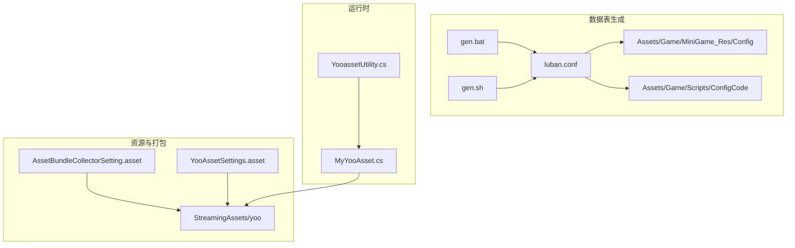
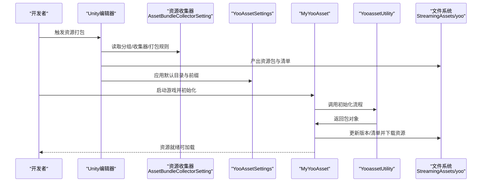
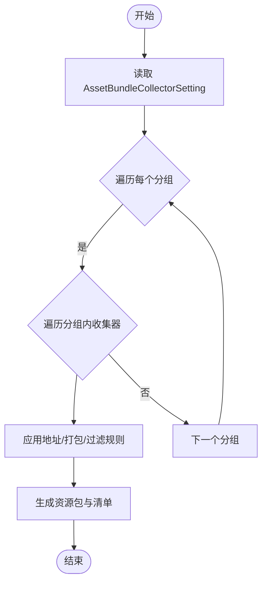
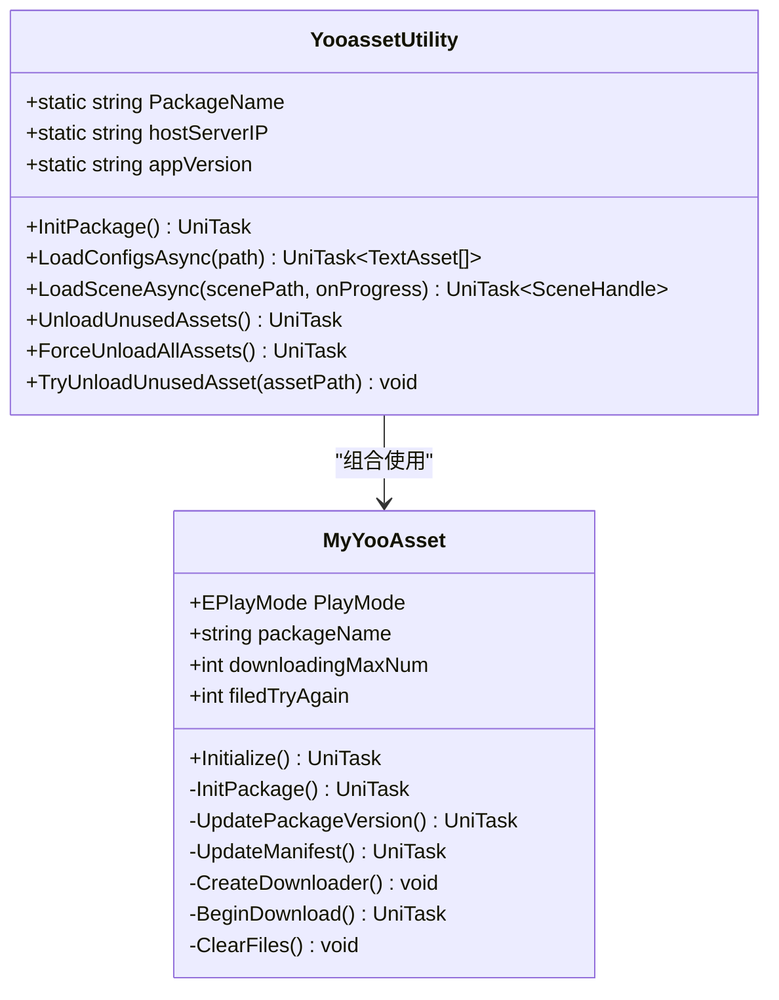
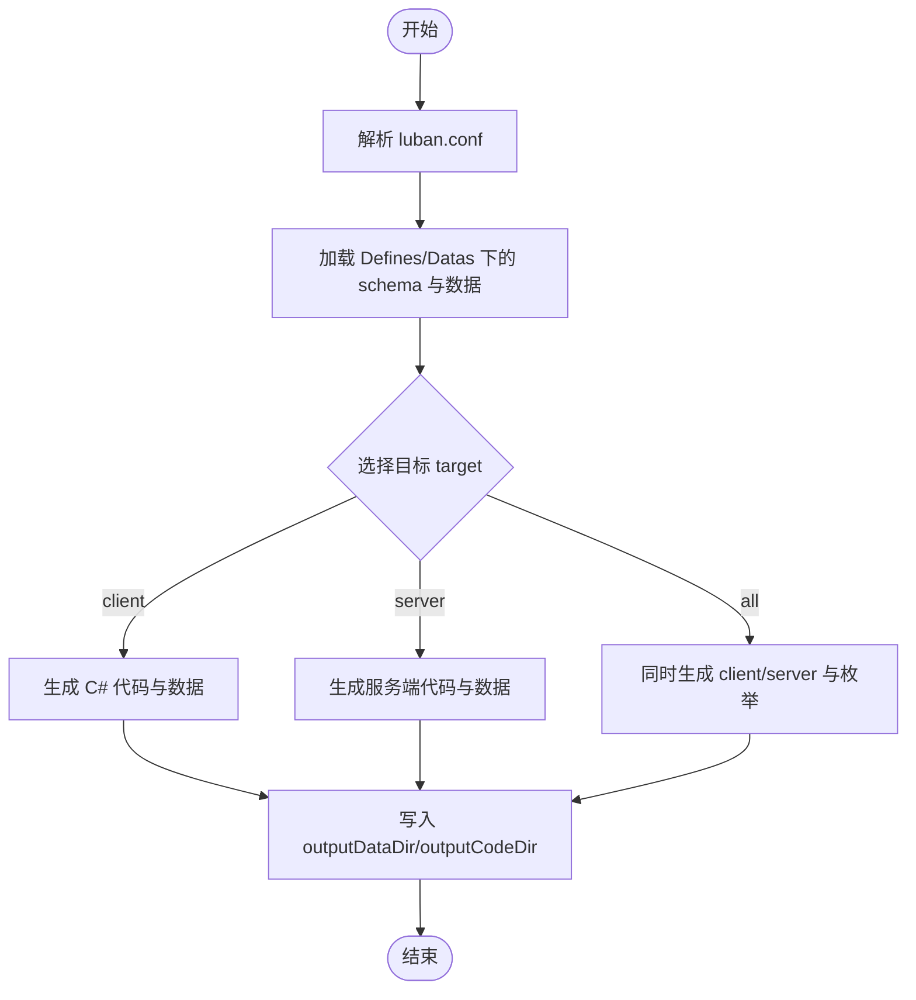
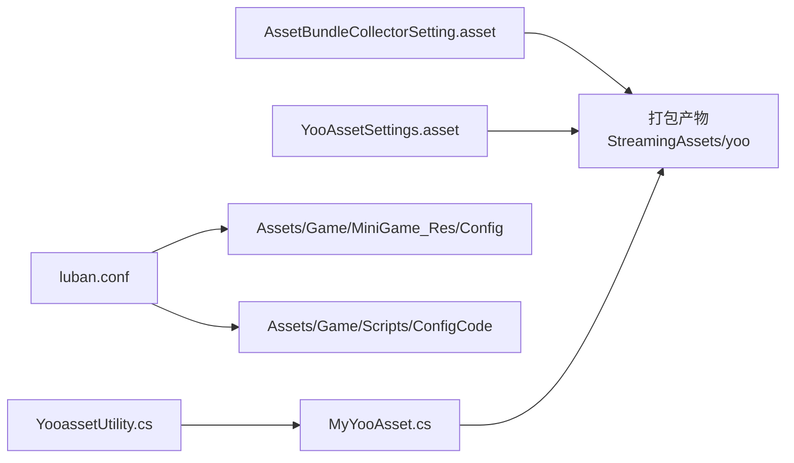

# 构建流程

<cite>
**本文引用的文件**   
- [AssetBundleCollectorSetting.asset](file://Assets/Game/Resources/AssetBundleCollectorSetting.asset)
- [YooAssetSettings.asset](file://Assets/Game/Resources/YooAssetSettings.asset)
- [luban.conf](file://LubanConfig\Template/luban.conf)
- [gen.bat](file://LubanConfig\Template/gen.bat)
- [gen.sh](file://LubanConfig\Template/gen.sh)
- [MyYooAsset.cs](file://Assets/Game/Scripts/MiniGame_Scripts/Utility/MyYooAsset.cs)
- [YooassetUtility.cs](file://Assets/Game/Scripts/MiniGame_Scripts/Utility/YooassetUtility.cs)
</cite>

## 目录
1. [简介](#简介)
2. [项目结构](#项目结构)
3. [核心组件](#核心组件)
4. [架构总览](#架构总览)
5. [详细组件分析](#详细组件分析)
6. [依赖关系分析](#依赖关系分析)
7. [性能考虑](#性能考虑)
8. [故障排查指南](#故障排查指南)
9. [结论](#结论)
10. [附录](#附录)

## 简介
本文件面向 SimulationClient 项目的构建与打包流程，重点覆盖以下方面：
- AssetBundleCollectorSetting.asset 的配置项与打包规则（资源分组、收集器配置、打包策略）
- YooAssetSettings.asset 的设置参数与资源包管理
- Luban 配置生成工具的命令行参数与模板配置
- 完整的构建脚本执行流程与自动化步骤
- 不同平台的构建差异与优化建议
- 常见错误定位与性能优化技巧

## 项目结构
本项目采用“资源按类型分组 + YooAsset 资源系统 + Luban 数据表代码生成”的构建体系。关键路径如下：
- 资源打包配置：Assets/Game/Resources/AssetBundleCollectorSetting.asset
- YooAsset 全局设置：Assets/Game/Resources/YooAssetSettings.asset
- 运行时资源加载入口：Assets/Game/Scripts/MiniGame_Scripts/Utility/MyYooAsset.cs、YooassetUtility.cs
- 数据表生成：LubanConfig\Template/luban.conf、gen.bat、gen.sh

图表来源
- [AssetBundleCollectorSetting.asset:1-114](file://Assets/Game/Resources/AssetBundleCollectorSetting.asset#L1-L114)
- [YooAssetSettings.asset:1-17](file://Assets/Game/Resources/YooAssetSettings.asset#L1-L17)
- [luban.conf:1-27](file://LubanConfig\Template/luban.conf#L1-L27)
- [gen.bat:1-12](file://LubanConfig\Template/gen.bat#L1-L12)
- [gen.sh:1-11](file://LubanConfig\Template/gen.sh#L1-L11)
- [MyYooAsset.cs:1-82](file://Assets/Game/Scripts/MiniGame_Scripts/Utility/MyYooAsset.cs#L1-L82)
- [YooassetUtility.cs:1-121](file://Assets/Game/Scripts/MiniGame_Scripts/Utility/YooassetUtility.cs#L1-L121)

章节来源
- [AssetBundleCollectorSetting.asset:1-114](file://Assets/Game/Resources/AssetBundleCollectorSetting.asset#L1-L114)
- [YooAssetSettings.asset:1-17](file://Assets/Game/Resources/YooAssetSettings.asset#L1-L17)
- [MyYooAsset.cs:1-82](file://Assets/Game/Scripts/MiniGame_Scripts/Utility/MyYooAsset.cs#L1-L82)
- [YooassetUtility.cs:1-121](file://Assets/Game/Scripts/MiniGame_Scripts/Utility/YooassetUtility.cs#L1-L121)

## 核心组件
- 资源收集与打包配置（AssetBundleCollectorSetting.asset）
  - 定义包名、地址规则、打包规则、过滤规则以及各资源组的收集路径与标签
- YooAsset 全局设置（YooAssetSettings.asset）
  - 指定默认输出目录与清单前缀，影响打包产物命名与存放位置
- 运行时资源初始化与下载（MyYooAsset.cs、YooassetUtility.cs）
  - 负责初始化 YooAsset、创建/获取包、更新版本与清单、并发下载、清理缓存等
- 数据表生成（luban.conf、gen.bat、gen.sh）
  - 通过 Luban 将 Excel 数据表转换为客户端/服务端代码与数据文件

章节来源
- [AssetBundleCollectorSetting.asset:1-114](file://Assets/Game/Resources/AssetBundleCollectorSetting.asset#L1-L114)
- [YooAssetSettings.asset:1-17](file://Assets/Game/Resources/YooAssetSettings.asset#L1-L17)
- [MyYooAsset.cs:1-82](file://Assets/Game/Scripts/MiniGame_Scripts/Utility/MyYooAsset.cs#L1-L82)
- [YooassetUtility.cs:1-121](file://Assets/Game/Scripts/MiniGame_Scripts/Utility/YooassetUtility.cs#L1-L121)
- [luban.conf:1-27](file://LubanConfig\Template/luban.conf#L1-L27)
- [gen.bat:1-12](file://LubanConfig\Template/gen.bat#L1-L12)
- [gen.sh:1-11](file://LubanConfig\Template/gen.sh#L1-L11)

## 架构总览
下图展示了从资源收集到运行期加载的整体流程，包括 YooAsset 的模拟模式与主机模式差异。

图表来源
- [AssetBundleCollectorSetting.asset:1-114](file://Assets/Game/Resources/AssetBundleCollectorSetting.asset#L1-L114)
- [YooAssetSettings.asset:1-17](file://Assets/Game/Resources/YooAssetSettings.asset#L1-L17)
- [MyYooAsset.cs:1-82](file://Assets/Game/Scripts/MiniGame_Scripts/Utility/MyYooAsset.cs#L1-L82)
- [YooassetUtility.cs:1-121](file://Assets/Game/Scripts/MiniGame_Scripts/Utility/YooassetUtility.cs#L1-L121)

## 详细组件分析

### 资源收集与打包配置（AssetBundleCollectorSetting.asset）
- 包级开关与行为
  - 显示包视图、编辑器别名、唯一包名、是否支持无扩展名地址、地址转小写、是否包含 GUID、自动收集着色器等
- 分组 Groups
  - Scene：场景资源，按目录打包，地址按文件名生成，过滤器为场景专用
  - UI：UI 预制体，按目录打包，地址按文件名生成，过滤器为全部
  - Texture：贴图资源，按目录打包，地址按文件名生成，过滤器为全部
  - Config：数据表源数据，按目录打包，地址按文件名生成，过滤器为全部
  - Other：ShaderVariants，使用专门的 ShaderVariants 打包规则与过滤器
  - Actor：角色与触发器 Prefab，分别两个收集器，均按目录打包，地址按文件名生成，带标签用于区分
- 收集器 Collectors
  - 每个收集器指定 CollectPath、CollectorType、AddressRuleName、PackRuleName、FilterRuleName、AssetTags 等
  - 常用规则：
    - AddressByFileName：以文件名作为地址
    - PackDirectory：按目录打包
    - PackShaderVariants：针对 ShaderVariants 的打包策略
    - FilterRuleName：CollectScene / CollectAll / CollectShaderVariants

图表来源
- [AssetBundleCollectorSetting.asset:1-114](file://Assets/Game/Resources/AssetBundleCollectorSetting.asset#L1-L114)

章节来源
- [AssetBundleCollectorSetting.asset:1-114](file://Assets/Game/Resources/AssetBundleCollectorSetting.asset#L1-L114)

### YooAsset 全局设置（YooAssetSettings.asset）
- DefaultYooFolderName：默认输出目录名称（如 yoo）
- PackageManifestPrefix：清单前缀（如 MiniGame1），影响清单与版本文件的命名

章节来源
- [YooAssetSettings.asset:1-17](file://Assets/Game/Resources/YooAssetSettings.asset#L1-L17)

### 运行时资源初始化与下载（MyYooAsset.cs、YooassetUtility.cs）
- MyYooAsset
  - 构造时接收 EPlayMode（HostPlayMode 或 EditorSimulateMode）
  - Initialize 流程：初始化 YooAssets、设置时间片、初始化包、更新版本、更新清单、创建下载器、开始下载、清理未使用缓存
  - 在编辑器模拟模式下，使用 EditorSimulateModeHelper.SimulateBuild 进行本地模拟构建
- YooassetUtility
  - 提供统一的包初始化与卸载接口
  - 封装 LoadConfigsAsync、LoadSceneAsync 等异步加载方法
  - 提供 UnloadUnusedAssets、ForceUnloadAllAssets、TryUnloadUnusedAsset 等释放接口

图表来源
- [MyYooAsset.cs:1-82](file://Assets/Game/Scripts/MiniGame_Scripts/Utility/MyYooAsset.cs#L1-L82)
- [YooassetUtility.cs:1-121](file://Assets/Game/Scripts/MiniGame_Scripts/Utility/YooassetUtility.cs#L1-L121)

章节来源
- [MyYooAsset.cs:1-82](file://Assets/Game/Scripts/MiniGame_Scripts/Utility/MyYooAsset.cs#L1-L82)
- [YooassetUtility.cs:1-121](file://Assets/Game/Scripts/MiniGame_Scripts/Utility/YooassetUtility.cs#L1-L121)

### Luban 配置生成工具（luban.conf、gen.bat、gen.sh）
- luban.conf
  - groups：定义 c/s/e 三组，默认启用
  - schemaFiles：Defines、Datas/__tables__.xlsx、__beans__.xlsx、__enums__.xlsx
  - dataDir：数据目录 Datas
  - targets：server/client/all 三个目标，manager 统一为 Tables，topModule 为 cfg
  - xargs：预留扩展参数
- gen.bat（Windows）
  - 设置工作区与 DLL 路径
  - 调用 dotnet 执行 Luban，目标 all，输出目录 bin，模板 cs-bin
  - 通过 --conf 指定配置文件
  - 通过 -x outputDataDir 与 -x outputCodeDir 指定数据与代码输出路径
- gen.sh（Linux/macOS）
  - 类似逻辑，但输出目录与模板可能不同（示例中为 json 与 output）

图表来源
- [luban.conf:1-27](file://LubanConfig\Template/luban.conf#L1-L27)
- [gen.bat:1-12](file://LubanConfig\Template/gen.bat#L1-L12)
- [gen.sh:1-11](file://LubanConfig\Template/gen.sh#L1-L11)

章节来源
- [luban.conf:1-27](file://LubanConfig\Template/luban.conf#L1-L27)
- [gen.bat:1-12](file://LubanConfig\Template/gen.bat#L1-L12)
- [gen.sh:1-11](file://LubanConfig\Template/gen.sh#L1-L11)

## 依赖关系分析
- 资源打包阶段
  - AssetBundleCollectorSetting.asset 决定资源如何被收集与打包
  - YooAssetSettings.asset 决定清单前缀与默认输出目录
- 数据表生成阶段
  - luban.conf 驱动 gen.bat/gen.sh 生成客户端与服务端代码及数据
- 运行阶段
  - YooassetUtility 与 MyYooAsset 协作完成包初始化、版本/清单更新、资源下载与释放

图表来源
- [AssetBundleCollectorSetting.asset:1-114](file://Assets/Game/Resources/AssetBundleCollectorSetting.asset#L1-L114)
- [YooAssetSettings.asset:1-17](file://Assets/Game/Resources/YooAssetSettings.asset#L1-L17)
- [luban.conf:1-27](file://LubanConfig\Template/luban.conf#L1-L27)
- [gen.bat:1-12](file://LubanConfig\Template/gen.bat#L1-L12)
- [gen.sh:1-11](file://LubanConfig\Template/gen.sh#L1-L11)
- [MyYooAsset.cs:1-82](file://Assets/Game/Scripts/MiniGame_Scripts/Utility/MyYooAsset.cs#L1-L82)
- [YooassetUtility.cs:1-121](file://Assets/Game/Scripts/MiniGame_Scripts/Utility/YooassetUtility.cs#L1-L121)

章节来源
- [AssetBundleCollectorSetting.asset:1-114](file://Assets/Game/Resources/AssetBundleCollectorSetting.asset#L1-L114)
- [YooAssetSettings.asset:1-17](file://Assets/Game/Resources/YooAssetSettings.asset#L1-L17)
- [MyYooAsset.cs:1-82](file://Assets/Game/Scripts/MiniGame_Scripts/Utility/MyYooAsset.cs#L1-L82)
- [YooassetUtility.cs:1-121](file://Assets/Game/Scripts/MiniGame_Scripts/Utility/YooassetUtility.cs#L1-L121)
- [luban.conf:1-27](file://LubanConfig\Template/luban.conf#L1-L27)
- [gen.bat:1-12](file://LubanConfig\Template/gen.bat#L1-L12)
- [gen.sh:1-11](file://LubanConfig\Template/gen.sh#L1-L11)

## 性能考虑
- 资源加载并发
  - 可通过设置最大并发加载数提升吞吐（参考 MyYooAsset 中的并发配置点）
- 清单与版本更新
  - 优先增量更新，避免全量拉取；在网络不佳时合理重试次数
- 资源释放
  - 切换场景后及时调用卸载接口，减少内存占用
- 打包粒度
  - 按目录打包有利于增量更新；对频繁变更的资源单独分包
- 平台差异
  - Android/iOS/WebGL 等平台的路径与网络策略不同，需根据平台调整下载与缓存策略

[本节为通用指导，不直接分析具体文件]

## 故障排查指南
- 清单或版本不一致
  - 检查 YooAssetSettings 的清单前缀与包名是否与运行时一致
  - 确认 StreamingAssets/yoo 下清单与版本文件是否存在且匹配
- 资源地址无效
  - 核对 AssetBundleCollectorSetting 的地址规则是否为 AddressByFileName，确保资源路径与地址一致
- 下载失败或超时
  - 检查 hostServerIP 与 appVersion 配置是否正确
  - 增大 downloadingMaxNum 或重试次数，观察日志定位瓶颈
- 数据表生成异常
  - 确认 luban.conf 的 schemaFiles 与 dataDir 路径正确
  - Windows 使用 gen.bat，Linux/macOS 使用 gen.sh，注意输出目录权限

章节来源
- [YooAssetSettings.asset:1-17](file://Assets/Game/Resources/YooAssetSettings.asset#L1-L17)
- [AssetBundleCollectorSetting.asset:1-114](file://Assets/Game/Resources/AssetBundleCollectorSetting.asset#L1-L114)
- [MyYooAsset.cs:1-82](file://Assets/Game/Scripts/MiniGame_Scripts/Utility/MyYooAsset.cs#L1-L82)
- [YooassetUtility.cs:1-121](file://Assets/Game/Scripts/MiniGame_Scripts/Utility/YooassetUtility.cs#L1-L121)
- [luban.conf:1-27](file://LubanConfig\Template/luban.conf#L1-L27)
- [gen.bat:1-12](file://LubanConfig\Template/gen.bat#L1-L12)
- [gen.sh:1-11](file://LubanConfig\Template/gen.sh#L1-L11)

## 结论
SimulationClient 的构建流程围绕“资源收集与打包 + 数据表生成 + 运行时资源加载”三大环节展开。通过合理的分组与打包策略、清晰的清单与版本管理、以及稳定的数据表生成管线，可实现高效的增量更新与良好的运行体验。建议在持续集成中固化上述脚本与配置，并结合平台特性进行差异化优化。

[本节为总结性内容，不直接分析具体文件]

## 附录

### 完整构建脚本执行流程（自动化步骤）
- 数据表生成
  - Windows：双击运行 gen.bat，依据 luban.conf 生成客户端/服务端代码与数据
  - Linux/macOS：执行 gen.sh，依据 luban.conf 生成对应目标
- Unity 资源打包
  - 在 Unity 编辑器中触发资源打包，读取 AssetBundleCollectorSetting 与 YooAssetSettings，产出清单与资源包至 StreamingAssets/yoo
- 运行期初始化
  - 启动游戏后，由 YooassetUtility 与 MyYooAsset 完成包初始化、版本/清单更新、资源下载与缓存清理

章节来源
- [gen.bat:1-12](file://LubanConfig\Template/gen.bat#L1-L12)
- [gen.sh:1-11](file://LubanConfig\Template/gen.sh#L1-L11)
- [luban.conf:1-27](file://LubanConfig\Template/luban.conf#L1-L27)
- [AssetBundleCollectorSetting.asset:1-114](file://Assets/Game/Resources/AssetBundleCollectorSetting.asset#L1-L114)
- [YooAssetSettings.asset:1-17](file://Assets/Game/Resources/YooAssetSettings.asset#L1-L17)
- [MyYooAsset.cs:1-82](file://Assets/Game/Scripts/MiniGame_Scripts/Utility/MyYooAsset.cs#L1-L82)
- [YooassetUtility.cs:1-121](file://Assets/Game/Scripts/MiniGame_Scripts/Utility/YooassetUtility.cs#L1-L121)