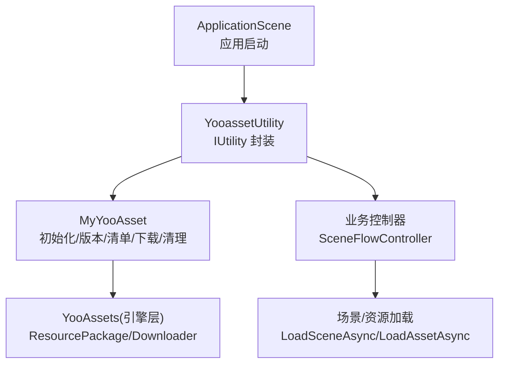
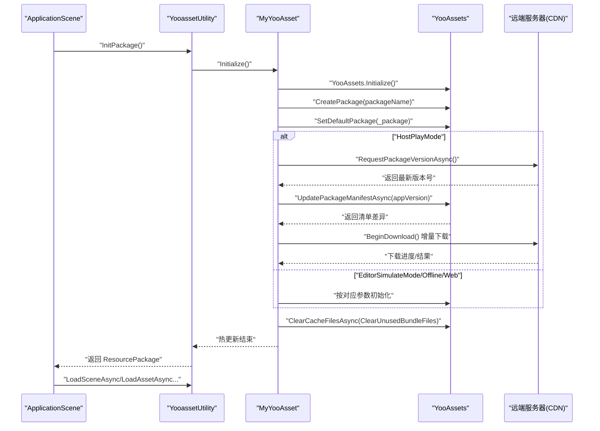
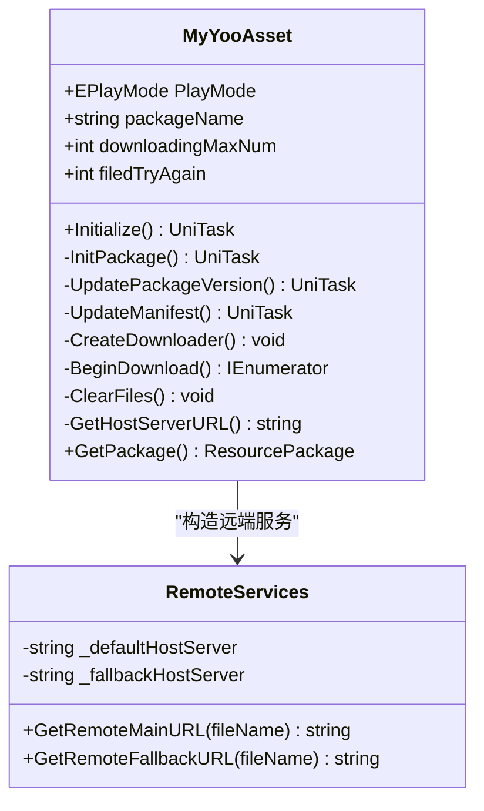
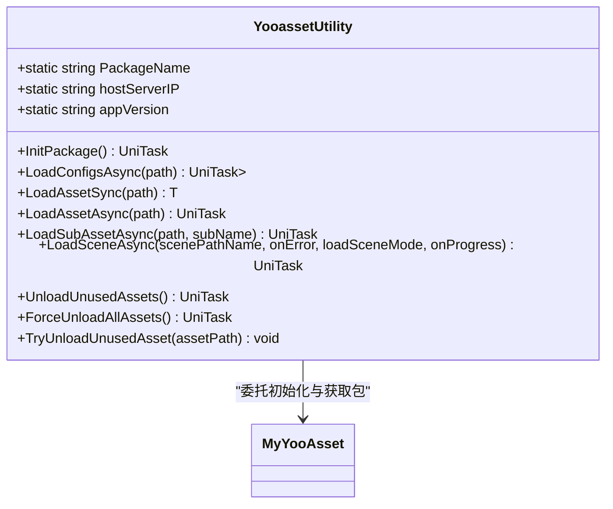
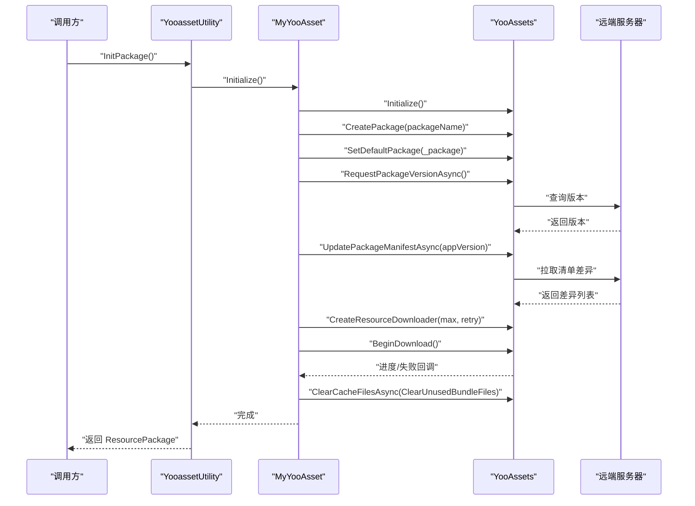
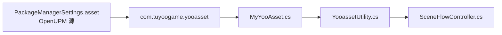

# 热更新方案

<cite>
**本文引用的文件**   
- [MyYooAsset.cs](file://Assets/Game/Scripts/MiniGame_Scripts/Utility/MyYooAsset.cs)
- [YooassetUtility.cs](file://Assets/Game/Scripts/MiniGame_Scripts/Utility/YooassetUtility.cs)
- [ApplicationScene.cs](file://Assets/Game/Scripts/ApplicationScene.cs)
- [YooAssetSettings.asset](file://Assets/Game/Resources/YooAssetSettings.asset)
- [PackageManagerSettings.asset](file://ProjectSettings/PackageManagerSettings.asset)
- [SceneFlowController.cs](file://Assets/Game/Scripts/MiniGame_Scripts/Controller/SceneFlowController.cs)
</cite>

## 目录
1. [简介](#简介)
2. [项目结构](#项目结构)
3. [核心组件](#核心组件)
4. [架构总览](#架构总览)
5. [详细组件分析](#详细组件分析)
6. [依赖关系分析](#依赖关系分析)
7. [性能与增量更新](#性能与增量更新)
8. [部署策略与CDN配置](#部署策略与cdn配置)
9. [回滚机制与兼容性处理](#回滚机制与兼容性处理)
10. [测试与验证方法](#测试与验证方法)
11. [故障排除指南](#故障排除指南)
12. [结论](#结论)

## 简介
本方案围绕 SimulationClient 项目的资源热更新，基于 YooAsset 构建“包版本管理 + 增量更新”的完整流程。通过 MyYooAsset 封装初始化、版本检查、清单拉取、下载器创建与清理等步骤；通过 YooassetUtility 对外提供统一的资源加载与释放接口，并作为 QFramework 的 IUtility 接入业务系统。文档同时覆盖部署策略、CDN 最佳实践、回滚与兼容策略，以及测试验证与常见问题排查。

## 项目结构
- 资源系统与热更新入口位于 MiniGame_Scripts/Utility 下：
  - MyYooAsset：实现 YooAsset 初始化、多运行模式适配、版本与清单更新、下载与缓存清理。
  - YooassetUtility：对上层暴露 Load/Release 统一 API，内部委托 MyYooAsset 完成初始化与获取 ResourcePackage。
- 运行时场景启动由 ApplicationScene 触发框架初始化，后续在 SceneFlowController 中执行加载流程（包含着色器预热、对象池生成、场景加载等）。
- YooAsset 工程级设置位于 Resources/YooAssetSettings.asset，定义默认 yoo 目录与包清单前缀。
- YooAsset 包管理器源注册于 ProjectSettings/PackageManagerSettings.asset，指向 OpenUPM 以安装 com.tuyoogame.yooasset。

图表来源
- [ApplicationScene.cs:1-36](file://Assets/Game/Scripts/ApplicationScene.cs#L1-L36)
- [YooassetUtility.cs:1-122](file://Assets/Game/Scripts/MiniGame_Scripts/Utility/YooassetUtility.cs#L1-L122)
- [MyYooAsset.cs:1-330](file://Assets/Game/Scripts/MiniGame_Scripts/Utility/MyYooAsset.cs#L1-L330)
- [SceneFlowController.cs:175-214](file://Assets/Game/Scripts/MiniGame_Scripts/Controller/SceneFlowController.cs#L175-L214)

章节来源
- [ApplicationScene.cs:1-36](file://Assets/Game/Scripts/ApplicationScene.cs#L1-L36)
- [YooAssetSettings.asset:1-16](file://Assets/Game/Resources/YooAssetSettings.asset#L1-L16)
- [PackageManagerSettings.asset:1-45](file://ProjectSettings/PackageManagerSettings.asset#L1-L45)

## 核心组件
- MyYooAsset
  - 负责 YooAssets 初始化、按运行模式初始化 ResourcePackage、请求包版本、更新清单、创建下载器、开始下载、清理未使用缓存、回调热更新结束。
  - 支持 EditorSimulateMode、OfflinePlayMode、HostPlayMode、WebPlayMode 多种运行模式，并在 HostPlayMode 下构造 RemoteServices 指定默认与备用远端地址。
- YooassetUtility
  - 作为 IUtility 暴露 InitPackage、LoadConfigsAsync、LoadAssetSync/Async、LoadSubAssetAsync、LoadSceneAsync、UnloadUnusedAssets、ForceUnloadAllAssets、TryUnloadUnusedAsset 等方法。
  - 内部持有 MyYooAsset 实例，调用其 Initialize 后获取 ResourcePackage 供上层使用。
- 工程配置
  - YooAssetSettings.asset：定义 DefaultYooFolderName 与 PackageManifestPrefix。
  - PackageManagerSettings.asset：OpenUPM 源注册 com.tuyoogame.yooasset。

章节来源
- [MyYooAsset.cs:1-330](file://Assets/Game/Scripts/MiniGame_Scripts/Utility/MyYooAsset.cs#L1-L330)
- [YooassetUtility.cs:1-122](file://Assets/Game/Scripts/MiniGame_Scripts/Utility/YooassetUtility.cs#L1-L122)
- [YooAssetSettings.asset:1-16](file://Assets/Game/Resources/YooAssetSettings.asset#L1-L16)
- [PackageManagerSettings.asset:1-45](file://ProjectSettings/PackageManagerSettings.asset#L1-L45)

## 架构总览
下图展示了从应用启动到资源热更新的端到端流程，包括运行模式选择、版本与清单更新、增量下载与缓存清理，以及上层资源的加载与释放。

图表来源
- [MyYooAsset.cs:36-62](file://Assets/Game/Scripts/MiniGame_Scripts/Utility/MyYooAsset.cs#L36-L62)
- [MyYooAsset.cs:66-146](file://Assets/Game/Scripts/MiniGame_Scripts/Utility/MyYooAsset.cs#L66-L146)
- [MyYooAsset.cs:213-248](file://Assets/Game/Scripts/MiniGame_Scripts/Utility/MyYooAsset.cs#L213-L248)
- [MyYooAsset.cs:251-322](file://Assets/Game/Scripts/MiniGame_Scripts/Utility/MyYooAsset.cs#L251-L322)
- [YooassetUtility.cs:27-31](file://Assets/Game/Scripts/MiniGame_Scripts/Utility/YooassetUtility.cs#L27-L31)

## 详细组件分析

### MyYooAsset 类分析
- 职责边界
  - 生命周期：Initialize 串联初始化、版本、清单、下载、清理。
  - 运行模式：根据 PlayMode 选择不同初始化参数，HostPlayMode 下构造 RemoteServices 指定默认与备用 URL。
  - 增量更新：通过 RequestPackageVersionAsync 与 UpdatePackageManifestAsync 获取差异，再使用 CreateResourceDownloader 进行增量下载。
  - 错误与进度：提供 DownloadErrorCallback 与 DownloadUpdateCallback 回调。
  - 缓存清理：ClearCacheFilesAsync(EFileClearMode.ClearUnusedBundleFiles)。
- 关键数据流
  - 版本号 -> 清单 -> 下载器 -> 下载 -> 清理 -> 完成回调。
- 复杂度与性能
  - 并发控制：BundleLoadingMaxConcurrency 与 downloadingMaxNum 影响吞吐与内存占用。
  - 时间片：SetOperationSystemMaxTimeSlice 控制每帧最大耗时，避免卡顿。

图表来源
- [MyYooAsset.cs:9-330](file://Assets/Game/Scripts/MiniGame_Scripts/Utility/MyYooAsset.cs#L9-L330)

章节来源
- [MyYooAsset.cs:36-62](file://Assets/Game/Scripts/MiniGame_Scripts/Utility/MyYooAsset.cs#L36-L62)
- [MyYooAsset.cs:66-146](file://Assets/Game/Scripts/MiniGame_Scripts/Utility/MyYooAsset.cs#L66-L146)
- [MyYooAsset.cs:151-173](file://Assets/Game/Scripts/MiniGame_Scripts/Utility/MyYooAsset.cs#L151-L173)
- [MyYooAsset.cs:178-196](file://Assets/Game/Scripts/MiniGame_Scripts/Utility/MyYooAsset.cs#L178-L196)
- [MyYooAsset.cs:213-248](file://Assets/Game/Scripts/MiniGame_Scripts/Utility/MyYooAsset.cs#L213-L248)
- [MyYooAsset.cs:251-322](file://Assets/Game/Scripts/MiniGame_Scripts/Utility/MyYooAsset.cs#L251-L322)

### YooassetUtility 类分析
- 职责边界
  - 作为 IUtility 被 QFramework 管理，提供 InitPackage 与资源加载/释放的统一入口。
  - 内部持有 MyYooAsset，调用 Initialize 后获取 ResourcePackage。
  - 提供 LoadConfigsAsync、LoadAssetSync/Async、LoadSubAssetAsync、LoadSceneAsync 等便捷方法。
  - 提供 UnloadUnusedAssets、ForceUnloadAllAssets、TryUnloadUnusedAsset 等释放方法。
- 典型用法
  - 启动阶段：调用 InitPackage 完成热更新与包初始化。
  - 加载阶段：通过 LoadSceneAsync/LoadAssetAsync 按需加载。
  - 释放阶段：切换场景或空闲时调用卸载接口。

图表来源
- [YooassetUtility.cs:12-122](file://Assets/Game/Scripts/MiniGame_Scripts/Utility/YooassetUtility.cs#L12-L122)

章节来源
- [YooassetUtility.cs:27-31](file://Assets/Game/Scripts/MiniGame_Scripts/Utility/YooassetUtility.cs#L27-L31)
- [YooassetUtility.cs:35-87](file://Assets/Game/Scripts/MiniGame_Scripts/Utility/YooassetUtility.cs#L35-L87)
- [YooassetUtility.cs:96-118](file://Assets/Game/Scripts/MiniGame_Scripts/Utility/YooassetUtility.cs#L96-L118)

### 热更新流程时序图（代码映射）

图表来源
- [MyYooAsset.cs:36-62](file://Assets/Game/Scripts/MiniGame_Scripts/Utility/MyYooAsset.cs#L36-L62)
- [MyYooAsset.cs:213-248](file://Assets/Game/Scripts/MiniGame_Scripts/Utility/MyYooAsset.cs#L213-L248)
- [MyYooAsset.cs:251-322](file://Assets/Game/Scripts/MiniGame_Scripts/Utility/MyYooAsset.cs#L251-L322)
- [YooassetUtility.cs:27-31](file://Assets/Game/Scripts/MiniGame_Scripts/Utility/YooassetUtility.cs#L27-L31)

## 依赖关系分析
- 外部依赖
  - YooAsset 包通过 OpenUPM 引入，源为 package.openupm.com，包名为 com.tuyoogame.yooasset。
- 内部依赖
  - YooassetUtility 依赖 MyYooAsset 完成初始化与包获取。
  - 业务控制器 SceneFlowController 通过 GetUtility<YooassetUtility>() 访问资源加载能力。
- 潜在耦合点
  - 包名与清单前缀需保持一致（PackageName 与 PackageManifestPrefix）。
  - 运行模式下远端地址拼接规则需与 CDN 目录结构一致。

图表来源
- [PackageManagerSettings.asset:30-37](file://ProjectSettings/PackageManagerSettings.asset#L30-L37)
- [YooassetUtility.cs:12-31](file://Assets/Game/Scripts/MiniGame_Scripts/Utility/YooassetUtility.cs#L12-L31)
- [SceneFlowController.cs:175-214](file://Assets/Game/Scripts/MiniGame_Scripts/Controller/SceneFlowController.cs#L175-L214)

章节来源
- [PackageManagerSettings.asset:1-45](file://ProjectSettings/PackageManagerSettings.asset#L1-L45)
- [YooassetUtility.cs:12-31](file://Assets/Game/Scripts/MiniGame_Scripts/Utility/YooassetUtility.cs#L12-L31)
- [SceneFlowController.cs:175-214](file://Assets/Game/Scripts/MiniGame_Scripts/Controller/SceneFlowController.cs#L175-L214)

## 性能与增量更新
- 并发与吞吐
  - BundleLoadingMaxConcurrency 与 downloadingMaxNum 共同决定加载与下载的并发度，建议根据平台与网络状况调优。
- 时间片控制
  - SetOperationSystemMaxTimeSlice 限制每帧最大操作时间，避免主线程阻塞导致卡顿。
- 增量更新
  - 通过 RequestPackageVersionAsync 与 UpdatePackageManifestAsync 获取差异，仅下载变更文件，显著降低带宽与时长。
- 缓存清理
  - ClearCacheFilesAsync(ClearUnusedBundleFiles) 定期清理未使用的 bundle，减少磁盘占用。

章节来源
- [MyYooAsset.cs:41-43](file://Assets/Game/Scripts/MiniGame_Scripts/Utility/MyYooAsset.cs#L41-L43)
- [MyYooAsset.cs:82-84](file://Assets/Game/Scripts/MiniGame_Scripts/Utility/MyYooAsset.cs#L82-L84)
- [MyYooAsset.cs:251-267](file://Assets/Game/Scripts/MiniGame_Scripts/Utility/MyYooAsset.cs#L251-L267)
- [MyYooAsset.cs:311-322](file://Assets/Game/Scripts/MiniGame_Scripts/Utility/MyYooAsset.cs#L311-L322)

## 部署策略与CDN配置
- 目录结构建议
  - 按平台与版本组织：/CDN/{Platform}/{appVersion}/...
  - 示例路径由 GetHostServerURL 拼接得到，确保与服务器实际目录一致。
- 默认与备用服务器
  - RemoteServices 支持 defaultHostServer 与 fallbackHostServer，可在主站不可用时自动降级。
- 清单与包根
  - YooAssetSettings.asset 中的 DefaultYooFolderName 与 PackageManifestPrefix 需与打包输出一致。
- 版本命名
  - appVersion 用于区分不同发布版本，建议语义化版本或带时间戳的版本号，便于回滚与灰度。

章节来源
- [MyYooAsset.cs:151-173](file://Assets/Game/Scripts/MiniGame_Scripts/Utility/MyYooAsset.cs#L151-L173)
- [MyYooAsset.cs:178-196](file://Assets/Game/Scripts/MiniGame_Scripts/Utility/MyYooAsset.cs#L178-L196)
- [YooAssetSettings.asset:1-16](file://Assets/Game/Resources/YooAssetSettings.asset#L1-L16)

## 回滚机制与兼容性处理
- 版本回滚
  - 通过 appVersion 控制目标版本，若新版本异常，可将 appVersion 回退至上一稳定版本，客户端将拉取旧版清单与资源。
- 清单兼容
  - 保持清单前缀与包名不变，避免历史客户端无法解析新清单。
- 资源兼容
  - 新增资源尽量采用向后兼容策略，避免破坏已有引用路径；必要时通过配置表路由到兼容路径。
- 服务端开关
  - 可结合业务配置在服务端下发强制回滚版本，客户端启动时优先读取该配置。

[本节为通用策略说明，不直接分析具体文件]

## 测试与验证方法
- 编辑器模拟模式
  - 使用 EditorSimulateMode 快速验证资源加载流程，无需真实 CDN。
- 单机离线模式
  - OfflinePlayMode 用于验证内置资源与本地缓存行为。
- 联机模式
  - HostPlayMode 配合本地 HTTP 服务器模拟 CDN，验证版本查询、清单差异与增量下载。
- 进度与错误回调
  - 利用 DownloadUpdateCallback 与 DownloadErrorCallback 观察下载状态与错误信息。
- 场景加载链路
  - 在 SceneFlowController 中集成 LoadSceneAsync，验证预热、对象池与场景切换。

章节来源
- [MyYooAsset.cs:77-84](file://Assets/Game/Scripts/MiniGame_Scripts/Utility/MyYooAsset.cs#L77-L84)
- [MyYooAsset.cs:291-307](file://Assets/Game/Scripts/MiniGame_Scripts/Utility/MyYooAsset.cs#L291-L307)
- [SceneFlowController.cs:175-214](file://Assets/Game/Scripts/MiniGame_Scripts/Controller/SceneFlowController.cs#L175-L214)

## 故障排除指南
- 初始化失败
  - 检查 InitPackage 的 InitializationOperation.Status 与 Error 日志，确认运行模式与文件系统参数是否正确。
- 版本/清单请求失败
  - 核对 GetHostServerURL 拼接路径是否与 CDN 目录一致；检查网络连通性与域名解析。
- 下载失败或中断
  - 调整 downloadingMaxNum 与 filedTryAgain；关注 DownloadErrorCallback 的错误信息。
- 资源加载为空或报错
  - 确认 path 是否为精确文件路径（LoadConfigsAsync 注释提示需传确定文件路径）；检查包名与清单前缀是否匹配。
- 内存与卡顿
  - 合理设置 BundleLoadingMaxConcurrency 与 SetOperationSystemMaxTimeSlice；及时调用 UnloadUnusedAssets/ForceUnloadAllAssets。

章节来源
- [MyYooAsset.cs:138-145](file://Assets/Game/Scripts/MiniGame_Scripts/Utility/MyYooAsset.cs#L138-L145)
- [MyYooAsset.cs:213-248](file://Assets/Game/Scripts/MiniGame_Scripts/Utility/MyYooAsset.cs#L213-L248)
- [MyYooAsset.cs:291-307](file://Assets/Game/Scripts/MiniGame_Scripts/Utility/MyYooAsset.cs#L291-L307)
- [YooassetUtility.cs:35-46](file://Assets/Game/Scripts/MiniGame_Scripts/Utility/YooassetUtility.cs#L35-L46)
- [YooassetUtility.cs:96-118](file://Assets/Game/Scripts/MiniGame_Scripts/Utility/YooassetUtility.cs#L96-L118)

## 结论
本项目通过 MyYooAsset 与 YooassetUtility 构建了清晰的 YooAsset 热更新体系：以包版本与清单为核心，实现增量更新与缓存管理；通过多运行模式适配与远端服务降级提升鲁棒性；结合合理的并发与时间片控制保障性能。配合规范的部署与回滚策略，可有效支撑持续迭代与稳定发布。