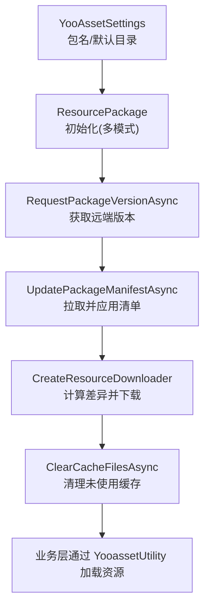
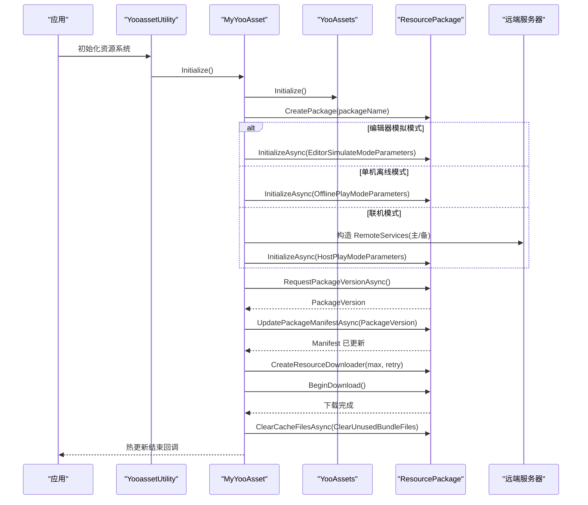
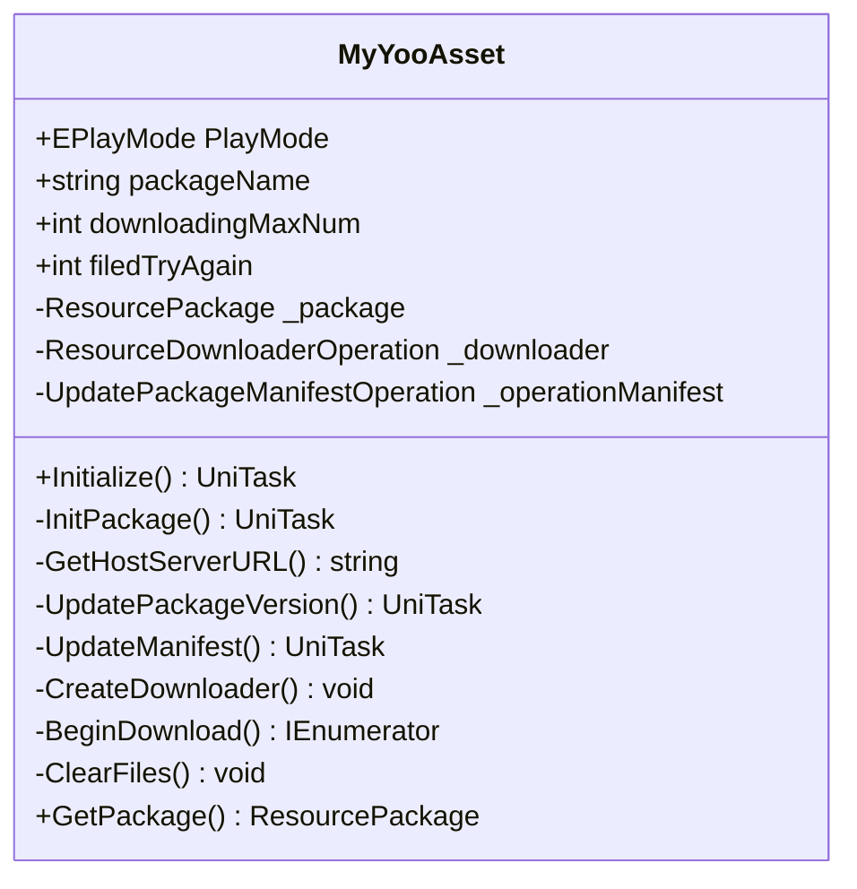
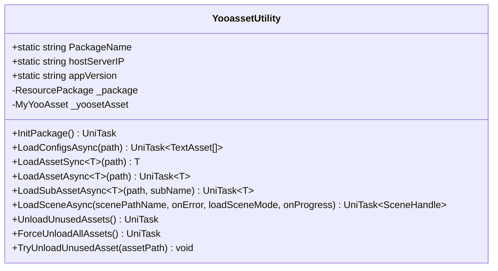
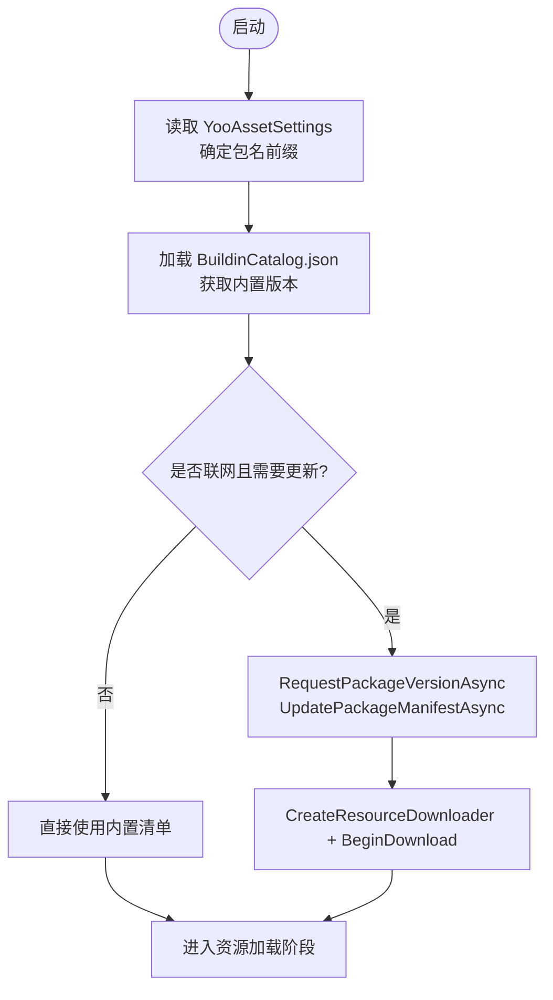
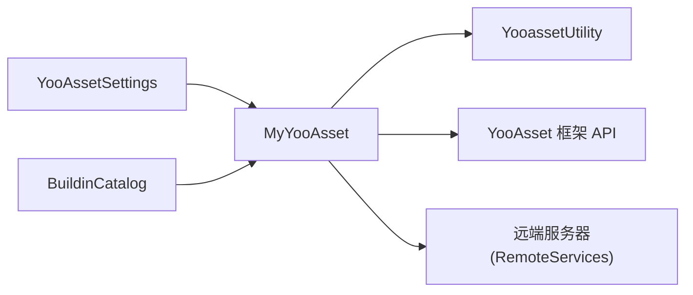

# 版本管理

<cite>
**本文引用的文件**
- [YooAssetSettings.asset](file://Assets/Game/Resources/YooAssetSettings.asset)
- [BuildinCatalog.json](file://Assets/StreamingAssets/yoo/MiniGame1/BuildinCatalog.json)
- [MyYooAsset.cs](file://Assets/Game/Scripts/MiniGame_Scripts/Utility/MyYooAsset.cs)
- [YooassetUtility.cs](file://Assets/Game/Scripts/MiniGame_Scripts/Utility/YooassetUtility.cs)
</cite>

## 目录
1. [简介](#简介)
2. [项目结构](#项目结构)
3. [核心组件](#核心组件)
4. [架构总览](#架构总览)
5. [详细组件分析](#详细组件分析)
6. [依赖分析](#依赖分析)
7. [性能考虑](#性能考虑)
8. [故障排查指南](#故障排查指南)
9. [结论](#结论)
10. [附录](#附录)

## 简介
本文件面向 SimulationClient 项目的资源与版本管理，重点说明：
- 游戏资源的版本控制策略与 Manifest 管理机制
- YooAsset 的版本号生成规则与版本升级流程
- 本地缓存与远程版本的同步策略
- 版本回退与兼容性检查的实现方法
- 版本发布的标准化流程与自动化脚本建议
- 版本冲突与数据迁移的处理方案

## 项目结构
本项目基于 YooAsset 进行资源打包、分发与热更新。关键位置如下：
- YooAsset 配置：Assets/Game/Resources/YooAssetSettings.asset
- 内置清单（Buildin Catalog）：Assets/StreamingAssets/yoo/MiniGame1/BuildinCatalog.json
- 运行时资源管理与热更新逻辑：Assets/Game/Scripts/MiniGame_Scripts/Utility/MyYooAsset.cs
- 资源加载与释放封装：Assets/Game/Scripts/MiniGame_Scripts/Utility/YooassetUtility.cs

图表来源
- [YooAssetSettings.asset:1-17](file://Assets/Game/Resources/YooAssetSettings.asset#L1-L17)
- [MyYooAsset.cs:66-146](file://Assets/Game/Scripts/MiniGame_Scripts/Utility/MyYooAsset.cs#L66-L146)
- [MyYooAsset.cs:212-247](file://Assets/Game/Scripts/MiniGame_Scripts/Utility/MyYooAsset.cs#L212-L247)
- [MyYooAsset.cs:250-322](file://Assets/Game/Scripts/MiniGame_Scripts/Utility/MyYooAsset.cs#L250-L322)
- [YooassetUtility.cs:27-31](file://Assets/Game/Scripts/MiniGame_Scripts/Utility/YooassetUtility.cs#L27-L31)

章节来源
- [YooAssetSettings.asset:1-17](file://Assets/Game/Resources/YooAssetSettings.asset#L1-L17)
- [BuildinCatalog.json:1-6](file://Assets/StreamingAssets/yoo/MiniGame1/BuildinCatalog.json#L1-L6)
- [MyYooAsset.cs:1-330](file://Assets/Game/Scripts/MiniGame_Scripts/Utility/MyYooAsset.cs#L1-L330)
- [YooassetUtility.cs:1-122](file://Assets/Game/Scripts/MiniGame_Scripts/Utility/YooassetUtility.cs#L1-L122)

## 核心组件
- YooAssetSettings：定义默认 Yoo 目录与包清单前缀（PackageName），用于构建期与运行期识别包标识。
- BuildinCatalog：内置清单，包含 FileVersion、PackageName、PackageVersion 等字段，作为离线或首次启动的基准版本。
- MyYooAsset：封装 YooAsset 初始化、版本请求、清单更新、下载器创建与下载、缓存清理等完整热更新流程。
- YooassetUtility：对外暴露统一的资源加载与释放接口，屏蔽底层 YooAsset 细节，便于业务调用。

章节来源
- [YooAssetSettings.asset:1-17](file://Assets/Game/Resources/YooAssetSettings.asset#L1-L17)
- [BuildinCatalog.json:1-6](file://Assets/StreamingAssets/yoo/MiniGame1/BuildinCatalog.json#L1-L6)
- [MyYooAsset.cs:36-62](file://Assets/Game/Scripts/MiniGame_Scripts/Utility/MyYooAsset.cs#L36-L62)
- [YooassetUtility.cs:12-31](file://Assets/Game/Scripts/MiniGame_Scripts/Utility/YooassetUtility.cs#L12-L31)

## 架构总览
下图展示了从启动到完成热更新的端到端流程，包括多平台服务器地址选择、版本比对与增量下载。

图表来源
- [MyYooAsset.cs:66-146](file://Assets/Game/Scripts/MiniGame_Scripts/Utility/MyYooAsset.cs#L66-L146)
- [MyYooAsset.cs:212-247](file://Assets/Game/Scripts/MiniGame_Scripts/Utility/MyYooAsset.cs#L212-L247)
- [MyYooAsset.cs:250-322](file://Assets/Game/Scripts/MiniGame_Scripts/Utility/MyYooAsset.cs#L250-L322)
- [YooassetUtility.cs:27-31](file://Assets/Game/Scripts/MiniGame_Scripts/Utility/YooassetUtility.cs#L27-L31)

## 详细组件分析

### 组件A：MyYooAsset（热更新核心）
职责
- 根据运行模式初始化 ResourcePackage（编辑器模拟、离线、主机/WebGL）
- 查询远端版本并更新清单
- 创建下载器并执行增量下载
- 清理未使用的缓存文件，触发“热更新结束”回调

关键实现要点
- 多模式初始化：在 InitPackage 中按 PlayMode 分支设置不同的参数对象与文件系统参数。
- 版本与清单：通过 RequestPackageVersionAsync 获取远端版本号，再调用 UpdatePackageManifestAsync 拉取并应用清单。
- 下载与重试：CreateResourceDownloader 支持并发数与失败重试；BeginDownload 提供进度与错误回调。
- 缓存清理：ClearCacheFilesAsync 使用 ClearUnusedBundleFiles 策略，避免残留占用。

图表来源
- [MyYooAsset.cs:9-34](file://Assets/Game/Scripts/MiniGame_Scripts/Utility/MyYooAsset.cs#L9-L34)
- [MyYooAsset.cs:66-146](file://Assets/Game/Scripts/MiniGame_Scripts/Utility/MyYooAsset.cs#L66-L146)
- [MyYooAsset.cs:212-247](file://Assets/Game/Scripts/MiniGame_Scripts/Utility/MyYooAsset.cs#L212-L247)
- [MyYooAsset.cs:250-322](file://Assets/Game/Scripts/MiniGame_Scripts/Utility/MyYooAsset.cs#L250-L322)

章节来源
- [MyYooAsset.cs:1-330](file://Assets/Game/Scripts/MiniGame_Scripts/Utility/MyYooAsset.cs#L1-L330)

### 组件B：YooassetUtility（资源访问封装）
职责
- 统一入口：InitPackage 委托给 MyYooAsset 完成初始化
- 资源加载：提供异步/同步加载场景、资源、子资源与批量配置的方法
- 资源释放：提供卸载未引用资源、强制卸载全部资源、尝试卸载指定资源等方法

图表来源
- [YooassetUtility.cs:12-31](file://Assets/Game/Scripts/MiniGame_Scripts/Utility/YooassetUtility.cs#L12-L31)
- [YooassetUtility.cs:33-88](file://Assets/Game/Scripts/MiniGame_Scripts/Utility/YooassetUtility.cs#L33-L88)
- [YooassetUtility.cs:92-121](file://Assets/Game/Scripts/MiniGame_Scripts/Utility/YooassetUtility.cs#L92-L121)

章节来源
- [YooassetUtility.cs:1-122](file://Assets/Game/Scripts/MiniGame_Scripts/Utility/YooassetUtility.cs#L1-L122)

### 组件C：YooAssetSettings 与 BuildinCatalog（清单与包元信息）
- YooAssetSettings：定义 DefaultYooFolderName 与 PackageManifestPrefix，决定清单与包的命名前缀。
- BuildinCatalog：内置清单 JSON，包含 FileVersion、PackageName、PackageVersion 等关键字段，作为离线/首次运行的基准。

图表来源
- [YooAssetSettings.asset:1-17](file://Assets/Game/Resources/YooAssetSettings.asset#L1-L17)
- [BuildinCatalog.json:1-6](file://Assets/StreamingAssets/yoo/MiniGame1/BuildinCatalog.json#L1-L6)
- [MyYooAsset.cs:212-247](file://Assets/Game/Scripts/MiniGame_Scripts/Utility/MyYooAsset.cs#L212-L247)
- [MyYooAsset.cs:250-322](file://Assets/Game/Scripts/MiniGame_Scripts/Utility/MyYooAsset.cs#L250-L322)

章节来源
- [YooAssetSettings.asset:1-17](file://Assets/Game/Resources/YooAssetSettings.asset#L1-L17)
- [BuildinCatalog.json:1-6](file://Assets/StreamingAssets/yoo/MiniGame1/BuildinCatalog.json#L1-L6)

## 依赖分析
- 模块耦合
  - YooassetUtility 依赖 MyYooAsset 完成初始化与包实例获取
  - MyYooAsset 依赖 YooAsset 框架 API（ResourcePackage、操作类、下载器等）
  - 配置依赖 YooAssetSettings 与 BuildinCatalog 提供的包名与内置版本
- 外部集成点
  - 远端服务器地址由 GetHostServerURL 根据平台动态拼接
  - 下载器与清单更新均通过 YooAsset 内部操作完成

图表来源
- [YooAssetSettings.asset:1-17](file://Assets/Game/Resources/YooAssetSettings.asset#L1-L17)
- [BuildinCatalog.json:1-6](file://Assets/StreamingAssets/yoo/MiniGame1/BuildinCatalog.json#L1-L6)
- [MyYooAsset.cs:151-173](file://Assets/Game/Scripts/MiniGame_Scripts/Utility/MyYooAsset.cs#L151-L173)
- [YooassetUtility.cs:27-31](file://Assets/Game/Scripts/MiniGame_Scripts/Utility/YooassetUtility.cs#L27-L31)

章节来源
- [MyYooAsset.cs:151-173](file://Assets/Game/Scripts/MiniGame_Scripts/Utility/MyYooAsset.cs#L151-L173)
- [YooassetUtility.cs:27-31](file://Assets/Game/Scripts/MiniGame_Scripts/Utility/YooassetUtility.cs#L27-L31)

## 性能考虑
- 并发与超时
  - BundleLoadingMaxConcurrency 控制最大并发加载数，需结合设备能力调优
  - UpdatePackageManifestAsync 可传入超时参数，避免长时间阻塞
- 下载策略
  - 合理设置 downloadingMaxNum 与 filedTryAgain，平衡速度与稳定性
  - 下载前检测磁盘空间，避免中断导致状态不一致
- 内存与缓存
  - 定期调用 UnloadUnusedAssets 或 ForceUnloadAllAssets 控制内存峰值
  - 使用 ClearUnusedBundleFiles 清理无用缓存，减少体积膨胀

[本节为通用指导，不直接分析具体文件]

## 故障排查指南
常见问题与定位思路
- 初始化失败
  - 检查各模式的 InitializationOperation.Status 与 Error 日志
  - 确认 RemoteServices 的主/备地址可达
- 清单更新失败
  - 核对 RequestPackageVersionAsync 返回的 PackageVersion 是否与远端一致
  - 检查网络权限与代理设置
- 下载失败或中断
  - 关注 DownloadErrorCallback 中的 FileName 与 ErrorInfo
  - 提升重试次数或降低并发，观察是否稳定
- 资源加载异常
  - 确认路径与包名匹配，必要时使用 TryUnloadUnusedAsset 清理后重试
  - 切换场景后及时调用 UnloadUnusedAssets

章节来源
- [MyYooAsset.cs:137-146](file://Assets/Game/Scripts/MiniGame_Scripts/Utility/MyYooAsset.cs#L137-L146)
- [MyYooAsset.cs:212-247](file://Assets/Game/Scripts/MiniGame_Scripts/Utility/MyYooAsset.cs#L212-L247)
- [MyYooAsset.cs:290-307](file://Assets/Game/Scripts/MiniGame_Scripts/Utility/MyYooAsset.cs#L290-L307)
- [YooassetUtility.cs:92-121](file://Assets/Game/Scripts/MiniGame_Scripts/Utility/YooassetUtility.cs#L92-L121)

## 结论
本项目以 YooAsset 为核心，通过清晰的初始化—版本—清单—下载—清理流程实现了稳定的资源版本管理与热更新。配合 YooassetUtility 的统一封装，业务侧可以便捷地加载与释放资源。建议在发布流程中引入自动化脚本，确保清单与版本一致性，并在服务端做好兼容性与回滚策略。

[本节为总结性内容，不直接分析具体文件]

## 附录

### 版本号生成规则与清单字段
- 内置清单字段（BuildinCatalog.json）
  - FileVersion：清单自身版本
  - PackageName：包名
  - PackageVersion：该次构建的资源包版本
- 运行时版本
  - 通过 RequestPackageVersionAsync 获取远端最新版本
  - 若与本地不一致，则通过 UpdatePackageManifestAsync 拉取并应用新清单

章节来源
- [BuildinCatalog.json:1-6](file://Assets/StreamingAssets/yoo/MiniGame1/BuildinCatalog.json#L1-L6)
- [MyYooAsset.cs:212-247](file://Assets/Game/Scripts/MiniGame_Scripts/Utility/MyYooAsset.cs#L212-L247)

### 本地缓存与远程版本同步策略
- 同步顺序
  - 先请求远端版本，再更新清单，最后创建下载器进行增量下载
- 缓存策略
  - 使用 ClearUnusedBundleFiles 清理未被引用的 bundle 文件，避免冗余
- 平台差异化
  - 根据平台动态拼接远端根路径，保证不同平台资源隔离

章节来源
- [MyYooAsset.cs:66-146](file://Assets/Game/Scripts/MiniGame_Scripts/Utility/MyYooAsset.cs#L66-L146)
- [MyYooAsset.cs:250-322](file://Assets/Game/Scripts/MiniGame_Scripts/Utility/MyYooAsset.cs#L250-L322)

### 版本回退与兼容性检查
- 回退策略
  - 当 UpdatePackageManifestAsync 失败时，保持并使用内置清单（BuildinCatalog）继续运行
  - 可在业务层记录最近成功版本，出现异常时主动降级至上一版本
- 兼容性检查
  - 对比 FileVersion 与客户端期望的最小版本，不满足则提示更新
  - 对破坏性变更（如资源路径/命名变化）在服务端维护迁移表，客户端在首次启动时执行迁移

[本节为通用方案建议，不直接分析具体文件]

### 版本发布标准化流程与自动化脚本建议
- 构建与打包
  - 使用 YooAsset 构建工具生成清单与资源包，输出到对应平台的 CDN 目录
- 清单校验
  - 校验 BuildinCatalog 的 PackageVersion 与远端最新一致
  - 校验清单完整性（MD5/SHA）与签名
- 自动化脚本
  - 构建完成后自动上传清单与资源包
  - 生成发布日志与变更摘要，推送通知
  - 灰度发布：先对小比例用户生效，监控错误率后再全量

[本节为通用流程建议，不直接分析具体文件]

### 版本冲突与数据迁移处理方案
- 冲突检测
  - 客户端启动时比较本地清单版本与远端版本，发现冲突则走增量更新流程
- 数据迁移
  - 针对破坏性变更，提供迁移脚本或数据转换工具
  - 迁移失败时保留旧数据并允许回滚，保障用户体验

[本节为通用方案建议，不直接分析具体文件]