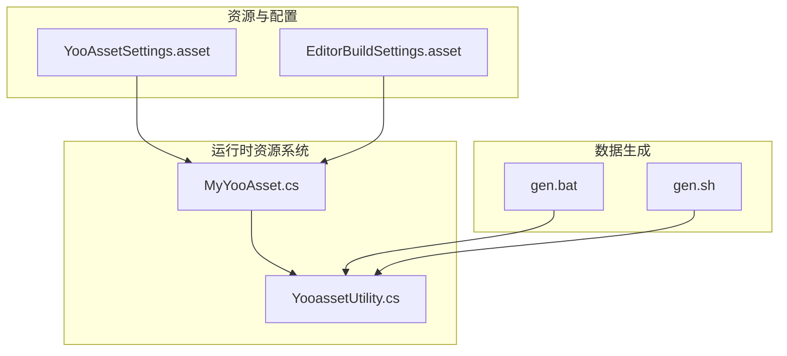
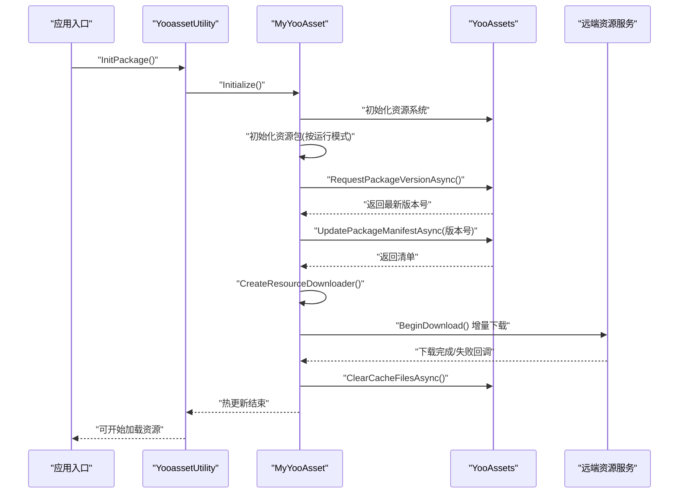
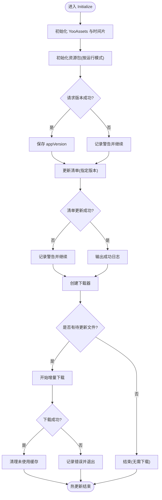
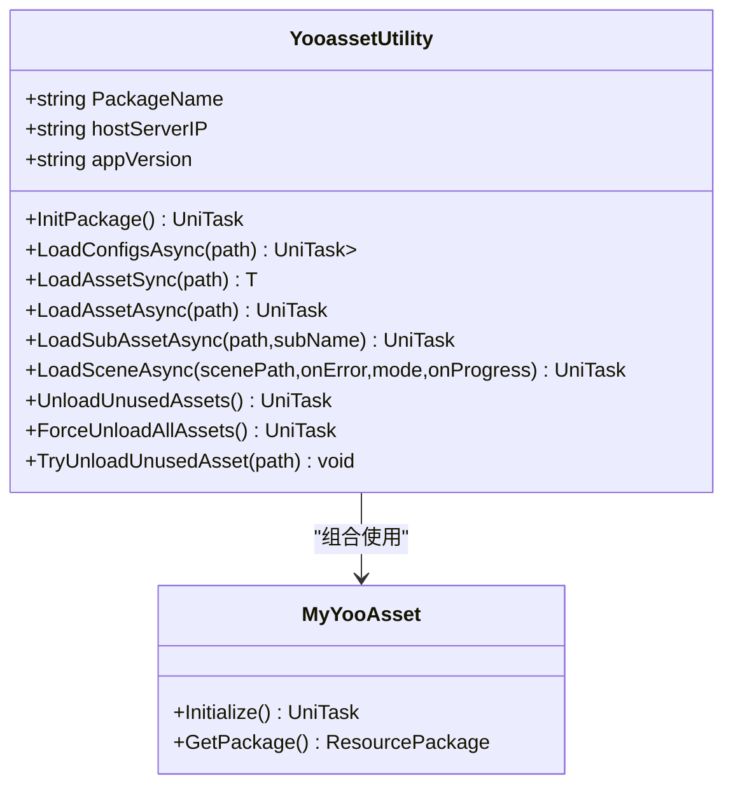
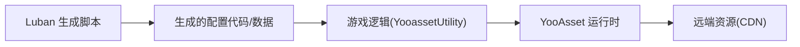

# 部署发布

<cite>
**本文引用的文件**   
- [MyYooAsset.cs](file://Assets/Game/Scripts/MiniGame_Scripts/Utility/MyYooAsset.cs)
- [YooassetUtility.cs](file://Assets/Game/Scripts/MiniGame_Scripts/Utility/YooassetUtility.cs)
- [YooAssetSettings.asset](file://Assets/Game/Resources/YooAssetSettings.asset)
- [EditorBuildSettings.asset](file://ProjectSettings/EditorBuildSettings.asset)
- [gen.bat](file://LubanConfig\Template/gen.bat)
- [gen.sh](file://LubanConfig\Template/gen.sh)
</cite>

## 目录
1. [简介](#简介)
2. [项目结构](#项目结构)
3. [核心组件](#核心组件)
4. [架构总览](#架构总览)
5. [详细组件分析](#详细组件分析)
6. [依赖分析](#依赖分析)
7. [性能考虑](#性能考虑)
8. [故障排除指南](#故障排除指南)
9. [结论](#结论)
10. [附录](#附录)

## 简介
本文件面向 SimulationClient 项目的构建、打包与发布流程，重点覆盖以下主题：
- 构建流程配置与优化（资源打包、平台适配、版本管理）
- 热更新方案实现（增量更新、回滚机制、兼容性处理）
- 不同平台的构建要求与特殊配置
- 自动化构建脚本与 CI/CD 集成最佳实践
- 资源包部署策略与 CDN 配置
- 性能优化建议与内存管理技巧
- 常见问题与排障方法

本项目基于 Unity + YooAsset 资源系统，使用 Luban 生成配置代码，采用多运行模式（编辑器模拟、离线内置、联机远端、WebGL）进行资源加载与热更。

## 项目结构
关键目录与职责：
- Assets/Game/Resources/YooAssetSettings.asset：YooAsset 全局设置（默认包名前缀、yoo 根目录等）
- Assets/Game/Scripts/MiniGame_Scripts/Utility/*：资源系统与热更封装（YooassetUtility、MyYooAsset）
- ProjectSettings/EditorBuildSettings.asset：Unity 场景清单与输入动作配置
- LubanConfig/Template/*：数据表模板与代码生成脚本（Windows/Linux）

图表来源
- [YooAssetSettings.asset:1-17](file://Assets/Game/Resources/YooAssetSettings.asset#L1-L17)
- [EditorBuildSettings.asset:1-17](file://ProjectSettings/EditorBuildSettings.asset#L1-L17)
- [MyYooAsset.cs:1-330](file://Assets/Game/Scripts/MiniGame_Scripts/Utility/MyYooAsset.cs#L1-L330)
- [YooassetUtility.cs:1-122](file://Assets/Game/Scripts/MiniGame_Scripts/Utility/YooassetUtility.cs#L1-L122)
- [gen.bat:1-12](file://LubanConfig\Template/gen.bat#L1-L12)
- [gen.sh:1-11](file://LubanConfig\Template/gen.sh#L1-L11)

章节来源
- [YooAssetSettings.asset:1-17](file://Assets/Game/Resources/YooAssetSettings.asset#L1-L17)
- [EditorBuildSettings.asset:1-17](file://ProjectSettings/EditorBuildSettings.asset#L1-L17)
- [MyYooAsset.cs:1-330](file://Assets/Game/Scripts/MiniGame_Scripts/Utility/MyYooAsset.cs#L1-L330)
- [YooassetUtility.cs:1-122](file://Assets/Game/Scripts/MiniGame_Scripts/Utility/YooassetUtility.cs#L1-L122)
- [gen.bat:1-12](file://LubanConfig\Template/gen.bat#L1-L12)
- [gen.sh:1-11](file://LubanConfig\Template/gen.sh#L1-L11)

## 核心组件
- YooAssetSettings：定义 yoo 根目录与包清单前缀，用于统一资源包命名与路径组织。
- MyYooAsset：封装 YooAsset 初始化、版本检查、清单更新、下载器创建与下载、缓存清理等完整热更流程；支持多运行模式与平台差异化服务器地址拼接。
- YooassetUtility：对外暴露统一的资源加载与释放接口（异步/同步），并封装场景加载与批量卸载逻辑。
- EditorBuildSettings：维护参与构建的场景列表，影响首次启动或场景切换时的资源依赖范围。
- Luban 生成脚本：根据配置生成 C# 代码与数据文件，供游戏运行时读取配置。

章节来源
- [YooAssetSettings.asset:1-17](file://Assets/Game/Resources/YooAssetSettings.asset#L1-L17)
- [MyYooAsset.cs:1-330](file://Assets/Game/Scripts/MiniGame_Scripts/Utility/MyYooAsset.cs#L1-L330)
- [YooassetUtility.cs:1-122](file://Assets/Game/Scripts/MiniGame_Scripts/Utility/YooassetUtility.cs#L1-L122)
- [EditorBuildSettings.asset:1-17](file://ProjectSettings/EditorBuildSettings.asset#L1-L17)
- [gen.bat:1-12](file://LubanConfig\Template/gen.bat#L1-L12)
- [gen.sh:1-11](file://LubanConfig\Template/gen.sh#L1-L11)

## 架构总览
下图展示从应用启动到资源热更的端到端流程，包括多运行模式分支与平台化 CDN 地址选择。

图表来源
- [MyYooAsset.cs:36-62](file://Assets/Game/Scripts/MiniGame_Scripts/Utility/MyYooAsset.cs#L36-L62)
- [MyYooAsset.cs:66-146](file://Assets/Game/Scripts/MiniGame_Scripts/Utility/MyYooAsset.cs#L66-L146)
- [MyYooAsset.cs:213-248](file://Assets/Game/Scripts/MiniGame_Scripts/Utility/MyYooAsset.cs#L213-L248)
- [MyYooAsset.cs:251-308](file://Assets/Game/Scripts/MiniGame_Scripts/Utility/MyYooAsset.cs#L251-L308)
- [MyYooAsset.cs:311-322](file://Assets/Game/Scripts/MiniGame_Scripts/Utility/MyYooAsset.cs#L311-L322)
- [YooassetUtility.cs:27-31](file://Assets/Game/Scripts/MiniGame_Scripts/Utility/YooassetUtility.cs#L27-L31)

## 详细组件分析

### 资源系统与热更新（MyYooAsset）
- 运行模式
  - 编辑器模拟：使用 EditorSimulateModeParameters 指向本地模拟包根目录，便于开发期快速迭代。
  - 离线内置：使用 OfflinePlayModeParameters 直接读取内置资源，适合无网络环境。
  - 联机模式：HostPlayModeParameters 配合 IRemoteServices 访问远端 CDN，支持主备地址。
  - WebGL：WebPlayModeParameters，针对微信小游戏提供专用文件系统参数。
- 版本与清单
  - RequestPackageVersionAsync 获取远端最新版本号。
  - UpdatePackageManifestAsync 拉取对应版本的清单。
- 下载与清理
  - CreateResourceDownloader 创建下载器，支持并发数与重试次数。
  - BeginDownload 执行增量下载，提供进度与错误回调。
  - ClearCacheFilesAsync 清理未使用的缓存文件，减少磁盘占用。
- 平台化 CDN 地址
  - GetHostServerURL 根据当前平台拼接 /CDN/{Platform}/{appVersion} 路径，区分 Android/iOS/WebGL/PC。

图表来源
- [MyYooAsset.cs:36-62](file://Assets/Game/Scripts/MiniGame_Scripts/Utility/MyYooAsset.cs#L36-L62)
- [MyYooAsset.cs:66-146](file://Assets/Game/Scripts/MiniGame_Scripts/Utility/MyYooAsset.cs#L66-L146)
- [MyYooAsset.cs:213-248](file://Assets/Game/Scripts/MiniGame_Scripts/Utility/MyYooAsset.cs#L213-L248)
- [MyYooAsset.cs:251-308](file://Assets/Game/Scripts/MiniGame_Scripts/Utility/MyYooAsset.cs#L251-L308)
- [MyYooAsset.cs:311-322](file://Assets/Game/Scripts/MiniGame_Scripts/Utility/MyYooAsset.cs#L311-L322)

章节来源
- [MyYooAsset.cs:1-330](file://Assets/Game/Scripts/MiniGame_Scripts/Utility/MyYooAsset.cs#L1-L330)

### 资源加载与释放（YooassetUtility）
- 统一入口：InitPackage 调用底层 MyYooAsset 完成初始化并持有 ResourcePackage。
- 加载能力：
  - 批量加载 TextAsset 列表
  - 同步/异步加载单个资源
  - 子资源加载
  - 场景异步加载（支持进度回调与异常捕获）
- 释放能力：
  - 卸载引用计数为 0 的资源
  - 强制卸载所有资源
  - 尝试卸载指定路径资源

图表来源
- [YooassetUtility.cs:12-121](file://Assets/Game/Scripts/MiniGame_Scripts/Utility/YooassetUtility.cs#L12-L121)
- [MyYooAsset.cs:1-330](file://Assets/Game/Scripts/MiniGame_Scripts/Utility/MyYooAsset.cs#L1-L330)

章节来源
- [YooassetUtility.cs:1-122](file://Assets/Game/Scripts/MiniGame_Scripts/Utility/YooassetUtility.cs#L1-L122)

### 数据表与代码生成（Luban）
- Windows 脚本 gen.bat：以 cs-bin 目标生成 C# 代码与二进制数据，输出至 Assets 目录。
- Linux/macOS 脚本 gen.sh：以 json 目标生成数据，输出至 output 目录（可按需调整）。
- 典型用途：在构建前自动执行，确保配置代码与数据与策划配置一致。

章节来源
- [gen.bat:1-12](file://LubanConfig\Template/gen.bat#L1-L12)
- [gen.sh:1-11](file://LubanConfig\Template/gen.sh#L1-L11)

### 场景与构建清单（EditorBuildSettings）
- 维护参与构建的场景列表，影响首包体积与资源依赖范围。
- 包含 Input System Actions 的配置对象引用。

章节来源
- [EditorBuildSettings.asset:1-17](file://ProjectSettings/EditorBuildSettings.asset#L1-L17)

## 依赖分析
- 运行时依赖
  - YooAsset：资源打包、清单、下载与缓存管理。
  - QFramework：作为工具容器（IUtility）承载 YooassetUtility。
  - Cysharp.Threading.Tasks：UniTask 异步模型。
- 构建期依赖
  - Luban：数据表模板与代码生成。
  - Unity 编辑器：场景清单与平台构建目标。

图表来源
- [gen.bat:1-12](file://LubanConfig\Template/gen.bat#L1-L12)
- [gen.sh:1-11](file://LubanConfig\Template/gen.sh#L1-L11)
- [YooassetUtility.cs:1-122](file://Assets/Game/Scripts/MiniGame_Scripts/Utility/YooassetUtility.cs#L1-L122)
- [MyYooAsset.cs:1-330](file://Assets/Game/Scripts/MiniGame_Scripts/Utility/MyYooAsset.cs#L1-L330)

章节来源
- [YooassetUtility.cs:1-122](file://Assets/Game/Scripts/MiniGame_Scripts/Utility/YooassetUtility.cs#L1-L122)
- [MyYooAsset.cs:1-330](file://Assets/Game/Scripts/MiniGame_Scripts/Utility/MyYooAsset.cs#L1-L330)
- [gen.bat:1-12](file://LubanConfig\Template/gen.bat#L1-L12)
- [gen.sh:1-11](file://LubanConfig\Template/gen.sh#L1-L11)

## 性能考虑
- 并发与时间片
  - 通过设置操作系统的最大时间片与 Bundle 加载并发数，平衡吞吐与帧率稳定性。
- 增量下载
  - 仅下载差异文件，显著降低带宽与安装体积。
- 缓存清理
  - 定期清理未使用的 bundle 文件，避免长期运行后磁盘膨胀。
- 资源释放
  - 场景切换后及时调用卸载接口，降低内存峰值。
- 平台差异化
  - 针对不同平台选择合适的文件系统与压缩格式，减少解压开销。

[本节为通用指导，不直接分析具体文件]

## 故障排除指南
- 初始化失败
  - 现象：初始化操作状态非成功，打印错误信息。
  - 排查：确认运行模式参数、CDN 可达性与权限。
- 版本/清单更新失败
  - 现象：请求版本或更新清单返回错误。
  - 排查：核对 appVersion 与远端目录结构是否匹配，检查网络与域名解析。
- 下载失败
  - 现象：单文件下载失败或整体下载失败。
  - 排查：查看失败文件名与错误信息；检查磁盘空间、代理与防火墙；适当增加重试次数。
- 资源加载为空或报错
  - 现象：LoadAsset/LoadScene 返回空或抛出异常。
  - 排查：确认资源路径正确、包名与清单前缀一致；确保已执行热更并完成缓存清理。
- 平台地址不正确
  - 现象：Android/iOS/WebGL/PC 无法命中正确 CDN 路径。
  - 排查：检查 GetHostServerURL 的平台判断逻辑与 appVersion 拼接。

章节来源
- [MyYooAsset.cs:138-146](file://Assets/Game/Scripts/MiniGame_Scripts/Utility/MyYooAsset.cs#L138-L146)
- [MyYooAsset.cs:213-248](file://Assets/Game/Scripts/MiniGame_Scripts/Utility/MyYooAsset.cs#L213-L248)
- [MyYooAsset.cs:271-308](file://Assets/Game/Scripts/MiniGame_Scripts/Utility/MyYooAsset.cs#L271-L308)
- [YooassetUtility.cs:68-87](file://Assets/Game/Scripts/MiniGame_Scripts/Utility/YooassetUtility.cs#L68-L87)

## 结论
SimulationClient 通过 YooAsset 实现了跨平台、可热更新的资源管理体系，结合 Luban 的数据生成管线，形成“配置先行、资源可热更”的完整交付链路。建议在 CI/CD 中固化数据生成与资源打包步骤，并以平台维度分发至 CDN，配合客户端的版本与清单校验，保障稳定上线与平滑回滚。

[本节为总结性内容，不直接分析具体文件]

## 附录

### 构建与发布流程建议
- 数据生成
  - 在构建前执行 Luban 脚本，保证配置代码与数据与策划配置一致。
- 资源打包
  - 使用 YooAsset 打包工具按平台生成包与清单，上传至对应 /CDN/{Platform}/{appVersion} 目录。
- 版本管理
  - 客户端启动时先请求最新版本号，再拉取清单并执行增量下载。
- 回滚机制
  - 若新版本存在严重问题，服务端可通过降级版本号或回退清单，使客户端回滚至上一稳定版本。
- 兼容性处理
  - 对新增资源与字段采用向后兼容策略，避免破坏旧版客户端。

[本节为通用指导，不直接分析具体文件]

### 平台适配要点
- Android/iOS
  - 使用 HostPlayMode 与远端 CDN，注意移动端网络不稳定与存储限制。
- WebGL/微信小游戏
  - 使用 WebPlayMode，必要时采用 WeChatWASM 文件系统参数，控制缓存路径与大小。
- PC
  - 可使用 HostPlayMode 或 OfflinePlayMode，视发行渠道而定。

章节来源
- [MyYooAsset.cs:154-173](file://Assets/Game/Scripts/MiniGame_Scripts/Utility/MyYooAsset.cs#L154-L173)
- [MyYooAsset.cs:118-133](file://Assets/Game/Scripts/MiniGame_Scripts/Utility/MyYooAsset.cs#L118-L133)

### 资源包部署与 CDN 配置
- 目录结构
  - /CDN/{Platform}/{appVersion}/... 存放各平台资源与清单。
- 访问策略
  - 客户端根据平台与 appVersion 拼接 URL，优先主站，失败回退备用站点。
- 缓存策略
  - 启用浏览器/设备缓存，配合强缓存与协商缓存策略提升加载速度。

章节来源
- [MyYooAsset.cs:154-173](file://Assets/Game/Scripts/MiniGame_Scripts/Utility/MyYooAsset.cs#L154-L173)
- [MyYooAsset.cs:178-196](file://Assets/Game/Scripts/MiniGame_Scripts/Utility/MyYooAsset.cs#L178-L196)

### 自动化与 CI/CD 集成
- 数据生成阶段
  - 在流水线中执行 gen.bat 或 gen.sh，产出配置代码与数据。
- 资源打包阶段
  - 使用 Unity 命令行或 YooAsset 打包工具，按平台生成包与清单。
- 产物上传
  - 将清单与资源上传至 CDN，并记录版本元数据。
- 客户端验证
  - 在测试环境执行一次完整的热更流程，验证版本、清单与下载链路。

章节来源
- [gen.bat:1-12](file://LubanConfig\Template/gen.bat#L1-L12)
- [gen.sh:1-11](file://LubanConfig\Template/gen.sh#L1-L11)