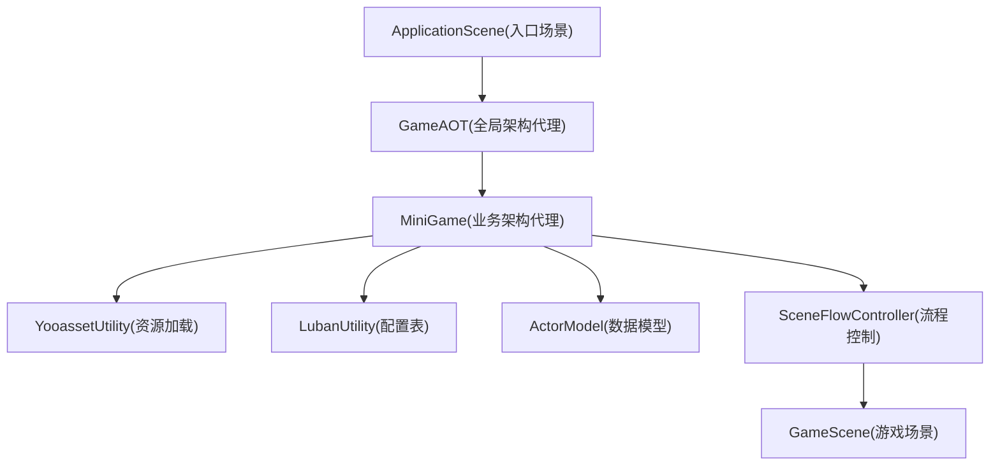
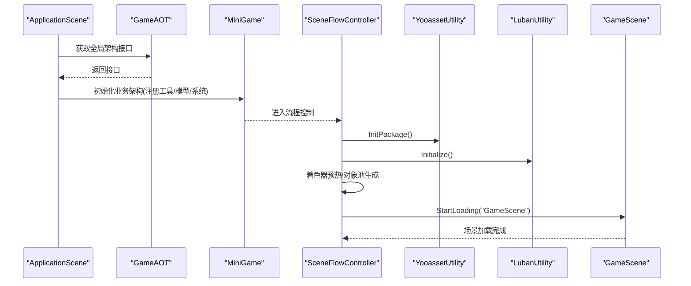
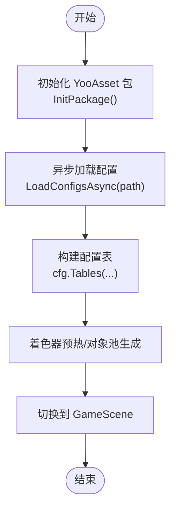
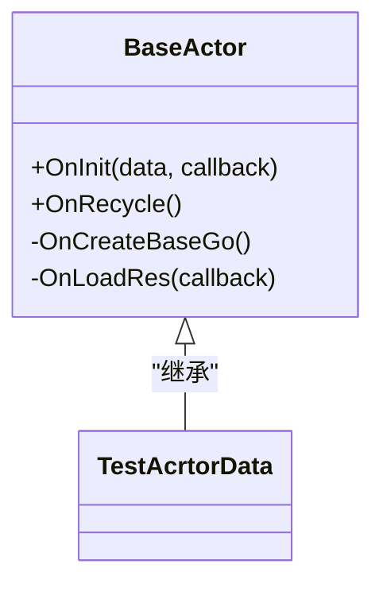
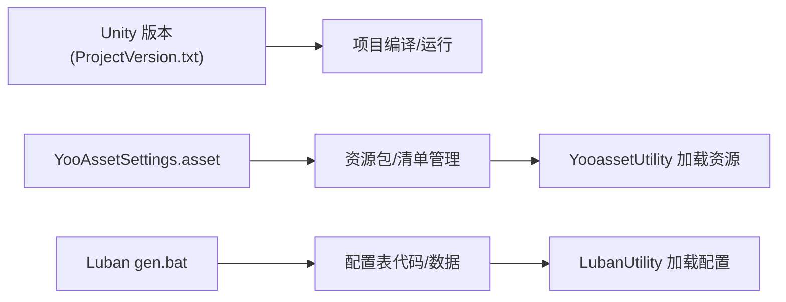

# 快速开始

<cite>
**本文引用的文件**   
- [ApplicationScene.cs](file://Assets/Game/Scripts/ApplicationScene.cs)
- [GameAOT.cs](file://Assets/Game/Scripts/GameAOT.cs)
- [MiniGame.cs](file://Assets/Game/Scripts/MiniGame_Scripts/MiniGame.cs)
- [ActorModel.cs](file://Assets/Game/Scripts/MiniGame_Scripts/Model/ActorModel.cs)
- [YooassetUtility.cs](file://Assets/Game/Scripts/MiniGame_Scripts/Utility/YooassetUtility.cs)
- [MyYooAsset.cs](file://Assets/Game/Scripts/MiniGame_Scripts/Utility/MyYooAsset.cs)
- [LubanUtility.cs](file://Assets/Game/Scripts/MiniGame_Scripts/Utility/LubanUtility.cs)
- [SceneFlowController.cs](file://Assets/Game/Scripts/MiniGame_Scripts/Controller/SceneFlowController.cs)
- [BaseActor.cs](file://Assets/Game/Scripts/Game/Runtime/Logic/Actor/BaseActor.cs)
- [TestAcrtorData.cs](file://Assets/Game/Scripts/Game/Runtime/Logic/Actor/TestAcrtorData.cs)
- [ApplicationScene.unity](file://Assets/Game/Scenes/ApplicationScene.unity)
- [GameScene.unity](file://Assets/Game/MiniGame_Res/Scene/GameScene.unity)
- [ProjectVersion.txt](file://ProjectSettings/ProjectVersion.txt)
- [YooAssetSettings.asset](file://Assets/Game/Resources/YooAssetSettings.asset)
- [gen.bat](file://LubanConfig\Template/gen.bat)
</cite>

## 目录
1. [简介](#简介)
2. [项目结构](#项目结构)
3. [核心组件](#核心组件)
4. [架构总览](#架构总览)
5. [详细组件分析](#详细组件分析)
6. [依赖分析](#依赖分析)
7. [性能考虑](#性能考虑)
8. [故障排查指南](#故障排查指南)
9. [结论](#结论)
10. [附录](#附录)

## 简介
本快速开始指南面向首次接触 SimulationClient 项目的开发者，目标是帮助你在最短时间内完成环境搭建、项目导入与配置，并顺利运行到第一个可交互场景。你将了解：
- Unity 版本要求与关键依赖
- 启动流程：ApplicationScene 初始化、GameAOT 全局架构代理设置、MiniGame 主架构注册
- 第一个示例：创建角色对象、显示 UI、实现场景切换
- 常见开发任务速查：新增系统/模型/工具类、使用对象池、加载资源
- 调试技巧与常见问题解决方案

## 项目结构
本项目采用分层与模块化组织方式：
- 框架层：QFramework、MOYV、YooAsset、UniTask、Luban 等
- 应用入口：ApplicationScene 作为首个场景控制器
- 架构代理：GameAOT（全局）、MiniGame（业务）
- 业务模块：Model/System/Controller/Utility 等
- 资源与场景：Resources、MiniGame_Res、StreamingAssets/yoo 等

图表来源
- [ApplicationScene.cs:1-36](file://Assets/Game/Scripts/ApplicationScene.cs#L1-L36)
- [GameAOT.cs:1-13](file://Assets/Game/Scripts/GameAOT.cs#L1-L13)
- [MiniGame.cs:1-30](file://Assets/Game/Scripts/MiniGame_Scripts/MiniGame.cs#L1-L30)
- [YooassetUtility.cs:1-40](file://Assets/Game/Scripts/MiniGame_Scripts/Utility/YooassetUtility.cs#L1-L40)
- [LubanUtility.cs:1-40](file://Assets/Game/Scripts/MiniGame_Scripts/Utility/LubanUtility.cs#L1-L40)
- [SceneFlowController.cs:175-214](file://Assets/Game/Scripts/MiniGame_Scripts/Controller/SceneFlowController.cs#L175-L214)
- [ApplicationScene.unity:482-537](file://Assets/Game/Scenes/ApplicationScene.unity#L482-L537)
- [GameScene.unity:509-616](file://Assets/Game/MiniGame_Res/Scene/GameScene.unity#L509-L616)

章节来源
- [ApplicationScene.cs:1-36](file://Assets/Game/Scripts/ApplicationScene.cs#L1-L36)
- [GameAOT.cs:1-13](file://Assets/Game/Scripts/GameAOT.cs#L1-L13)
- [MiniGame.cs:1-30](file://Assets/Game/Scripts/MiniGame_Scripts/MiniGame.cs#L1-L30)
- [ApplicationScene.unity:482-537](file://Assets/Game/Scenes/ApplicationScene.unity#L482-L537)
- [GameScene.unity:509-616](file://Assets/Game/MiniGame_Res/Scene/GameScene.unity#L509-L616)

## 核心组件
- ApplicationScene：应用入口场景控制器，负责获取全局架构接口并在生命周期中触发初始化。
- GameAOT：全局架构代理，用于注册全局系统（如定时器）。
- MiniGame：业务架构代理，负责注册工具、模型与系统，是业务逻辑的装配中心。
- YooassetUtility：基于 YooAsset 的资源加载封装，提供包初始化、配置表异步加载等方法。
- LubanUtility：基于 Luban 的配置表加载器，通过 YooassetUtility 读取二进制配置并构建 Tables。
- SceneFlowController：场景流程控制器，串联加载配置、生成对象池、着色器预热、场景切换等步骤。
- BaseActor：实体基类，封装了对象池回收、资源加载、事件注册/注销等通用能力。

章节来源
- [ApplicationScene.cs:1-36](file://Assets/Game/Scripts/ApplicationScene.cs#L1-L36)
- [GameAOT.cs:1-13](file://Assets/Game/Scripts/GameAOT.cs#L1-L13)
- [MiniGame.cs:1-30](file://Assets/Game/Scripts/MiniGame_Scripts/MiniGame.cs#L1-L30)
- [YooassetUtility.cs:1-40](file://Assets/Game/Scripts/MiniGame_Scripts/Utility/YooassetUtility.cs#L1-L40)
- [LubanUtility.cs:1-40](file://Assets/Game/Scripts/MiniGame_Scripts/Utility/LubanUtility.cs#L1-L40)
- [SceneFlowController.cs:175-214](file://Assets/Game/Scripts/MiniGame_Scripts/Controller/SceneFlowController.cs#L175-L214)
- [BaseActor.cs:1-121](file://Assets/Game/Scripts/Game/Runtime/Logic/Actor/BaseActor.cs#L1-L121)

## 架构总览
下图展示了从应用启动到进入游戏场景的关键调用链，以及各架构代理与工具类的协作关系。

图表来源
- [ApplicationScene.cs:22-35](file://Assets/Game/Scripts/ApplicationScene.cs#L22-L35)
- [GameAOT.cs:9-12](file://Assets/Game/Scripts/GameAOT.cs#L9-L12)
- [MiniGame.cs:6-28](file://Assets/Game/Scripts/MiniGame_Scripts/MiniGame.cs#L6-L28)
- [SceneFlowController.cs:175-214](file://Assets/Game/Scripts/MiniGame_Scripts/Controller/SceneFlowController.cs#L175-L214)
- [YooassetUtility.cs:27-31](file://Assets/Game/Scripts/MiniGame_Scripts/Utility/YooassetUtility.cs#L27-L31)
- [LubanUtility.cs:17-38](file://Assets/Game/Scripts/MiniGame_Scripts/Utility/LubanUtility.cs#L17-L38)
- [ApplicationScene.unity:482-537](file://Assets/Game/Scenes/ApplicationScene.unity#L482-L537)
- [GameScene.unity:509-616](file://Assets/Game/MiniGame_Res/Scene/GameScene.unity#L509-L616)

## 详细组件分析

### 启动流程与关键步骤
- ApplicationScene 在 Awake 中调用 Initialize，并通过 GameAOT.Interface 获取全局架构接口，随后由业务架构 MiniGame 完成工具、模型与系统的注册。
- GameAOT.Init 中注册全局系统（例如 TimerSystem），为后续定时逻辑提供支撑。
- MiniGame.Init 中依次注册工具（YooassetUtility、LubanUtility）、模型（ActorModel）与系统（可扩展）。
- SceneFlowController 负责整体流程：加载配置、生成对象池、着色器预热、切换到 GameScene。

章节来源
- [ApplicationScene.cs:13-25](file://Assets/Game/Scripts/ApplicationScene.cs#L13-L25)
- [GameAOT.cs:9-12](file://Assets/Game/Scripts/GameAOT.cs#L9-L12)
- [MiniGame.cs:6-28](file://Assets/Game/Scripts/MiniGame_Scripts/MiniGame.cs#L6-L28)
- [SceneFlowController.cs:175-214](file://Assets/Game/Scripts/MiniGame_Scripts/Controller/SceneFlowController.cs#L175-L214)

### 资源与配置加载
- YooassetUtility 使用 MyYooAsset 初始化 YooAsset 资源系统，支持编辑器模拟模式或主机模式；提供 InitPackage 与 LoadConfigsAsync 等异步方法。
- LubanUtility 通过 YooassetUtility 加载配置二进制文件，构造 cfg.Tables 供业务访问。
- SceneFlowController 在流程中调用 LubanUtility.Initialize 与 YooassetUtility.UnloadUnusedAssets，确保配置就绪并释放无用资源。

图表来源
- [YooassetUtility.cs:27-40](file://Assets/Game/Scripts/MiniGame_Scripts/Utility/YooassetUtility.cs#L27-L40)
- [MyYooAsset.cs:36-62](file://Assets/Game/Scripts/MiniGame_Scripts/Utility/MyYooAsset.cs#L36-L62)
- [LubanUtility.cs:17-38](file://Assets/Game/Scripts/MiniGame_Scripts/Utility/LubanUtility.cs#L17-L38)
- [SceneFlowController.cs:175-214](file://Assets/Game/Scripts/MiniGame_Scripts/Controller/SceneFlowController.cs#L175-L214)

章节来源
- [YooassetUtility.cs:1-40](file://Assets/Game/Scripts/MiniGame_Scripts/Utility/YooassetUtility.cs#L1-L40)
- [MyYooAsset.cs:1-82](file://Assets/Game/Scripts/MiniGame_Scripts/Utility/MyYooAsset.cs#L1-L82)
- [LubanUtility.cs:1-40](file://Assets/Game/Scripts/MiniGame_Scripts/Utility/LubanUtility.cs#L1-L40)
- [SceneFlowController.cs:175-214](file://Assets/Game/Scripts/MiniGame_Scripts/Controller/SceneFlowController.cs#L175-L214)

### 第一个示例：角色对象、UI 与场景切换
- 角色对象：GameScene 中已包含一个 Role 预制体实例，可通过 BaseActor 体系进行管理与复用。
- UI 界面：项目中提供了 UGUI 扩展与动画 UI 工具，可在流程中打开 LoadingView 等面板。
- 场景切换：SceneFlowController.StartLoading("GameScene") 驱动场景加载。

图表来源
- [BaseActor.cs:46-91](file://Assets/Game/Scripts/Game/Runtime/Logic/Actor/BaseActor.cs#L46-L91)
- [TestAcrtorData.cs:1-7](file://Assets/Game/Scripts/Game/Runtime/Logic/Actor/TestAcrtorData.cs#L1-L7)
- [GameScene.unity:509-616](file://Assets/Game/MiniGame_Res/Scene/GameScene.unity#L509-L616)

章节来源
- [BaseActor.cs:1-121](file://Assets/Game/Scripts/Game/Runtime/Logic/Actor/BaseActor.cs#L1-L121)
- [TestAcrtorData.cs:1-7](file://Assets/Game/Scripts/Game/Runtime/Logic/Actor/TestAcrtorData.cs#L1-L7)
- [GameScene.unity:509-616](file://Assets/Game/MiniGame_Res/Scene/GameScene.unity#L509-L616)

### 常见开发任务速查
- 添加新的系统
  - 在 MiniGame.RegisterSystem 中注册你的系统类。
  - 参考路径：[MiniGame.cs:19-22](file://Assets/Game/Scripts/MiniGame_Scripts/MiniGame.cs#L19-L22)
- 添加新的模型
  - 在 MiniGame.RegisterModel 中注册模型，或在 ActorModel 基础上扩展。
  - 参考路径：[MiniGame.cs:14-17](file://Assets/Game/Scripts/MiniGame_Scripts/MiniGame.cs#L14-L17)、[ActorModel.cs:1-13](file://Assets/Game/Scripts/MiniGame_Scripts/Model/ActorModel.cs#L1-L13)
- 添加新的工具类
  - 实现 IUtility 接口，在 MiniGame.RegisterUtility 中注册。
  - 参考路径：[MiniGame.cs:24-28](file://Assets/Game/Scripts/MiniGame_Scripts/MiniGame.cs#L24-L28)
- 使用对象池
  - 在流程中调用 UniPooling.Initalize 与 CreateSpawner，并使用 PushToPool 回收对象。
  - 参考路径：[SceneFlowController.cs:206-211](file://Assets/Game/Scripts/MiniGame_Scripts/Controller/SceneFlowController.cs#L206-L211)、[BaseActor.cs:80-84](file://Assets/Game/Scripts/Game/Runtime/Logic/Actor/BaseActor.cs#L80-L84)
- 加载资源
  - 使用 YooassetUtility 提供的异步加载方法，或通过 MyYooAsset 初始化包后按需加载。
  - 参考路径：[YooassetUtility.cs:27-40](file://Assets/Game/Scripts/MiniGame_Scripts/Utility/YooassetUtility.cs#L27-L40)、[MyYooAsset.cs:36-62](file://Assets/Game/Scripts/MiniGame_Scripts/Utility/MyYooAsset.cs#L36-L62)

章节来源
- [MiniGame.cs:14-28](file://Assets/Game/Scripts/MiniGame_Scripts/MiniGame.cs#L14-L28)
- [ActorModel.cs:1-13](file://Assets/Game/Scripts/MiniGame_Scripts/Model/ActorModel.cs#L1-L13)
- [SceneFlowController.cs:206-211](file://Assets/Game/Scripts/MiniGame_Scripts/Controller/SceneFlowController.cs#L206-L211)
- [BaseActor.cs:80-84](file://Assets/Game/Scripts/Game/Runtime/Logic/Actor/BaseActor.cs#L80-L84)
- [YooassetUtility.cs:27-40](file://Assets/Game/Scripts/MiniGame_Scripts/Utility/YooassetUtility.cs#L27-L40)
- [MyYooAsset.cs:36-62](file://Assets/Game/Scripts/MiniGame_Scripts/Utility/MyYooAsset.cs#L36-L62)

## 依赖分析
- Unity 版本
  - 当前工程使用的 Unity 版本记录于 ProjectSettings/ProjectVersion.txt。
- YooAsset 配置
  - 默认包名与清单前缀在 YooAssetSettings.asset 中定义。
- Luban 代码生成
  - gen.bat 指定输出目录与模板，生成配置表代码至 Scripts/ConfigCode，数据文件至 MiniGame_Res/Config。

图表来源
- [ProjectVersion.txt:1-3](file://ProjectSettings/ProjectVersion.txt#L1-L3)
- [YooAssetSettings.asset:1-16](file://Assets/Game/Resources/YooAssetSettings.asset#L1-L16)
- [gen.bat:1-12](file://LubanConfig\Template/gen.bat#L1-L12)
- [LubanUtility.cs:17-38](file://Assets/Game/Scripts/MiniGame_Scripts/Utility/LubanUtility.cs#L17-L38)
- [YooassetUtility.cs:27-40](file://Assets/Game/Scripts/MiniGame_Scripts/Utility/YooassetUtility.cs#L27-L40)

章节来源
- [ProjectVersion.txt:1-3](file://ProjectSettings/ProjectVersion.txt#L1-L3)
- [YooAssetSettings.asset:1-16](file://Assets/Game/Resources/YooAssetSettings.asset#L1-L16)
- [gen.bat:1-12](file://LubanConfig\Template/gen.bat#L1-L12)

## 性能考虑
- 资源加载
  - 使用 YooAsset 的异步加载与并发控制，避免阻塞主线程。
  - 在流程中执行着色器预热，减少运行时卡顿。
- 对象池
  - 统一通过 UniPooling 与 PushToPool 管理对象生命周期，降低 GC 压力。
- 配置表
  - 一次性加载并缓存 cfg.Tables，避免重复 IO。

[本节为通用指导，不直接分析具体文件]

## 故障排查指南
- 无法进入 GameScene
  - 检查 SceneFlowController 的流程是否按顺序执行：加载配置→对象池→着色器预热→StartLoading。
  - 参考路径：[SceneFlowController.cs:175-214](file://Assets/Game/Scripts/MiniGame_Scripts/Controller/SceneFlowController.cs#L175-L214)
- 配置表为空或加载失败
  - 确认 Luban 已正确生成数据与代码，且路径与 gen.bat 一致。
  - 检查 YooassetUtility.LoadConfigsAsync 传入的具体文件路径是否正确。
  - 参考路径：[LubanUtility.cs:17-38](file://Assets/Game/Scripts/MiniGame_Scripts/Utility/LubanUtility.cs#L17-L38)、[gen.bat:1-12](file://LubanConfig\Template/gen.bat#L1-L12)
- 资源未找到或加载异常
  - 确认 YooAsset 包名与清单前缀匹配 YooAssetSettings.asset。
  - 在编辑器下使用 EditorSimulateMode 时，确保模拟构建结果存在。
  - 参考路径：[YooAssetSettings.asset:1-16](file://Assets/Game/Resources/YooAssetSettings.asset#L1-L16)、[MyYooAsset.cs:76-82](file://Assets/Game/Scripts/MiniGame_Scripts/Utility/MyYooAsset.cs#L76-L82)
- 角色对象未出现
  - 检查 GameScene 中是否已放置 Role 预制体，或是否在流程中通过 BaseActor 体系创建。
  - 参考路径：[GameScene.unity:509-616](file://Assets/Game/MiniGame_Res/Scene/GameScene.unity#L509-L616)、[BaseActor.cs:46-91](file://Assets/Game/Scripts/Game/Runtime/Logic/Actor/BaseActor.cs#L46-L91)

章节来源
- [SceneFlowController.cs:175-214](file://Assets/Game/Scripts/MiniGame_Scripts/Controller/SceneFlowController.cs#L175-L214)
- [LubanUtility.cs:17-38](file://Assets/Game/Scripts/MiniGame_Scripts/Utility/LubanUtility.cs#L17-L38)
- [gen.bat:1-12](file://LubanConfig\Template/gen.bat#L1-L12)
- [YooAssetSettings.asset:1-16](file://Assets/Game/Resources/YooAssetSettings.asset#L1-L16)
- [MyYooAsset.cs:76-82](file://Assets/Game/Scripts/MiniGame_Scripts/Utility/MyYooAsset.cs#L76-L82)
- [GameScene.unity:509-616](file://Assets/Game/MiniGame_Res/Scene/GameScene.unity#L509-L616)
- [BaseActor.cs:46-91](file://Assets/Game/Scripts/Game/Runtime/Logic/Actor/BaseActor.cs#L46-L91)

## 结论
通过 ApplicationScene → GameAOT → MiniGame 的三层架构，配合 YooAsset 与 Luban 的资源与配置管理能力，SimulationClient 提供了清晰的启动流程与可扩展的业务骨架。按照本指南完成环境搭建与流程配置后，你可以快速进入 GameScene 并开始功能开发。

[本节为总结性内容，不直接分析具体文件]

## 附录
- 环境搭建步骤（简要）
  - 安装与打开 Unity（版本见 ProjectVersion.txt）
  - 导入项目并确保 Packages 与 Settings 完整
  - 运行 Luban 生成配置表（gen.bat）
  - 在编辑器中打开 ApplicationScene 并运行
- 关键路径速览
  - 入口场景：ApplicationScene.unity
  - 游戏场景：GameScene.unity
  - 资源设置：YooAssetSettings.asset
  - 配置生成：LubanConfig\Template/gen.bat

章节来源
- [ProjectVersion.txt:1-3](file://ProjectSettings/ProjectVersion.txt#L1-L3)
- [ApplicationScene.unity:482-537](file://Assets/Game/Scenes/ApplicationScene.unity#L482-L537)
- [GameScene.unity:509-616](file://Assets/Game/MiniGame_Res/Scene/GameScene.unity#L509-L616)
- [YooAssetSettings.asset:1-16](file://Assets/Game/Resources/YooAssetSettings.asset#L1-L16)
- [gen.bat:1-12](file://LubanConfig\Template/gen.bat#L1-L12)