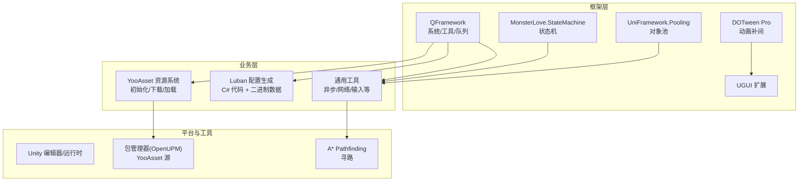
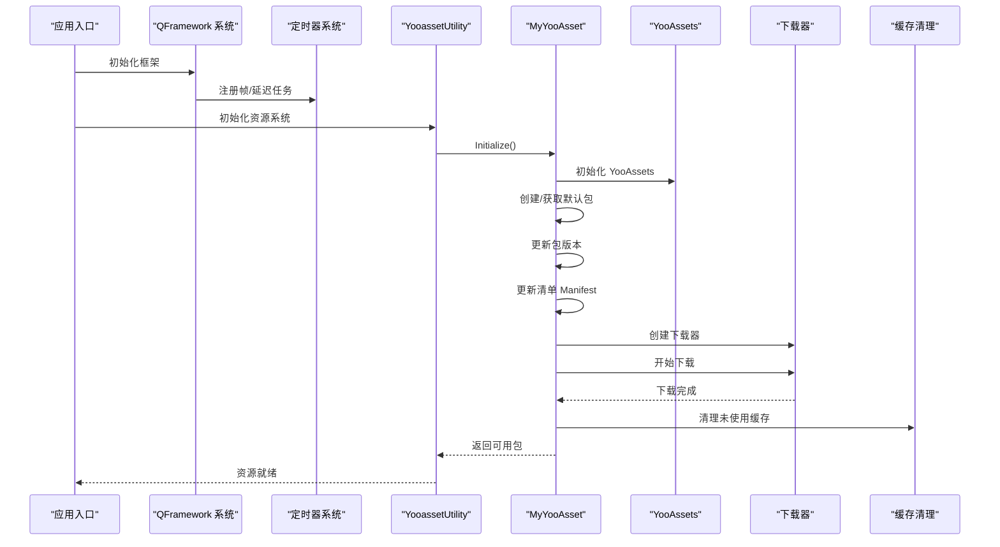
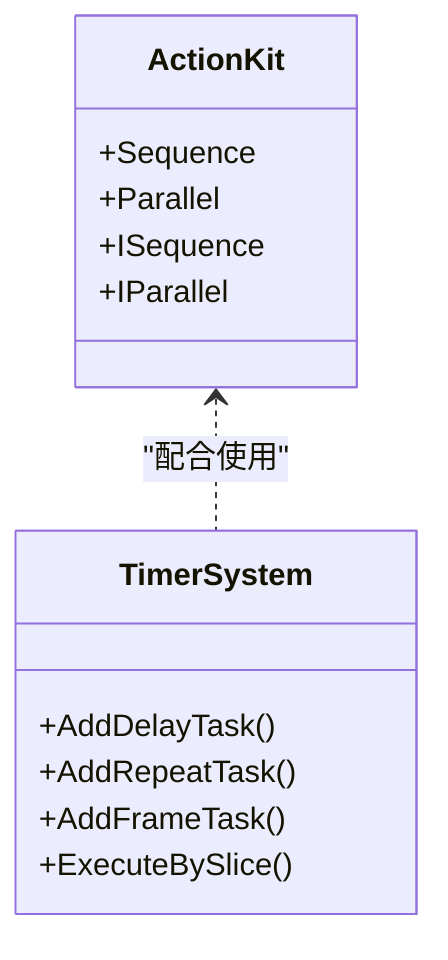
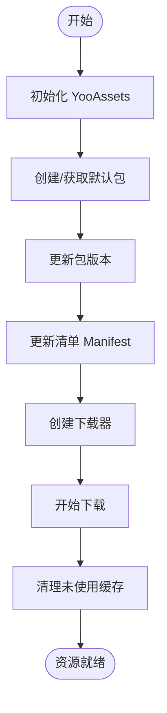
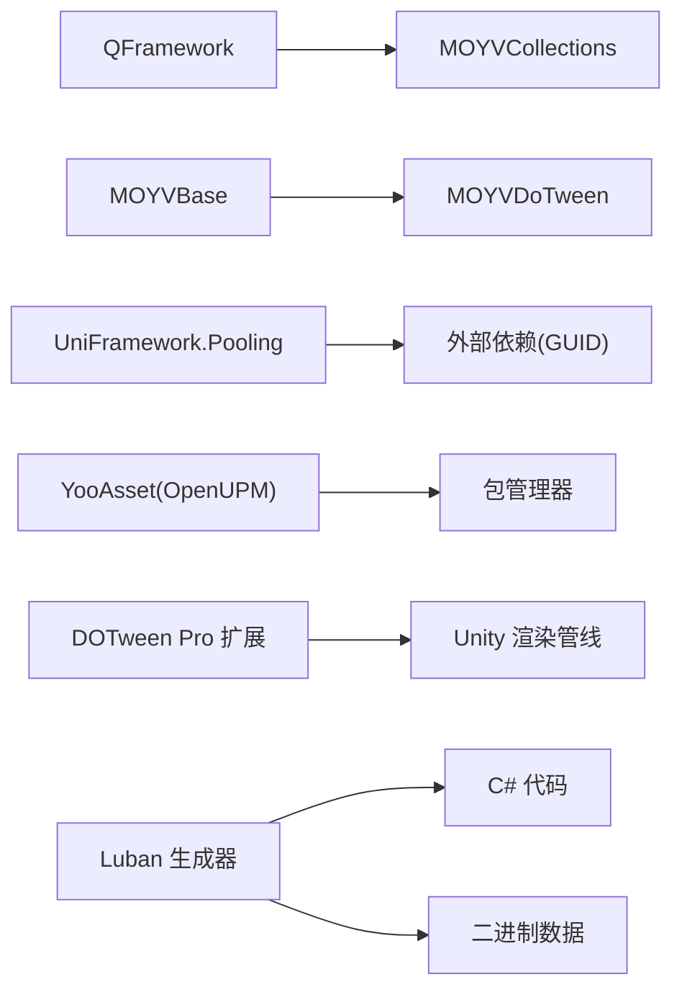

# 技术栈概览

<cite>
**本文引用的文件**
- [ProjectVersion.txt](file://ProjectSettings/ProjectVersion.txt)
- [PackageManagerSettings.asset](file://ProjectSettings/PackageManagerSettings.asset)
- [YooAssetSettings.asset](file://Assets/Game/Resources/YooAssetSettings.asset)
- [MyYooAsset.cs](file://Assets/Game/Scripts/MiniGame_Scripts/Utility/MyYooAsset.cs)
- [YooassetUtility.cs](file://Assets/Game/Scripts/MiniGame_Scripts/Utility/YooassetUtility.cs)
- [QFramework.asmdef](file://Assets/Game/Framework/Qframework/Runtime/QFramework.asmdef)
- [MOYVBase.asmdef](file://Assets/Game/Framework/Base/MOYVBase.asmdef)
- [MonsterLove.StateMachine.Runtime.asmdef](file://Assets/Game/Framework/FSM/Runtime/MonsterLove.StateMachine.Runtime.asmdef)
- [UniFramework.Pooling.asmdef](file://Assets/Game/Scripts/MiniGame_Scripts/Utility/UniPooling/Runtime/UniFramework.Pooling.asmdef)
- [DOTweenModuleEPOOutline.cs](file://Assets/Game/Framework/DoTween/DOTween/Modules/DOTweenModuleEPOOutline.cs)
- [DOTweenModulePhysics.cs](file://Assets/Game/Framework/DoTween/DOTween/Modules/DOTweenModulePhysics.cs)
- [ActionKit.cs](file://Assets/Game/Framework/Qframework/Runtime/Toolkits/ActionKit.cs)
- [TimerSystem.cs](file://Assets/Game/Framework/Qframework/Runtime/Moyv/Systems/TimerSystem.cs)
- [gen.bat](file://LubanConfig/Template/gen.bat)
- [gen.sh](file://LubanConfig/Template/gen.sh)
</cite>

## 目录
1. [简介](#简介)
2. [项目结构](#项目结构)
3. [核心组件](#核心组件)
4. [架构总览](#架构总览)
5. [详细组件分析](#详细组件分析)
6. [依赖关系分析](#依赖关系分析)
7. [性能考量](#性能考量)
8. [故障排查指南](#故障排查指南)
9. [结论](#结论)
10. [附录](#附录)

## 简介
本技术栈概览面向 SimulationClient 项目，系统性梳理并解释其核心技术选型与集成方式。重点覆盖：
- Unity 引擎版本要求与 .NET 环境
- C# 编程规范与工程组织（asmdef、包管理）
- 核心框架与第三方库：QFramework、YooAsset、MonsterLove.StateMachine、DOTween Pro、Luban、UniTask、A* Pathfinding 等
- 各组件的职责、价值与协同工作方式
- 第三方插件集成与自定义扩展模块
- 技术选型原因与优势分析

## 项目结构
项目采用模块化与分层组织方式：
- Assets/Game/Framework：自研与集成的基础框架层（QFramework、FSM、DoTween、UI、集合、事件、池化等）
- Assets/Game/Scripts：业务脚本与工具（资源加载、配置生成、通用工具等）
- Assets/Game/Resources：运行时资源与 YooAsset 设置
- LubanConfig：配置生成工具链（模板、脚本、配置文件）
- ProjectSettings：Unity 工程设置（含包管理器注册源）

图表来源
- [QFramework.asmdef:1-16](file://Assets/Game/Framework/Qframework/Runtime/QFramework.asmdef#L1-L16)
- [MonsterLove.StateMachine.Runtime.asmdef:1-13](file://Assets/Game/Framework/FSM/Runtime/MonsterLove.StateMachine.Runtime.asmdef#L1-L13)
- [UniFramework.Pooling.asmdef:1-16](file://Assets/Game/Scripts/MiniGame_Scripts/Utility/UniPooling/Runtime/UniFramework.Pooling.asmdef#L1-L16)
- [DOTweenModuleEPOOutline.cs:33-147](file://Assets/Game/Framework/DoTween/DOTween/Modules/DOTweenModuleEPOOutline.cs#L33-L147)
- [DOTweenModulePhysics.cs:178-217](file://Assets/Game/Framework/DoTween/DOTween/Modules/DOTweenModulePhysics.cs#L178-L217)
- [YooAssetSettings.asset:1-16](file://Assets/Game/Resources/YooAssetSettings.asset#L1-L16)
- [PackageManagerSettings.asset:22-38](file://ProjectSettings/PackageManagerSettings.asset#L22-L38)

章节来源
- [ProjectVersion.txt:1-3](file://ProjectSettings/ProjectVersion.txt#L1-L3)
- [PackageManagerSettings.asset:22-38](file://ProjectSettings/PackageManagerSettings.asset#L22-L38)

## 核心组件
- Unity 引擎与 .NET 环境
  - Unity 编辑器版本：6000.3.2f1（对应较新的 Unity 主版本）
  - .NET 目标：由 Luban 的依赖清单可见使用 System.* 4.x 系列，表明基于 .NET Standard/Core 生态；Unity 侧通过 dotnet 调用 Luban 进行配置生成
- QFramework 游戏框架
  - 提供系统调度、动作序列/并行、定时器、事件、池化等基础设施
  - 通过 asmdef 明确引用 MOYVCollections，形成清晰的编译边界
- YooAsset 资源管理系统
  - 通过 OpenUPM 引入，支持离线/在线模式、包与清单管理、增量更新
  - 项目内封装了初始化、下载、清理的统一流程
- MonsterLove.StateMachine 状态机
  - 轻量级状态机实现，用于复杂行为控制
- DOTween Pro 动画库
  - 提供丰富的补间能力，包含对 EPO Outline、Rigidbody 等扩展模块
- Luban 配置生成工具
  - 通过命令行生成 C# 类型与二进制数据，统一配置契约
- UniTask 异步处理库
  - 在资源加载与工具类中广泛使用 async/await 风格
- A* Pathfinding 寻路
  - 提供高性能路径搜索与可视化调试

章节来源
- [ProjectVersion.txt:1-3](file://ProjectSettings/ProjectVersion.txt#L1-L3)
- [QFramework.asmdef:1-16](file://Assets/Game/Framework/Qframework/Runtime/QFramework.asmdef#L1-L16)
- [YooAssetSettings.asset:1-16](file://Assets/Game/Resources/YooAssetSettings.asset#L1-L16)
- [DOTweenModuleEPOOutline.cs:33-147](file://Assets/Game/Framework/DoTween/DOTween/Modules/DOTweenModuleEPOOutline.cs#L33-L147)
- [DOTweenModulePhysics.cs:178-217](file://Assets/Game/Framework/DoTween/DOTween/Modules/DOTweenModulePhysics.cs#L178-L217)
- [gen.bat:1-12](file://LubanConfig/Template/gen.bat#L1-L12)
- [gen.sh:1-11](file://LubanConfig/Template/gen.sh#L1-L11)

## 架构总览
下图展示了从应用启动到资源加载的关键协作关系：QFramework 驱动系统生命周期，YooAsset 负责资源包与清单，UniTask 贯穿异步流程，DOTween 提供动效，Luban 保障配置一致性。

图表来源
- [YooassetUtility.cs:1-40](file://Assets/Game/Scripts/MiniGame_Scripts/Utility/YooassetUtility.cs#L1-L40)
- [MyYooAsset.cs:1-82](file://Assets/Game/Scripts/MiniGame_Scripts/Utility/MyYooAsset.cs#L1-L82)
- [TimerSystem.cs:118-317](file://Assets/Game/Framework/Qframework/Runtime/Moyv/Systems/TimerSystem.cs#L118-L317)

## 详细组件分析

### Unity 与 .NET 环境
- Unity 版本：6000.3.2f1
- 包管理器注册源：启用 OpenUPM 以拉取 com.tuyoogame.yooasset
- .NET 依赖：Luban 的 deps.json 显示使用 System.* 4.x 系列，符合现代 .NET 标准

章节来源
- [ProjectVersion.txt:1-3](file://ProjectSettings/ProjectVersion.txt#L1-L3)
- [PackageManagerSettings.asset:22-38](file://ProjectSettings/PackageManagerSettings.asset#L22-L38)
- [Luban.deps.json:176-212](file://LubanConfig/Template/Luban/Luban.deps.json#L176-L212)

### QFramework 框架
- 作用与价值
  - 提供系统调度、事件总线、动作编排（顺序/并行）、定时器、对象池等
  - 降低样板代码，提升开发效率与可维护性
- 关键实现要点
  - ActionKit 中的 Sequence/Parallel 通过对象池复用，减少 GC
  - TimerSystem 统一管理帧任务、延迟任务、周期任务，支持忙时跳过策略
- 集成点
  - 通过 asmdef 引用 MOYVCollections，保持编译边界清晰

图表来源
- [ActionKit.cs:3097-3296](file://Assets/Game/Framework/Qframework/Runtime/Toolkits/ActionKit.cs#L3097-L3296)
- [TimerSystem.cs:118-317](file://Assets/Game/Framework/Qframework/Runtime/Moyv/Systems/TimerSystem.cs#L118-L317)

章节来源
- [QFramework.asmdef:1-16](file://Assets/Game/Framework/Qframework/Runtime/QFramework.asmdef#L1-L16)
- [ActionKit.cs:3097-3296](file://Assets/Game/Framework/Qframework/Runtime/Toolkits/ActionKit.cs#L3097-L3296)
- [TimerSystem.cs:118-317](file://Assets/Game/Framework/Qframework/Runtime/Moyv/Systems/TimerSystem.cs#L118-L317)

### YooAsset 资源系统
- 作用与价值
  - 统一的资源打包、分发、更新与加载方案，支持多包与清单机制
- 关键流程
  - 初始化 -> 创建/获取包 -> 更新版本 -> 更新清单 -> 创建下载器 -> 开始下载 -> 清理缓存
- 配置项
  - DefaultYooFolderName、PackageManifestPrefix 等

图表来源
- [MyYooAsset.cs:1-82](file://Assets/Game/Scripts/MiniGame_Scripts/Utility/MyYooAsset.cs#L1-L82)
- [YooAssetSettings.asset:1-16](file://Assets/Game/Resources/YooAssetSettings.asset#L1-L16)

章节来源
- [YooassetUtility.cs:1-40](file://Assets/Game/Scripts/MiniGame_Scripts/Utility/YooassetUtility.cs#L1-L40)
- [MyYooAsset.cs:1-82](file://Assets/Game/Scripts/MiniGame_Scripts/Utility/MyYooAsset.cs#L1-L82)
- [YooAssetSettings.asset:1-16](file://Assets/Game/Resources/YooAssetSettings.asset#L1-L16)

### MonsterLove.StateMachine 状态机
- 作用与价值
  - 轻量、易用的状态机实现，适合 UI 状态切换、实体行为管理等
- 集成方式
  - 通过 Runtime asmdef 独立编译单元，避免不必要的耦合

章节来源
- [MonsterLove.StateMachine.Runtime.asmdef:1-13](file://Assets/Game/Framework/FSM/Runtime/MonsterLove.StateMachine.Runtime.asmdef#L1-L13)

### DOTween Pro 动画库
- 作用与价值
  - 高性能补间动画，支持大量 Unity 组件与第三方插件扩展
- 扩展模块
  - EPO Outline 属性动画（颜色、模糊、膨胀等）
  - Rigidbody 路径动画（DOPath/DOLocalPath）
- 最佳实践
  - 合理设置容量与回收策略，避免频繁 GC

章节来源
- [DOTweenModuleEPOOutline.cs:33-147](file://Assets/Game/Framework/DoTween/DOTween/Modules/DOTweenModuleEPOOutline.cs#L33-L147)
- [DOTweenModulePhysics.cs:178-217](file://Assets/Game/Framework/DoTween/DOTween/Modules/DOTweenModulePhysics.cs#L178-L217)

### Luban 配置生成工具
- 作用与价值
  - 通过 schema 定义与模板，自动生成 C# 类型与二进制数据，保证前后端一致
- 构建脚本
  - Windows 与 Linux/macOS 双脚本，输出目录与代码目录分离
- 典型命令参数
  - 目标格式 cs-bin、输出目录、配置文件路径等

章节来源
- [gen.bat:1-12](file://LubanConfig/Template/gen.bat#L1-L12)
- [gen.sh:1-11](file://LubanConfig/Template/gen.sh#L1-L11)

### UniTask 异步处理库
- 作用与价值
  - 零分配或低分配的异步原语，提升资源加载与 IO 操作性能
- 使用场景
  - 资源初始化、清单更新、批量加载等

章节来源
- [YooassetUtility.cs:1-40](file://Assets/Game/Scripts/MiniGame_Scripts/Utility/YooassetUtility.cs#L1-L40)
- [MyYooAsset.cs:1-82](file://Assets/Game/Scripts/MiniGame_Scripts/Utility/MyYooAsset.cs#L1-L82)

### A* Pathfinding 寻路
- 作用与价值
  - 高性能网格/导航图寻路，支持可视化调试与多种启发式算法
- 集成位置
  - Plugins/Astar 下包含核心与编辑器扩展

章节来源
- [AstarPathfindingProject.asmdef](file://Assets/Plugins/Astar/AstarPathfindingProject.asmdef)

## 依赖关系分析
- 编译期依赖
  - QFramework 引用 MOYVCollections
  - Base 模块引用 MOYVDoTween
  - UniFramework.Pooling 通过 GUID 引用外部依赖
- 运行期依赖
  - YooAsset 通过包管理器从 OpenUPM 拉取
  - DOTween Pro 扩展模块按需启用
  - Luban 通过 dotnet CLI 执行，生成产物供运行时读取

图表来源
- [QFramework.asmdef:1-16](file://Assets/Game/Framework/Qframework/Runtime/QFramework.asmdef#L1-L16)
- [MOYVBase.asmdef:1-16](file://Assets/Game/Framework/Base/MOYVBase.asmdef#L1-L16)
- [UniFramework.Pooling.asmdef:1-16](file://Assets/Game/Scripts/MiniGame_Scripts/Utility/UniPooling/Runtime/UniFramework.Pooling.asmdef#L1-L16)
- [PackageManagerSettings.asset:22-38](file://ProjectSettings/PackageManagerSettings.asset#L22-L38)

章节来源
- [QFramework.asmdef:1-16](file://Assets/Game/Framework/Qframework/Runtime/QFramework.asmdef#L1-L16)
- [MOYVBase.asmdef:1-16](file://Assets/Game/Framework/Base/MOYVBase.asmdef#L1-L16)
- [UniFramework.Pooling.asmdef:1-16](file://Assets/Game/Scripts/MiniGame_Scripts/Utility/UniPooling/Runtime/UniFramework.Pooling.asmdef#L1-L16)
- [PackageManagerSettings.asset:22-38](file://ProjectSettings/PackageManagerSettings.asset#L22-L38)

## 性能考量
- 对象池与复用
  - QFramework 的 Sequence/Parallel 使用 SimpleObjectPool 复用实例，减少 GC
  - UniFramework.Pooling 提供通用对象池能力
- 异步与分片执行
  - TimerSystem 提供 ExecuteBySlice 将大任务切分到多帧执行，避免卡顿
- 动画与物理
  - DOTween 建议合理设置容量与回收策略，避免过度分配
  - 对 Rigidbody 的路径动画需关注插值与步长
- 资源加载
  - YooAsset 的并发加载数与下载器数量应结合平台能力调优
  - 及时清理未使用缓存，控制磁盘占用

[本节为通用指导，不直接分析具体文件]

## 故障排查指南
- YooAsset 初始化失败
  - 检查包名、清单前缀与服务器地址配置
  - 确认 EditorSimulateMode 或 HostPlayMode 与实际环境匹配
- 资源下载卡住
  - 调整最大并发下载数与重试次数
  - 检查网络连通性与服务器响应
- 动画异常
  - 确认 DOTween 模块已启用，目标组件存在且有效
  - 避免对已销毁对象继续播放动画
- 配置生成错误
  - 核对 luban.conf 与模板路径
  - 确保 dotnet 环境与依赖完整

章节来源
- [YooassetUtility.cs:1-40](file://Assets/Game/Scripts/MiniGame_Scripts/Utility/YooassetUtility.cs#L1-L40)
- [MyYooAsset.cs:1-82](file://Assets/Game/Scripts/MiniGame_Scripts/Utility/MyYooAsset.cs#L1-L82)
- [DOTweenModuleEPOOutline.cs:33-147](file://Assets/Game/Framework/DoTween/DOTween/Modules/DOTweenModuleEPOOutline.cs#L33-L147)
- [DOTweenModulePhysics.cs:178-217](file://Assets/Game/Framework/DoTween/DOTween/Modules/DOTweenModulePhysics.cs#L178-L217)
- [gen.bat:1-12](file://LubanConfig/Template/gen.bat#L1-L12)
- [gen.sh:1-11](file://LubanConfig/Template/gen.sh#L1-L11)

## 结论
SimulationClient 的技术栈围绕“高内聚、低耦合”的原则组织：以 QFramework 为核心骨架，YooAsset 提供稳健的资源管线，DOTween Pro 增强表现力，Luban 保障配置一致性，UniTask 提升异步体验，MonsterLove.StateMachine 简化状态管理，A* Pathfinding 解决复杂寻路需求。该组合兼顾开发效率、运行性能与可维护性，适合中大型项目的持续迭代。

[本节为总结性内容，不直接分析具体文件]

## 附录
- 技术选型原因与优势
  - QFramework：系统化抽象，减少重复劳动，便于团队协作
  - YooAsset：成熟的资源管理与增量更新方案，适配多平台
  - DOTween Pro：生态完善、扩展丰富，动效开发高效
  - Luban：强类型约束与跨语言生成，降低配置错误率
  - UniTask：高性能异步，减少协程心智负担
  - MonsterLove.StateMachine：轻量易用，适合快速建模
  - A* Pathfinding：成熟稳定，性能与功能平衡

[本节为概念性内容，不直接分析具体文件]