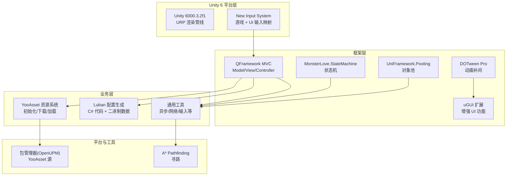
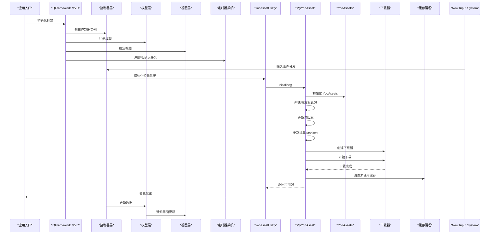
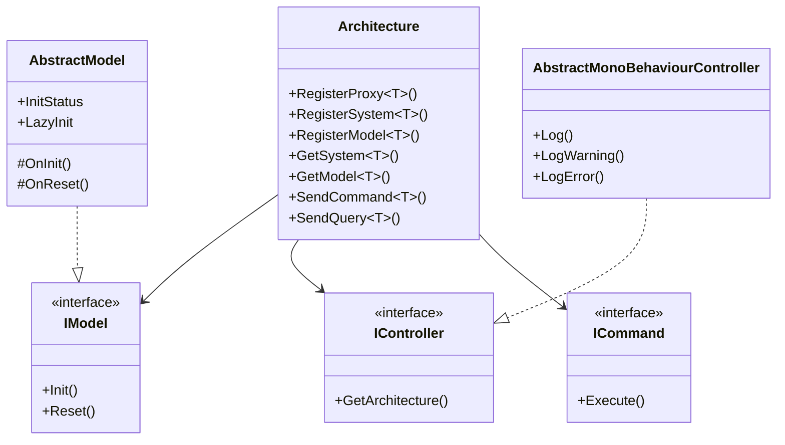
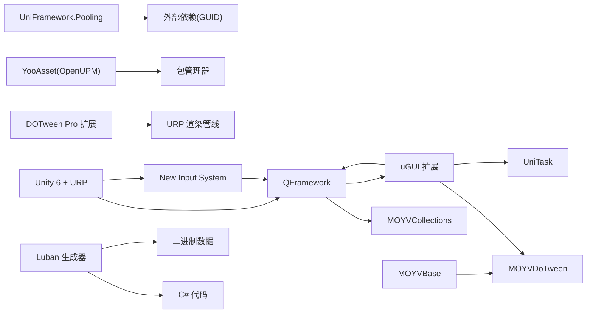

# 技术栈概览

<cite>
**本文引用的文件**
- [ProjectVersion.txt](file://ProjectSettings/ProjectVersion.txt)
- [URPProjectSettings.asset](file://ProjectSettings/URPProjectSettings.asset)
- [UniversalRenderPipelineGlobalSettings.asset](file://Assets/Settings/UniversalRenderPipelineGlobalSettings.asset)
- [GraphicsSettings.asset](file://ProjectSettings/GraphicsSettings.asset)
- [InputSystem_Actions.inputactions](file://Assets/InputSystem_Actions.inputactions)
- [PackageManagerSettings.asset](file://ProjectSettings/PackageManagerSettings.asset)
- [YooAssetSettings.asset](file://Assets/Game/Resources/YooAssetSettings.asset)
- [MyYooAsset.cs](file://Assets/Game/Scripts/MiniGame_Scripts/Utility/MyYooAsset.cs)
- [YooassetUtility.cs](file://Assets/Game/Scripts/MiniGame_Scripts/Utility/YooassetUtility.cs)
- [QFramework.asmdef](file://Assets/Game/Framework/Qframework/Runtime/QFramework.asmdef)
- [MOYVBase.asmdef](file://Assets/Game/Framework/Base/MOYVBase.asmdef)
- [MonsterLove.StateMachine.Runtime.asmdef](file://Assets/Game/Framework/FSM/Runtime/MonsterLove.StateMachine.Runtime.asmdef)
- [UniFramework.Pooling.asmdef](file://Assets/Game/Scripts/MiniGame_Scripts/Utility/UniPooling/Runtime/UniFramework.Pooling.asmdef)
- [DOTweenModuleEPOOutline.cs](file://Assets/Game/Framework/DoTween/DOTween/Modules/DOTweenModuleEPOOutline.cs)
- [DOTweenModulePhysics.cs](file://Assets/Game/Framework/DoTween/DOTween/Modules/DOTweenModulePhysics.cs)
- [ActionKit.cs](file://Assets/Game/Framework/Qframework/Runtime/Toolkits/ActionKit.cs)
- [TimerSystem.cs](file://Assets/Game/Framework/Qframework/Runtime/Moyv/Systems/TimerSystem.cs)
- [gen.bat](file://LubanConfig/Template/gen.bat)
- [gen.sh](file://LubanConfig/Template/gen.sh)
- [QFramework.cs](file://Assets/Game/Framework/Qframework/Runtime/QFramework.cs)
- [GameArchitecture.cs](file://Assets/Game/Framework/Qframework/Runtime/Moyv/Proxies/GameArchitecture.cs)
- [CameraController.cs](file://Assets/Game/Scripts/MiniGame_Scripts\Controller\Camera\CameraController.cs)
- [LoadingView.cs](file://Assets/Game/Scripts/MiniGame_Scripts\Controller\LoadingView.cs)
- [MOYVUnityUGUI.asmdef](file://Assets/Game\Framework\Ugui\MOYVUnityUGUI.asmdef)
- [GameViewInputManager.cs](file://Assets/Game\Framework\Ugui\Runtime\GameViewScripts\GameViewInputManager.cs)
</cite>

## 更新摘要
**变更内容**
- 更新 Unity 引擎版本至 6000.3.2f1，确认 URP 渲染管线配置
- 新增 New Input System 输入系统支持，包含完整的游戏和 UI 输入映射
- 集成 uGUI 扩展组件，提供增强的 UI 功能和编辑器工具
- 完善 QFramework MVC 架构实现，包含完整的 Model、View、Controller 层
- 更新依赖关系分析，反映新的技术栈组合

## 目录
1. [简介](#简介)
2. [项目结构](#项目结构)
3. [核心组件](#核心组件)
4. [架构总览](#架构总览)
5. [详细组件分析](#详细组件分析)
6. [依赖关系分析](#依赖关系分析)
7. [性能考量](#性能考量)
8. [故障排查指南](#故障排查指南)
9. [结论](#结论)
10. [附录](#附录)

## 简介
本技术栈概览面向 SimulationClient 项目，系统性梳理并解释其核心技术选型与集成方式。重点覆盖：
- Unity 6 (6000.3.2f1) 引擎版本要求与 URP 渲染管线
- New Input System 现代输入系统与旧版 Input Manager 的兼容方案
- C# 编程规范与工程组织（asmdef、包管理）
- 核心框架与第三方库：QFramework MVC 架构、YooAsset、MonsterLove.StateMachine、DOTween Pro、Luban、UniTask、A* Pathfinding 等
- uGUI 扩展组件与自定义 UI 功能
- 各组件的职责、价值与协同工作方式
- 第三方插件集成与自定义扩展模块
- 技术选型原因与优势分析

## 项目结构
项目采用模块化与分层组织方式，基于 Unity 6 和 URP 渲染管线：
- Assets/Game/Framework：自研与集成的基础框架层（QFramework MVC、FSM、DoTween、uGUI 扩展、集合、事件、池化等）
- Assets/Game/Scripts：业务脚本与工具（资源加载、配置生成、通用工具等）
- Assets/Game/Resources：运行时资源与 YooAsset 设置
- LubanConfig：配置生成工具链（模板、脚本、配置文件）
- ProjectSettings：Unity 工程设置（含 URP 配置、New Input System、包管理器注册源）

**图表来源**
- [ProjectVersion.txt:1-3](file://ProjectSettings/ProjectVersion.txt#L1-L3)
- [URPProjectSettings.asset:1-17](file://ProjectSettings/URPProjectSettings.asset#L1-L17)
- [InputSystem_Actions.inputactions:1-800](file://Assets/InputSystem_Actions.inputactions#L1-L800)
- [QFramework.asmdef:1-16](file://Assets/Game/Framework/Qframework/Runtime/QFramework.asmdef#L1-L16)
- [MonsterLove.StateMachine.Runtime.asmdef:1-13](file://Assets/Game/Framework/FSM/Runtime/MonsterLove.StateMachine.Runtime.asmdef#L1-L13)
- [UniFramework.Pooling.asmdef:1-16](file://Assets/Game/Scripts/MiniGame_Scripts/Utility/UniPooling/Runtime/UniFramework.Pooling.asmdef#L1-L16)
- [DOTweenModuleEPOOutline.cs:33-147](file://Assets/Game/Framework/DoTween/DOTween/Modules/DOTweenModuleEPOOutline.cs#L33-L147)
- [DOTweenModulePhysics.cs:178-217](file://Assets/Game/Framework/DoTween/DOTween/Modules/DOTweenModulePhysics.cs#L178-L217)
- [YooAssetSettings.asset:1-16](file://Assets/Game/Resources/YooAssetSettings.asset#L1-L16)
- [PackageManagerSettings.asset:22-38](file://ProjectSettings/PackageManagerSettings.asset#L22-L38)

**章节来源**
- [ProjectVersion.txt:1-3](file://ProjectSettings/ProjectVersion.txt#L1-L3)
- [PackageManagerSettings.asset:22-38](file://ProjectSettings/PackageManagerSettings.asset#L22-L38)

## 核心组件
- **Unity 6 与 URP 渲染管线**
  - Unity 编辑器版本：6000.3.2f1（最新 LTS 版本）
  - URP 渲染管线配置，支持现代图形 API 和高性能渲染
  - Shader Stripping 优化，减少构建体积
- **New Input System 输入系统**
  - 完整的游戏控制映射（移动、攻击、跳跃、交互等）
  - UI 导航系统（导航、提交、取消、点击等）
  - 多设备支持（键盘鼠标、手柄、触屏、XR）
- **.NET 环境**
  - 由 Luban 的依赖清单可见使用 System.* 4.x 系列，表明基于 .NET Standard/Core 生态
  - Unity 侧通过 dotnet 调用 Luban 进行配置生成
- **QFramework MVC 架构**
  - 完整的 Model-View-Controller 架构模式
  - 提供系统调度、动作序列/并行、定时器、事件、池化等基础设施
  - 通过 asmdef 明确引用 MOYVCollections，形成清晰的编译边界
- **YooAsset 资源管理系统**
  - 通过 OpenUPM 引入，支持离线/在线模式、包与清单管理、增量更新
  - 项目内封装了初始化、下载、清理的统一流程
- **MonsterLove.StateMachine 状态机**
  - 轻量级状态机实现，用于复杂行为控制
- **DOTween Pro 动画库**
  - 提供丰富的补间能力，包含对 EPO Outline、Rigidbody 等扩展模块
- **Luban 配置生成工具**
  - 通过命令行生成 C# 类型与二进制数据，统一配置契约
- **UniTask 异步处理库**
  - 在资源加载与工具类中广泛使用 async/await 风格
- **uGUI 扩展组件**
  - 增强的 UI 组件和编辑器工具
  - 粒子效果支持、拖拽功能、碰撞检测等
- **A* Pathfinding 寻路**
  - 提供高性能路径搜索与可视化调试

**章节来源**
- [ProjectVersion.txt:1-3](file://ProjectSettings/ProjectVersion.txt#L1-L3)
- [URPProjectSettings.asset:1-17](file://ProjectSettings/URPProjectSettings.asset#L1-L17)
- [InputSystem_Actions.inputactions:1-800](file://Assets/InputSystem_Actions.inputactions#L1-L800)
- [QFramework.asmdef:1-16](file://Assets/Game/Framework/Qframework/Runtime/QFramework.asmdef#L1-L16)
- [YooAssetSettings.asset:1-16](file://Assets/Game/Resources/YooAssetSettings.asset#L1-L16)
- [DOTweenModuleEPOOutline.cs:33-147](file://Assets/Game/Framework/DoTween/DOTween/Modules/DOTweenModuleEPOOutline.cs#L33-L147)
- [DOTweenModulePhysics.cs:178-217](file://Assets/Game/Framework/DoTween/DOTween/Modules/DOTweenModulePhysics.cs#L178-L217)
- [gen.bat:1-12](file://LubanConfig/Template/gen.bat#L1-L12)
- [gen.sh:1-11](file://LubanConfig/Template/gen.sh#L1-L11)

## 架构总览
下图展示了从应用启动到资源加载的关键协作关系，基于 QFramework MVC 架构：QFramework 驱动系统生命周期，YooAsset 负责资源包与清单，UniTask 贯穿异步流程，DOTween 提供动效，Luban 保障配置一致性，New Input System 处理用户输入。

**图表来源**
- [QFramework.cs:36-529](file://Assets/Game/Framework/Qframework/Runtime/QFramework.cs#L36-L529)
- [GameArchitecture.cs:1-10](file://Assets/Game/Framework/Qframework/Runtime/Moyv/Proxies/GameArchitecture.cs#L1-L10)
- [CameraController.cs:1-11](file://Assets/Game/Scripts/MiniGame_Scripts\Controller\Camera\CameraController.cs#L1-L11)
- [LoadingView.cs:1-49](file://Assets/Game/Scripts/MiniGame_Scripts\Controller\LoadingView.cs#L1-L49)
- [YooassetUtility.cs:1-40](file://Assets/Game/Scripts/MiniGame_Scripts/Utility/YooassetUtility.cs#L1-L40)
- [MyYooAsset.cs:1-82](file://Assets/Game/Scripts/MiniGame_Scripts/Utility/MyYooAsset.cs#L1-L82)
- [TimerSystem.cs:118-317](file://Assets/Game/Framework/Qframework/Runtime/Moyv/Systems/TimerSystem.cs#L118-L317)
- [InputSystem_Actions.inputactions:1-800](file://Assets/InputSystem_Actions.inputactions#L1-L800)

## 详细组件分析

### Unity 6 与 URP 渲染管线
- **Unity 版本**：6000.3.2f1（最新 LTS 版本）
- **URP 配置**：
  - UniversalRenderPipelineGlobalSettings 启用 Shader Stripping 优化
  - GraphicsSettings 配置 URP 渲染管线
  - 支持现代图形 API 和高性能渲染特性
- **Shader 优化**：
  - 自动剥离未使用的 Shader 变体
  - 减少构建体积和内存占用

**章节来源**
- [ProjectVersion.txt:1-3](file://ProjectSettings/ProjectVersion.txt#L1-L3)
- [URPProjectSettings.asset:1-17](file://ProjectSettings/URPProjectSettings.asset#L1-L17)
- [UniversalRenderPipelineGlobalSettings.asset:1-46](file://Assets/Settings/UniversalRenderPipelineGlobalSettings.asset#L1-L46)
- [GraphicsSettings.asset:35-69](file://ProjectSettings/GraphicsSettings.asset#L35-L69)

### New Input System 输入系统
- **游戏控制映射**：
  - 移动控制（WASD、方向键、摇杆）
  - 攻击交互（鼠标左键、手柄按钮、触屏点击）
  - 特殊操作（跳跃、蹲下、冲刺、交互）
- **UI 导航系统**：
  - 导航控制（方向键、摇杆）
  - 提交/取消操作
  - 指针和点击事件
- **多设备支持**：
  - 键盘鼠标、手柄、触屏、VR/XR 控制器
  - 统一的输入抽象层

**章节来源**
- [InputSystem_Actions.inputactions:1-800](file://Assets/InputSystem_Actions.inputactions#L1-L800)

### QFramework MVC 架构
- **架构设计**：
  - Model：数据管理和业务逻辑
  - View：界面显示和用户交互
  - Controller：协调 Model 和 View 的通信
- **核心特性**：
  - 依赖注入容器
  - 事件总线系统
  - 命令模式执行器
  - 查询模式数据访问
- **集成示例**：
  - CameraController：继承 AbstractMonoBehaviourController
  - LoadingView：继承 AbstractBasePanel 实现 UI 面板
  - GameArchitecture：全局架构单例

**图表来源**
- [QFramework.cs:36-529](file://Assets/Game/Framework/Qframework/Runtime/QFramework.cs#L36-L529)

**章节来源**
- [QFramework.cs:36-529](file://Assets/Game/Framework/Qframework/Runtime/QFramework.cs#L36-L529)
- [GameArchitecture.cs:1-10](file://Assets/Game/Framework/Qframework/Runtime/Moyv/Proxies/GameArchitecture.cs#L1-L10)
- [CameraController.cs:1-11](file://Assets/Game/Scripts/MiniGame_Scripts\Controller\Camera\CameraController.cs#L1-L11)
- [LoadingView.cs:1-49](file://Assets/Game/Scripts/MiniGame_Scripts\Controller\LoadingView.cs#L1-L49)

### uGUI 扩展组件
- **扩展功能**：
  - ExtendImage：增强的图像组件
  - ExtendRawImage：原始图像扩展
  - UGUIParticle：UI 粒子效果支持
- **编辑器工具**：
  - 自定义 Inspector 界面
  - 快捷菜单创建组件
  - 属性编辑增强
- **输入管理**：
  - GameViewInputManager：触摸和鼠标事件管理
  - 碰撞检测和射线投射
  - 消息分发机制

**章节来源**
- [MOYVUnityUGUI.asmdef:1-20](file://Assets/Game\Framework\Ugui\MOYVUnityUGUI.asmdef#L1-L20)
- [GameViewInputManager.cs:1-173](file://Assets/Game\Framework\Ugui\Runtime\GameViewScripts\GameViewInputManager.cs#L1-L173)

### 其他核心组件
- **QFramework 框架**
  - 提供系统调度、事件总线、动作编排（顺序/并行）、定时器、对象池等
  - 降低样板代码，提升开发效率与可维护性
  - ActionKit 中的 Sequence/Parallel 通过对象池复用，减少 GC
  - TimerSystem 统一管理帧任务、延迟任务、周期任务，支持忙时跳过策略
- **YooAsset 资源系统**
  - 统一的资源打包、分发、更新与加载方案，支持多包与清单机制
  - 初始化 -> 创建/获取包 -> 更新版本 -> 更新清单 -> 创建下载器 -> 开始下载 -> 清理缓存
- **MonsterLove.StateMachine 状态机**
  - 轻量、易用的状态机实现，适合 UI 状态切换、实体行为管理等
- **DOTween Pro 动画库**
  - 高性能补间动画，支持大量 Unity 组件与第三方插件扩展
  - EPO Outline 属性动画（颜色、模糊、膨胀等）
  - Rigidbody 路径动画（DOPath/DOLocalPath）
- **Luban 配置生成工具**
  - 通过 schema 定义与模板，自动生成 C# 类型与二进制数据，保证前后端一致
  - Windows 与 Linux/macOS 双脚本，输出目录与代码目录分离
- **UniTask 异步处理库**
  - 零分配或低分配的异步原语，提升资源加载与 IO 操作性能
- **A* Pathfinding 寻路**
  - 高性能网格/导航图寻路，支持可视化调试与多种启发式算法

**章节来源**
- [QFramework.asmdef:1-16](file://Assets/Game/Framework/Qframework/Runtime/QFramework.asmdef#L1-L16)
- [ActionKit.cs:3097-3296](file://Assets/Game/Framework/Qframework/Runtime/Toolkits/ActionKit.cs#L3097-L3296)
- [TimerSystem.cs:118-317](file://Assets/Game/Framework/Qframework/Runtime/Moyv/Systems/TimerSystem.cs#L118-L317)
- [YooassetUtility.cs:1-40](file://Assets/Game/Scripts/MiniGame_Scripts/Utility/YooassetUtility.cs#L1-L40)
- [MyYooAsset.cs:1-82](file://Assets/Game/Scripts/MiniGame_Scripts/Utility/MyYooAsset.cs#L1-L82)
- [YooAssetSettings.asset:1-16](file://Assets/Game/Resources/YooAssetSettings.asset#L1-L16)
- [MonsterLove.StateMachine.Runtime.asmdef:1-13](file://Assets/Game/Framework/FSM/Runtime/MonsterLove.StateMachine.Runtime.asmdef#L1-L13)
- [DOTweenModuleEPOOutline.cs:33-147](file://Assets/Game/Framework/DoTween/DOTween/Modules/DOTweenModuleEPOOutline.cs#L33-L147)
- [DOTweenModulePhysics.cs:178-217](file://Assets/Game/Framework/DoTween/DOTween/Modules/DOTweenModulePhysics.cs#L178-L217)
- [gen.bat:1-12](file://LubanConfig/Template/gen.bat#L1-L12)
- [gen.sh:1-11](file://LubanConfig/Template/gen.sh#L1-L11)

## 依赖关系分析
- **编译期依赖**
  - QFramework 引用 MOYVCollections
  - Base 模块引用 MOYVDoTween
  - UniFramework.Pooling 通过 GUID 引用外部依赖
  - uGUI 扩展引用 QFramework、MOYVBase、MOYVDoTween、UniTask
- **运行期依赖**
  - YooAsset 通过包管理器从 OpenUPM 拉取
  - DOTween Pro 扩展模块按需启用
  - Luban 通过 dotnet CLI 执行，生成产物供运行时读取
  - New Input System 作为 Unity 内置包提供输入功能

**图表来源**
- [QFramework.asmdef:1-16](file://Assets/Game/Framework/Qframework/Runtime/QFramework.asmdef#L1-L16)
- [MOYVBase.asmdef:1-16](file://Assets/Game/Framework/Base/MOYVBase.asmdef#L1-L16)
- [UniFramework.Pooling.asmdef:1-16](file://Assets/Game/Scripts/MiniGame_Scripts/Utility/UniPooling/Runtime/UniFramework.Pooling.asmdef#L1-L16)
- [MOYVUnityUGUI.asmdef:1-20](file://Assets/Game\Framework\Ugui\MOYVUnityUGUI.asmdef#L1-L20)
- [PackageManagerSettings.asset:22-38](file://ProjectSettings/PackageManagerSettings.asset#L22-L38)
- [URPProjectSettings.asset:1-17](file://ProjectSettings/URPProjectSettings.asset#L1-L17)

**章节来源**
- [QFramework.asmdef:1-16](file://Assets/Game/Framework/Qframework/Runtime/QFramework.asmdef#L1-L16)
- [MOYVBase.asmdef:1-16](file://Assets/Game/Framework/Base/MOYVBase.asmdef#L1-L16)
- [UniFramework.Pooling.asmdef:1-16](file://Assets/Game/Scripts/MiniGame_Scripts/Utility/UniPooling/Runtime/UniFramework.Pooling.asmdef#L1-L16)
- [MOYVUnityUGUI.asmdef:1-20](file://Assets/Game\Framework\Ugui\MOYVUnityUGUI.asmdef#L1-L20)
- [PackageManagerSettings.asset:22-38](file://ProjectSettings/PackageManagerSettings.asset#L22-L38)

## 性能考量
- **Unity 6 优化**
  - URP 渲染管线提供更好的性能和跨平台兼容性
  - Shader Stripping 减少构建体积和内存占用
  - 支持最新的图形 API 和优化特性
- **New Input System 性能**
  - 高效的输入事件处理机制
  - 支持批量处理和事件缓冲
  - 减少传统 Input Manager 的性能开销
- **对象池与复用**
  - QFramework 的 Sequence/Parallel 使用 SimpleObjectPool 复用实例，减少 GC
  - UniFramework.Pooling 提供通用对象池能力
- **异步与分片执行**
  - TimerSystem 提供 ExecuteBySlice 将大任务切分到多帧执行，避免卡顿
  - UniTask 提供高性能异步操作
- **动画与物理**
  - DOTween 建议合理设置容量与回收策略，避免过度分配
  - 对 Rigidbody 的路径动画需关注插值与步长
- **资源加载**
  - YooAsset 的并发加载数与下载器数量应结合平台能力调优
  - 及时清理未使用缓存，控制磁盘占用

## 故障排查指南
- **Unity 6 与 URP 问题**
  - 检查 URP 渲染管线配置是否正确
  - 确认 Shader 兼容性和版本匹配
  - 验证 GraphicsSettings 中的渲染管线设置
- **New Input System 问题**
  - 检查 Input Actions 文件配置是否正确
  - 确认输入映射和设备绑定
  - 验证输入系统的启用状态
- **QFramework MVC 问题**
  - 检查架构注册和依赖注入配置
  - 确认 Model、View、Controller 的生命周期管理
  - 验证事件系统和命令执行流程
- **YooAsset 初始化失败**
  - 检查包名、清单前缀与服务器地址配置
  - 确认 EditorSimulateMode 或 HostPlayMode 与实际环境匹配
- **资源下载卡住**
  - 调整最大并发下载数与重试次数
  - 检查网络连通性与服务器响应
- **动画异常**
  - 确认 DOTween 模块已启用，目标组件存在且有效
  - 避免对已销毁对象继续播放动画
- **配置生成错误**
  - 核对 luban.conf 与模板路径
  - 确保 dotnet 环境与依赖完整

**章节来源**
- [URPProjectSettings.asset:1-17](file://ProjectSettings/URPProjectSettings.asset#L1-L17)
- [InputSystem_Actions.inputactions:1-800](file://Assets/InputSystem_Actions.inputactions#L1-L800)
- [QFramework.cs:36-529](file://Assets/Game/Framework/Qframework/Runtime/QFramework.cs#L36-L529)
- [YooassetUtility.cs:1-40](file://Assets/Game/Scripts/MiniGame_Scripts/Utility/YooassetUtility.cs#L1-L40)
- [MyYooAsset.cs:1-82](file://Assets/Game/Scripts/MiniGame_Scripts/Utility/MyYooAsset.cs#L1-L82)
- [DOTweenModuleEPOOutline.cs:33-147](file://Assets/Game/Framework/DoTween/DOTween/Modules/DOTweenModuleEPOOutline.cs#L33-L147)
- [DOTweenModulePhysics.cs:178-217](file://Assets/Game/Framework/DoTween/DOTween/Modules/DOTweenModulePhysics.cs#L178-L217)
- [gen.bat:1-12](file://LubanConfig/Template/gen.bat#L1-L12)
- [gen.sh:1-11](file://LubanConfig/Template/gen.sh#L1-L11)

## 结论
SimulationClient 的技术栈围绕"高内聚、低耦合"的原则组织，基于 Unity 6 和 URP 渲染管线：以 QFramework MVC 架构为核心骨架，YooAsset 提供稳健的资源管线，DOTween Pro 增强表现力，Luban 保障配置一致性，UniTask 提升异步体验，MonsterLove.StateMachine 简化状态管理，New Input System 提供现代化输入处理，uGUI 扩展增强界面功能，A* Pathfinding 解决复杂寻路需求。该组合兼顾开发效率、运行性能与可维护性，适合中大型项目的持续迭代。

## 附录
- **技术选型原因与优势**
  - **Unity 6 + URP**：现代化渲染管线，更好的性能和跨平台支持
  - **New Input System**：统一的输入抽象，支持多设备和未来扩展
  - **QFramework MVC**：系统化架构设计，清晰的职责分离，便于团队协作
  - **YooAsset**：成熟的资源管理与增量更新方案，适配多平台
  - **DOTween Pro**：生态完善、扩展丰富，动效开发高效
  - **Luban**：强类型约束与跨语言生成，降低配置错误率
  - **UniTask**：高性能异步，减少协程心智负担
  - **MonsterLove.StateMachine**：轻量易用，适合快速建模
  - **uGUI 扩展**：增强原生 UI 功能，提升开发效率
  - **A* Pathfinding**：成熟稳定，性能与功能平衡