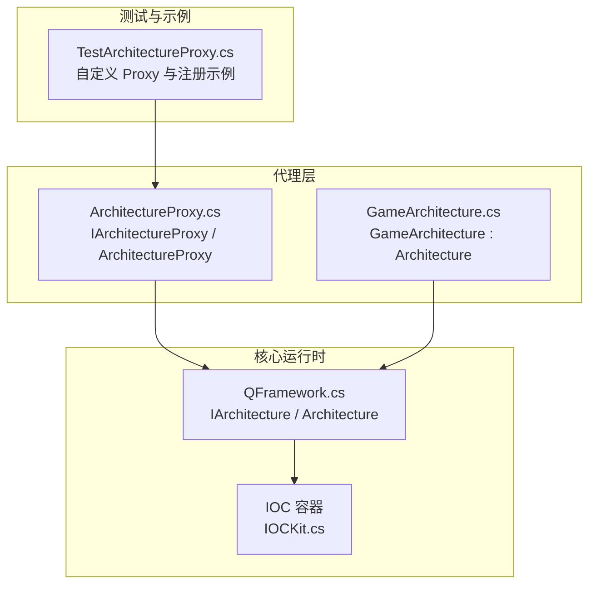
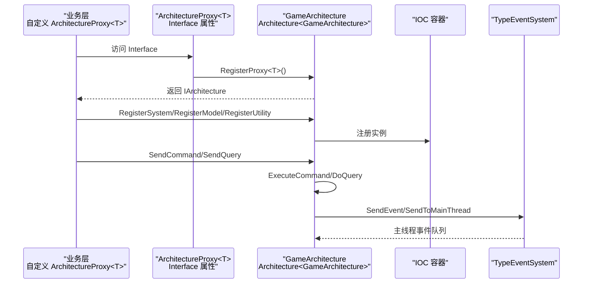
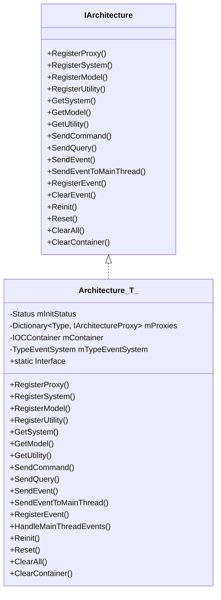
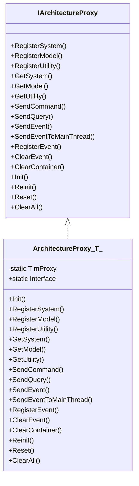
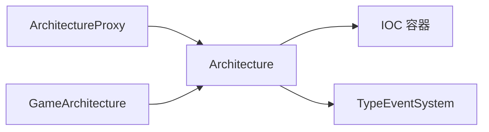

# QFramework 架构模式

<cite>
**本文引用的文件**   
- [QFramework.cs](file://Assets/Game/Framework/Qframework/Runtime/QFramework.cs)
- [ArchitectureProxy.cs](file://Assets/Game/Framework/Qframework/Runtime/Moyv/Proxies/ArchitectureProxy.cs)
- [GameArchitecture.cs](file://Assets/Game/Framework/Qframework/Runtime/Moyv/Proxies/GameArchitecture.cs)
- [TestArchitectureProxy.cs](file://Assets/Game/Framework/Qframework/Tests/Runtime/TestArchitectureProxy.cs)
- [IOCKit.cs](file://Assets/Game/Framework/Qframework/Toolkits/_CoreKit/IOCKit/IOCKit.cs)
</cite>

## 目录
1. [简介](#简介)
2. [项目结构](#项目结构)
3. [核心组件](#核心组件)
4. [架构总览](#架构总览)
5. [详细组件分析](#详细组件分析)
6. [依赖关系分析](#依赖关系分析)
7. [性能考量](#性能考量)
8. [故障排查指南](#故障排查指南)
9. [结论](#结论)
10. [附录：使用示例与最佳实践](#附录使用示例与最佳实践)

## 简介
本技术文档围绕 QFramework 的 System-Model-Utility 三层架构展开，重点阐述以下目标：
- 解释三层职责分离原则与通信机制
- 深入解析 ArchitectureProxy 抽象基类的设计模式、泛型约束、单例应用与依赖注入
- 说明 IArchitecture 接口定义的核心能力（系统注册、模型管理、工具访问、命令发送、事件处理等）
- 通过架构图表展示组件关系与生命周期管理
- 提供可操作的代码示例路径，指导如何继承 ArchitectureProxy<T> 创建自定义代理并正确注册和使用各组件

## 项目结构
本项目在 Assets/Game/Framework/Qframework 下实现了 QFramework 的核心运行时与示例。与架构模式直接相关的核心文件包括：
- 运行时核心：QFramework.cs（IArchitecture、Architecture<T>、System/Model/Command/Query 等）
- 代理层：Moyv/Proxies/ArchitectureProxy.cs（IArchitectureProxy、ArchitectureProxy<T>）
- 游戏级实现：Moyv/Proxies/GameArchitecture.cs（GameArchitecture）
- 测试用例：Tests/Runtime/TestArchitectureProxy.cs（演示自定义代理与注册流程）
- IOC 容器：Toolkits/_CoreKit/IOCKit/IOCKit.cs（可选的 IOC 能力）

图表来源
- [QFramework.cs:45-92](file://Assets/Game/Framework/Qframework/Runtime/QFramework.cs#L45-L92)
- [ArchitectureProxy.cs:7-51](file://Assets/Game/Framework/Qframework/Runtime/Moyv/Proxies/ArchitectureProxy.cs#L7-L51)
- [GameArchitecture.cs:5-10](file://Assets/Game/Framework/Qframework/Runtime/Moyv/Proxies/GameArchitecture.cs#L5-L10)
- [IOCKit.cs:142-152](file://Assets/Game/Framework/Qframework/Toolkits/_CoreKit/IOCKit/IOCKit.cs#L142-L152)

章节来源
- [QFramework.cs:45-92](file://Assets/Game/Framework/Qframework/Runtime/QFramework.cs#L45-L92)
- [ArchitectureProxy.cs:7-51](file://Assets/Game/Framework/Qframework/Runtime/Moyv/Proxies/ArchitectureProxy.cs#L7-L51)
- [GameArchitecture.cs:5-10](file://Assets/Game/Framework/Qframework/Runtime/Moyv/Proxies/GameArchitecture.cs#L5-L10)
- [IOCKit.cs:142-152](file://Assets/Game/Framework/Qframework/Toolkits/_CoreKit/IOCKit/IOCKit.cs#L142-L152)

## 核心组件
- IArchitecture 接口：定义全局架构能力，包括系统、模型、工具类的注册与获取；命令与查询的发送；事件注册与分发；容器清理与重置等。
- Architecture<T> 抽象基类：实现 IArchitecture，维护 IOC 容器、事件系统、代理注册与生命周期管理（Init/Reset/Reinit/ClearAll）。
- ArchitectureProxy<T> 抽象基类：面向业务层的统一入口，屏蔽底层细节，提供静态 Interface 便捷访问，内部委托至 GameArchitecture.Interface。
- GameArchitecture：具体架构实现，继承自 Architecture<GameArchitecture>，作为全局唯一实例承载所有组件。
- IOC 容器：用于类型映射与实例管理，支持按类型或接口解析对象。

章节来源
- [QFramework.cs:45-92](file://Assets/Game/Framework/Qframework/Runtime/QFramework.cs#L45-L92)
- [QFramework.cs:94-351](file://Assets/Game/Framework/Qframework/Runtime/QFramework.cs#L94-L351)
- [ArchitectureProxy.cs:53-197](file://Assets/Game/Framework/Qframework/Runtime/Moyv/Proxies/ArchitectureProxy.cs#L53-L197)
- [GameArchitecture.cs:5-10](file://Assets/Game/Framework/Qframework/Runtime/Moyv/Proxies/GameArchitecture.cs#L5-L10)
- [IOCKit.cs:142-152](file://Assets/Game/Framework/Qframework/Toolkits/_CoreKit/IOCKit/IOCKit.cs#L142-L152)

## 架构总览
下图展示了从业务层到核心运行时的调用链与数据流向。ArchitectureProxy<T> 作为门面，将请求转发给 GameArchitecture.Interface，后者负责组件生命周期、IOC 容器管理与事件分发。

图表来源
- [ArchitectureProxy.cs:57-65](file://Assets/Game/Framework/Qframework/Runtime/Moyv/Proxies/ArchitectureProxy.cs#L57-L65)
- [QFramework.cs:196-204](file://Assets/Game/Framework/Qframework/Runtime/QFramework.cs#L196-L204)
- [QFramework.cs:206-223](file://Assets/Game/Framework/Qframework/Runtime/QFramework.cs#L206-L223)
- [QFramework.cs:308-332](file://Assets/Game/Framework/Qframework/Runtime/QFramework.cs#L308-L332)
- [QFramework.cs:334-348](file://Assets/Game/Framework/Qframework/Runtime/QFramework.cs#L334-L348)

## 详细组件分析

### IArchitecture 接口设计
- 职责边界
  - 组件注册与获取：RegisterSystem/RegisterModel/RegisterUtility 与对应 Get* 方法
  - 命令与查询：SendCommand/SendQuery 及其重载
  - 事件系统：SendEvent/SendEventToMainThread/RegisterEvent/UnRegisterEvent/ClearEvent
  - 生命周期：Reinit/Reset/ClearAll/ClearContainer
- 设计要点
  - 以接口形式暴露最小必要能力，便于替换实现与测试
  - 通过扩展接口（如 ICanGetSystem、ICanGetModel 等）为组件提供便捷访问

章节来源
- [QFramework.cs:45-92](file://Assets/Game/Framework/Qframework/Runtime/QFramework.cs#L45-L92)
- [QFramework.cs:608-697](file://Assets/Game/Framework/Qframework/Runtime/QFramework.cs#L608-L697)

### Architecture<T> 抽象基类
- 单例与初始化
  - 静态 Interface 保证全局唯一实例
  - MakeSureArchitecture 确保 Init 仅执行一次，并在首次访问时完成初始化
- 组件生命周期
  - Reinit：重启未初始化的 Model/System
  - Reset：调用已初始化组件的 Reset 并重置状态
  - ClearAll：重置 + 清空事件 + 清空容器 + 重置代理缓存
- IOC 集成
  - mContainer 统一管理实例，支持按类型或接口解析
  - Register 时设置 Architecture 引用，按需触发 LazyInit
- 事件系统
  - 基于 TypeEventSystem 的类型安全事件分发
  - 支持主线程调度（SendToMainThread），并通过定时器在主帧处理

图表来源
- [QFramework.cs:45-92](file://Assets/Game/Framework/Qframework/Runtime/QFramework.cs#L45-L92)
- [QFramework.cs:94-351](file://Assets/Game/Framework/Qframework/Runtime/QFramework.cs#L94-L351)

章节来源
- [QFramework.cs:94-351](file://Assets/Game/Framework/Qframework/Runtime/QFramework.cs#L94-L351)

### ArchitectureProxy<T> 抽象基类
- 设计模式
  - 门面模式：对外暴露统一的 Interface 静态属性，简化访问
  - 泛型约束：T : ArchitectureProxy<T>, new() 保证派生类具备无参构造且形成自引用泛型
  - 单例式代理：通过 GameArchitecture.RegisterProxy<T> 延迟创建与缓存
- 依赖注入
  - 所有注册与获取均委托给 GameArchitecture.Interface，保持与核心解耦
- 生命周期与清理
  - Reinit/Reset/ClearAll 等方法透传至架构层，便于统一管控

图表来源
- [ArchitectureProxy.cs:7-51](file://Assets/Game/Framework/Qframework/Runtime/Moyv/Proxies/ArchitectureProxy.cs#L7-L51)
- [ArchitectureProxy.cs:53-197](file://Assets/Game/Framework/Qframework/Runtime/Moyv/Proxies/ArchitectureProxy.cs#L53-L197)

章节来源
- [ArchitectureProxy.cs:53-197](file://Assets/Game/Framework/Qframework/Runtime/Moyv/Proxies/ArchitectureProxy.cs#L53-L197)

### GameArchitecture 具体实现
- 角色定位
  - 作为 Architecture<GameArchitecture> 的具体实现，承担全局架构实例的职责
- 初始化策略
  - 重写 Init 为空实现，可在其中进行全局基础配置（如注册默认系统/模型/工具）

章节来源
- [GameArchitecture.cs:5-10](file://Assets/Game/Framework/Qframework/Runtime/Moyv/Proxies/GameArchitecture.cs#L5-L10)

### IOC 容器与依赖注入
- 功能概述
  - 提供类型映射与实例解析，支持按类型或接口获取对象
  - 支持命名实例、关系映射、批量注入等高级特性
- 与架构集成
  - Architecture<T> 内部使用 IOC 容器管理 System/Model/Utility 的生命周期与解析

章节来源
- [QFramework.cs:189-306](file://Assets/Game/Framework/Qframework/Runtime/QFramework.cs#L189-L306)
- [IOCKit.cs:142-152](file://Assets/Game/Framework/Qframework/Toolkits/_CoreKit/IOCKit/IOCKit.cs#L142-L152)

## 依赖关系分析
- 耦合与内聚
  - ArchitectureProxy<T> 对 GameArchitecture 存在强依赖，但通过 IArchitecture 接口降低耦合度
  - Architecture<T> 集中管理 IOC 与事件系统，内聚度高
- 外部依赖
  - 事件系统 TypeEventSystem 提供类型安全的事件分发
  - IOC 容器 IOCKit 提供依赖注入能力

图表来源
- [ArchitectureProxy.cs:53-197](file://Assets/Game/Framework/Qframework/Runtime/Moyv/Proxies/ArchitectureProxy.cs#L53-L197)
- [QFramework.cs:94-351](file://Assets/Game/Framework/Qframework/Runtime/QFramework.cs#L94-L351)
- [GameArchitecture.cs:5-10](file://Assets/Game/Framework/Qframework/Runtime/Moyv/Proxies/GameArchitecture.cs#L5-L10)

章节来源
- [ArchitectureProxy.cs:53-197](file://Assets/Game/Framework/Qframework/Runtime/Moyv/Proxies/ArchitectureProxy.cs#L53-L197)
- [QFramework.cs:94-351](file://Assets/Game/Framework/Qframework/Runtime/QFramework.cs#L94-L351)
- [GameArchitecture.cs:5-10](file://Assets/Game/Framework/Qframework/Runtime/Moyv/Proxies/GameArchitecture.cs#L5-L10)

## 性能考量
- 懒加载与一次性初始化
  - Architecture<T>.MakeSureArchitecture 确保 Init 只执行一次，避免重复开销
  - System/Model 支持 LazyInit，按需初始化减少启动成本
- 事件分发
  - 主线程事件通过队列异步派发，避免阻塞非主线程逻辑
- IOC 解析
  - 基于字典的查找与多键映射，注意避免频繁反射与大量短生命周期对象的创建

[本节为通用性能建议，不直接分析具体文件]

## 故障排查指南
- 常见问题
  - 组件未初始化：检查是否在代理 Init 中正确注册，或是否启用了 LazyInit 但未访问
  - 事件未触发：确认是否正确注册监听器，以及是否在主线程处理事件
  - 重复注册警告：IOC 容器会对重复注册输出日志，需检查注册顺序与覆盖策略
- 调试建议
  - 使用 ArchitectureProxy.Interface 统一入口，便于断点追踪
  - 利用 Reset/Reinit/ClearAll 组合进行场景切换后的状态恢复

章节来源
- [QFramework.cs:116-137](file://Assets/Game/Framework/Qframework/Runtime/QFramework.cs#L116-L137)
- [QFramework.cs:148-187](file://Assets/Game/Framework/Qframework/Runtime/QFramework.cs#L148-L187)
- [QFramework.cs:950-978](file://Assets/Game/Framework/Qframework/Runtime/QFramework.cs#L950-L978)

## 结论
QFramework 通过 IArchitecture 与 Architecture<T> 构建了清晰的系统骨架，结合 ArchitectureProxy<T> 的门面设计与 IOC 容器的依赖注入能力，实现了松耦合、可扩展的 System-Model-Utility 三层架构。借助类型安全的事件系统与主线程调度，开发者可以高效组织复杂业务逻辑，同时保持良好的生命周期管理与资源回收策略。

[本节为总结性内容，不直接分析具体文件]

## 附录：使用示例与最佳实践
- 自定义架构代理
  - 继承 ArchitectureProxy<T>，实现 Init 方法，在其中注册所需的 System、Model、Utility
  - 通过 ArchitectureProxy<T>.Interface 获取 IArchitecture 进行后续操作
  - 参考测试用例中的 Proxy1/Proxy2 示例，了解注册与获取流程

章节来源
- [TestArchitectureProxy.cs:45-61](file://Assets/Game/Framework/Qframework/Tests/Runtime/TestArchitectureProxy.cs#L45-L61)

- 注册与获取组件
  - 使用 RegisterSystem/RegisterModel/RegisterUtility 注册实例
  - 使用 GetSystem<T>/GetModel<T>/GetUtility<T> 获取实例
  - 对于需要自动创建的 System，可通过 GetSystem<T>(autoCreate=true) 获取

章节来源
- [QFramework.cs:206-242](file://Assets/Game/Framework/Qframework/Runtime/QFramework.cs#L206-L242)
- [QFramework.cs:273-306](file://Assets/Game/Framework/Qframework/Runtime/QFramework.cs#L273-L306)

- 命令与查询
  - 使用 SendCommand<T>() 或 SendCommand(command) 发送命令
  - 使用 SendQuery(query) 发起查询并获取结果

章节来源
- [QFramework.cs:308-332](file://Assets/Game/Framework/Qframework/Runtime/QFramework.cs#L308-L332)

- 事件处理
  - 使用 RegisterEvent<T>(onEvent) 订阅事件
  - 使用 SendEvent<T>() 或 SendEvent(e) 发布事件
  - 使用 SendEventToMainThread<T>() 将事件投递到主线程处理

章节来源
- [QFramework.cs:334-348](file://Assets/Game/Framework/Qframework/Runtime/QFramework.cs#L334-L348)

- 生命周期管理
  - 使用 Reset() 重置所有已初始化组件
  - 使用 Reinit() 重新初始化未初始化的组件
  - 使用 ClearAll() 彻底清理事件与实例

章节来源
- [QFramework.cs:148-187](file://Assets/Game/Framework/Qframework/Runtime/QFramework.cs#L148-L187)