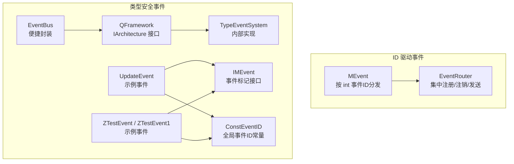
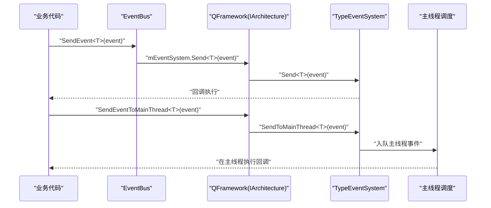
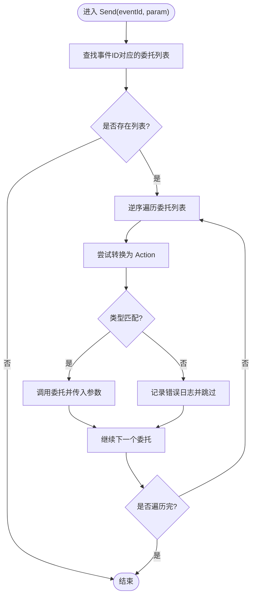
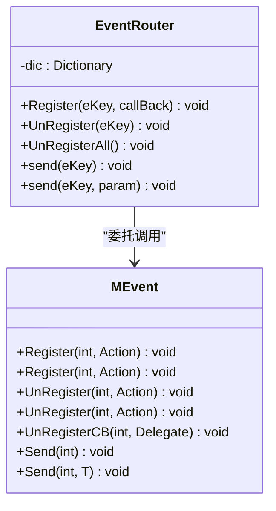
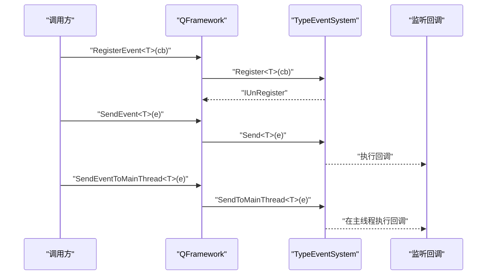
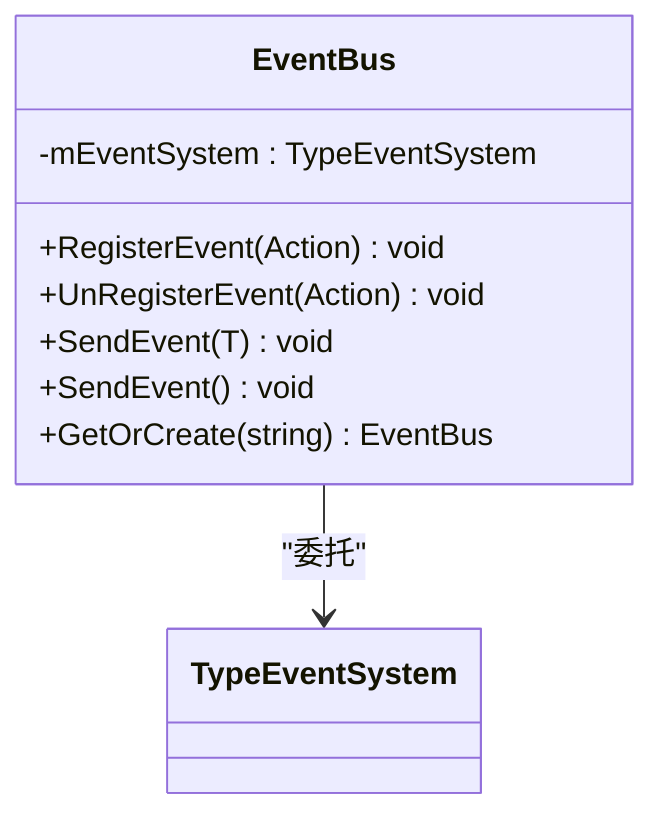
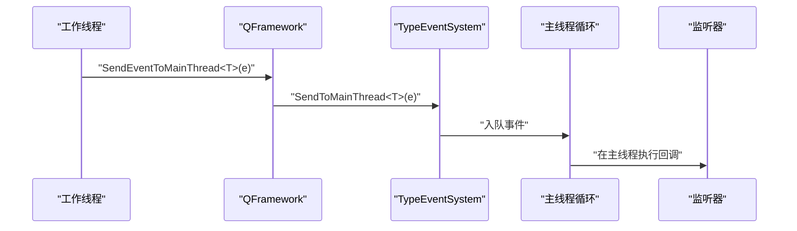
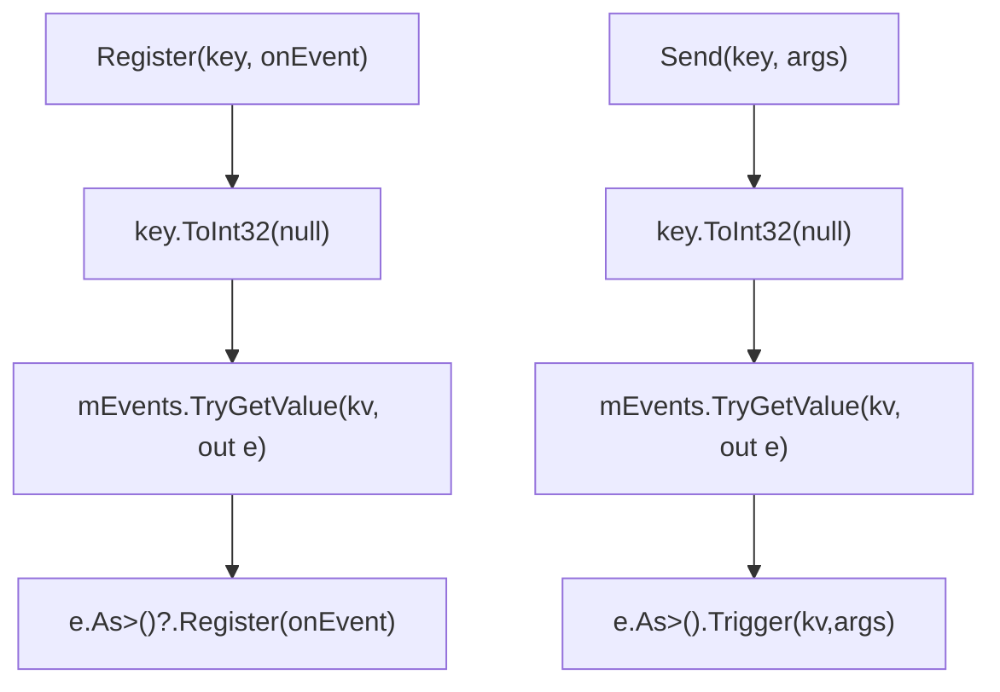
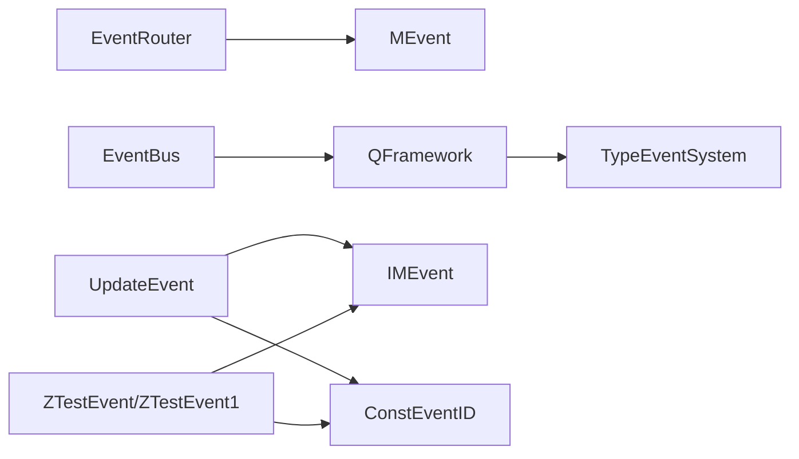

# 事件消息系统

<cite>
**本文引用的文件**
- [MEvent.cs](file://Assets/Game/Framework/MEvent/MEvent.cs)
- [EventRouter.cs](file://Assets/Game/Scripts/Game/Runtime/Logic/Router/EventRouter.cs)
- [QFramework.cs](file://Assets/Game/Framework/Qframework/Runtime/QFramework.cs)
- [EventBus.cs](file://Assets/Game/Framework/Qframework/Runtime/Moyv/EventBus.cs)
- [ConstEventID.cs](file://Assets/Game/Framework/Qframework/Runtime/Moyv/Events/ConstEventID.cs)
- [IMEvent.cs](file://Assets/Game/Framework/Qframework/Runtime/Moyv/Events/IMEvent.cs)
- [UpdateEvent.cs](file://Assets/Game/Framework/Qframework/Runtime/Moyv/Events/UpdateEvent.cs)
- [ZTestEvent.cs](file://Assets/Game/Framework/Qframework/Runtime/Moyv/Events/ZTestEvent.cs)
- [ZTestEvent1.cs](file://Assets/Game/Framework/Qframework/Runtime/Moyv/Events/ZTestEvent1.cs)
- [EnumEventSystem.cs](file://Assets/Game/Framework/Qframework/Toolkits/_CoreKit/EventKit/EventSystem/EnumEventSystem.cs)
- [TimerSystem.cs](file://Assets/Game/Framework/Qframework/Runtime/Moyv/Systems/TimerSystem.cs)
</cite>

## 目录
1. [简介](#简介)
2. [项目结构](#项目结构)
3. [核心组件](#核心组件)
4. [架构总览](#架构总览)
5. [详细组件分析](#详细组件分析)
6. [依赖关系分析](#依赖关系分析)
7. [性能考虑](#性能考虑)
8. [故障排查指南](#故障排查指南)
9. [结论](#结论)
10. [附录](#附录)

## 简介
本技术文档围绕事件消息系统，深入解析基于 EventBus 的发布订阅模式与类型安全的事件机制。重点说明以下能力：
- 基于 MEvent 的 ID 驱动事件（Send、Register、UnRegister）
- 基于 TypeEventSystem 的类型安全事件（SendEvent、RegisterEvent、UnRegisterEvent）
- 主线程事件调度 SendEventToMainThread 的工作方式与线程安全保证
- 事件队列管理与内存泄漏防护
- ConstEventID 常量事件 ID 的使用模式与命名规范
- 自定义事件类型的定义、监听器注册与触发流程
- 事件流程图与性能优化技巧（事件池化、批量处理等）

## 项目结构
事件系统由两套实现组成：
- 旧版 ID 驱动事件：MEvent + EventRouter
- 新版类型安全事件：TypeEventSystem（通过 QFramework 暴露）+ EventBus 封装 + IMEvent/ConstEventID 约定



图表来源
- [MEvent.cs:1-288](file://Assets/Game/Framework/MEvent/MEvent.cs#L1-L288)
- [EventRouter.cs:46-90](file://Assets/Game/Scripts/Game/Runtime/Logic/Router/EventRouter.cs#L46-L90)
- [QFramework.cs:330-365](file://Assets/Game/Framework/Qframework/Runtime/QFramework.cs#L330-L365)
- [EventBus.cs:1-52](file://Assets/Game/Framework/Qframework/Runtime/Moyv/EventBus.cs#L1-L52)
- [ConstEventID.cs:1-9](file://Assets/Game/Framework/Qframework/Runtime/Moyv/Events/ConstEventID.cs#L1-L9)
- [IMEvent.cs:1-4](file://Assets/Game/Framework/Qframework/Runtime/Moyv/Events/IMEvent.cs#L1-L4)
- [UpdateEvent.cs:1-7](file://Assets/Game/Framework/Qframework/Runtime/Moyv/Events/UpdateEvent.cs#L1-L7)
- [ZTestEvent.cs:1-5](file://Assets/Game/Framework/Qframework/Runtime/Moyv/Events/ZTestEvent.cs#L1-L5)
- [ZTestEvent1.cs:1-5](file://Assets/Game/Framework/Qframework/Runtime/Moyv/Events/ZTestEvent1.cs#L1-L5)

章节来源
- [MEvent.cs:1-288](file://Assets/Game/Framework/MEvent/MEvent.cs#L1-L288)
- [EventRouter.cs:46-90](file://Assets/Game/Scripts/Game/Runtime/Logic/Router/EventRouter.cs#L46-L90)
- [QFramework.cs:330-365](file://Assets/Game/Framework/Qframework/Runtime/QFramework.cs#L330-L365)
- [EventBus.cs:1-52](file://Assets/Game/Framework/Qframework/Runtime/Moyv/EventBus.cs#L1-L52)
- [ConstEventID.cs:1-9](file://Assets/Game/Framework/Qframework/Runtime/Moyv/Events/ConstEventID.cs#L1-L9)
- [IMEvent.cs:1-4](file://Assets/Game/Framework/Qframework/Runtime/Moyv/Events/IMEvent.cs#L1-L4)
- [UpdateEvent.cs:1-7](file://Assets/Game/Framework/Qframework/Runtime/Moyv/Events/UpdateEvent.cs#L1-L7)
- [ZTestEvent.cs:1-5](file://Assets/Game/Framework/Qframework/Runtime/Moyv/Events/ZTestEvent.cs#L1-L5)
- [ZTestEvent1.cs:1-5](file://Assets/Game/Framework/Qframework/Runtime/Moyv/Events/ZTestEvent1.cs#L1-L5)

## 核心组件
- MEvent：基于 int 事件ID的静态事件管理器，提供 Register/Send/UnRegister 等方法，内部使用字典维护事件ID到委托列表的映射。
- EventRouter：对 MEvent 的轻量封装，提供统一的注册、注销和发送入口，便于集中管理。
- QFramework（IArchitecture）：对外暴露类型安全事件 API（SendEvent、RegisterEvent、UnRegisterEvent、SendEventToMainThread），内部委托给 TypeEventSystem。
- EventBus：对 QFramework 的进一步封装，提供 GetOrCreate 单例式访问，简化跨模块调用。
- IMEvent/ConstEventID：为事件类型提供统一标识约定，便于在需要时与 ID 体系互通。
- UpdateEvent/ZTestEvent/ZTestEvent1：示例事件类型，展示如何结合 IMEvent 与 ConstEventID 定义事件。

章节来源
- [MEvent.cs:1-288](file://Assets/Game/Framework/MEvent/MEvent.cs#L1-L288)
- [EventRouter.cs:46-90](file://Assets/Game/Scripts/Game/Runtime/Logic/Router/EventRouter.cs#L46-L90)
- [QFramework.cs:330-365](file://Assets/Game/Framework/Qframework/Runtime/QFramework.cs#L330-L365)
- [EventBus.cs:1-52](file://Assets/Game/Framework/Qframework/Runtime/Moyv/EventBus.cs#L1-L52)
- [ConstEventID.cs:1-9](file://Assets/Game/Framework/Qframework/Runtime/Moyv/Events/ConstEventID.cs#L1-L9)
- [IMEvent.cs:1-4](file://Assets/Game/Framework/Qframework/Runtime/Moyv/Events/IMEvent.cs#L1-L4)
- [UpdateEvent.cs:1-7](file://Assets/Game/Framework/Qframework/Runtime/Moyv/Events/UpdateEvent.cs#L1-L7)
- [ZTestEvent.cs:1-5](file://Assets/Game/Framework/Qframework/Runtime/Moyv/Events/ZTestEvent.cs#L1-L5)
- [ZTestEvent1.cs:1-5](file://Assets/Game/Framework/Qframework/Runtime/Moyv/Events/ZTestEvent1.cs#L1-L5)

## 架构总览
下图展示了从业务层到事件系统的调用路径，以及主线程调度的关键节点。



图表来源
- [EventBus.cs:21-29](file://Assets/Game/Framework/Qframework/Runtime/Moyv/EventBus.cs#L21-L29)
- [QFramework.cs:336-342](file://Assets/Game/Framework/Qframework/Runtime/QFramework.cs#L336-L342)

## 详细组件分析

### MEvent（ID 驱动事件）
- 设计要点
  - 以 int 事件ID为键，存储多个委托（Action/Action<T>）。
  - Register 支持无参与单参泛型；Send 对应分发；UnRegister 支持精确移除。
  - 重复注册会发出警告日志，避免重复回调。
  - Send 中若委托类型不匹配，会记录错误日志提示参数类型不一致。
- 线程模型
  - 同步直接调用，未内置线程安全锁或主线程调度。
- 内存管理
  - OnReset 清空所有事件映射，适合场景切换时释放引用。
  - UnRegisterCB 可精确移除指定委托，防止悬挂引用导致内存泄漏。



图表来源
- [MEvent.cs:144-165](file://Assets/Game/Framework/MEvent/MEvent.cs#L144-L165)

章节来源
- [MEvent.cs:25-79](file://Assets/Game/Framework/MEvent/MEvent.cs#L25-L79)
- [MEvent.cs:116-126](file://Assets/Game/Framework/MEvent/MEvent.cs#L116-L126)
- [MEvent.cs:128-165](file://Assets/Game/Framework/MEvent/MEvent.cs#L128-L165)
- [MEvent.cs:15-23](file://Assets/Game/Framework/MEvent/MEvent.cs#L15-L23)

### EventRouter（MEvent 的集中封装）
- 职责
  - 统一管理某模块内的事件注册、注销与发送，降低散乱调用带来的维护成本。
- 关键点
  - 内部持有 dic 映射，注册时调用 MEvent.Register，注销时调用 MEvent.UnRegisterCB 并从本地字典移除。
  - send 方法转发至 MEvent.Send。



图表来源
- [EventRouter.cs:46-90](file://Assets/Game/Scripts/Game/Runtime/Logic/Router/EventRouter.cs#L46-L90)
- [MEvent.cs:25-79](file://Assets/Game/Framework/MEvent/MEvent.cs#L25-L79)
- [MEvent.cs:116-165](file://Assets/Game/Framework/MEvent/MEvent.cs#L116-L165)

章节来源
- [EventRouter.cs:46-90](file://Assets/Game/Scripts/Game/Runtime/Logic/Router/EventRouter.cs#L46-L90)

### QFramework 类型安全事件（TypeEventSystem 封装）
- 对外 API
  - SendEvent<T>() / SendEvent<T>(T e)：发送类型安全事件。
  - RegisterEvent<T>(Action<T>)：返回 IUnRegister，用于精准注销。
  - UnRegisterEvent<T>(Action<T>)：注销指定监听。
  - SendEventToMainThread<T>() / SendEventToMainThread<T>(T e)：将事件入队到主线程执行。
- 内部实现
  - 通过私有 mTypeEventSystem 字段委托给 TypeEventSystem 完成实际分发与主线程调度。
- 扩展点
  - OnGlobalEventExtension 提供针对实现了 IOnEvent<T> 的对象的全局注册/注销扩展方法。



图表来源
- [QFramework.cs:336-346](file://Assets/Game/Framework/Qframework/Runtime/QFramework.cs#L336-L346)
- [QFramework.cs:358-365](file://Assets/Game/Framework/Qframework/Runtime/QFramework.cs#L358-L365)

章节来源
- [QFramework.cs:330-365](file://Assets/Game/Framework/Qframework/Runtime/QFramework.cs#L330-L365)

### EventBus（便捷封装）
- 作用
  - 提供 GetOrCreate(key) 获取或创建 EventBus 实例，内部持有 TypeEventSystem 实例，简化跨模块事件调用。
- 主要方法
  - RegisterEvent<T>(Action<T>)
  - UnRegisterEvent<T>(Action<T>)
  - SendEvent<T>(T)
  - SendEvent<T>()（空参构造事件）



图表来源
- [EventBus.cs:1-52](file://Assets/Game/Framework/Qframework/Runtime/Moyv/EventBus.cs#L1-L52)

章节来源
- [EventBus.cs:1-52](file://Assets/Game/Framework/Qframework/Runtime/Moyv/EventBus.cs#L1-L52)

### 事件类型与常量 ID 约定（IMEvent/ConstEventID）
- IMEvent
  - 定义事件类型需实现的接口，包含 EventID 属性，便于与 ID 体系互通。
- ConstEventID
  - 集中管理事件ID常量，建议按功能域划分编号段，避免冲突。
- 示例事件
  - UpdateEvent：携带 deltaTime 的更新事件。
  - ZTestEvent/ZTestEvent1：测试用事件，演示同一 ID 的不同事件类型。

```mermaid
erDiagram
IMEVENT {
int EventID
}
CONSTEVENTID {
int UpdateEvent
int LateUpdateEvent
int FixedUpdateEvent
int ZTestEvent
int ZTestEvent1
}
UPDATEEVENT {
float deltaTime
}
ZTESTEVENT {
}
ZTESTEVENT1 {
}
UPDATEEVENT ||..|| IMEVENT : "实现"
ZTESTEVENT ||..|| IMEVENT : "实现"
ZTESTEVENT1 ||..|| IMEVENT : "实现"
UPDATEEVENT --|| CONSTEVENTID : "使用"
ZTESTEVENT --|| CONSTEVENTID : "使用"
ZTESTEVENT1 --|| CONSTEVENTID : "使用"
```

图表来源
- [IMEvent.cs:1-4](file://Assets/Game/Framework/Qframework/Runtime/Moyv/Events/IMEvent.cs#L1-L4)
- [ConstEventID.cs:1-9](file://Assets/Game/Framework/Qframework/Runtime/Moyv/Events/ConstEventID.cs#L1-L9)
- [UpdateEvent.cs:1-7](file://Assets/Game/Framework/Qframework/Runtime/Moyv/Events/UpdateEvent.cs#L1-L7)
- [ZTestEvent.cs:1-5](file://Assets/Game/Framework/Qframework/Runtime/Moyv/Events/ZTestEvent.cs#L1-L5)
- [ZTestEvent1.cs:1-5](file://Assets/Game/Framework/Qframework/Runtime/Moyv/Events/ZTestEvent1.cs#L1-L5)

章节来源
- [IMEvent.cs:1-4](file://Assets/Game/Framework/Qframework/Runtime/Moyv/Events/IMEvent.cs#L1-L4)
- [ConstEventID.cs:1-9](file://Assets/Game/Framework/Qframework/Runtime/Moyv/Events/ConstEventID.cs#L1-L9)
- [UpdateEvent.cs:1-7](file://Assets/Game/Framework/Qframework/Runtime/Moyv/Events/UpdateEvent.cs#L1-L7)
- [ZTestEvent.cs:1-5](file://Assets/Game/Framework/Qframework/Runtime/Moyv/Events/ZTestEvent.cs#L1-L5)
- [ZTestEvent1.cs:1-5](file://Assets/Game/Framework/Qframework/Runtime/Moyv/Events/ZTestEvent1.cs#L1-L5)

### 主线程事件调度（SendEventToMainThread）
- 工作流
  - 非主线程调用 SendEventToMainThread 后，事件会被入队到主线程队列，随后在主线程帧循环中消费并执行回调。
- 典型用法
  - 定时器系统 TimerSystem 在初始化时注册 UpdateEvent，并在销毁时注销，确保生命周期内正确接收事件。



图表来源
- [QFramework.cs:340-342](file://Assets/Game/Framework/Qframework/Runtime/QFramework.cs#L340-L342)
- [TimerSystem.cs:133-144](file://Assets/Game/Framework/Qframework/Runtime/Moyv/Systems/TimerSystem.cs#L133-L144)

章节来源
- [QFramework.cs:340-342](file://Assets/Game/Framework/Qframework/Runtime/QFramework.cs#L340-L342)
- [TimerSystem.cs:133-144](file://Assets/Game/Framework/Qframework/Runtime/Moyv/Systems/TimerSystem.cs#L133-L144)

### 枚举事件系统（EnumEventSystem）
- 特点
  - 支持以枚举作为事件键，内部转换为 int 进行分发，适用于强类型键的场景。
- 主要方法
  - Register<T>(key, onEvent)
  - UnRegister<T>(key, onEvent)
  - Send<T>(key, params object[])



图表来源
- [EnumEventSystem.cs:44-81](file://Assets/Game/Framework/Qframework/Toolkits/_CoreKit/EventKit/EventSystem/EnumEventSystem.cs#L44-L81)

章节来源
- [EnumEventSystem.cs:44-81](file://Assets/Game/Framework/Qframework/Toolkits/_CoreKit/EventKit/EventSystem/EnumEventSystem.cs#L44-L81)

## 依赖关系分析
- MEvent 被 EventRouter 依赖，形成“底层分发 + 上层封装”的结构。
- QFramework 内部组合 TypeEventSystem，并通过 IArchitecture 暴露事件 API。
- EventBus 依赖 QFramework，提供便捷的单例式访问。
- 事件类型（UpdateEvent/ZTestEvent/ZTestEvent1）依赖 IMEvent 与 ConstEventID，形成“类型 + 常量ID”的双轨约定。



图表来源
- [EventRouter.cs:46-90](file://Assets/Game/Scripts/Game/Runtime/Logic/Router/EventRouter.cs#L46-L90)
- [MEvent.cs:1-288](file://Assets/Game/Framework/MEvent/MEvent.cs#L1-L288)
- [EventBus.cs:1-52](file://Assets/Game/Framework/Qframework/Runtime/Moyv/EventBus.cs#L1-L52)
- [QFramework.cs:330-365](file://Assets/Game/Framework/Qframework/Runtime/QFramework.cs#L330-L365)
- [IMEvent.cs:1-4](file://Assets/Game/Framework/Qframework/Runtime/Moyv/Events/IMEvent.cs#L1-L4)
- [ConstEventID.cs:1-9](file://Assets/Game/Framework/Qframework/Runtime/Moyv/Events/ConstEventID.cs#L1-L9)
- [UpdateEvent.cs:1-7](file://Assets/Game/Framework/Qframework/Runtime/Moyv/Events/UpdateEvent.cs#L1-L7)
- [ZTestEvent.cs:1-5](file://Assets/Game/Framework/Qframework/Runtime/Moyv/Events/ZTestEvent.cs#L1-L5)
- [ZTestEvent1.cs:1-5](file://Assets/Game/Framework/Qframework/Runtime/Moyv/Events/ZTestEvent1.cs#L1-L5)

章节来源
- [EventRouter.cs:46-90](file://Assets/Game/Scripts/Game/Runtime/Logic/Router/EventRouter.cs#L46-L90)
- [MEvent.cs:1-288](file://Assets/Game/Framework/MEvent/MEvent.cs#L1-L288)
- [EventBus.cs:1-52](file://Assets/Game/Framework/Qframework/Runtime/Moyv/EventBus.cs#L1-L52)
- [QFramework.cs:330-365](file://Assets/Game/Framework/Qframework/Runtime/QFramework.cs#L330-L365)
- [IMEvent.cs:1-4](file://Assets/Game/Framework/Qframework/Runtime/Moyv/Events/IMEvent.cs#L1-L4)
- [ConstEventID.cs:1-9](file://Assets/Game/Framework/Qframework/Runtime/Moyv/Events/ConstEventID.cs#L1-L9)
- [UpdateEvent.cs:1-7](file://Assets/Game/Framework/Qframework/Runtime/Moyv/Events/UpdateEvent.cs#L1-L7)
- [ZTestEvent.cs:1-5](file://Assets/Game/Framework/Qframework/Runtime/Moyv/Events/ZTestEvent.cs#L1-L5)
- [ZTestEvent1.cs:1-5](file://Assets/Game/Framework/Qframework/Runtime/Moyv/Events/ZTestEvent1.cs#L1-L5)

## 性能考虑
- 事件池化
  - 对于高频事件（如 UpdateEvent），建议使用对象池复用事件实例，减少 GC 压力。可在 SendEventToMainThread 前从池中取出事件，回调结束后归还。
- 批量处理
  - 将多事件合并为一帧内批量派发，减少主线程调度开销。例如在固定时间窗口内收集事件，再一次性分发。
- 去重与过滤
  - 在注册阶段避免重复监听；在发送前根据条件过滤无关监听者，降低无效回调数量。
- 主线程节流
  - 对高频率的主线程事件进行节流或限流，避免阻塞渲染帧。
- 数据结构选择
  - 对于 ID 驱动事件，确保事件ID分布合理，避免热点冲突；必要时采用分桶策略提升查找效率。

[本节为通用指导，不涉及具体文件分析]

## 故障排查指南
- 事件参数类型不一致
  - 现象：Send<T> 时回调无法匹配，出现错误日志。
  - 排查：确认 Register 与 Send 使用的泛型类型一致。
  - 参考路径：[MEvent.cs:144-165](file://Assets/Game/Framework/MEvent/MEvent.cs#L144-L165)
- 重复注册警告
  - 现象：Register 时输出重复注册警告。
  - 排查：检查是否在多处重复注册相同回调；使用 IUnRegister 或 UnRegister 精确注销。
  - 参考路径：[MEvent.cs:60-79](file://Assets/Game/Framework/MEvent/MEvent.cs#L60-L79)
- 主线程事件未执行
  - 现象：SendEventToMainThread 后回调未触发。
  - 排查：确认主线程循环是否正确消费事件队列；在编辑器环境下需在 EditorApplication.update 中处理。
  - 参考路径：[QFramework.cs:340-342](file://Assets/Game/Framework/Qframework/Runtime/QFramework.cs#L340-L342)
- 内存泄漏风险
  - 现象：场景切换后仍有回调被调用。
  - 排查：确保在对象销毁时调用 UnRegisterEvent 或 OnReset 清理事件映射。
  - 参考路径：[MEvent.cs:15-23](file://Assets/Game/Framework/MEvent/MEvent.cs#L15-L23), [EventRouter.cs:65-72](file://Assets/Game/Scripts/Game/Runtime/Logic/Router/EventRouter.cs#L65-L72)

章节来源
- [MEvent.cs:60-79](file://Assets/Game/Framework/MEvent/MEvent.cs#L60-L79)
- [MEvent.cs:144-165](file://Assets/Game/Framework/MEvent/MEvent.cs#L144-L165)
- [MEvent.cs:15-23](file://Assets/Game/Framework/MEvent/MEvent.cs#L15-L23)
- [EventRouter.cs:65-72](file://Assets/Game/Scripts/Game/Runtime/Logic/Router/EventRouter.cs#L65-L72)
- [QFramework.cs:340-342](file://Assets/Game/Framework/Qframework/Runtime/QFramework.cs#L340-L342)

## 结论
本事件消息系统提供了两套互补的实现：
- MEvent：轻量、高效、基于 ID 的事件分发，适合简单场景与快速集成。
- TypeEventSystem（QFramework）：类型安全、主线程调度、生命周期友好，适合大型项目的解耦通信。

通过合理的注册/注销策略、事件池化与批量处理，可以在保证性能的同时有效避免内存泄漏与主线程卡顿。

[本节为总结性内容，不涉及具体文件分析]

## 附录
- 使用示例（路径指引）
  - 定义自定义事件类型：参考 [UpdateEvent.cs:1-7](file://Assets/Game/Framework/Qframework/Runtime/Moyv/Events/UpdateEvent.cs#L1-L7)、[ZTestEvent.cs:1-5](file://Assets/Game/Framework/Qframework/Runtime/Moyv/Events/ZTestEvent.cs#L1-L5)
  - 注册事件监听器：参考 [QFramework.cs:344-346](file://Assets/Game/Framework/Qframework/Runtime/QFramework.cs#L344-L346)
  - 触发事件传递：参考 [QFramework.cs:336-342](file://Assets/Game/Framework/Qframework/Runtime/QFramework.cs#L336-L342)
  - 主线程事件调度：参考 [QFramework.cs:340-342](file://Assets/Game/Framework/Qframework/Runtime/QFramework.cs#L340-L342)
  - 使用 EventBus 便捷访问：参考 [EventBus.cs:21-29](file://Assets/Game/Framework/Qframework/Runtime/Moyv/EventBus.cs#L21-L29)
  - 使用 MEvent 进行 ID 驱动事件：参考 [MEvent.cs:25-79](file://Assets/Game/Framework/MEvent/MEvent.cs#L25-L79)、[MEvent.cs:128-165](file://Assets/Game/Framework/MEvent/MEvent.cs#L128-L165)
  - 使用 EventRouter 集中管理：参考 [EventRouter.cs:46-90](file://Assets/Game/Scripts/Game/Runtime/Logic/Router/EventRouter.cs#L46-L90)
  - 使用 EnumEventSystem 枚举键事件：参考 [EnumEventSystem.cs:44-81](file://Assets/Game/Framework/Qframework/Toolkits/_CoreKit/EventKit/EventSystem/EnumEventSystem.cs#L44-L81)

[本节为使用指引，不涉及具体文件分析]