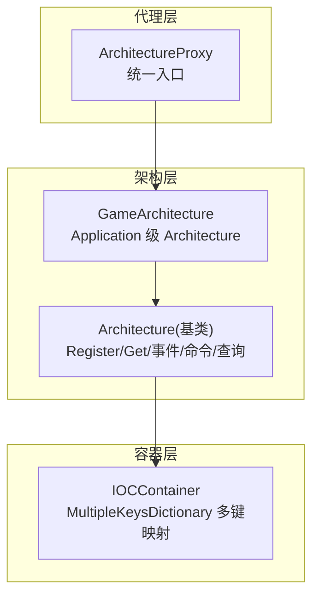
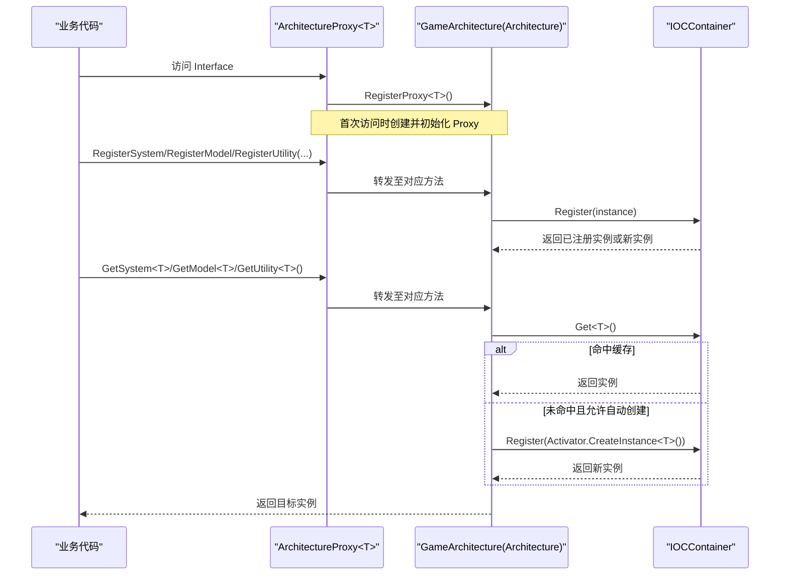
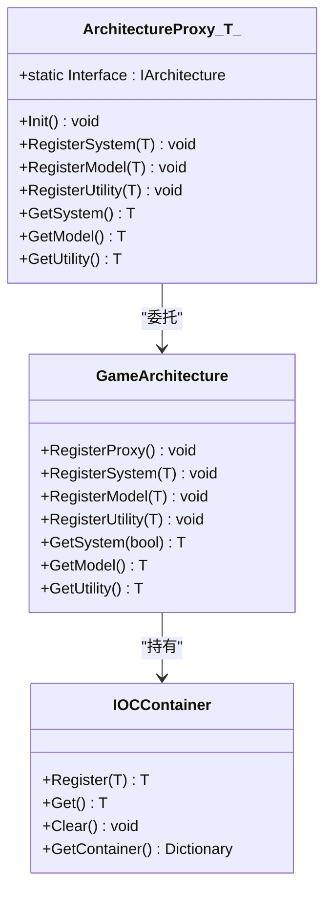
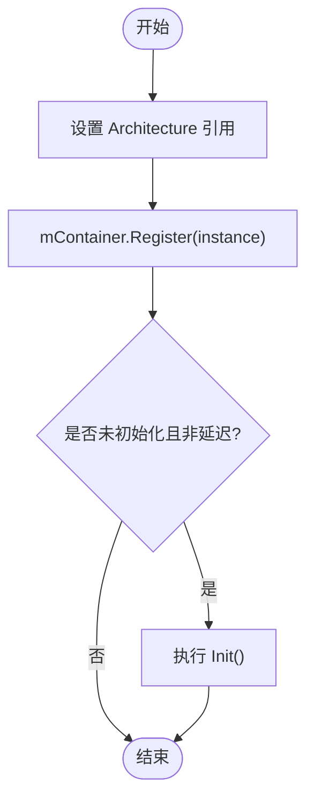
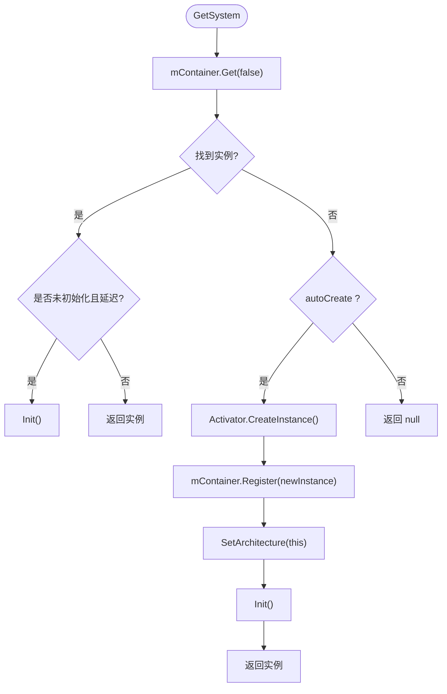
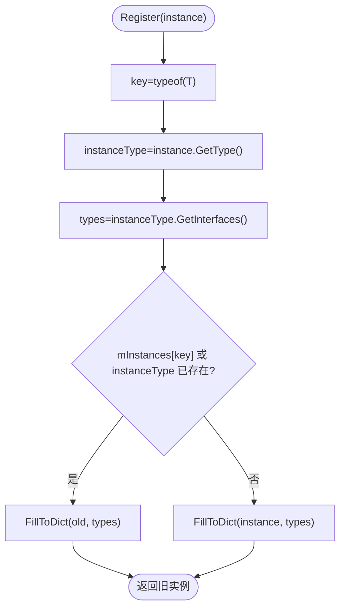
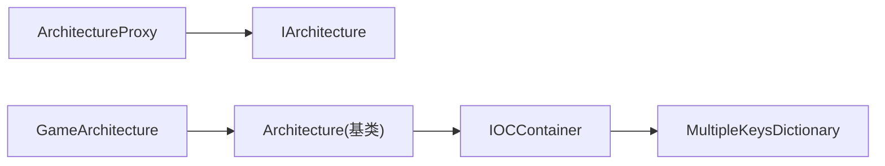

# 依赖注入容器

<cite>
**本文引用的文件**   
- [ArchitectureProxy.cs](file://Assets/Game/Framework/Qframework/Runtime/Moyv/Proxies/ArchitectureProxy.cs)
- [GameArchitecture.cs](file://Assets/Game/Framework/Qframework/Runtime/Moyv/Proxies/GameArchitecture.cs)
- [QFramework.cs](file://Assets/Game/Framework/Qframework/Runtime/QFramework.cs)
- [TestArchitectureProxy.cs](file://Assets/Game/Framework/Qframework/Tests/Runtime/TestArchitectureProxy.cs)
</cite>

## 目录
1. [简介](#简介)
2. [项目结构](#项目结构)
3. [核心组件](#核心组件)
4. [架构总览](#架构总览)
5. [详细组件分析](#详细组件分析)
6. [依赖关系分析](#依赖关系分析)
7. [性能考量](#性能考量)
8. [故障排查指南](#故障排查指南)
9. [结论](#结论)
10. [附录：使用示例与最佳实践](#附录使用示例与最佳实践)

## 简介
本技术文档围绕基于 ArchitectureProxy 的依赖注入容器实现，系统性阐述其注册、获取、生命周期管理、类型约束与单例访问机制。重点覆盖以下方面：
- 基于 ArchitectureProxy 的代理式注册与获取流程
- RegisterSystem/RegisterModel/RegisterUtility 的工作流与存储结构
- GetSystem/GetModel/GetUtility 的查找算法与缓存策略
- 泛型类型约束在 DI 中的应用与类型安全保证
- 单例模式与全局访问机制（ArchitectureProxy.Interface）
- 循环依赖与冲突的处理建议
- 架构图与性能优化建议

## 项目结构
本项目中的依赖注入容器位于 Qframework 运行时模块中，关键文件如下：
- ArchitectureProxy<T>：面向业务层的统一入口代理，提供注册与获取 API，并维护对具体容器的访问
- GameArchitecture：应用级 Architecture 的具体实现，承载 IOC 容器与系统/模型/工具的管理
- QFramework.cs：包含 Architecture 基类、IOCContainer 等核心实现
- TestArchitectureProxy.cs：测试用例，验证正常注册、反向注册、未注册获取的错误路径

图示来源
- [ArchitectureProxy.cs:53-197](file://Assets/Game/Framework/Qframework/Runtime/Moyv/Proxies/ArchitectureProxy.cs#L53-L197)
- [GameArchitecture.cs:5-10](file://Assets/Game/Framework/Qframework/Runtime/Moyv/Proxies/GameArchitecture.cs#L5-L10)
- [QFramework.cs:190-351](file://Assets/Game/Framework/Qframework/Runtime/QFramework.cs#L190-L351)
- [QFramework.cs:941-978](file://Assets/Game/Framework/Qframework/Runtime/QFramework.cs#L941-L978)

章节来源
- [ArchitectureProxy.cs:53-197](file://Assets/Game/Framework/Qframework/Runtime/Moyv/Proxies/ArchitectureProxy.cs#L53-L197)
- [GameArchitecture.cs:5-10](file://Assets/Game/Framework/Qframework/Runtime/Moyv/Proxies/GameArchitecture.cs#L5-L10)
- [QFramework.cs:190-351](file://Assets/Game/Framework/Qframework/Runtime/QFramework.cs#L190-L351)

## 核心组件
- ArchitectureProxy<T>
  - 职责：为业务代码提供统一的注册/获取接口；通过静态 Interface 属性暴露全局访问点；内部委托到具体 Architecture 实例
  - 关键点：泛型自引用约束 T : ArchitectureProxy<T>, new() 确保子类可被正确构造；Init() 由框架在首次访问时调用
- GameArchitecture
  - 职责：应用级 Architecture 的具体实现，继承自 Architecture<GameArchitecture>，作为全局单例入口
- Architecture（基类，位于 QFramework.cs）
  - 职责：封装 IOC 容器 mContainer，提供 RegisterSystem/RegisterModel/RegisterUtility、GetSystem/GetModel/GetUtility、事件/命令/查询等能力
- IOCContainer
  - 职责：基于 MultipleKeysDictionary<Type, object> 的多键字典，支持按具体类型与所有公开接口进行映射与解析

章节来源
- [ArchitectureProxy.cs:53-197](file://Assets/Game/Framework/Qframework/Runtime/Moyv/Proxies/ArchitectureProxy.cs#L53-L197)
- [GameArchitecture.cs:5-10](file://Assets/Game/Framework/Qframework/Runtime/Moyv/Proxies/GameArchitecture.cs#L5-L10)
- [QFramework.cs:190-351](file://Assets/Game/Framework/Qframework/Runtime/QFramework.cs#L190-L351)
- [QFramework.cs:941-978](file://Assets/Game/Framework/Qframework/Runtime/QFramework.cs#L941-L978)

## 架构总览
下图展示了从业务侧通过 ArchitectureProxy 访问容器，再到 Architecture 与 IOCContainer 的完整调用链。

图示来源
- [ArchitectureProxy.cs:57-112](file://Assets/Game/Framework/Qframework/Runtime/Moyv/Proxies/ArchitectureProxy.cs#L57-L112)
- [QFramework.cs:196-242](file://Assets/Game/Framework/Qframework/Runtime/QFramework.cs#L196-L242)
- [QFramework.cs:941-978](file://Assets/Game/Framework/Qframework/Runtime/QFramework.cs#L941-L978)

## 详细组件分析

### ArchitectureProxy<T> 分析与工作流
- 全局访问机制
  - 通过静态属性 Interface 获取 IArchitecture，并在首次访问时调用 architecture.RegisterProxy<T>()，从而完成代理注册与 Init() 调用
- 注册方法
  - RegisterSystem/RegisterModel/RegisterUtility：将传入实例交由底层 Architecture 处理，设置 Architecture 引用并进入容器
- 获取方法
  - GetSystem<T>/GetModel<T>/GetUtility<T>：直接委托给 Architecture 的对应方法，遵循“先查缓存，再按需创建”的策略
- 生命周期控制
  - 对于 System/Model，若处于未初始化且非延迟初始化状态，则在注册或获取时触发 Init()

图示来源
- [ArchitectureProxy.cs:53-197](file://Assets/Game/Framework/Qframework/Runtime/Moyv/Proxies/ArchitectureProxy.cs#L53-L197)
- [GameArchitecture.cs:5-10](file://Assets/Game/Framework/Qframework/Runtime/Moyv/Proxies/GameArchitecture.cs#L5-L10)
- [QFramework.cs:190-351](file://Assets/Game/Framework/Qframework/Runtime/QFramework.cs#L190-L351)
- [QFramework.cs:941-978](file://Assets/Game/Framework/Qframework/Runtime/QFramework.cs#L941-L978)

章节来源
- [ArchitectureProxy.cs:53-197](file://Assets/Game/Framework/Qframework/Runtime/Moyv/Proxies/ArchitectureProxy.cs#L53-L197)

### 注册方法：RegisterSystem / RegisterModel / RegisterUtility
- RegisterSystem<TSystem>(system)
  - 设置 system.SetArchitecture(this)
  - 调用 mContainer.Register(system)，将实例及其所有接口映射入容器
  - 若实例未初始化且非延迟初始化，则立即执行 Init()
- RegisterModel<TModel>(model)
  - 与 RegisterSystem 类似，但针对 Model 的生命周期与懒加载策略
- RegisterUtility<TUtility>(utility)
  - 仅注册工具类，不触发 Init()，通常用于无状态或纯函数式服务

图示来源
- [QFramework.cs:206-223](file://Assets/Game/Framework/Qframework/Runtime/QFramework.cs#L206-L223)
- [QFramework.cs:941-978](file://Assets/Game/Framework/Qframework/Runtime/QFramework.cs#L941-L978)

章节来源
- [QFramework.cs:206-223](file://Assets/Game/Framework/Qframework/Runtime/QFramework.cs#L206-L223)

### 获取方法：GetSystem / GetModel / GetUtility
- GetSystem<TSystem>(autoCreate = true)
  - 先从容器查找，若命中且为延迟初始化，则触发 Init()
  - 若未命中且 autoCreate 为真，则通过 Activator 创建实例，注册后设置 Architecture，并执行 Init()
- GetModel<TModel>()
  - 从容器查找，若命中且为延迟初始化，则触发 Init()
- GetUtility<TUtility>()
  - 直接从容器返回，不做额外初始化逻辑

图示来源
- [QFramework.cs:225-242](file://Assets/Game/Framework/Qframework/Runtime/QFramework.cs#L225-L242)
- [QFramework.cs:273-290](file://Assets/Game/Framework/Qframework/Runtime/QFramework.cs#L273-L290)
- [QFramework.cs:306](file://Assets/Game/Framework/Qframework/Runtime/QFramework.cs#L306)

章节来源
- [QFramework.cs:225-242](file://Assets/Game/Framework/Qframework/Runtime/QFramework.cs#L225-L242)
- [QFramework.cs:273-290](file://Assets/Game/Framework/Qframework/Runtime/QFramework.cs#L273-L290)
- [QFramework.cs:306](file://Assets/Game/Framework/Qframework/Runtime/QFramework.cs#L306)

### 存储结构与查找算法（IOCContainer）
- 存储结构
  - 使用 MultipleKeysDictionary<Type, object> 维护映射，支持同一实例以多种键（具体类型+所有接口）索引
- 注册算法
  - 若目标键或实例类型已存在相同实例，则复用并填充接口映射
  - 否则写入实例及所有接口映射
- 查找算法
  - 优先按请求类型查找，命中即返回
  - 未命中时，根据上层逻辑决定是否自动创建

图示来源
- [QFramework.cs:941-978](file://Assets/Game/Framework/Qframework/Runtime/QFramework.cs#L941-L978)

章节来源
- [QFramework.cs:941-978](file://Assets/Game/Framework/Qframework/Runtime/QFramework.cs#L941-L978)

### 泛型类型约束与类型安全
- 约束说明
  - RegisterSystem<TSystem> where TSystem : class, ISystem
  - RegisterModel<TModel> where TModel : class, IModel
  - RegisterUtility<TUtility> where TUtility : class, IUtility
  - 获取方法同样带有相应接口约束，确保编译期类型安全
- 作用
  - 防止错误类型注册/获取
  - 与 Architecture 的扩展方法（如 ICanGetSystem/ICanGetUtility）协同，提供更强的类型推断与易用性

章节来源
- [QFramework.cs:206-223](file://Assets/Game/Framework/Qframework/Runtime/QFramework.cs#L206-L223)
- [QFramework.cs:225-242](file://Assets/Game/Framework/Qframework/Runtime/QFramework.cs#L225-L242)
- [QFramework.cs:273-306](file://Assets/Game/Framework/Qframework/Runtime/QFramework.cs#L273-L306)

### 单例模式与全局访问机制
- ArchitectureProxy<T>.Interface
  - 首次访问时通过 GameArchitecture.Interface 获取全局 Architecture，并调用 RegisterProxy<T>() 完成代理注册与 Init() 调用
- GameArchitecture
  - 继承自 Architecture<GameArchitecture>，作为应用级单例入口
- 效果
  - 业务代码可通过 ArchitectureProxy<YourProxy>.Interface 便捷地访问容器，无需手动维护引用

章节来源
- [ArchitectureProxy.cs:57-65](file://Assets/Game/Framework/Qframework/Runtime/Moyv/Proxies/ArchitectureProxy.cs#L57-L65)
- [GameArchitecture.cs:5-10](file://Assets/Game/Framework/Qframework/Runtime/Moyv/Proxies/GameArchitecture.cs#L5-L10)
- [QFramework.cs:196-204](file://Assets/Game/Framework/Qframework/Runtime/QFramework.cs#L196-L204)

## 依赖关系分析
- 耦合关系
  - ArchitectureProxy<T> 仅依赖 IArchitecture 接口，降低与具体实现的耦合
  - GameArchitecture 组合 IOCContainer，负责实例生命周期与映射管理
- 外部依赖
  - 使用 MultipleKeysDictionary 实现多键映射，提升按接口获取的能力
- 潜在循环依赖
  - 由于容器采用“注册时建立映射、获取时惰性初始化”的策略，循环依赖可能在构造阶段出现；建议在 Init() 中避免强依赖，或通过延迟初始化规避

图示来源
- [ArchitectureProxy.cs:53-197](file://Assets/Game/Framework/Qframework/Runtime/Moyv/Proxies/ArchitectureProxy.cs#L53-L197)
- [QFramework.cs:190-351](file://Assets/Game/Framework/Qframework/Runtime/QFramework.cs#L190-L351)
- [QFramework.cs:941-978](file://Assets/Game/Framework/Qframework/Runtime/QFramework.cs#L941-L978)

章节来源
- [ArchitectureProxy.cs:53-197](file://Assets/Game/Framework/Qframework/Runtime/Moyv/Proxies/ArchitectureProxy.cs#L53-L197)
- [QFramework.cs:190-351](file://Assets/Game/Framework/Qframework/Runtime/QFramework.cs#L190-L351)
- [QFramework.cs:941-978](file://Assets/Game/Framework/Qframework/Runtime/QFramework.cs#L941-L978)

## 性能考量
- 查找复杂度
  - 基于字典的 O(1) 平均时间复杂度，按类型与接口键快速定位实例
- 反射开销
  - 自动创建路径使用 Activator.CreateInstance<T>()，应尽量避免频繁反射；推荐在启动阶段集中注册
- 延迟初始化
  - 对 System/Model 支持 LazyInit，可减少冷启动成本
- 批量操作
  - GetAllSystems/GetAllModels 会遍历容器 Entry，注意在热路径中谨慎使用

[本节为通用性能建议，不直接分析具体文件]

## 故障排查指南
- 未注册类型获取失败
  - 现象：尝试获取未注册的 Model/System 时报错
  - 参考测试用例：在未注册情况下获取 Model 会触发错误日志
- 重复注册
  - 现象：同一实例多次注册会复用旧实例并输出提示日志
- 清理与重置
  - ClearContainer：清空容器
  - Reset：调用各 System/Model 的 Reset
  - ClearAll：清空事件与实例

章节来源
- [TestArchitectureProxy.cs:78-115](file://Assets/Game/Framework/Qframework/Tests/Runtime/TestArchitectureProxy.cs#L78-L115)
- [QFramework.cs:350-351](file://Assets/Game/Framework/Qframework/Runtime/QFramework.cs#L350-L351)
- [QFramework.cs:941-978](file://Assets/Game/Framework/Qframework/Runtime/QFramework.cs#L941-L978)

## 结论
该依赖注入容器通过 ArchitectureProxy 提供简洁的全局访问入口，结合 Architecture 与 IOCContainer 实现了高效的注册与获取机制。借助泛型约束与多键映射，系统在类型安全与灵活性之间取得良好平衡。配合延迟初始化与合理的注册策略，可在大型项目中获得良好的性能与可维护性。

[本节为总结性内容，不直接分析具体文件]

## 附录：使用示例与最佳实践
- 基本用法
  - 定义自定义 Proxy 继承 ArchitectureProxy<YourProxy>，在 Init() 中注册所需的 System/Model/Utility
  - 通过 YourProxy.Interface 访问容器，进行注册与获取
- 注册顺序与反向注册
  - 测试覆盖了正向注册与反向注册场景，确保在不同顺序下均可正确获取
- 循环依赖处理
  - 避免在构造函数中进行强依赖；必要时在 Init() 中延迟获取依赖
  - 利用延迟初始化减少构造阶段的环依赖风险
- 冲突处理
  - 同一实例多次注册会被复用；如需替换，请先 ClearContainer 或在设计层面避免重复注册
- 清理与重启
  - 使用 ClearContainer/Reset/ClearAll 进行资源回收与状态重置
  - Reinit 可用于重置后重新初始化所有 System/Model

章节来源
- [TestArchitectureProxy.cs:78-115](file://Assets/Game/Framework/Qframework/Tests/Runtime/TestArchitectureProxy.cs#L78-L115)
- [QFramework.cs:350-351](file://Assets/Game/Framework/Qframework/Runtime/QFramework.cs#L350-L351)