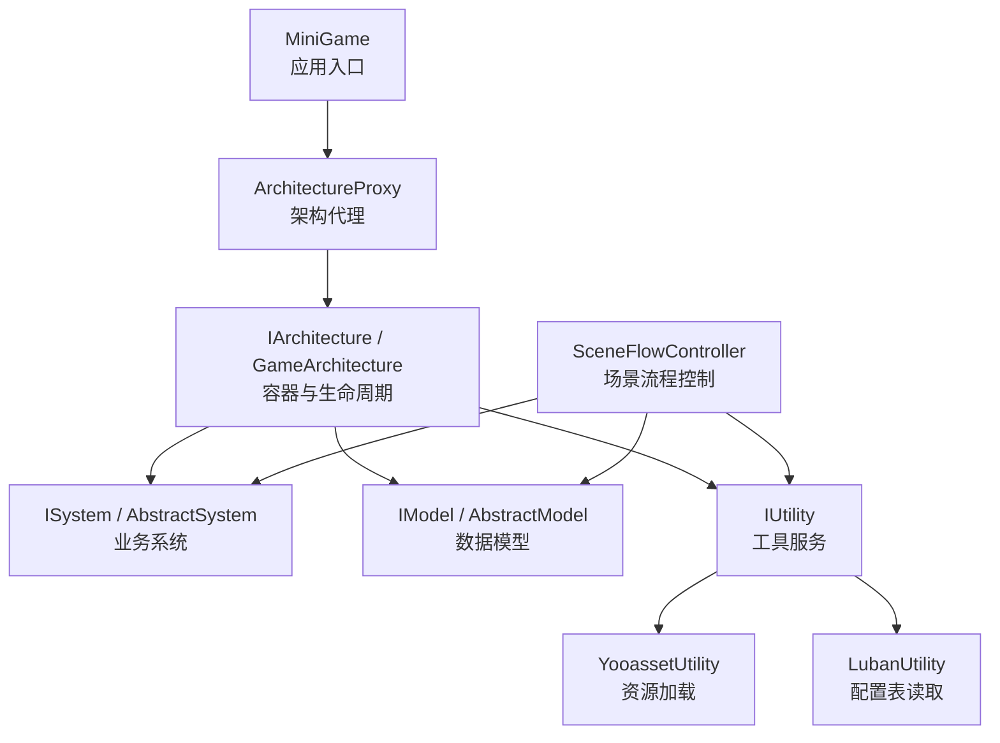
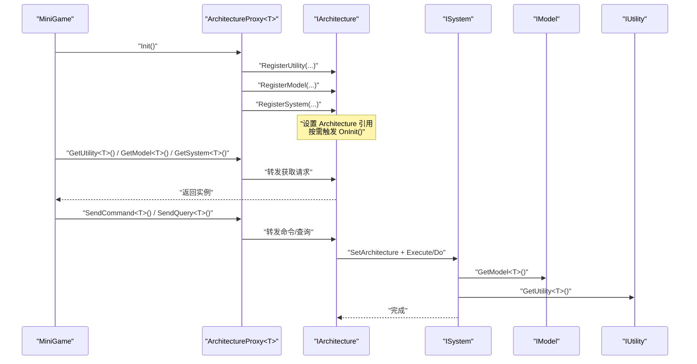
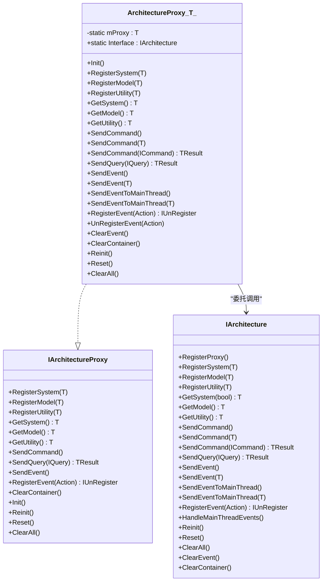
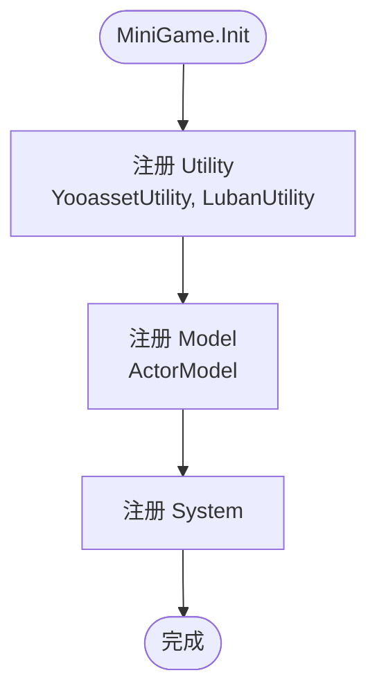
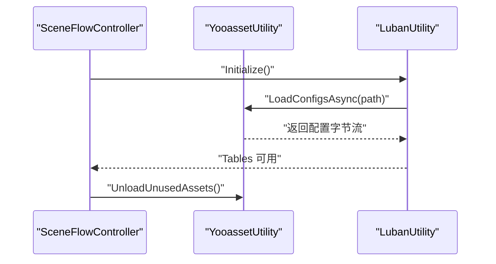
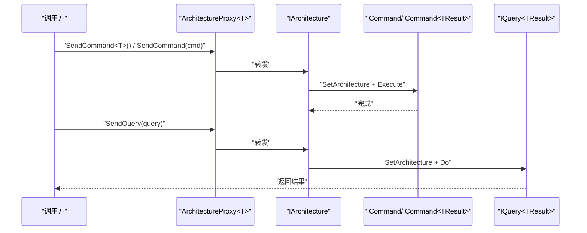
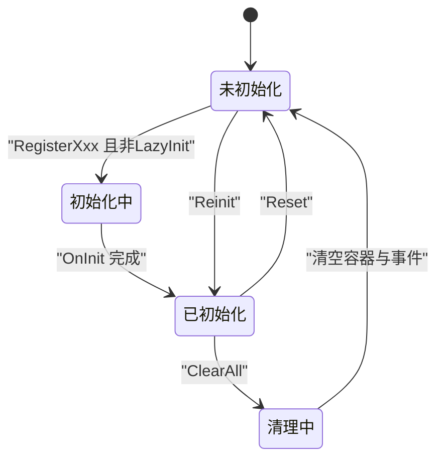
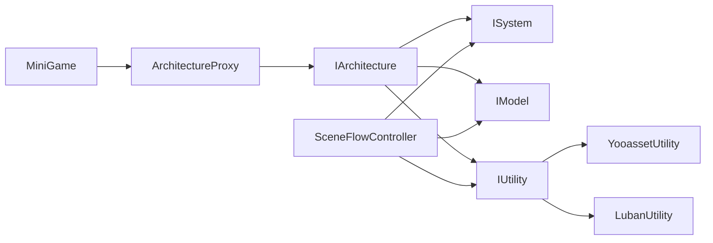

# 架构概览

<cite>
**本文引用的文件**   
- [MiniGame.cs](file://Assets/Game/Scripts/MiniGame_Scripts/MiniGame.cs)
- [ArchitectureProxy.cs](file://Assets/Game/Framework/Qframework/Runtime/Moyv/Proxies/ArchitectureProxy.cs)
- [QFramework.cs](file://Assets/Game/Framework/Qframework/Runtime/QFramework.cs)
- [YooassetUtility.cs](file://Assets/Game/Scripts/MiniGame_Scripts/Utility/YooassetUtility.cs)
- [LubanUtility.cs](file://Assets/Game/Scripts/MiniGame_Scripts/Utility/LubanUtility.cs)
- [SceneFlowController.cs](file://Assets/Game/Scripts/MiniGame_Scripts/Controller/SceneFlowController.cs)
</cite>

## 目录
1. [简介](#简介)
2. [项目结构](#项目结构)
3. [核心组件](#核心组件)
4. [架构总览](#架构总览)
5. [详细组件分析](#详细组件分析)
6. [依赖关系分析](#依赖关系分析)
7. [性能考量](#性能考量)
8. [故障排查指南](#故障排查指南)
9. [结论](#结论)
10. [附录](#附录)

## 简介
本文件为 SimulationClient 项目的架构概览，重点阐述基于 QFramework 的 System-Model-Utility 分层架构与 ArchitectureProxy 代理系统。文档将解释：
- 分层职责：System 层处理业务逻辑、Model 层管理数据状态、Utility 层提供工具方法
- 架构代理：ArchitectureProxy 的注册机制、依赖注入模式与生命周期管理
- 通信机制：事件系统、命令（Command）、查询（Query）与接口调用
- 设计模式：单例、工厂、观察者、策略等在框架中的体现
- 数据流向与控制流程：通过架构图与流程图直观呈现

## 项目结构
本项目采用“应用入口 + 架构代理 + 分层模块”的组织方式：
- 应用入口 MiniGame：继承自 ArchitectureProxy，负责初始化并注册 Utility、Model、System
- 架构代理 ArchitectureProxy：统一暴露注册/获取/命令/事件等能力，内部委托给全局 IArchitecture
- 核心框架 QFramework.cs：定义 IArchitecture、AbstractSystem、AbstractModel、IUtility、命令/查询/事件等基础设施
- 工具层 Utility：如 YooassetUtility、LubanUtility，封装资源加载与配置表读取
- 控制器 SceneFlowController：演示如何通过 GetUtility 访问工具，驱动业务流程

图表来源
- [MiniGame.cs:1-30](file://Assets/Game/Scripts/MiniGame_Scripts/MiniGame.cs#L1-L30)
- [ArchitectureProxy.cs:1-197](file://Assets/Game/Framework/Qframework/Runtime/Moyv/Proxies/ArchitectureProxy.cs#L1-L197)
- [QFramework.cs:45-351](file://Assets/Game/Framework/Qframework/Runtime/QFramework.cs#L45-L351)
- [YooassetUtility.cs:1-121](file://Assets/Game/Scripts/MiniGame_Scripts/Utility/YooassetUtility.cs#L1-L121)
- [LubanUtility.cs:1-40](file://Assets/Game/Scripts/MiniGame_Scripts/Utility/LubanUtility.cs#L1-L40)
- [SceneFlowController.cs:284-300](file://Assets/Game/Scripts/MiniGame_Scripts/Controller/SceneFlowController.cs#L284-L300)

章节来源
- [MiniGame.cs:1-30](file://Assets/Game/Scripts/MiniGame_Scripts/MiniGame.cs#L1-L30)
- [ArchitectureProxy.cs:1-197](file://Assets/Game/Framework/Qframework/Runtime/Moyv/Proxies/ArchitectureProxy.cs#L1-L197)
- [QFramework.cs:45-351](file://Assets/Game/Framework/Qframework/Runtime/QFramework.cs#L45-L351)

## 核心组件
- 架构代理 ArchitectureProxy<T>
  - 作用：对外暴露统一的注册/获取/命令/事件/查询接口，内部转发到全局 IArchitecture
  - 关键点：静态 Interface 属性在首次访问时完成代理注册；Init 由具体子类实现，用于集中注册各层组件
- 架构容器 IArchitecture / Architecture<T>
  - 作用：维护 IOC 容器、管理 System/Model/Utility 的生命周期、分发命令/查询/事件
  - 关键点：RegisterXxx 时设置 Architecture 引用并按需触发 Init；支持 LazyInit；提供 Reset/Reinit/ClearAll 等生命周期管理
- 分层抽象
  - System：承载业务逻辑，可获取 Model/Utility、发送事件/命令/查询
  - Model：持有数据状态，可发送事件、获取 Utility
  - Utility：无状态或弱状态的通用工具，被 System/Model/Controller 通过容器获取
- 通信机制
  - 事件：类型化事件系统，支持主线程派发
  - 命令：同步执行，支持带返回值的命令
  - 查询：只读查询，返回结果

章节来源
- [ArchitectureProxy.cs:1-197](file://Assets/Game/Framework/Qframework/Runtime/Moyv/Proxies/ArchitectureProxy.cs#L1-L197)
- [QFramework.cs:45-351](file://Assets/Game/Framework/Qframework/Runtime/QFramework.cs#L45-L351)

## 架构总览
下图展示了从应用入口到各层的完整交互路径，包括注册、获取与命令/事件/查询的分发。

图表来源
- [MiniGame.cs:1-30](file://Assets/Game/Scripts/MiniGame_Scripts/MiniGame.cs#L1-L30)
- [ArchitectureProxy.cs:1-197](file://Assets/Game/Framework/Qframework/Runtime/Moyv/Proxies/ArchitectureProxy.cs#L1-L197)
- [QFramework.cs:45-351](file://Assets/Game/Framework/Qframework/Runtime/QFramework.cs#L45-L351)

## 详细组件分析

### 架构代理 ArchitectureProxy<T>
- 职责
  - 作为应用级入口的基类，集中注册 Utility/Model/System
  - 统一转发命令、查询、事件到 IArchitecture
- 关键行为
  - 静态 Interface：首次访问时向全局 IArchitecture 注册当前代理类型，确保后续可通过该代理访问
  - RegisterXxx：将实例注册进容器，并为 System/Model 注入 Architecture 引用，按 LazyInit 决定是否立即 Init
  - GetXxx：从容器获取已注册实例，若未注册且允许自动创建则构造并初始化
  - 生命周期：Reset/Reinit/ClearAll 分别对应重置、重启与清理
- 适用场景
  - 多代理隔离：不同子系统可使用不同代理进行独立注册与生命周期管理

图表来源
- [ArchitectureProxy.cs:1-197](file://Assets/Game/Framework/Qframework/Runtime/Moyv/Proxies/ArchitectureProxy.cs#L1-L197)
- [QFramework.cs:45-351](file://Assets/Game/Framework/Qframework/Runtime/QFramework.cs#L45-L351)

章节来源
- [ArchitectureProxy.cs:1-197](file://Assets/Game/Framework/Qframework/Runtime/Moyv/Proxies/ArchitectureProxy.cs#L1-L197)
- [QFramework.cs:45-351](file://Assets/Game/Framework/Qframework/Runtime/QFramework.cs#L45-L351)

### 应用入口 MiniGame
- 职责
  - 继承 ArchitectureProxy，重写 Init 完成 Utility/Model/System 的注册
- 典型流程
  - 先注册 Utility（如 YooassetUtility、LubanUtility），再注册 Model，最后注册 System
  - 通过 this.RegisterUtility/this.RegisterModel/this.RegisterSystem 完成注册

图表来源
- [MiniGame.cs:1-30](file://Assets/Game/Scripts/MiniGame_Scripts/MiniGame.cs#L1-L30)

章节来源
- [MiniGame.cs:1-30](file://Assets/Game/Scripts/MiniGame_Scripts/MiniGame.cs#L1-L30)

### 工具层 Utility
- YooassetUtility
  - 职责：封装 YooAsset 的资源包初始化、配置加载、场景加载与卸载
  - 使用方式：通过 GetUtility<YooassetUtility>() 获取后调用异步方法
- LubanUtility
  - 职责：读取配置表，构建 Tables 对象供上层使用
  - 使用方式：通过 GetUtility<LubanUtility>().Initialize() 初始化后访问 Tables

图表来源
- [YooassetUtility.cs:1-121](file://Assets/Game/Scripts/MiniGame_Scripts/Utility/YooassetUtility.cs#L1-L121)
- [LubanUtility.cs:1-40](file://Assets/Game/Scripts/MiniGame_Scripts/Utility/LubanUtility.cs#L1-L40)
- [SceneFlowController.cs:284-300](file://Assets/Game/Scripts/MiniGame_Scripts/Controller/SceneFlowController.cs#L284-L300)

章节来源
- [YooassetUtility.cs:1-121](file://Assets/Game/Scripts/MiniGame_Scripts/Utility/YooassetUtility.cs#L1-L121)
- [LubanUtility.cs:1-40](file://Assets/Game/Scripts/MiniGame_Scripts/Utility/LubanUtility.cs#L1-L40)
- [SceneFlowController.cs:284-300](file://Assets/Game/Scripts/MiniGame_Scripts/Controller/SceneFlowController.cs#L284-L300)

### 通信机制：事件、命令、查询
- 事件系统
  - 支持 SendEvent/SendEventToMainThread/RegisterEvent/UnRegisterEvent
  - 适用于解耦的跨层通知
- 命令系统
  - SendCommand 支持无返回值与有返回值两种形式
  - 适合封装一次性操作，内部可访问 System/Model/Utility
- 查询系统
  - SendQuery 用于只读查询，返回结果不改变状态

图表来源
- [ArchitectureProxy.cs:1-197](file://Assets/Game/Framework/Qframework/Runtime/Moyv/Proxies/ArchitectureProxy.cs#L1-L197)
- [QFramework.cs:45-351](file://Assets/Game/Framework/Qframework/Runtime/QFramework.cs#L45-L351)

章节来源
- [ArchitectureProxy.cs:1-197](file://Assets/Game/Framework/Qframework/Runtime/Moyv/Proxies/ArchitectureProxy.cs#L1-L197)
- [QFramework.cs:45-351](file://Assets/Game/Framework/Qframework/Runtime/QFramework.cs#L45-L351)

### 生命周期管理
- 注册阶段
  - RegisterSystem/RegisterModel 会注入 Architecture 引用，并根据 LazyInit 决定是否立即 Init
- 运行阶段
  - Reset：调用各 System/Model 的 Reset，并将状态置为 NotDo
  - Reinit：仅对尚未初始化的 System/Model 执行 Init
  - ClearAll：Reset + ClearEvent + ClearContainer，并重置架构初始化状态
- 主线程事件
  - HandleMainThreadEvents 在主线程调度事件，避免多线程 UI 问题

图表来源
- [QFramework.cs:45-351](file://Assets/Game/Framework/Qframework/Runtime/QFramework.cs#L45-L351)

章节来源
- [QFramework.cs:45-351](file://Assets/Game/Framework/Qframework/Runtime/QFramework.cs#L45-L351)

## 依赖关系分析
- 耦合与内聚
  - MiniGame 仅依赖 ArchitectureProxy 提供的注册接口，低耦合
  - Utility 通过 IUtility 接口被容器管理，松耦合
  - System/Model 通过扩展方法便捷获取其他组件，降低直接依赖
- 外部依赖
  - YooassetUtility 依赖 YooAsset 资源系统
  - LubanUtility 依赖配置生成代码与 JSON 库
- 潜在循环依赖
  - 通过 IArchitecture 与 IOC 容器解耦，避免显式相互引用

图表来源
- [MiniGame.cs:1-30](file://Assets/Game/Scripts/MiniGame_Scripts/MiniGame.cs#L1-L30)
- [ArchitectureProxy.cs:1-197](file://Assets/Game/Framework/Qframework/Runtime/Moyv/Proxies/ArchitectureProxy.cs#L1-L197)
- [QFramework.cs:45-351](file://Assets/Game/Framework/Qframework/Runtime/QFramework.cs#L45-L351)
- [YooassetUtility.cs:1-121](file://Assets/Game/Scripts/MiniGame_Scripts/Utility/YooassetUtility.cs#L1-L121)
- [LubanUtility.cs:1-40](file://Assets/Game/Scripts/MiniGame_Scripts/Utility/LubanUtility.cs#L1-L40)
- [SceneFlowController.cs:284-300](file://Assets/Game/Scripts/MiniGame_Scripts/Controller/SceneFlowController.cs#L284-L300)

章节来源
- [QFramework.cs:45-351](file://Assets/Game/Framework/Qframework/Runtime/QFramework.cs#L45-L351)

## 性能考量
- 延迟初始化（LazyInit）
  - 对于重型 System/Model，建议开启 LazyInit，按需初始化以减少启动开销
- 资源释放
  - 切换场景后及时调用 UnloadUnusedAssets/ForceUnloadAllAssets，避免内存泄漏
- 事件派发
  - 使用 SendEventToMainThread 保证 UI 安全，避免跨线程访问导致异常
- 容器清理
  - 在需要完全重置的场景使用 ClearAll，注意重新注册顺序

[本节为通用指导，无需源码引用]

## 故障排查指南
- 常见问题
  - 获取不到 System/Model：确认是否在 Init 中正确注册，或通过 GetSystem<T>(autoCreate=false) 检查是否允许自动创建
  - 事件未触发：检查是否正确 RegisterEvent 并在合适时机 UnregisterEvent
  - 资源加载失败：确认 YooassetUtility 初始化流程与包名/路径配置
- 定位步骤
  - 打印日志：利用 IBelongToArchitecture 的 Log/LogWarning/LogError 输出上下文信息
  - 分步验证：先验证 Utility 初始化，再验证 Model 状态，最后验证 System 逻辑

章节来源
- [QFramework.cs:45-351](file://Assets/Game/Framework/Qframework/Runtime/QFramework.cs#L45-L351)

## 结论
SimulationClient 基于 QFramework 的 System-Model-Utility 分层清晰、职责明确，配合 ArchitectureProxy 提供了统一的注册与访问入口。通过 IOC 容器、事件/命令/查询机制，实现了高内聚、低耦合的可扩展架构。建议在大型项目中遵循以下实践：
- 严格分层：System 专注业务，Model 专注数据，Utility 专注工具
- 合理使用 LazyInit 与生命周期管理
- 通过事件与命令解耦模块间通信
- 重视资源管理与内存回收

[本节为总结性内容，无需源码引用]

## 附录
- 设计模式映射
  - 单例模式：ArchitectureProxy<T>.Interface、IArchitecture.Interface
  - 工厂模式：GetSystem<T>(autoCreate=true) 自动构造与注册
  - 观察者模式：TypeEventSystem 事件订阅与分发
  - 策略模式：IUtility 可扩展多种工具实现，按需注入
- 扩展指导
  - 新增 System/Model：在 MiniGame.Init 中注册，必要时启用 LazyInit
  - 新增 Utility：实现 IUtility 并通过 RegisterUtility 注册
  - 新增通信：优先使用命令/查询，必要时使用事件

[本节为概念性内容，无需源码引用]