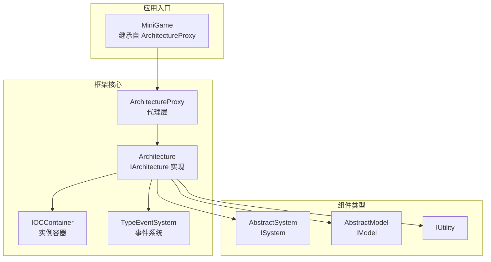
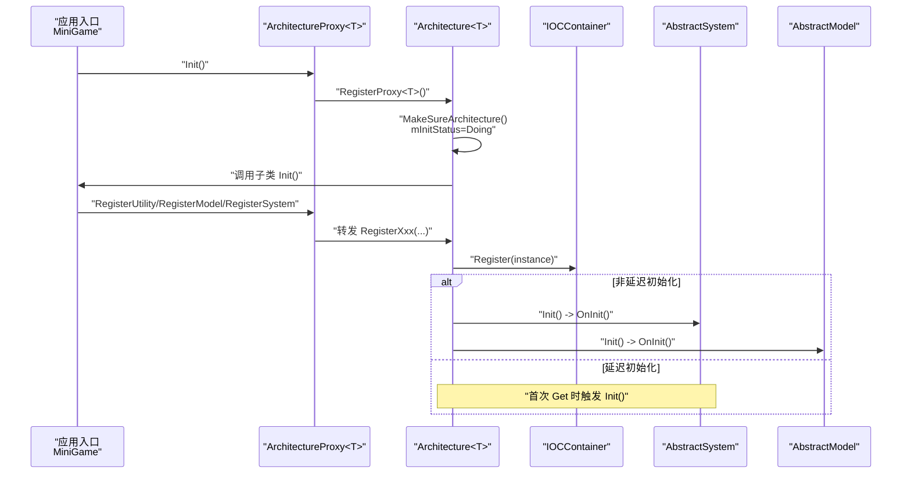
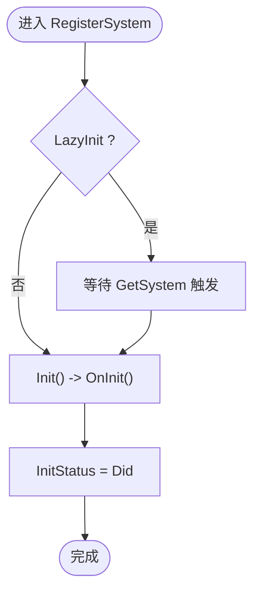
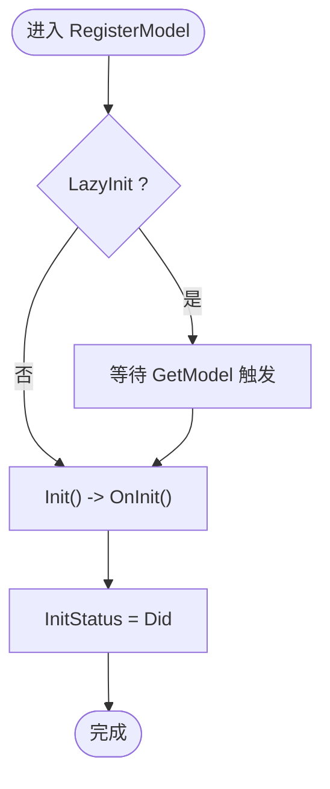
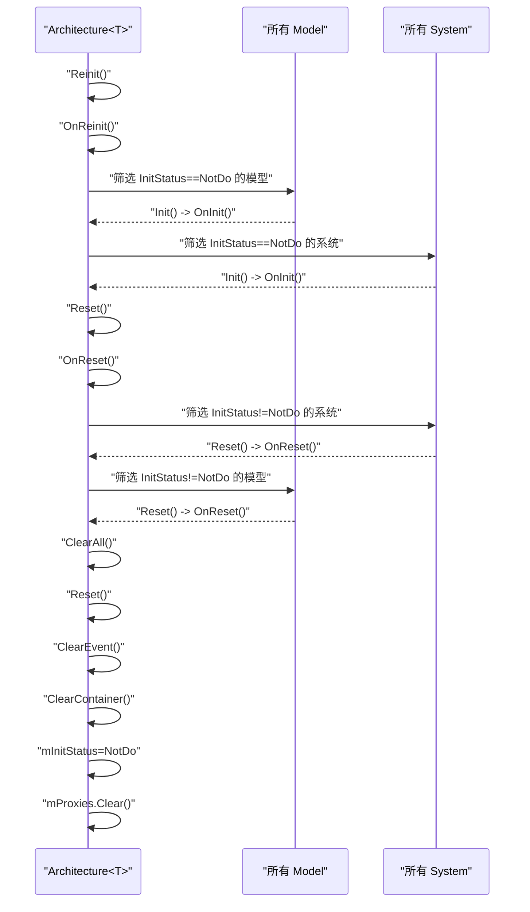
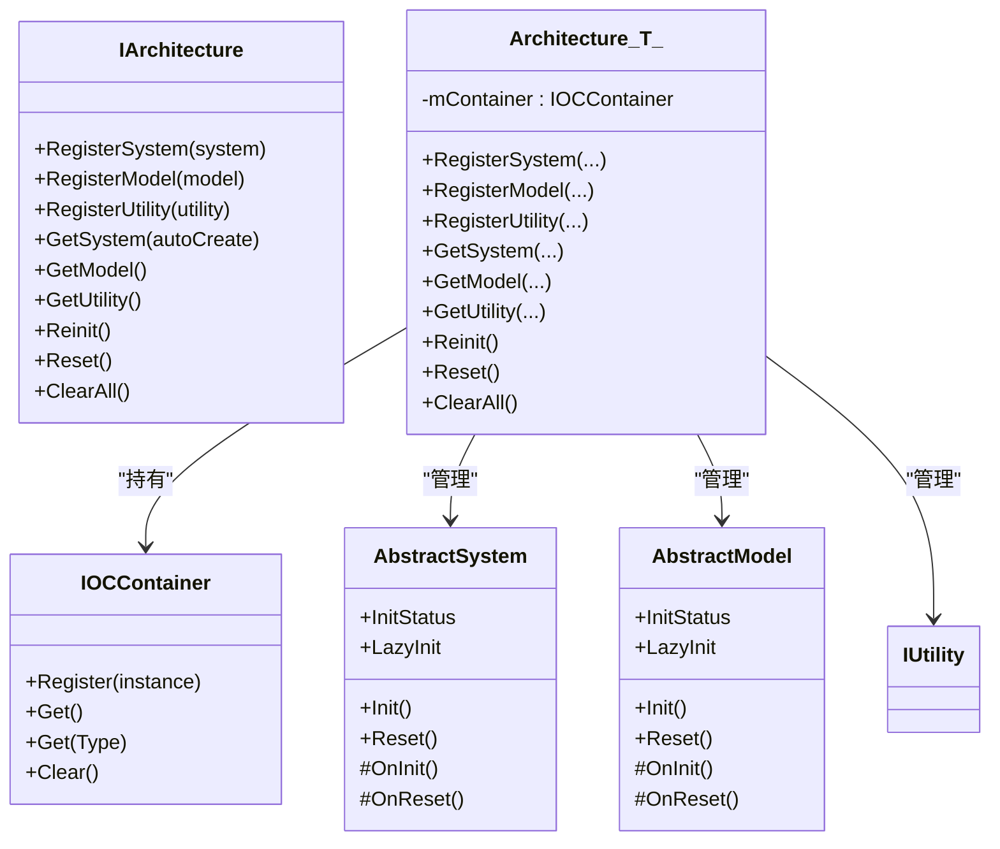
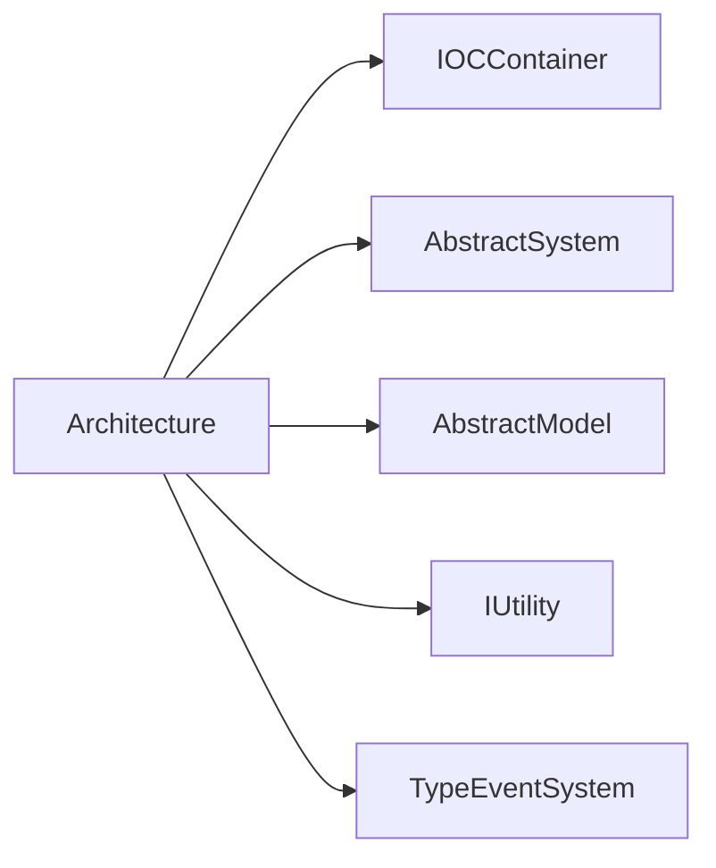

# 组件生命周期管理

<cite>
**本文引用的文件**
- [QFramework.cs](file://Assets/Game/Framework/Qframework/Runtime/QFramework.cs)
- [ArchitectureProxy.cs](file://Assets/Game/Framework/Qframework/Runtime/Moyv/Proxies/ArchitectureProxy.cs)
- [MiniGame.cs](file://Assets/Game/Scripts/MiniGame_Scripts/MiniGame.cs)
- [TestInitAndDeinit.cs](file://Assets/Game/Framework/Qframework/Tests/Runtime/TestInitAndDeinit.cs)
</cite>

## 目录
1. [简介](#简介)
2. [项目结构](#项目结构)
3. [核心组件](#核心组件)
4. [架构总览](#架构总览)
5. [详细组件分析](#详细组件分析)
6. [依赖关系分析](#依赖关系分析)
7. [性能考量](#性能考量)
8. [故障排查指南](#故障排查指南)
9. [结论](#结论)
10. [附录](#附录)

## 简介
本技术文档围绕组件生命周期管理系统，系统阐述 System、Model、Utility 三类组件的注册、初始化、重置与销毁流程；解释 Init()、Reset()、Reinit()、ClearAll() 等关键方法的调用时机与执行顺序；说明 MonoBehaviorSystem 与 Unity 生命周期的集成方式（Awake、Start、Update、LateUpdate、FixedUpdate）；并给出组件间依赖管理与初始化顺序控制的最佳实践。文档同时提供流程图与类图，帮助读者快速理解并落地实现自定义组件的生命周期方法与依赖注入。

## 项目结构
本项目基于 QFramework 的 Architecture 模式，通过 Architecture<T> 作为全局入口，统一负责：
- 组件注册（RegisterSystem/RegisterModel/RegisterUtility）
- 组件获取（GetSystem/GetModel/GetUtility）
- 事件总线（SendEvent/SendCommand/SendQuery）
- 生命周期管理（Reinit/Reset/ClearAll）
- IOC 容器（IOCContainer）

图表来源
- [ArchitectureProxy.cs:53-197](file://Assets/Game/Framework/Qframework/Runtime/Moyv/Proxies/ArchitectureProxy.cs#L53-L197)
- [QFramework.cs:94-351](file://Assets/Game/Framework/Qframework/Runtime/QFramework.cs#L94-L351)
- [QFramework.cs:941-1013](file://Assets/Game/Framework/Qframework/Runtime/QFramework.cs#L941-L1013)
- [QFramework.cs:874-909](file://Assets/Game/Framework/Qframework/Runtime/QFramework.cs#L874-L909)

章节来源
- [MiniGame.cs:1-30](file://Assets/Game/Scripts/MiniGame_Scripts/MiniGame.cs#L1-L30)
- [ArchitectureProxy.cs:53-197](file://Assets/Game/Framework/Qframework/Runtime/Moyv/Proxies/ArchitectureProxy.cs#L53-L197)
- [QFramework.cs:94-351](file://Assets/Game/Framework/Qframework/Runtime/QFramework.cs#L94-L351)

## 核心组件
- IArchitecture/Aarchitecture<T>：架构接口与默认实现，负责组件注册、获取、事件分发以及 Reinit/Reset/ClearAll 等生命周期编排。
- AbstractSystem/ISystem：系统组件抽象，支持 LazyInit、InitStatus 状态机、OnInit/OnReset 钩子。
- AbstractModel/IModel：数据模型抽象，支持 LazyInit、InitStatus 状态机、OnInit/OnReset 钩子。
- IUtility：无状态的通用工具服务接口。
- IOCContainer：轻量级容器，按类型与接口映射存储实例，并提供 Get/GetInstancesByType/Clear。
- TypeEventSystem：类型化事件系统，支持主线程派发队列。

章节来源
- [QFramework.cs:45-92](file://Assets/Game/Framework/Qframework/Runtime/QFramework.cs#L45-L92)
- [QFramework.cs:94-351](file://Assets/Game/Framework/Qframework/Runtime/QFramework.cs#L94-L351)
- [QFramework.cs:429-500](file://Assets/Game/Framework/Qframework/Runtime/QFramework.cs#L429-L500)
- [QFramework.cs:506-510](file://Assets/Game/Framework/Qframework/Runtime/QFramework.cs#L506-L510)
- [QFramework.cs:941-1013](file://Assets/Game/Framework/Qframework/Runtime/QFramework.cs#L941-L1013)
- [QFramework.cs:874-909](file://Assets/Game/Framework/Qframework/Runtime/QFramework.cs#L874-L909)

## 架构总览
下图展示了从应用入口到框架核心的调用链，以及组件注册与获取路径。

图表来源
- [ArchitectureProxy.cs:53-104](file://Assets/Game/Framework/Qframework/Runtime/Moyv/Proxies/ArchitectureProxy.cs#L53-L104)
- [QFramework.cs:116-137](file://Assets/Game/Framework/Qframework/Runtime/QFramework.cs#L116-L137)
- [QFramework.cs:206-223](file://Assets/Game/Framework/Qframework/Runtime/QFramework.cs#L206-L223)
- [QFramework.cs:441-458](file://Assets/Game/Framework/Qframework/Runtime/QFramework.cs#L441-L458)
- [QFramework.cs:482-499](file://Assets/Game/Framework/Qframework/Runtime/QFramework.cs#L482-L499)

## 详细组件分析

### System 组件生命周期
- 注册阶段：RegisterSystem 将系统实例注册进容器，若未延迟初始化则立即调用 Init()。
- 初始化阶段：Init() 设置状态为 Doing，调用用户实现的 OnInit()，完成后标记为 Did。
- 重置阶段：Reset() 调用 OnReset()，并将状态回退为 NotDo，以便后续可再次 Init。
- 延迟初始化：LazyInit 为 true 的系统在首次 GetSystem 时才触发 Init()。

图表来源
- [QFramework.cs:206-211](file://Assets/Game/Framework/Qframework/Runtime/QFramework.cs#L206-L211)
- [QFramework.cs:439-458](file://Assets/Game/Framework/Qframework/Runtime/QFramework.cs#L439-L458)

章节来源
- [QFramework.cs:206-211](file://Assets/Game/Framework/Qframework/Runtime/QFramework.cs#L206-L211)
- [QFramework.cs:429-459](file://Assets/Game/Framework/Qframework/Runtime/QFramework.cs#L429-L459)

### Model 组件生命周期
- 注册阶段：RegisterModel 将模型实例注册进容器，若非延迟初始化则立即 Init()。
- 初始化阶段：Init() 设置状态为 Doing，调用用户实现的 OnInit()，完成后标记为 Did。
- 重置阶段：Reset() 调用 OnReset()，并将状态回退为 NotDo。
- 延迟初始化：LazyInit 为 true 的模型在首次 GetModel 时触发 Init()。

图表来源
- [QFramework.cs:213-218](file://Assets/Game/Framework/Qframework/Runtime/QFramework.cs#L213-L218)
- [QFramework.cs:478-499](file://Assets/Game/Framework/Qframework/Runtime/QFramework.cs#L478-L499)

章节来源
- [QFramework.cs:213-218](file://Assets/Game/Framework/Qframework/Runtime/QFramework.cs#L213-L218)
- [QFramework.cs:470-500](file://Assets/Game/Framework/Qframework/Runtime/QFramework.cs#L470-L500)

### Utility 组件生命周期
- Utility 是无状态工具接口，不参与 Init/Reset 生命周期，仅通过 RegisterUtility 注册并在需要时 GetUtility 获取。
- 典型用途：封装外部库或平台相关能力（如资源加载、配置解析）。

章节来源
- [QFramework.cs:506-510](file://Assets/Game/Framework/Qframework/Runtime/QFramework.cs#L506-L510)
- [QFramework.cs:220-223](file://Assets/Game/Framework/Qframework/Runtime/QFramework.cs#L220-L223)

### 生命周期方法调用时机与顺序
- Reinit：先调用 OnReinit，再遍历所有尚未初始化的 Model/System 进行 Init。
- Reset：先调用 OnReset，再遍历已初始化（非 NotDo）的 System/Model 调用 Reset。
- ClearAll：顺序为 Reset -> ClearEvent -> ClearContainer -> 重置架构自身 mInitStatus -> 清空代理字典。

图表来源
- [QFramework.cs:148-187](file://Assets/Game/Framework/Qframework/Runtime/QFramework.cs#L148-L187)

章节来源
- [QFramework.cs:148-187](file://Assets/Game/Framework/Qframework/Runtime/QFramework.cs#L148-L187)

### 组件间的依赖关系管理与初始化顺序控制
- 依赖获取：System/Model 可通过扩展方法 GetModel<T>/GetSystem<T> 获取其他组件，内部委托给 Architecture 的对应 Get 方法。
- 延迟依赖：若被依赖组件设置了 LazyInit=true，则在首次 Get 时才会触发其 Init()，从而避免不必要的提前初始化。
- 初始化顺序：
  - 显式注册顺序：在 MiniGame.Init 中，先 RegisterUtility，再 RegisterModel，最后 RegisterSystem，确保依赖可用。
  - 隐式顺序：若使用自动创建（GetSystem(autoCreate=true)，且未显式注册），会在首次获取时构造并初始化。

图表来源
- [QFramework.cs:45-92](file://Assets/Game/Framework/Qframework/Runtime/QFramework.cs#L45-L92)
- [QFramework.cs:94-351](file://Assets/Game/Framework/Qframework/Runtime/QFramework.cs#L94-L351)
- [QFramework.cs:429-500](file://Assets/Game/Framework/Qframework/Runtime/QFramework.cs#L429-L500)
- [QFramework.cs:941-1013](file://Assets/Game/Framework/Qframework/Runtime/QFramework.cs#L941-L1013)

章节来源
- [QFramework.cs:612-640](file://Assets/Game/Framework/Qframework/Runtime/QFramework.cs#L612-L640)
- [QFramework.cs:225-257](file://Assets/Game/Framework/Qframework/Runtime/QFramework.cs#L225-L257)
- [QFramework.cs:273-304](file://Assets/Game/Framework/Qframework/Runtime/QFramework.cs#L273-L304)
- [MiniGame.cs:6-28](file://Assets/Game/Scripts/MiniGame_Scripts/MiniGame.cs#L6-L28)

### MonoBehaviorSystem 与 Unity 生命周期集成
- 当前仓库未包含名为 MonoBehaviorSystem 的具体实现。但框架提供了 UnRegisterTrigger 系列 MonoBehaviour，用于在 Unity 生命周期（OnDestroy/OnDisable/场景卸载）时自动解绑事件与资源。
- 建议在需要与 Unity 生命周期绑定的逻辑中：
  - 使用 UnRegisterWhenGameObjectDestroyed/UnRegisterWhenDisabled 等扩展，将 IUnRegister 绑定到 GameObject 生命周期。
  - 在 Awake/Start 中订阅事件或初始化资源，在 OnDestroy/OnDisable 中通过 IUnRegister 列表释放。

章节来源
- [QFramework.cs:756-823](file://Assets/Game/Framework/Qframework/Runtime/QFramework.cs#L756-L823)
- [QFramework.cs:826-872](file://Assets/Game/Framework/Qframework/Runtime/QFramework.cs#L826-L872)

### 自定义组件生命周期与依赖注入示例指引
- 自定义 System：
  - 继承 AbstractSystem，重写 OnInit/OnReset。
  - 在 OnInit 中通过 this.GetModel<T>() 或 this.GetSystem<T>() 获取依赖。
  - 如需延迟初始化，覆盖 LazyInit 返回 true。
- 自定义 Model：
  - 继承 AbstractModel，重写 OnInit/OnReset。
  - 在 OnInit 中初始化数据，在 OnReset 中清理引用与集合。
  - 如需延迟初始化，覆盖 LazyInit 返回 true。
- 自定义 Utility：
  - 实现 IUtility 接口，封装工具方法。
  - 通过 RegisterUtility 注册，使用 GetUtility 获取。
- 依赖注入最佳实践：
  - 优先显式注册并按依赖顺序调用 RegisterUtility/RegisterModel/RegisterSystem。
  - 对重型或可选模块使用 LazyInit，减少启动开销。
  - 在 OnReset 中务必清理引用，避免内存泄漏。

章节来源
- [QFramework.cs:429-500](file://Assets/Game/Framework/Qframework/Runtime/QFramework.cs#L429-L500)
- [QFramework.cs:206-223](file://Assets/Game/Framework/Qframework/Runtime/QFramework.cs#L206-L223)
- [MiniGame.cs:6-28](file://Assets/Game/Scripts/MiniGame_Scripts/MiniGame.cs#L6-L28)

## 依赖关系分析
- 耦合度：
  - Architecture<T> 与 IOCContainer 强耦合，负责实例注册与获取。
  - System/Model 通过扩展方法间接依赖 Architecture，保持低耦合。
- 循环依赖风险：
  - 避免在 OnInit 中互相 Get 导致循环初始化；必要时使用 LazyInit 或拆分职责。
- 外部依赖点：
  - Unity 事件与场景卸载回调（UnRegisterCurrentSceneUnloadedTrigger）。
  - 多线程事件处理（ENABLE_MULTITHREAD_EVENT 宏下，每帧调度主线程事件）。

图表来源
- [QFramework.cs:94-351](file://Assets/Game/Framework/Qframework/Runtime/QFramework.cs#L94-L351)
- [QFramework.cs:941-1013](file://Assets/Game/Framework/Qframework/Runtime/QFramework.cs#L941-L1013)
- [QFramework.cs:874-909](file://Assets/Game/Framework/Qframework/Runtime/QFramework.cs#L874-L909)

章节来源
- [QFramework.cs:94-351](file://Assets/Game/Framework/Qframework/Runtime/QFramework.cs#L94-L351)
- [QFramework.cs:941-1013](file://Assets/Game/Framework/Qframework/Runtime/QFramework.cs#L941-L1013)
- [QFramework.cs:874-909](file://Assets/Game/Framework/Qframework/Runtime/QFramework.cs#L874-L909)

## 性能考量
- 延迟初始化：对重型或可选模块启用 LazyInit，降低首帧压力。
- 批量操作：在 Reset/Reinit 中尽量复用对象池或预分配集合，避免频繁 GC。
- 事件系统：合理使用 SendEventToMainThread 与主线程队列，避免跨线程访问 Unity API。
- 容器清理：在 ClearAll 后及时重建必要组件，避免重复创建带来的额外开销。

## 故障排查指南
- 常见问题与定位：
  - 组件未初始化：检查是否设置了 LazyInit 但未触发 Get；或在 Reset 后忘记 Reinit。
  - 事件未触发：确认是否正确调用 RegisterEvent/UnRegisterEvent，或使用 UnRegisterWhenGameObjectDestroyed 自动解绑。
  - 资源泄漏：确保在 OnReset 中清理引用与集合，避免残留引用。
- 验证用例参考：
  - 测试用例演示了 Reset 后各组件状态归零、事件不再触发、延迟组件按需初始化等行为。

章节来源
- [TestInitAndDeinit.cs:119-159](file://Assets/Game/Framework/Qframework/Tests/Runtime/TestInitAndDeinit.cs#L119-L159)
- [QFramework.cs:756-823](file://Assets/Game/Framework/Qframework/Runtime/QFramework.cs#L756-L823)
- [QFramework.cs:826-872](file://Assets/Game/Framework/Qframework/Runtime/QFramework.cs#L826-L872)

## 结论
本生命周期管理体系以 Architecture<T> 为核心，结合 IOCContainer 与 TypeEventSystem，为 System、Model、Utility 提供了统一的注册、初始化、重置与销毁机制。通过 LazyInit 与显式注册顺序，可有效控制依赖关系与初始化时序。配合 Unity 生命周期解绑工具，可实现健壮的资源管理与事件解耦。遵循本文最佳实践，可在复杂项目中稳定地扩展与维护组件体系。

## 附录
- 关键方法速查：
  - Reinit：重启所有未初始化的 Model/System。
  - Reset：重置所有已初始化的 System/Model。
  - ClearAll：重置 + 清事件 + 清容器 + 重置架构状态。
- 推荐实践：
  - 在 MiniGame.Init 中按“Utility -> Model -> System”的顺序注册。
  - 对重型组件启用 LazyInit，并在 OnReset 中彻底清理。
  - 使用 UnRegisterWhenGameObjectDestroyed/UnRegisterWhenDisabled 管理事件与资源生命周期。