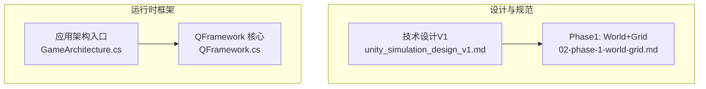
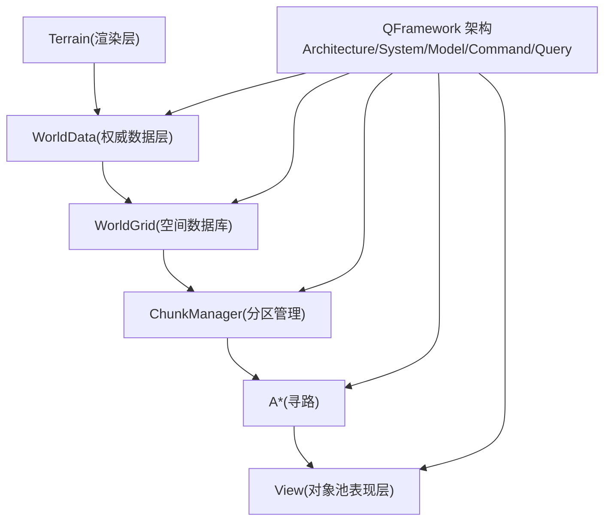
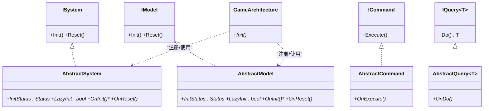
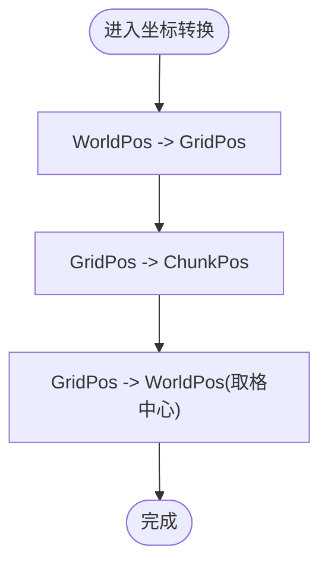
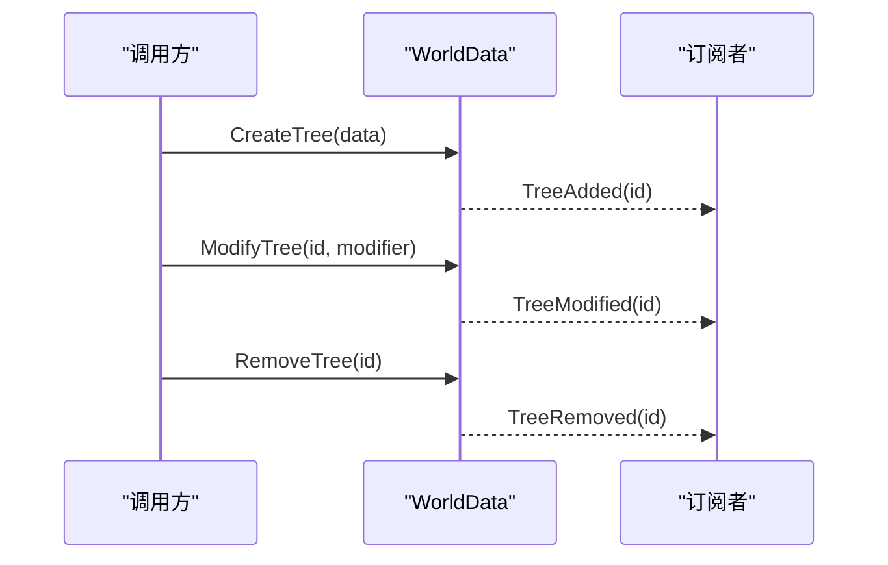
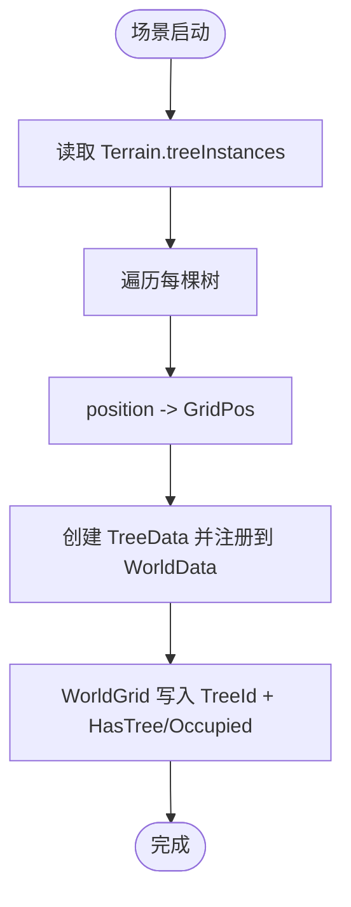
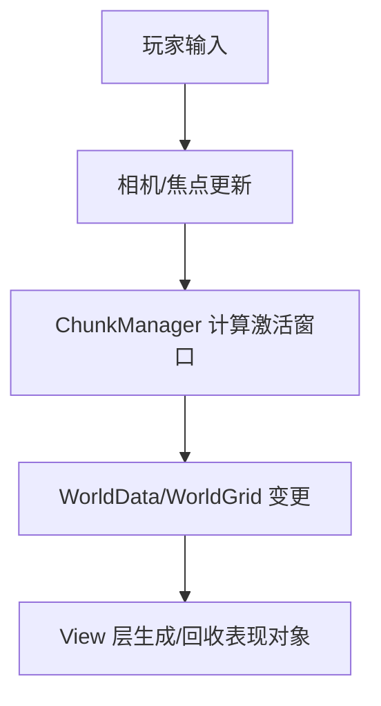
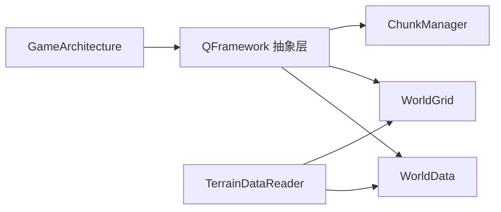

# 模拟游戏框架概览

<cite>
**本文引用的文件**   
- [unity_simulation_design_v1.md](file://.simulationdoc/unity_simulation_design_v1.md)
- [02-phase-1-world-grid.md](file://.simulationdoc/specs/02-phase-1-world-grid.md)
- [GameArchitecture.cs](file://Assets/Game/Framework/Qframework/Runtime/Moyv/Proxies/GameArchitecture.cs)
- [QFramework.cs](file://Assets/Game/Framework/Qframework/Runtime/QFramework.cs)
</cite>

## 目录
1. [简介](#简介)
2. [项目结构](#项目结构)
3. [核心组件](#核心组件)
4. [架构总览](#架构总览)
5. [详细组件分析](#详细组件分析)
6. [依赖关系分析](#依赖关系分析)
7. [性能考量](#性能考量)
8. [故障排查指南](#故障排查指南)
9. [结论](#结论)
10. [附录](#附录)

## 简介
本项目为基于 Unity 的模拟经营类游戏框架，目标参考 Against the Storm、Timberborn、Factorio 等作品，构建支持大地图地形、大量树木资源、工人寻路与建造/道路/农田系统的可扩展架构。整体遵循“数据与表现分离”的原则：Terrain 仅负责渲染，WorldGrid 负责世界逻辑，A* 仅负责寻路，GameObject 仅用于表现层。

## 项目结构
- 设计文档位于 .simulationdoc/specs 下，按阶段拆分（Phase 0/1/...），明确产出文件、接口与验收标准。
- 运行时框架采用 QFramework 的 Architecture/System/Model/Command/Query 分层，提供统一的初始化、事件与查询机制。
- 模拟系统主入口通过自定义 GameArchitecture 扩展，后续将在此注册各 System/Model/Utility。

图表来源
- [unity_simulation_design_v1.md:1-196](file://.simulationdoc/unity_simulation_design_v1.md#L1-L196)
- [02-phase-1-world-grid.md:1-267](file://.simulationdoc/specs/02-phase-1-world-grid.md#L1-L267)
- [GameArchitecture.cs:1-10](file://Assets/Game/Framework/Qframework/Runtime/Moyv/Proxies/GameArchitecture.cs#L1-L10)
- [QFramework.cs:415-614](file://Assets/Game/Framework/Qframework/Runtime/QFramework.cs#L415-L614)

章节来源
- [unity_simulation_design_v1.md:1-196](file://.simulationdoc/unity_simulation_design_v1.md#L1-L196)
- [02-phase-1-world-grid.md:1-267](file://.simulationdoc/specs/02-phase-1-world-grid.md#L1-L267)
- [GameArchitecture.cs:1-10](file://Assets/Game/Framework/Qframework/Runtime/Moyv/Proxies/GameArchitecture.cs#L1-L10)
- [QFramework.cs:415-614](file://Assets/Game/Framework/Qframework/Runtime/QFramework.cs#L415-L614)

## 核心组件
- 架构与生命周期
  - GameArchitecture：应用级架构入口，继承自 QFramework 的 Architecture，用于集中初始化与模块装配。
  - QFramework 抽象基类：ISystem/IModel/ICommand/IQuery 及其 AbstractSystem/AbstractModel/AbstractCommand/AbstractQuery，提供统一 Init/Reset 生命周期与日志能力。
- 世界与空间
  - WorldData：权威数据层，维护 Tree/Building/Road/Worker 等实体的 ID 索引与增删改事件。
  - WorldGrid：空间数据库，提供 Cell 读写、占用标记、可行走判断与实体定位。
  - ChunkManager：以 3×3 窗口为中心进行分区激活/停用管理，驱动局部加载与卸载。
  - 坐标体系：WorldPos/GridPos/ChunkPos 及 CoordinateUtility，提供零分配的双向转换。
- 地形与初始同步
  - TerrainDataReader：从 Terrain.treeInstances 读取并生成 TreeData，写入 WorldData 与 WorldGrid。

章节来源
- [GameArchitecture.cs:1-10](file://Assets/Game/Framework/Qframework/Runtime/Moyv/Proxies/GameArchitecture.cs#L1-L10)
- [QFramework.cs:415-614](file://Assets/Game/Framework/Qframework/Runtime/QFramework.cs#L415-L614)
- [02-phase-1-world-grid.md:36-78](file://.simulationdoc/specs/02-phase-1-world-grid.md#L36-L78)
- [02-phase-1-world-grid.md:79-132](file://.simulationdoc/specs/02-phase-1-world-grid.md#L79-L132)
- [02-phase-1-world-grid.md:133-182](file://.simulationdoc/specs/02-phase-1-world-grid.md#L133-L182)
- [02-phase-1-world-grid.md:183-222](file://.simulationdoc/specs/02-phase-1-world-grid.md#L183-L222)
- [02-phase-1-world-grid.md:224-251](file://.simulationdoc/specs/02-phase-1-world-grid.md#L224-L251)

## 架构总览
下图展示从 Terrain 到 View 的分层与职责边界，以及 QFramework 在其中的组织方式。

图表来源
- [unity_simulation_design_v1.md:20-44](file://.simulationdoc/unity_simulation_design_v1.md#L20-L44)
- [QFramework.cs:415-614](file://Assets/Game/Framework/Qframework/Runtime/QFramework.cs#L415-L614)

## 详细组件分析

### 架构与生命周期（QFramework）
- 角色与职责
  - ISystem/IModel/ICommand/IQuery：定义系统、模型、命令、查询的统一契约。
  - AbstractSystem/AbstractModel/AbstractCommand/AbstractQuery：封装 Init/Reset 生命周期、日志与架构注入。
  - GameArchitecture：应用级入口，可在 Init 中注册各 System/Model/Utility。
- 关键流程
  - 启动时由 Architecture 调度各组件 Init；按需 LazyInit；Reset 清理状态。
  - 组件间通过 SendEvent/SendCommand/SendQuery 解耦交互。

图表来源
- [QFramework.cs:415-614](file://Assets/Game/Framework/Qframework/Runtime/QFramework.cs#L415-L614)
- [GameArchitecture.cs:1-10](file://Assets/Game/Framework/Qframework/Runtime/Moyv/Proxies/GameArchitecture.cs#L1-L10)

章节来源
- [QFramework.cs:415-614](file://Assets/Game/Framework/Qframework/Runtime/QFramework.cs#L415-L614)
- [GameArchitecture.cs:1-10](file://Assets/Game/Framework/Qframework/Runtime/Moyv/Proxies/GameArchitecture.cs#L1-L10)

### 坐标系与网格（Phase 1）
- 坐标体系
  - GridPos：整数格索引 (X,Z)。
  - ChunkPos：Chunk 索引，由 GridPos 除以 chunkSize 得到。
  - WorldPos：浮点世界坐标，Y 由 Terrain 高度采样。
  - CoordinateUtility：提供零分配双向转换与比较/哈希实现。
- WorldGrid
  - CellFlags：Walkable/Occupied/HasTree/HasBuilding/HasRoad 等位标志。
  - Cell：记录 TreeId/BuildingId/RoadId 与 Flags。
  - WorldGrid：GetCell/SetCell/IsWalkable/IsOccupied/GetEntityAt/IsInBounds。
- ChunkManager
  - 固定 32×32 尺寸，以相机焦点为中心维持 3×3 激活窗口。
  - 暴露 ChunkActivated/ChunkDeactivated 事件，供 View 层按需生成/回收。

图表来源
- [02-phase-1-world-grid.md:36-78](file://.simulationdoc/specs/02-phase-1-world-grid.md#L36-L78)
- [02-phase-1-world-grid.md:79-132](file://.simulationdoc/specs/02-phase-1-world-grid.md#L79-L132)
- [02-phase-1-world-grid.md:183-222](file://.simulationdoc/specs/02-phase-1-world-grid.md#L183-L222)

章节来源
- [02-phase-1-world-grid.md:36-78](file://.simulationdoc/specs/02-phase-1-world-grid.md#L36-L78)
- [02-phase-1-world-grid.md:79-132](file://.simulationdoc/specs/02-phase-1-world-grid.md#L79-L132)
- [02-phase-1-world-grid.md:183-222](file://.simulationdoc/specs/02-phase-1-world-grid.md#L183-L222)

### 权威数据层（WorldData）
- 数据结构
  - 按 ID 索引的字典：Trees/Buildings/Roads/Workers。
  - IdGenerator：统一递增 int ID，从 1 开始。
- 事件机制
  - TreeAdded/Removed/Modified、BuildingAdded/Removed/Modified、RoadAdded/Removed、WorkerAdded/Removed/Modified。
- 热路径建议
  - Tick 热路径优先使用 C# 原生事件避免 GC；跨模块通知可结合 QFramework 的 SendEvent<T>()。

图表来源
- [02-phase-1-world-grid.md:133-182](file://.simulationdoc/specs/02-phase-1-world-grid.md#L133-L182)

章节来源
- [02-phase-1-world-grid.md:133-182](file://.simulationdoc/specs/02-phase-1-world-grid.md#L133-L182)

### 地形树木初始同步（TerrainDataReader）
- 流程
  - 启动时读取 Terrain.terrainData.treeInstances。
  - 将每个 TreeInstance.position 转换为 GridPos。
  - 创建 TreeData 并通过 WorldData 注册。
  - 在 WorldGrid 对应 Cell 写入 TreeId 与 Occupied/HasTree 标记。
- 约束
  - 此步骤只读 Terrain，不修改 Terrain。

图表来源
- [02-phase-1-world-grid.md:224-251](file://.simulationdoc/specs/02-phase-1-world-grid.md#L224-L251)

章节来源
- [02-phase-1-world-grid.md:224-251](file://.simulationdoc/specs/02-phase-1-world-grid.md#L224-L251)

### 概念性总览（非代码映射）
- 典型运行期循环
  - 输入 → Camera/ChunkManager 更新焦点 → Chunk 激活/停用 → WorldGrid/WorldData 变化 → View 层根据事件生成/回收 GameObject。
- 该图为概念流程，不对应具体源码文件。

[本图为概念流程图，无需图表来源]

## 依赖关系分析
- 架构依赖
  - GameArchitecture 依赖 QFramework 的 Architecture 与 System/Model/Command/Query 抽象。
- 领域依赖
  - Phase 1 产出的坐标、WorldGrid、WorldData、ChunkManager、TerrainDataReader 形成稳定的数据与空间访问契约，供后续 Worker/AI/View 使用。
- 风险点
  - WorldGrid 性能直接影响寻路与建筑放置。
  - WorldData 事件设计不当会导致耦合或 GC 压力。
  - 坐标转换错误会引发全局空间逻辑异常。

图表来源
- [GameArchitecture.cs:1-10](file://Assets/Game/Framework/Qframework/Runtime/Moyv/Proxies/GameArchitecture.cs#L1-L10)
- [QFramework.cs:415-614](file://Assets/Game/Framework/Qframework/Runtime/QFramework.cs#L415-L614)
- [02-phase-1-world-grid.md:133-182](file://.simulationdoc/specs/02-phase-1-world-grid.md#L133-L182)
- [02-phase-1-world-grid.md:79-132](file://.simulationdoc/specs/02-phase-1-world-grid.md#L79-L132)
- [02-phase-1-world-grid.md:183-222](file://.simulationdoc/specs/02-phase-1-world-grid.md#L183-L222)
- [02-phase-1-world-grid.md:224-251](file://.simulationdoc/specs/02-phase-1-world-grid.md#L224-L251)

章节来源
- [GameArchitecture.cs:1-10](file://Assets/Game/Framework/Qframework/Runtime/Moyv/Proxies/GameArchitecture.cs#L1-L10)
- [QFramework.cs:415-614](file://Assets/Game/Framework/Qframework/Runtime/QFramework.cs#L415-L614)
- [02-phase-1-world-grid.md:133-182](file://.simulationdoc/specs/02-phase-1-world-grid.md#L133-L182)
- [02-phase-1-world-grid.md:79-132](file://.simulationdoc/specs/02-phase-1-world-grid.md#L79-L132)
- [02-phase-1-world-grid.md:183-222](file://.simulationdoc/specs/02-phase-1-world-grid.md#L183-L222)
- [02-phase-1-world-grid.md:224-251](file://.simulationdoc/specs/02-phase-1-world-grid.md#L224-L251)

## 性能考量
- 内存与分配
  - 坐标转换要求零分配；Tick 热路径优先使用 C# 原生事件避免 GC。
- 对象池
  - View 层（如 TreeView）建议最大实例数控制在数百级别，避免频繁 Instantiate/Destroy。
- 分区与激活
  - 3×3 Chunk 激活窗口限制活跃对象数量，降低 CPU/GPU 压力。
- 寻路优化
  - 局部 Graph Update，避免全图刷新。

章节来源
- [unity_simulation_design_v1.md:89-106](file://.simulationdoc/unity_simulation_design_v1.md#L89-L106)
- [unity_simulation_design_v1.md:127-136](file://.simulationdoc/unity_simulation_design_v1.md#L127-L136)
- [02-phase-1-world-grid.md:36-78](file://.simulationdoc/specs/02-phase-1-world-grid.md#L36-L78)
- [02-phase-1-world-grid.md:133-182](file://.simulationdoc/specs/02-phase-1-world-grid.md#L133-L182)

## 故障排查指南
- 常见问题定位
  - 坐标转换异常：检查 GridPos/ChunkPos/WorldPos 边界处理与反向一致性。
  - WorldGrid 越界访问：确认 IsInBounds 校验与默认 Cell 返回策略。
  - WorldData 事件风暴：评估订阅者数量与热路径是否误用 SendEvent<T>()。
  - Chunk 抖动：为焦点切换增加滞后/惰性策略，减少频繁激活/停用。
- 调试建议
  - 利用 QFramework 的日志接口输出关键路径信息。
  - 对热点路径开启 Profiler 统计，关注 Command/Query 计数与耗时。

章节来源
- [QFramework.cs:415-614](file://Assets/Game/Framework/Qframework/Runtime/QFramework.cs#L415-L614)
- [02-phase-1-world-grid.md:79-132](file://.simulationdoc/specs/02-phase-1-world-grid.md#L79-L132)
- [02-phase-1-world-grid.md:183-222](file://.simulationdoc/specs/02-phase-1-world-grid.md#L183-L222)

## 结论
本框架以 QFramework 的组织方式承载模拟经营的核心子系统，通过 WorldData/WorldGrid/ChunkManager 建立清晰的数据与空间边界，配合 Terrain 与 View 的解耦，满足大规模地形与高并发对象的管理需求。Phase 1 聚焦于坐标、网格与权威数据层的契约化，为后续 Worker/AI/Job 等系统奠定稳定基础。

## 附录
- 开发阶段规划
  - Phase 1：World + Grid
  - Phase 2：Tree + View
  - Phase 3：Worker + A*
  - Phase 4：Building + Road
  - Phase 5：Simulation
  - Phase 6：Optimization

章节来源
- [unity_simulation_design_v1.md:182-190](file://.simulationdoc/unity_simulation_design_v1.md#L182-L190)