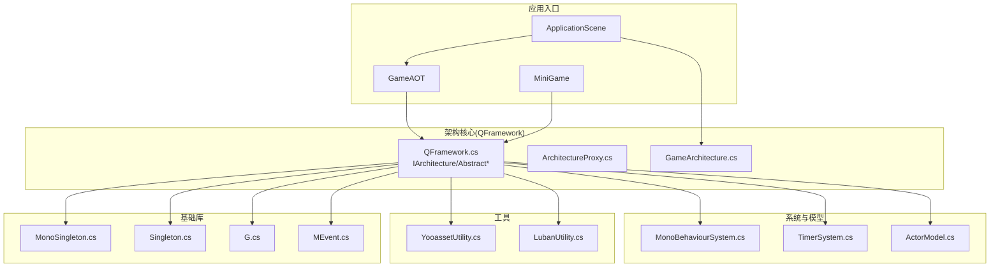
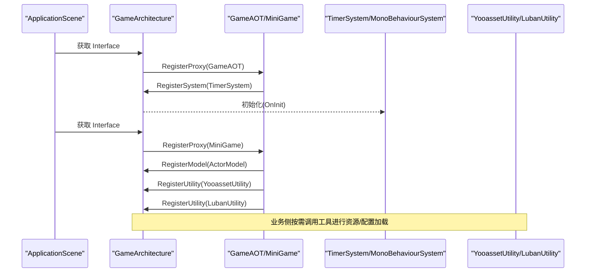
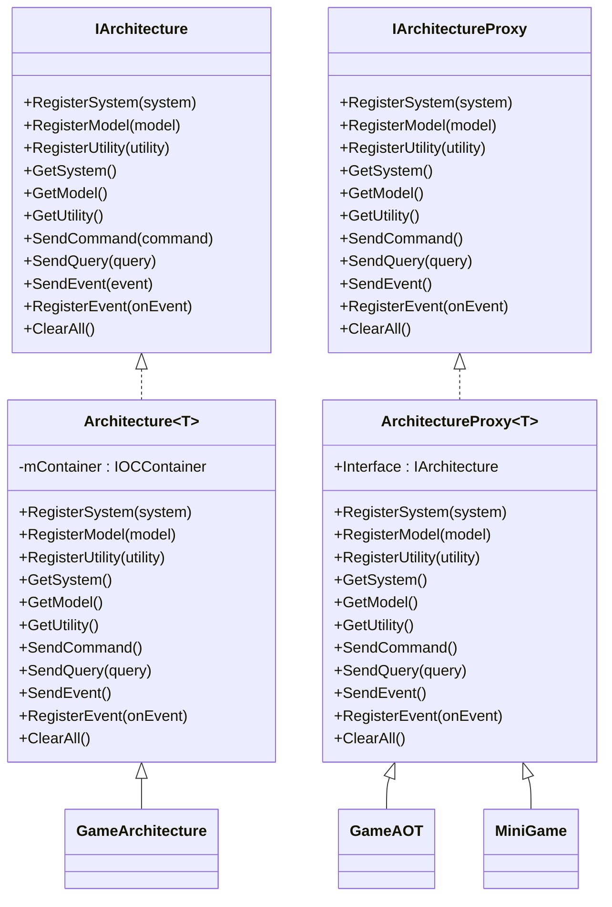
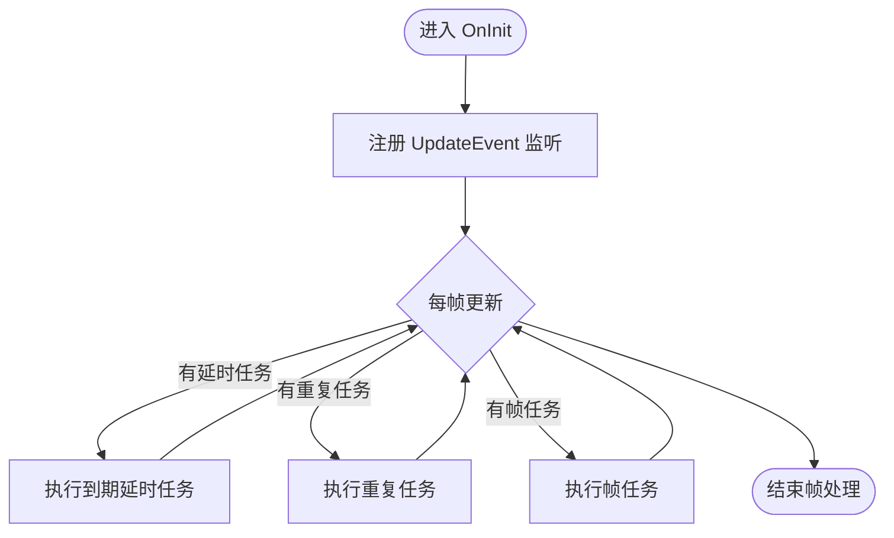
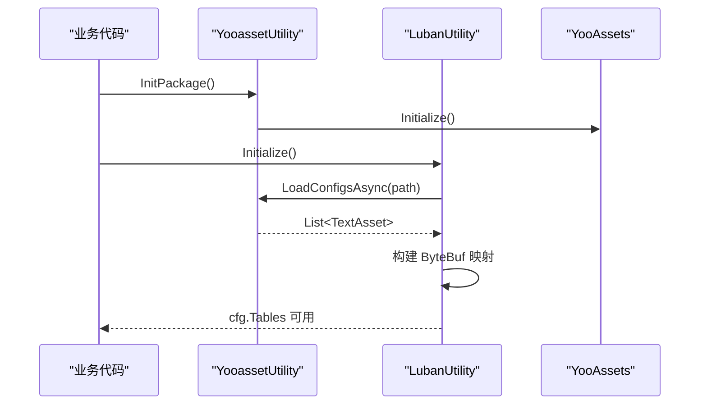
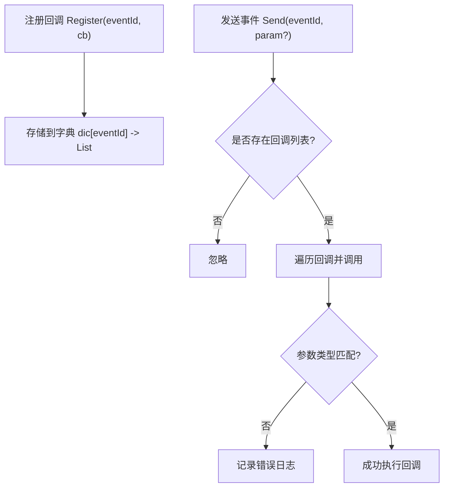
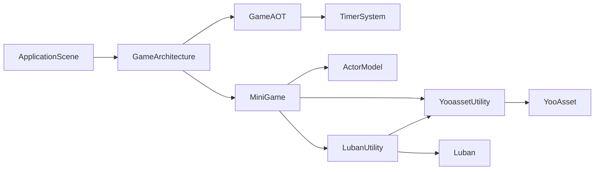

# 模拟游戏项目

<cite>
**本文引用的文件**   
- [ApplicationScene.cs](file://Assets/Game/Scripts/ApplicationScene.cs)
- [GameAOT.cs](file://Assets/Game/Scripts/GameAOT.cs)
- [MiniGame.cs](file://Assets/Game/Scripts/MiniGame_Scripts/MiniGame.cs)
- [ActorModel.cs](file://Assets/Game/Scripts/MiniGame_Scripts/Model/ActorModel.cs)
- [YooassetUtility.cs](file://Assets/Game/Scripts/MiniGame_Scripts/Utility/YooassetUtility.cs)
- [LubanUtility.cs](file://Assets/Game/Scripts/MiniGame_Scripts/Utility/LubanUtility.cs)
- [QFramework.cs](file://Assets/Game/Framework/Qframework/Runtime/QFramework.cs)
- [ArchitectureProxy.cs](file://Assets/Game/Framework/Qframework/Runtime/Moyv/Proxies/ArchitectureProxy.cs)
- [GameArchitecture.cs](file://Assets/Game/Framework/Qframework/Runtime/Moyv/Proxies/GameArchitecture.cs)
- [MonoBehaviourSystem.cs](file://Assets/Game/Framework/Qframework/Runtime/Moyv/Systems/MonoBehaviourSystem.cs)
- [TimerSystem.cs](file://Assets/Game/Framework/Qframework/Runtime/Moyv/Systems/TimerSystem.cs)
- [MEvent.cs](file://Assets/Game/Framework/MEvent/MEvent.cs)
- [G.cs](file://Assets/Game/Framework/Base/G.cs)
- [MonoSingleton.cs](file://Assets/Game/Framework/Base/Common/MonoSingleton.cs)
- [Singleton.cs](file://Assets/Game/Framework/Base/Common/Singleton.cs)
</cite>

## 目录
1. [简介](#简介)
2. [项目结构](#项目结构)
3. [核心组件](#核心组件)
4. [架构总览](#架构总览)
5. [详细组件分析](#详细组件分析)
6. [依赖关系分析](#依赖关系分析)
7. [性能考量](#性能考量)
8. [故障排查指南](#故障排查指南)
9. [结论](#结论)
10. [附录](#附录)

## 简介
本项目为基于 Unity 的“模拟游戏”客户端，采用 QFramework 作为基础架构，结合自研扩展（如 TimerSystem、事件系统、资源与配置加载工具等），实现模块化、可维护的游戏逻辑组织。整体遵循 MVC/MVVM 风格的分层：控制器（Controller）负责交互与流程编排，模型（Model）承载数据与持久化，系统（System）封装通用能力（如定时器、帧循环），工具（Utility）提供跨模块复用能力（如 YooAsset 资源管理、Luban 配置读取）。

## 项目结构
- 应用入口与初始化
  - ApplicationScene：场景级控制器，负责获取全局架构接口并触发框架初始化。
  - GameAOT：全局架构代理，注册全局系统（如定时器）。
  - MiniGame：业务架构代理，注册业务模型与工具。
- 框架层（QFramework + 自研扩展）
  - Architecture/Proxy：统一容器与生命周期管理，命令/查询/事件分发。
  - System/Model/Utility：抽象基类与约定，便于扩展。
  - MonoBehaviourSystem/TimmerSystem：将 Unity 生命周期与自定义任务调度解耦。
  - MEvent：轻量事件总线（按 ID 分发）。
- 工具与资源
  - YooassetUtility：基于 YooAsset 的资源/场景异步加载与释放。
  - LubanUtility：基于 Luban 生成的 Tables 进行配置读取。
- 基础库
  - MonoSingleton/Singleton：单例模式实现。
  - G：常用协程等待常量。

图表来源
- [ApplicationScene.cs:1-36](file://Assets/Game/Scripts/ApplicationScene.cs#L1-L36)
- [GameAOT.cs:1-13](file://Assets/Game/Scripts/GameAOT.cs#L1-L13)
- [MiniGame.cs:1-30](file://Assets/Game/Scripts/MiniGame_Scripts/MiniGame.cs#L1-L30)
- [QFramework.cs:1-800](file://Assets/Game/Framework/Qframework/Runtime/QFramework.cs#L1-L800)
- [ArchitectureProxy.cs:1-197](file://Assets/Game/Framework/Qframework/Runtime/Moyv/Proxies/ArchitectureProxy.cs#L1-L197)
- [GameArchitecture.cs:1-10](file://Assets/Game/Framework/Qframework/Runtime/Moyv/Proxies/GameArchitecture.cs#L1-L10)
- [MonoBehaviourSystem.cs:1-54](file://Assets/Game/Framework/Qframework/Runtime/Moyv/Systems/MonoBehaviourSystem.cs#L1-L54)
- [TimerSystem.cs:118-146](file://Assets/Game/Framework/Qframework/Runtime/Moyv/Systems/TimerSystem.cs#L118-L146)
- [ActorModel.cs:1-13](file://Assets/Game/Scripts/MiniGame_Scripts/Model/ActorModel.cs#L1-L13)
- [YooassetUtility.cs:1-122](file://Assets/Game/Scripts/MiniGame_Scripts/Utility/YooassetUtility.cs#L1-L122)
- [LubanUtility.cs:1-40](file://Assets/Game/Scripts/MiniGame_Scripts/Utility/LubanUtility.cs#L1-L40)
- [MEvent.cs:1-288](file://Assets/Game/Framework/MEvent/MEvent.cs#L1-L288)
- [G.cs:1-14](file://Assets/Game/Framework/Base/G.cs#L1-L14)
- [MonoSingleton.cs:1-141](file://Assets/Game/Framework/Base/Common/MonoSingleton.cs#L1-L141)
- [Singleton.cs:1-40](file://Assets/Game/Framework/Base/Common/Singleton.cs#L1-L40)

章节来源
- [ApplicationScene.cs:1-36](file://Assets/Game/Scripts/ApplicationScene.cs#L1-L36)
- [GameAOT.cs:1-13](file://Assets/Game/Scripts/GameAOT.cs#L1-L13)
- [MiniGame.cs:1-30](file://Assets/Game/Scripts/MiniGame_Scripts/MiniGame.cs#L1-L30)

## 核心组件
- 架构与代理
  - IArchitecture/Architecture<T>：统一的系统/模型/工具容器，命令/查询/事件分发，生命周期管理（Init/Reset/Reinit/ClearAll）。
  - ArchitectureProxy<T>：面向具体模块的便捷代理，转发到 GameArchitecture.Interface。
  - GameArchitecture：全局架构实例，持有所有注册对象。
- 系统与模型
  - AbstractSystem/AbstractModel：提供 Init/Reset 生命周期与状态机，支持延迟初始化。
  - MonoBehaviourSystem：桥接 Unity 生命周期事件（Update/LateUpdate/OnDestroy/OnApplicationPause 等）。
  - TimerSystem：基于事件驱动的延时/重复/帧任务调度器。
  - ActorModel：示例业务模型，用于存档或与服务端通信的数据载体。
- 工具
  - YooassetUtility：封装 YooAsset 的包初始化、资源/子资源/场景异步加载与释放。
  - LubanUtility：通过 YooAsset 加载配置二进制，构造 cfg.Tables 供业务使用。
- 基础库
  - MonoSingleton/Singleton：通用单例模板。
  - G：常用 WaitForSeconds 常量。
  - MEvent：基于事件 ID 的轻量事件总线。

章节来源
- [QFramework.cs:1-800](file://Assets/Game/Framework/Qframework/Runtime/QFramework.cs#L1-L800)
- [ArchitectureProxy.cs:1-197](file://Assets/Game/Framework/Qframework/Runtime/Moyv/Proxies/ArchitectureProxy.cs#L1-L197)
- [GameArchitecture.cs:1-10](file://Assets/Game/Framework/Qframework/Runtime/Moyv/Proxies/GameArchitecture.cs#L1-L10)
- [MonoBehaviourSystem.cs:1-54](file://Assets/Game/Framework/Qframework/Runtime/Moyv/Systems/MonoBehaviourSystem.cs#L1-L54)
- [TimerSystem.cs:118-146](file://Assets/Game/Framework/Qframework/Runtime/Moyv/Systems/TimerSystem.cs#L118-L146)
- [ActorModel.cs:1-13](file://Assets/Game/Scripts/MiniGame_Scripts/Model/ActorModel.cs#L1-L13)
- [YooassetUtility.cs:1-122](file://Assets/Game/Scripts/MiniGame_Scripts/Utility/YooassetUtility.cs#L1-L122)
- [LubanUtility.cs:1-40](file://Assets/Game/Scripts/MiniGame_Scripts/Utility/LubanUtility.cs#L1-L40)
- [MonoSingleton.cs:1-141](file://Assets/Game/Framework/Base/Common/MonoSingleton.cs#L1-L141)
- [Singleton.cs:1-40](file://Assets/Game/Framework/Base/Common/Singleton.cs#L1-L40)
- [G.cs:1-14](file://Assets/Game/Framework/Base/G.cs#L1-L14)
- [MEvent.cs:1-288](file://Assets/Game/Framework/MEvent/MEvent.cs#L1-L288)

## 架构总览
下图展示了从场景启动到架构初始化、系统/模型/工具注册的完整流程，以及后续资源与配置的加载路径。

图表来源
- [ApplicationScene.cs:1-36](file://Assets/Game/Scripts/ApplicationScene.cs#L1-L36)
- [GameAOT.cs:1-13](file://Assets/Game/Scripts/GameAOT.cs#L1-L13)
- [MiniGame.cs:1-30](file://Assets/Game/Scripts/MiniGame_Scripts/MiniGame.cs#L1-L30)
- [QFramework.cs:1-800](file://Assets/Game/Framework/Qframework/Runtime/QFramework.cs#L1-L800)
- [ArchitectureProxy.cs:1-197](file://Assets/Game/Framework/Qframework/Runtime/Moyv/Proxies/ArchitectureProxy.cs#L1-L197)
- [GameArchitecture.cs:1-10](file://Assets/Game/Framework/Qframework/Runtime/Moyv/Proxies/GameArchitecture.cs#L1-L10)
- [TimerSystem.cs:118-146](file://Assets/Game/Framework/Qframework/Runtime/Moyv/Systems/TimerSystem.cs#L118-L146)
- [MonoBehaviourSystem.cs:1-54](file://Assets/Game/Framework/Qframework/Runtime/Moyv/Systems/MonoBehaviourSystem.cs#L1-L54)
- [YooassetUtility.cs:1-122](file://Assets/Game/Scripts/MiniGame_Scripts/Utility/YooassetUtility.cs#L1-L122)
- [LubanUtility.cs:1-40](file://Assets/Game/Scripts/MiniGame_Scripts/Utility/LubanUtility.cs#L1-L40)

## 详细组件分析

### 架构与代理（QFramework + 自研扩展）
- 职责
  - 统一管理 System/Model/Utility 的生命周期与访问。
  - 提供命令/查询/事件的分发通道。
  - 支持重置与重建（Reset/Reinit/ClearAll）。
- 关键设计
  - Architecture<T>.Interface 懒加载并保证只初始化一次。
  - 通过 IOCContainer 注册与解析对象，支持延迟初始化。
  - 事件系统支持主线程派发，避免多线程 UI 问题。

图表来源
- [QFramework.cs:1-800](file://Assets/Game/Framework/Qframework/Runtime/QFramework.cs#L1-L800)
- [ArchitectureProxy.cs:1-197](file://Assets/Game/Framework/Qframework/Runtime/Moyv/Proxies/ArchitectureProxy.cs#L1-L197)
- [GameArchitecture.cs:1-10](file://Assets/Game/Framework/Qframework/Runtime/Moyv/Proxies/GameArchitecture.cs#L1-L10)
- [GameAOT.cs:1-13](file://Assets/Game/Scripts/GameAOT.cs#L1-L13)
- [MiniGame.cs:1-30](file://Assets/Game/Scripts/MiniGame_Scripts/MiniGame.cs#L1-L30)

章节来源
- [QFramework.cs:1-800](file://Assets/Game/Framework/Qframework/Runtime/QFramework.cs#L1-L800)
- [ArchitectureProxy.cs:1-197](file://Assets/Game/Framework/Qframework/Runtime/Moyv/Proxies/ArchitectureProxy.cs#L1-L197)
- [GameArchitecture.cs:1-10](file://Assets/Game/Framework/Qframework/Runtime/Moyv/Proxies/GameArchitecture.cs#L1-L10)
- [GameAOT.cs:1-13](file://Assets/Game/Scripts/GameAOT.cs#L1-L13)
- [MiniGame.cs:1-30](file://Assets/Game/Scripts/MiniGame_Scripts/MiniGame.cs#L1-L30)

### 定时器系统（TimerSystem）
- 职责
  - 提供延时执行、重复执行、每帧执行的任务调度。
  - 与 MonoBehaviourSystem 的事件体系集成，确保在合适的时机执行。
- 关键点
  - 支持忙闲检测（IsBusy），避免卡顿放大。
  - 提供 Reset 清理，防止内存泄漏。

图表来源
- [TimerSystem.cs:118-146](file://Assets/Game/Framework/Qframework/Runtime/Moyv/Systems/TimerSystem.cs#L118-L146)
- [MonoBehaviourSystem.cs:1-54](file://Assets/Game/Framework/Qframework/Runtime/Moyv/Systems/MonoBehaviourSystem.cs#L1-L54)

章节来源
- [TimerSystem.cs:118-146](file://Assets/Game/Framework/Qframework/Runtime/Moyv/Systems/TimerSystem.cs#L118-L146)
- [MonoBehaviourSystem.cs:1-54](file://Assets/Game/Framework/Qframework/Runtime/Moyv/Systems/MonoBehaviourSystem.cs#L1-L54)

### 资源与配置加载（YooassetUtility / LubanUtility）
- YooassetUtility
  - 初始化资源包（EditorSimulateMode/HostPlayMode）。
  - 提供同步/异步加载资源、子资源、场景的能力。
  - 提供卸载未使用资源、强制卸载全部资源、尝试卸载指定资源的方法。
- LubanUtility
  - 通过 YooassetUtility 加载配置二进制集合。
  - 构造 cfg.Tables 以供业务直接访问配置表。

图表来源
- [YooassetUtility.cs:1-122](file://Assets/Game/Scripts/MiniGame_Scripts/Utility/YooassetUtility.cs#L1-L122)
- [LubanUtility.cs:1-40](file://Assets/Game/Scripts/MiniGame_Scripts/Utility/LubanUtility.cs#L1-L40)

章节来源
- [YooassetUtility.cs:1-122](file://Assets/Game/Scripts/MiniGame_Scripts/Utility/YooassetUtility.cs#L1-L122)
- [LubanUtility.cs:1-40](file://Assets/Game/Scripts/MiniGame_Scripts/Utility/LubanUtility.cs#L1-L40)

### 事件系统（MEvent）
- 职责
  - 基于事件 ID 的轻量事件总线，支持无参与带参回调。
  - 提供注册/反注册/发送/重置方法。
- 注意
  - 参数类型需与注册时一致，否则会在发送时报错。

图表来源
- [MEvent.cs:1-288](file://Assets/Game/Framework/MEvent/MEvent.cs#L1-L288)

章节来源
- [MEvent.cs:1-288](file://Assets/Game/Framework/MEvent/MEvent.cs#L1-L288)

### 单例与常量（MonoSingleton / Singleton / G）
- MonoSingleton<T>
  - 基于 GameObject 的单例，自动创建 Boot 节点，支持销毁标记与重复实例清理。
- Singleton<T>
  - 纯托管对象的单例，支持 Release 释放。
- G
  - 提供常用的 WaitForSeconds 常量，减少重复创建。

章节来源
- [MonoSingleton.cs:1-141](file://Assets/Game/Framework/Base/Common/MonoSingleton.cs#L1-L141)
- [Singleton.cs:1-40](file://Assets/Game/Framework/Base/Common/Singleton.cs#L1-L40)
- [G.cs:1-14](file://Assets/Game/Framework/Base/G.cs#L1-L14)

## 依赖关系分析
- 耦合与内聚
  - 架构层（QFramework）高度内聚，对外暴露稳定接口；业务通过代理（GameAOT/MiniGame）注册，降低耦合。
  - 工具层（YooassetUtility/LubanUtility）仅依赖架构提供的 GetUtility 与 YooAsset/Luban SDK，职责清晰。
- 外部依赖
  - YooAsset：资源打包与加载。
  - Luban：配置生成与读取。
  - Cysharp.Threading.Tasks：异步任务（UniTask）。
- 潜在循环依赖
  - 当前未见明显循环引用；建议保持工具不反向依赖业务模块。

图表来源
- [ApplicationScene.cs:1-36](file://Assets/Game/Scripts/ApplicationScene.cs#L1-L36)
- [GameAOT.cs:1-13](file://Assets/Game/Scripts/GameAOT.cs#L1-L13)
- [MiniGame.cs:1-30](file://Assets/Game/Scripts/MiniGame_Scripts/MiniGame.cs#L1-L30)
- [TimerSystem.cs:118-146](file://Assets/Game/Framework/Qframework/Runtime/Moyv/Systems/TimerSystem.cs#L118-L146)
- [ActorModel.cs:1-13](file://Assets/Game/Scripts/MiniGame_Scripts/Model/ActorModel.cs#L1-L13)
- [YooassetUtility.cs:1-122](file://Assets/Game/Scripts/MiniGame_Scripts/Utility/YooassetUtility.cs#L1-L122)
- [LubanUtility.cs:1-40](file://Assets/Game/Scripts/MiniGame_Scripts/Utility/LubanUtility.cs#L1-L40)

章节来源
- [ApplicationScene.cs:1-36](file://Assets/Game/Scripts/ApplicationScene.cs#L1-L36)
- [GameAOT.cs:1-13](file://Assets/Game/Scripts/GameAOT.cs#L1-L13)
- [MiniGame.cs:1-30](file://Assets/Game/Scripts/MiniGame_Scripts/MiniGame.cs#L1-L30)
- [YooassetUtility.cs:1-122](file://Assets/Game/Scripts/MiniGame_Scripts/Utility/YooassetUtility.cs#L1-L122)
- [LubanUtility.cs:1-40](file://Assets/Game/Scripts/MiniGame_Scripts/Utility/LubanUtility.cs#L1-L40)

## 性能考量
- 资源加载
  - 优先使用异步加载（LoadAssetAsync/LoadSceneAsync），避免阻塞主线程。
  - 场景切换后及时调用 UnloadUnusedAssets 或 ForceUnloadAllAssets，控制内存峰值。
- 任务调度
  - 利用 TimerSystem 的忙闲检测，避免在卡顿帧堆积任务。
  - 合理拆分耗时操作，使用 UniTask 与帧任务组合。
- 事件与对象
  - 及时注销事件与对象，避免内存泄漏。
  - 使用 MonoSingleton 的销毁标记机制，避免重复实例。

[本节为通用指导，无需源码引用]

## 故障排查指南
- 事件参数类型不一致
  - 现象：发送事件时报错提示类型不一致。
  - 排查：确认注册与发送的参数类型一致。
- 资源加载失败
  - 现象：LoadConfigsAsync/LoadAssetAsync 返回空或异常。
  - 排查：检查 YooAsset 包名、路径、运行模式（EditorSimulateMode/HostPlayMode）与 StreamingAssets 目录。
- 定时器未执行
  - 现象：延时/重复任务未触发。
  - 排查：确认 TimerSystem 已注册且 MonoBehaviourSystem 正常派发 UpdateEvent。
- 单例重复实例
  - 现象：出现多个相同单例实例。
  - 排查：检查是否手动 new 而非通过 Instance 访问，或是否在编辑器热重载导致状态残留。

章节来源
- [MEvent.cs:1-288](file://Assets/Game/Framework/MEvent/MEvent.cs#L1-L288)
- [YooassetUtility.cs:1-122](file://Assets/Game/Scripts/MiniGame_Scripts/Utility/YooassetUtility.cs#L1-L122)
- [TimerSystem.cs:118-146](file://Assets/Game/Framework/Qframework/Runtime/Moyv/Systems/TimerSystem.cs#L118-L146)
- [MonoSingleton.cs:1-141](file://Assets/Game/Framework/Base/Common/MonoSingleton.cs#L1-L141)

## 结论
本项目以 QFramework 为核心，结合自研扩展实现了清晰的架构分层与良好的可扩展性。通过统一的架构代理、系统/模型/工具分离、异步资源与配置加载、以及稳定的事件与定时器机制，为模拟游戏的快速迭代与稳定运行提供了坚实基础。建议在后续开发中持续完善错误处理与性能监控，并逐步补充更多业务系统。

[本节为总结，无需源码引用]

## 附录
- 术语
  - 架构（Architecture）：统一容器与生命周期管理器。
  - 代理（Proxy）：面向模块的便捷访问入口。
  - 系统（System）：通用能力封装（如定时器、帧循环）。
  - 模型（Model）：数据与持久化载体。
  - 工具（Utility）：跨模块复用的服务（资源、配置、网络等）。
- 最佳实践
  - 通过 ArchitectureProxy 注册与访问，避免直接耦合底层容器。
  - 使用异步 API 与 UniTask 组合，避免主线程阻塞。
  - 在场景切换或退出时，主动释放资源与注销事件。

[本节为概念说明，无需源码引用]