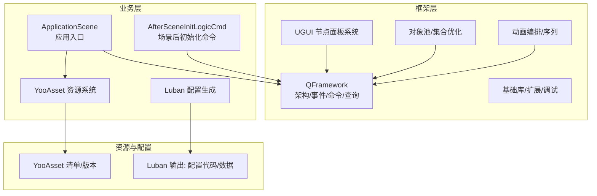
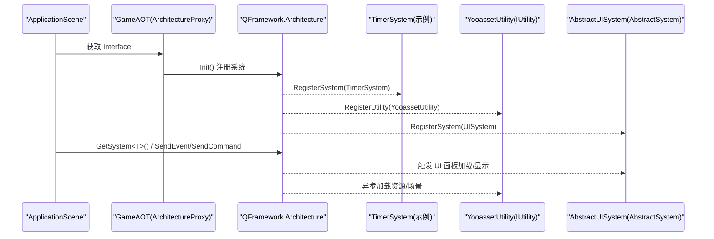
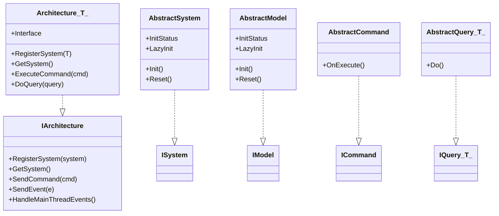
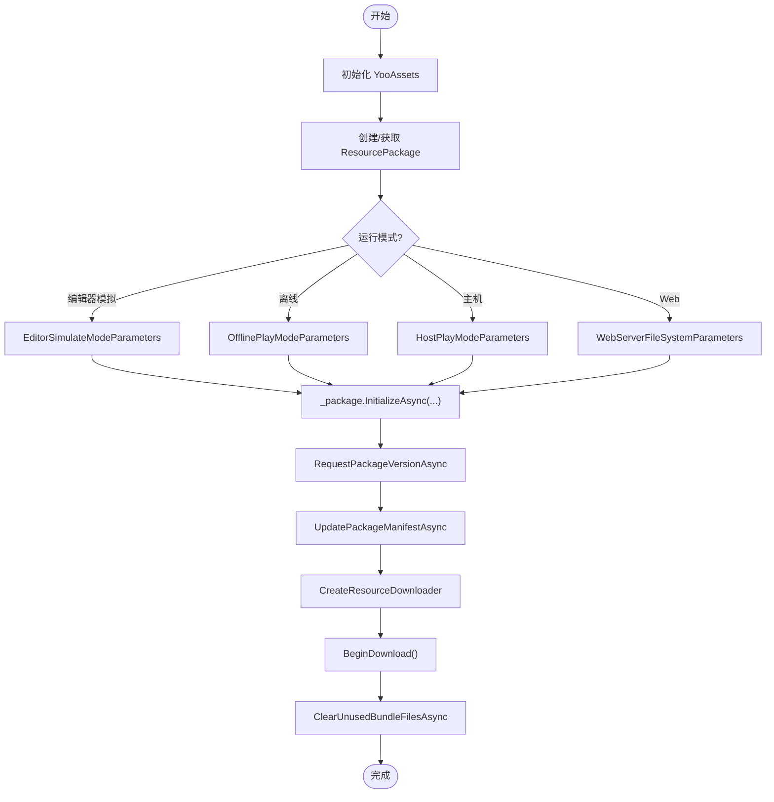
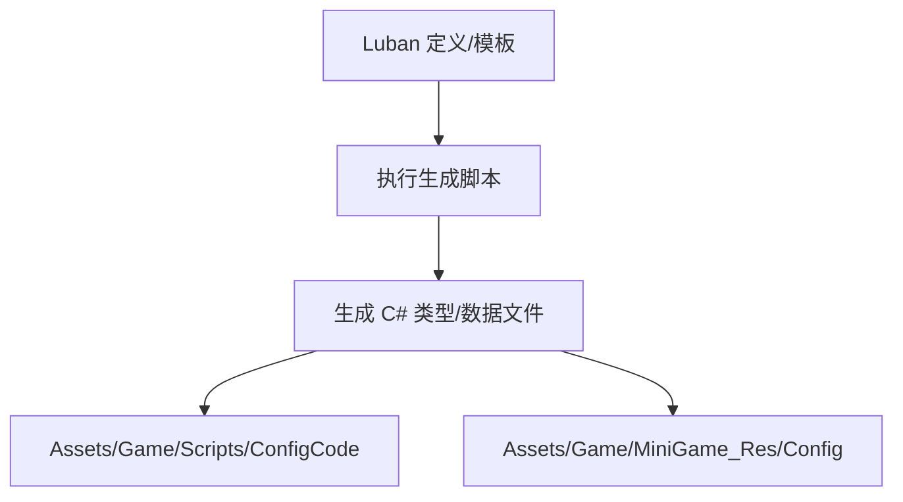
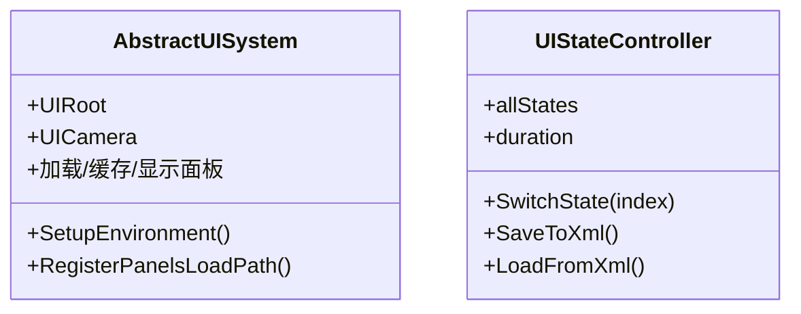
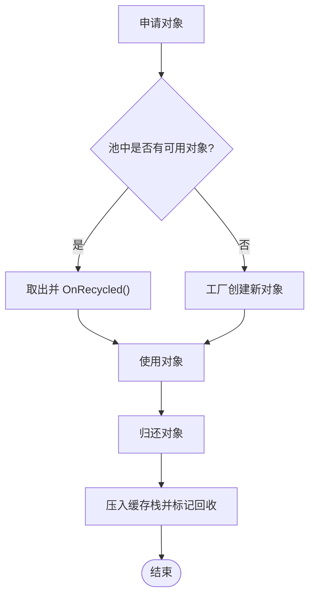
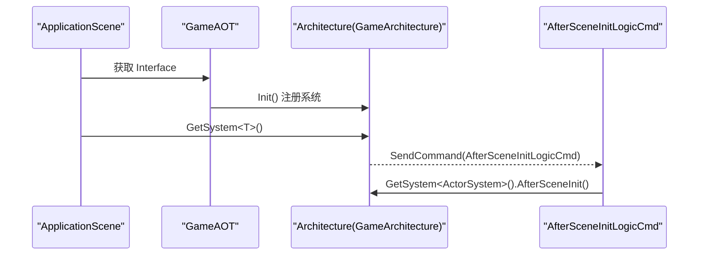
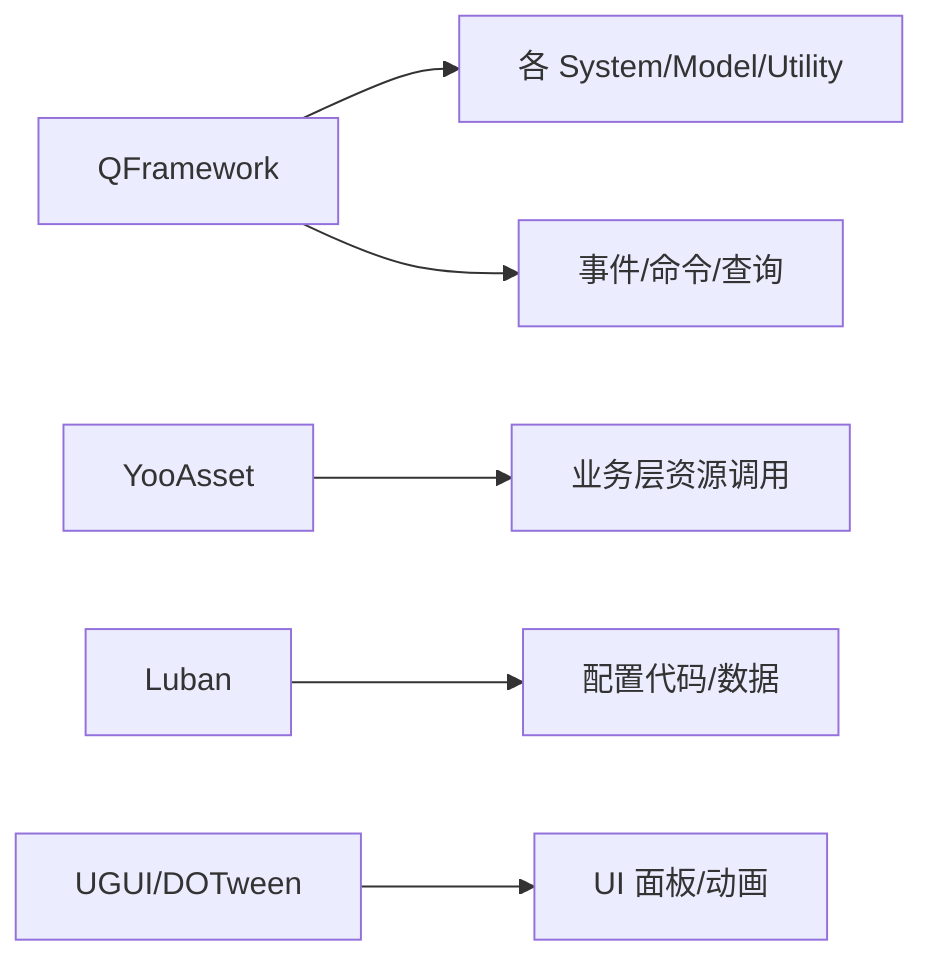

# 项目介绍

<cite>
**本文引用的文件**   
- [QFramework.cs](file://Assets/Game/Framework/Qframework/Runtime/QFramework.cs)
- [GameArchitecture.cs](file://Assets/Game/Framework/Qframework/Runtime/Moyv/Proxies/GameArchitecture.cs)
- [GameAOT.cs](file://Assets/Game/Scripts/GameAOT.cs)
- [ApplicationScene.cs](file://Assets/Game/Scripts/ApplicationScene.cs)
- [MyYooAsset.cs](file://Assets/Game/Scripts/MiniGame_Scripts/Utility/MyYooAsset.cs)
- [YooassetUtility.cs](file://Assets/Game/Scripts/MiniGame_Scripts/Utility/YooassetUtility.cs)
- [AbstractUISystem.cs](file://Assets/Game/Framework/Ugui/Runtime/NodePanel/AbstractUISystem.cs)
- [UIStateController.cs](file://Assets/Game/Framework/UIStateSwitcher/UIStateController.cs)
- [PoolKit.cs](file://Assets/Game/Framework/Qframework/Runtime/Toolkits/PoolKit.cs)
- [gen.bat](file://LubanConfig/Template/gen.bat)
- [gen.sh](file://LubanConfig/Template/gen.sh)
</cite>

## 目录
1. [简介](#简介)
2. [项目结构](#项目结构)
3. [核心组件](#核心组件)
4. [架构总览](#架构总览)
5. [详细组件分析](#详细组件分析)
6. [依赖关系分析](#依赖关系分析)
7. [性能考量](#性能考量)
8. [故障排查指南](#故障排查指南)
9. [结论](#结论)
10. [附录](#附录)

## 简介
SimulationClient 是基于 QFramework 的现代化 Unity 游戏客户端框架，面向高性能、可维护与可扩展的游戏开发。项目围绕“模块化架构 + 资源管理 + 配置系统 + UI 框架 + 对象池 + 事件驱动”等关键能力构建，提供类型安全的配置生成、异步资源加载与热更新流程、轻量级 UI 状态切换与动画编排工具，以及统一的事件与命令机制，帮助团队在复杂业务中保持清晰的职责边界与高效的迭代节奏。

## 项目结构
- 框架层（Framework）
  - QFramework：统一的架构容器、System/Model/Command/Query/Event 体系
  - UGUI 扩展：节点式 UI 系统与面板生命周期管理
  - UIStateSwitcher：基于 XML 的 UI 状态切换器
  - MPool/PoolKit：对象池与集合优化
  - AnimationComposer/AnimationUI：动画序列与组合工具
  - Base：通用单例、扩展方法、平台适配、调试工具等
- 业务层（Scripts/MiniGame_Scripts）
  - 应用入口与场景初始化
  - 资源系统封装（YooAsset）
  - 配置代码生成（Luban）
  - 常用工具与控制器
- 资源与配置（MiniGame_Res/Resources/StreamingAssets）
  - 资源包、场景、材质、UI 资源
  - YooAsset 清单与版本信息
  - Luban 模板与生成脚本

图表来源
- [ApplicationScene.cs:1-36](file://Assets/Game/Scripts/ApplicationScene.cs#L1-L36)
- [QFramework.cs:36-351](file://Assets/Game/Framework/Qframework/Runtime/QFramework.cs#L36-L351)
- [YooassetUtility.cs:1-122](file://Assets/Game/Scripts/MiniGame_Scripts/Utility/YooassetUtility.cs#L1-L122)
- [gen.bat:1-12](file://LubanConfig/Template/gen.bat#L1-L12)

章节来源
- [ApplicationScene.cs:1-36](file://Assets/Game/Scripts/ApplicationScene.cs#L1-L36)
- [QFramework.cs:36-351](file://Assets/Game/Framework/Qframework/Runtime/QFramework.cs#L36-L351)
- [YooassetUtility.cs:1-122](file://Assets/Game/Scripts/MiniGame_Scripts/Utility/YooassetUtility.cs#L1-L122)
- [gen.bat:1-12](file://LubanConfig/Template/gen.bat#L1-L12)

## 核心组件
- 架构与模块注册
  - 通过 Architecture 抽象类统一管理 System/Model/Utility 的生命周期与获取方式，支持懒加载与重置
  - 提供 Command/Query/Event 的统一入口，便于解耦与跨模块通信
- 资源管理系统
  - 基于 YooAsset 的异步资源加载、版本与清单更新、下载与缓存清理
  - 提供多运行模式（编辑器模拟、离线、主机、WebGL）与并发控制
- 配置系统
  - 使用 Luban 从定义生成 C# 类型与数据，实现类型安全与强约束的配置访问
- UI 框架
  - 节点式 UI 系统负责面板加载、排序、显示/隐藏与生命周期
  - UI 状态切换器支持以 XML 描述界面状态并运行时切换
- 对象池机制
  - 泛型对象池与非公开构造函数对象池，减少 GC 压力与分配峰值
- 动画系统
  - 动画序列与组合器，支持命令化编排与可视化编辑

章节来源
- [QFramework.cs:36-351](file://Assets/Game/Framework/Qframework/Runtime/QFramework.cs#L36-L351)
- [MyYooAsset.cs:1-330](file://Assets/Game/Scripts/MiniGame_Scripts/Utility/MyYooAsset.cs#L1-L330)
- [YooassetUtility.cs:1-122](file://Assets/Game/Scripts/MiniGame_Scripts/Utility/YooassetUtility.cs#L1-L122)
- [gen.bat:1-12](file://LubanConfig/Template/gen.bat#L1-L12)
- [gen.sh:1-11](file://LubanConfig/Template/gen.sh#L1-L11)
- [AbstractUISystem.cs:1-45](file://Assets/Game/Framework/Ugui/Runtime/NodePanel/AbstractUISystem.cs#L1-L45)
- [UIStateController.cs:1-110](file://Assets/Game/Framework/UIStateSwitcher/UIStateController.cs#L1-L110)
- [PoolKit.cs:152-207](file://Assets/Game/Framework/Qframework/Runtime/Toolkits/PoolKit.cs#L152-L207)

## 架构总览
项目采用“架构中心 + 模块化子系统”的设计：ApplicationScene 作为入口，通过 GameAOT 初始化全局架构；各子系统（资源、UI、计时器等）以 System 形式注册；业务逻辑通过 Command/Event 进行解耦交互。

图表来源
- [ApplicationScene.cs:1-36](file://Assets/Game/Scripts/ApplicationScene.cs#L1-L36)
- [GameAOT.cs:1-13](file://Assets/Game/Scripts/GameAOT.cs#L1-L13)
- [QFramework.cs:94-351](file://Assets/Game/Framework/Qframework/Runtime/QFramework.cs#L94-L351)
- [YooassetUtility.cs:1-122](file://Assets/Game/Scripts/MiniGame_Scripts/Utility/YooassetUtility.cs#L1-L122)
- [AbstractUISystem.cs:1-45](file://Assets/Game/Framework/Ugui/Runtime/NodePanel/AbstractUISystem.cs#L1-L45)

## 详细组件分析

### 架构与事件驱动（QFramework）
- 设计要点
  - Architecture 提供统一的注册/获取/重置/清理接口，内置 IOC 容器
  - System/Model/Utility 具备 Init/Reset/LazyInit 生命周期
  - Command/Query 提供同步/返回值操作，Event 支持主线程派发
- 适用场景
  - 跨模块通信、解耦业务流、统一生命周期管理

图表来源
- [QFramework.cs:36-351](file://Assets/Game/Framework/Qframework/Runtime/QFramework.cs#L36-L351)

章节来源
- [QFramework.cs:36-351](file://Assets/Game/Framework/Qframework/Runtime/QFramework.cs#L36-L351)

### 资源管理与热更新（YooAsset）
- 设计要点
  - MyYooAsset 封装 YooAsset 初始化、版本/清单更新、下载与缓存清理
  - 支持多种运行模式与 WebGL/微信小游戏特殊路径
  - YooassetUtility 暴露统一异步 API：加载配置、资源、子资源、场景，以及卸载策略
- 适用场景
  - 大型项目资源分包、增量更新、跨平台资源分发

图表来源
- [MyYooAsset.cs:1-330](file://Assets/Game/Scripts/MiniGame_Scripts/Utility/MyYooAsset.cs#L1-L330)

章节来源
- [MyYooAsset.cs:1-330](file://Assets/Game/Scripts/MiniGame_Scripts/Utility/MyYooAsset.cs#L1-L330)
- [YooassetUtility.cs:1-122](file://Assets/Game/Scripts/MiniGame_Scripts/Utility/YooassetUtility.cs#L1-L122)

### 配置系统（Luban）
- 设计要点
  - 通过 gen.bat/gen.sh 调用 Luban，将数据定义转换为 C# 类型与二进制/JSON 数据
  - 输出到 MiniGame_Res/Config 与 Scripts/ConfigCode，供运行时类型安全读取
- 适用场景
  - 数值表、关卡配置、本地化文本等结构化数据的强类型访问

图表来源
- [gen.bat:1-12](file://LubanConfig/Template/gen.bat#L1-L12)
- [gen.sh:1-11](file://LubanConfig/Template/gen.sh#L1-L11)

章节来源
- [gen.bat:1-12](file://LubanConfig/Template/gen.bat#L1-L12)
- [gen.sh:1-11](file://LubanConfig/Template/gen.sh#L1-L11)

### UI 框架与状态切换
- 节点式 UI 系统（AbstractUISystem）
  - 维护面板加载路径、已缓存面板、打开面板列表与加载队列
  - 提供 UI 根节点与摄像机设置，统一排序与生命周期
- UI 状态切换器（UIStateController）
  - 以 XML 描述 UI 状态（激活、缩放、透明度、Sprite 等），运行时平滑切换
- 适用场景
  - 复杂界面状态管理、批量属性切换、配置驱动 UI 表现

图表来源
- [AbstractUISystem.cs:1-45](file://Assets/Game/Framework/Ugui/Runtime/NodePanel/AbstractUISystem.cs#L1-L45)
- [UIStateController.cs:1-110](file://Assets/Game/Framework/UIStateSwitcher/UIStateController.cs#L1-L110)

章节来源
- [AbstractUISystem.cs:1-45](file://Assets/Game/Framework/Ugui/Runtime/NodePanel/AbstractUISystem.cs#L1-L45)
- [UIStateController.cs:1-110](file://Assets/Game/Framework/UIStateSwitcher/UIStateController.cs#L1-L110)

### 对象池机制（PoolKit）
- 设计要点
  - 泛型对象池支持最大容量与预初始化数量
  - NonPublicObjectPool 针对无公共构造函数的类型（如单例）提供池化
- 适用场景
  - 高频创建销毁的对象（特效、子弹、临时数据结构）降低 GC 峰值

图表来源
- [PoolKit.cs:152-207](file://Assets/Game/Framework/Qframework/Runtime/Toolkits/PoolKit.cs#L152-L207)

章节来源
- [PoolKit.cs:152-207](file://Assets/Game/Framework/Qframework/Runtime/Toolkits/PoolKit.cs#L152-L207)

### 应用入口与场景初始化
- ApplicationScene 作为 MonoBehaviour 控制器，Awake 时初始化框架并返回 Architecture 实例
- GameAOT 作为 ArchitectureProxy，集中注册系统（如 TimerSystem）
- AfterSceneInitLogicCmd 用于场景加载后的逻辑初始化（示例中预留了多个系统钩子）

图表来源
- [ApplicationScene.cs:1-36](file://Assets/Game/Scripts/ApplicationScene.cs#L1-L36)
- [GameAOT.cs:1-13](file://Assets/Game/Scripts/GameAOT.cs#L1-L13)
- [GameArchitecture.cs:1-10](file://Assets/Game/Framework/Qframework/Runtime/Moyv/Proxies/GameArchitecture.cs#L1-L10)

章节来源
- [ApplicationScene.cs:1-36](file://Assets/Game/Scripts/ApplicationScene.cs#L1-L36)
- [GameAOT.cs:1-13](file://Assets/Game/Scripts/GameAOT.cs#L1-L13)
- [GameArchitecture.cs:1-10](file://Assets/Game/Framework/Qframework/Runtime/Moyv/Proxies/GameArchitecture.cs#L1-L10)

## 依赖关系分析
- 低耦合高内聚
  - 架构层（QFramework）为所有子系统提供统一入口，避免直接耦合
  - 资源系统通过 IUtility 暴露，UI 系统通过 AbstractSystem 接入
- 外部依赖
  - YooAsset：资源打包、版本与清单、下载与缓存
  - Luban：配置代码与数据生成
  - DOTween/UGUI：动画与 UI 渲染

图表来源
- [QFramework.cs:36-351](file://Assets/Game/Framework/Qframework/Runtime/QFramework.cs#L36-L351)
- [YooassetUtility.cs:1-122](file://Assets/Game/Scripts/MiniGame_Scripts/Utility/YooassetUtility.cs#L1-L122)
- [gen.bat:1-12](file://LubanConfig/Template/gen.bat#L1-L12)

章节来源
- [QFramework.cs:36-351](file://Assets/Game/Framework/Qframework/Runtime/QFramework.cs#L36-L351)
- [YooassetUtility.cs:1-122](file://Assets/Game/Scripts/MiniGame_Scripts/Utility/YooassetUtility.cs#L1-L122)
- [gen.bat:1-12](file://LubanConfig/Template/gen.bat#L1-L12)

## 性能考量
- 对象复用
  - 使用 PoolKit 对频繁创建销毁的对象进行池化，减少 GC 抖动
- 资源加载
  - 合理设置 BundleLoadingMaxConcurrency，平衡吞吐与内存占用
  - 及时调用 UnloadUnusedAssets/ForceUnloadAllAssets，避免内存泄漏
- 事件调度
  - 使用 SendEventToMainThread 确保 UI 相关事件在主线程执行
- 配置访问
  - 通过 Luban 生成的类型直接访问，避免运行时解析开销

[本节为通用指导，不直接分析具体文件]

## 故障排查指南
- 资源初始化失败
  - 检查 PlayMode 与文件系统参数是否匹配目标平台
  - 确认远程服务器地址与版本号是否正确
- 清单或版本更新异常
  - 查看 UpdatePackageManifestAsync 的错误码与日志
- 下载失败或进度卡住
  - 检查网络连通性与重试次数，关注 DownloadErrorCallback
- UI 面板未显示
  - 确认 AbstractUISystem 的 SetupEnvironment 与 RegisterPanelsLoadPath 是否配置正确
  - 检查面板排序与父节点层级
- 配置无法读取
  - 确认 Luban 生成路径与文件名一致，且资源已被打包进对应包

章节来源
- [MyYooAsset.cs:1-330](file://Assets/Game/Scripts/MiniGame_Scripts/Utility/MyYooAsset.cs#L1-L330)
- [YooassetUtility.cs:1-122](file://Assets/Game/Scripts/MiniGame_Scripts/Utility/YooassetUtility.cs#L1-L122)
- [AbstractUISystem.cs:1-45](file://Assets/Game/Framework/Ugui/Runtime/NodePanel/AbstractUISystem.cs#L1-L45)

## 结论
SimulationClient 以 QFramework 为核心，结合 YooAsset 与 Luban，构建了“架构清晰、资源可控、配置安全、UI 易用、性能友好”的现代化客户端框架。通过对象池与异步加载、事件驱动与模块化设计，项目在提升开发效率的同时，有效降低了运行时开销与维护成本，适用于需要快速迭代与稳定性能的中型至大型 Unity 项目。

[本节为总结性内容，不直接分析具体文件]

## 附录
- 术语对照
  - 架构：IArchitecture/Arcitecture<T>
  - 系统：ISystem/AbstractSystem
  - 模型：IModel/AbstractModel
  - 工具：IUtility
  - 命令：ICommand/AbstractCommand
  - 查询：IQuery/AbstractQuery<T>
  - 事件：TypeEventSystem/主线程派发
- 参考路径
  - 架构与事件：[QFramework.cs](file://Assets/Game/Framework/Qframework/Runtime/QFramework.cs)
  - 资源系统：[MyYooAsset.cs](file://Assets/Game/Scripts/MiniGame_Scripts/Utility/MyYooAsset.cs)、[YooassetUtility.cs](file://Assets/Game/Scripts/MiniGame_Scripts/Utility/YooassetUtility.cs)
  - 配置生成：[gen.bat](file://LubanConfig/Template/gen.bat)、[gen.sh](file://LubanConfig/Template/gen.sh)
  - UI 框架：[AbstractUISystem.cs](file://Assets/Game/Framework/Ugui/Runtime/NodePanel/AbstractUISystem.cs)、[UIStateController.cs](file://Assets/Game/Framework/UIStateSwitcher/UIStateController.cs)
  - 对象池：[PoolKit.cs](file://Assets/Game/Framework/Qframework/Runtime/Toolkits/PoolKit.cs)