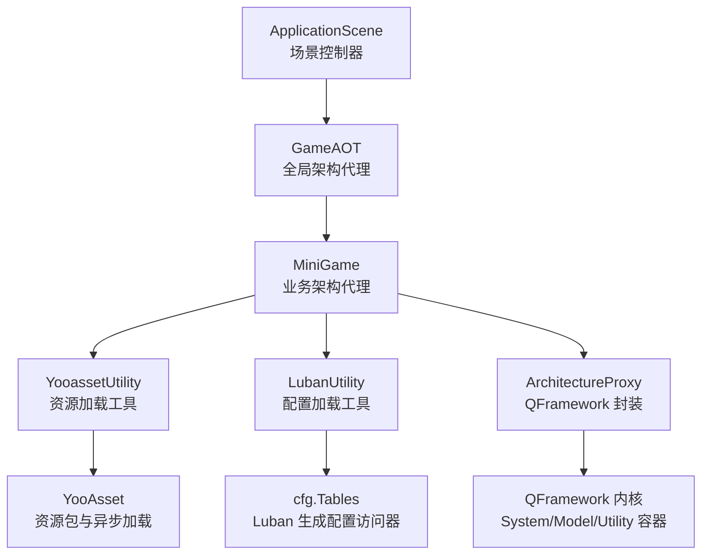
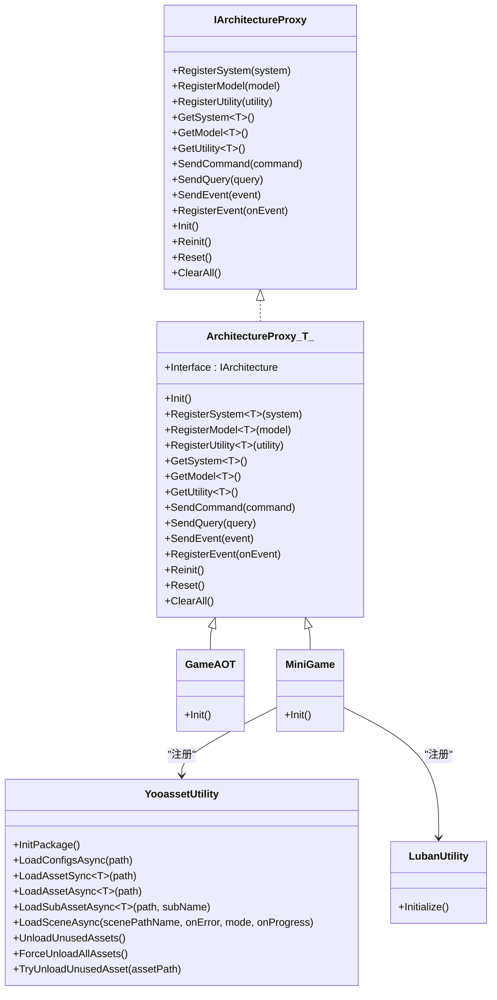
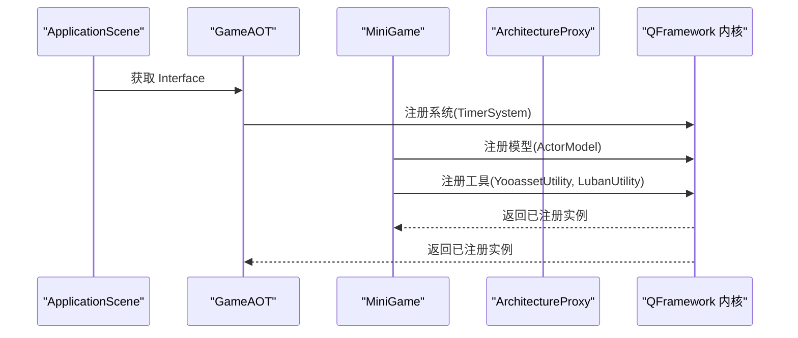
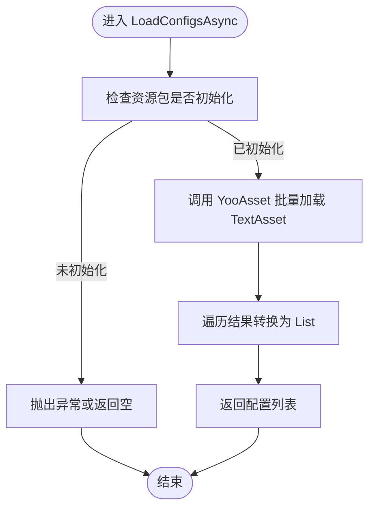
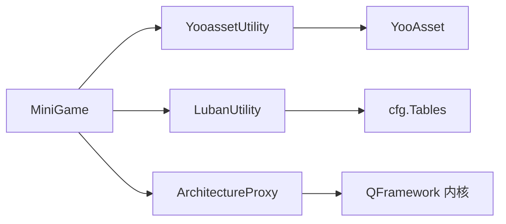

# 项目概述

<cite>
**本文引用的文件**   
- [Assets/Game/Scripts/MiniGame_Scripts/MiniGame.cs](file://Assets/Game/Scripts/MiniGame_Scripts/MiniGame.cs)
- [Assets/Game/Scripts/ApplicationScene.cs](file://Assets/Game/Scripts/ApplicationScene.cs)
- [Assets/Game/Scripts/GameAOT.cs](file://Assets/Game/Scripts/GameAOT.cs)
- [Assets/Game/Framework/Qframework/Runtime/Moyv/Proxies/ArchitectureProxy.cs](file://Assets/Game/Framework/Qframework/Runtime/Moyv/Proxies/ArchitectureProxy.cs)
- [Assets/Game/Scripts/MiniGame_Scripts/Utility/YooassetUtility.cs](file://Assets/Game/Scripts/MiniGame_Scripts/Utility/YooassetUtility.cs)
- [Assets/Game/Scripts/MiniGame_Scripts/Utility/LubanUtility.cs](file://Assets/Game/Scripts/MiniGame_Scripts/Utility/LubanUtility.cs)
- [Assets/Game/Scripts/AssetPathConst.cs](file://Assets/Game/Scripts/AssetPathConst.cs)
- [Assets/Game/Framework/Base/MOYVBase.asmdef](file://Assets/Game/Framework/Base/MOYVBase.asmdef)
</cite>

## 目录
1. [简介](#简介)
2. [项目结构](#项目结构)
3. [核心组件](#核心组件)
4. [架构总览](#架构总览)
5. [详细组件分析](#详细组件分析)
6. [依赖关系分析](#依赖关系分析)
7. [性能与资源管理](#性能与资源管理)
8. [快速开始指南](#快速开始指南)
9. [故障排查](#故障排查)
10. [结论](#结论)

## 简介
本项目为基于 QFramework 的 Unity 游戏客户端框架，采用 System-Model-Utility 分层架构，结合 YooAsset 进行资源打包与加载、Luban 生成配置数据、DOTween 提供动画能力，并通过对象池机制提升运行时性能。整体设计强调模块化、低耦合与高可维护性，便于团队协作与持续迭代。

## 项目结构
- 应用入口与架构初始化
  - ApplicationScene：场景控制器，负责获取全局架构接口并触发初始化流程。
  - GameAOT：全局架构代理，注册系统（如定时器）。
  - MiniGame：业务层架构代理，注册模型与工具类（如 YooAsset、Luban）。
- 工具与基础设施
  - YooassetUtility：封装 YooAsset 的资源加载、场景加载与释放。
  - LubanUtility：通过 YooAsset 加载生成的配置表，构建 Tables 访问器。
  - AssetPathConst：集中管理资源路径常量。
  - ArchitectureProxy：统一封装对 QFramework 的调用，提供 System/Model/Utility 的注册与获取。
- 第三方集成
  - DOTween：通过程序集引用启用动画能力。
  - YooAsset：资源包管理与异步加载。
  - Luban：配置表代码生成与读取。

图表来源
- [Assets/Game/Scripts/ApplicationScene.cs:1-36](file://Assets/Game/Scripts/ApplicationScene.cs#L1-L36)
- [Assets/Game/Scripts/GameAOT.cs:1-13](file://Assets/Game/Scripts/GameAOT.cs#L1-L13)
- [Assets/Game/Scripts/MiniGame_Scripts/MiniGame.cs:1-30](file://Assets/Game/Scripts/MiniGame_Scripts/MiniGame.cs#L1-L30)
- [Assets/Game/Scripts/MiniGame_Scripts/Utility/YooassetUtility.cs:1-122](file://Assets/Game/Scripts/MiniGame_Scripts/Utility/YooassetUtility.cs#L1-L122)
- [Assets/Game/Scripts/MiniGame_Scripts/Utility/LubanUtility.cs:1-40](file://Assets/Game/Scripts/MiniGame_Scripts/Utility/LubanUtility.cs#L1-L40)
- [Assets/Game/Framework/Qframework/Runtime/Moyv/Proxies/ArchitectureProxy.cs:1-197](file://Assets/Game/Framework/Qframework/Runtime/Moyv/Proxies/ArchitectureProxy.cs#L1-L197)

章节来源
- [Assets/Game/Scripts/ApplicationScene.cs:1-36](file://Assets/Game/Scripts/ApplicationScene.cs#L1-L36)
- [Assets/Game/Scripts/GameAOT.cs:1-13](file://Assets/Game/Scripts/GameAOT.cs#L1-L13)
- [Assets/Game/Scripts/MiniGame_Scripts/MiniGame.cs:1-30](file://Assets/Game/Scripts/MiniGame_Scripts/MiniGame.cs#L1-L30)
- [Assets/Game/Scripts/MiniGame_Scripts/Utility/YooassetUtility.cs:1-122](file://Assets/Game/Scripts/MiniGame_Scripts/Utility/YooassetUtility.cs#L1-L122)
- [Assets/Game/Scripts/MiniGame_Scripts/Utility/LubanUtility.cs:1-40](file://Assets/Game/Scripts/MiniGame_Scripts/Utility/LubanUtility.cs#L1-L40)
- [Assets/Game/Framework/Qframework/Runtime/Moyv/Proxies/ArchitectureProxy.cs:1-197](file://Assets/Game/Framework/Qframework/Runtime/Moyv/Proxies/ArchitectureProxy.cs#L1-L197)

## 核心组件
- 架构代理与生命周期
  - ArchitectureProxy<T>：统一暴露 RegisterSystem/RegisterModel/RegisterUtility、GetSystem/GetModel/GetUtility、事件与命令发送等能力，内部委托至 QFramework 的 GameArchitecture。
  - GameAOT：在 Init 中注册系统（示例：TimerSystem），作为全局架构入口。
  - MiniGame：在 Init 中注册模型与工具（示例：ActorModel、YooassetUtility、LubanUtility），组织业务层依赖。
- 资源与配置
  - YooassetUtility：封装 YooAsset 的初始化、资源/子资源/场景异步加载、同步加载、以及资源释放（卸载未使用、强制卸载、尝试卸载指定资源）。
  - LubanUtility：通过 YooassetUtility 加载配置二进制文件，构造 cfg.Tables 以提供强类型访问。
- 基础与扩展
  - AssetPathConst：集中定义资源路径前缀，避免硬编码分散。
  - MOYVBase.asmdef：声明对 DOTween 的程序集引用，确保动画能力可用。

章节来源
- [Assets/Game/Framework/Qframework/Runtime/Moyv/Proxies/ArchitectureProxy.cs:1-197](file://Assets/Game/Framework/Qframework/Runtime/Moyv/Proxies/ArchitectureProxy.cs#L1-L197)
- [Assets/Game/Scripts/GameAOT.cs:1-13](file://Assets/Game/Scripts/GameAOT.cs#L1-L13)
- [Assets/Game/Scripts/MiniGame_Scripts/MiniGame.cs:1-30](file://Assets/Game/Scripts/MiniGame_Scripts/MiniGame.cs#L1-L30)
- [Assets/Game/Scripts/MiniGame_Scripts/Utility/YooassetUtility.cs:1-122](file://Assets/Game/Scripts/MiniGame_Scripts/Utility/YooassetUtility.cs#L1-L122)
- [Assets/Game/Scripts/MiniGame_Scripts/Utility/LubanUtility.cs:1-40](file://Assets/Game/Scripts/MiniGame_Scripts/Utility/LubanUtility.cs#L1-L40)
- [Assets/Game/Scripts/AssetPathConst.cs:1-10](file://Assets/Game/Scripts/AssetPathConst.cs#L1-L10)
- [Assets/Game/Framework/Base/MOYVBase.asmdef:1-16](file://Assets/Game/Framework/Base/MOYVBase.asmdef#L1-L16)

## 架构总览
本项目的架构遵循 QFramework 的 System-Model-Utility 分层：
- Model：状态与数据源（例如 ActorModel）。
- System：逻辑处理与协调（例如 TimerSystem）。
- Utility：通用能力封装（例如 YooassetUtility、LubanUtility）。
- 架构代理：通过 ArchitectureProxy<T> 将上述三类组件注册到容器，并提供统一的查询与通信接口（命令、查询、事件）。

图表来源
- [Assets/Game/Framework/Qframework/Runtime/Moyv/Proxies/ArchitectureProxy.cs:1-197](file://Assets/Game/Framework/Qframework/Runtime/Moyv/Proxies/ArchitectureProxy.cs#L1-L197)
- [Assets/Game/Scripts/GameAOT.cs:1-13](file://Assets/Game/Scripts/GameAOT.cs#L1-L13)
- [Assets/Game/Scripts/MiniGame_Scripts/MiniGame.cs:1-30](file://Assets/Game/Scripts/MiniGame_Scripts/MiniGame.cs#L1-L30)
- [Assets/Game/Scripts/MiniGame_Scripts/Utility/YooassetUtility.cs:1-122](file://Assets/Game/Scripts/MiniGame_Scripts/Utility/YooassetUtility.cs#L1-L122)
- [Assets/Game/Scripts/MiniGame_Scripts/Utility/LubanUtility.cs:1-40](file://Assets/Game/Scripts/MiniGame_Scripts/Utility/LubanUtility.cs#L1-L40)

## 详细组件分析

### 架构代理与生命周期
- 职责
  - 提供统一的注册与获取 API，屏蔽底层 QFramework 细节。
  - 支持命令、查询、事件的发送与订阅，包括主线程事件调度。
  - 提供 Reinit/Reset/ClearAll 等生命周期管理方法。
- 关键点
  - Interface 静态属性用于获取当前架构实例并注册代理。
  - 所有操作均转发至 GameArchitecture.Interface。

章节来源
- [Assets/Game/Framework/Qframework/Runtime/Moyv/Proxies/ArchitectureProxy.cs:1-197](file://Assets/Game/Framework/Qframework/Runtime/Moyv/Proxies/ArchitectureProxy.cs#L1-L197)

### 应用启动流程
- 步骤
  - ApplicationScene.Awake 中调用 Initialize，获取 GameAOT.Interface。
  - GameAOT.Init 注册系统（如 TimerSystem）。
  - MiniGame.Init 注册模型与工具（如 ActorModel、YooassetUtility、LubanUtility）。
- 时序图

图表来源
- [Assets/Game/Scripts/ApplicationScene.cs:1-36](file://Assets/Game/Scripts/ApplicationScene.cs#L1-L36)
- [Assets/Game/Scripts/GameAOT.cs:1-13](file://Assets/Game/Scripts/GameAOT.cs#L1-L13)
- [Assets/Game/Scripts/MiniGame_Scripts/MiniGame.cs:1-30](file://Assets/Game/Scripts/MiniGame_Scripts/MiniGame.cs#L1-L30)
- [Assets/Game/Framework/Qframework/Runtime/Moyv/Proxies/ArchitectureProxy.cs:1-197](file://Assets/Game/Framework/Qframework/Runtime/Moyv/Proxies/ArchitectureProxy.cs#L1-L197)

章节来源
- [Assets/Game/Scripts/ApplicationScene.cs:1-36](file://Assets/Game/Scripts/ApplicationScene.cs#L1-L36)
- [Assets/Game/Scripts/GameAOT.cs:1-13](file://Assets/Game/Scripts/GameAOT.cs#L1-L13)
- [Assets/Game/Scripts/MiniGame_Scripts/MiniGame.cs:1-30](file://Assets/Game/Scripts/MiniGame_Scripts/MiniGame.cs#L1-L30)

### 资源加载工具（YooassetUtility）
- 功能
  - 初始化资源包（InitPackage）。
  - 异步/同步加载资源、子资源与场景。
  - 批量加载配置文本资源（LoadConfigsAsync）。
  - 资源释放：卸载未使用、强制卸载全部、尝试卸载指定资源。
- 关键参数
  - PackageName、hostServerIP、appVersion 用于定位资源包与版本。
- 流程图

图表来源
- [Assets/Game/Scripts/MiniGame_Scripts/Utility/YooassetUtility.cs:1-122](file://Assets/Game/Scripts/MiniGame_Scripts/Utility/YooassetUtility.cs#L1-L122)

章节来源
- [Assets/Game/Scripts/MiniGame_Scripts/Utility/YooassetUtility.cs:1-122](file://Assets/Game/Scripts/MiniGame_Scripts/Utility/YooassetUtility.cs#L1-L122)

### 配置加载工具（LubanUtility）
- 功能
  - 通过 YooassetUtility 加载配置二进制文件。
  - 使用 ByteBuf 构造 cfg.Tables，提供强类型访问。
- 注意事项
  - 需要确保输出目录与 gen.bat 中的 outputDataDir 一致。
  - 异步加载完成后需等待任务完成再解析。

章节来源
- [Assets/Game/Scripts/MiniGame_Scripts/Utility/LubanUtility.cs:1-40](file://Assets/Game/Scripts/MiniGame_Scripts/Utility/LubanUtility.cs#L1-L40)

### 资源路径常量（AssetPathConst）
- 作用
  - 集中管理常用资源路径前缀，避免散落的字符串硬编码。
- 建议
  - 按模块划分常量类，保持命名清晰与一致性。

章节来源
- [Assets/Game/Scripts/AssetPathConst.cs:1-10](file://Assets/Game/Scripts/AssetPathConst.cs#L1-L10)

### 动画系统（DOTween）
- 集成方式
  - 通过 MOYVBase.asmdef 引用 DOTween 程序集，使动画能力在项目内可用。
- 使用建议
  - 合理设置 DOTweenSettings，避免过度动画导致帧率波动。

章节来源
- [Assets/Game/Framework/Base/MOYVBase.asmdef:1-16](file://Assets/Game/Framework/Base/MOYVBase.asmdef#L1-L16)

## 依赖关系分析
- 组件耦合
  - MiniGame 依赖 YooassetUtility 与 LubanUtility，二者分别依赖 YooAsset 与 cfg.Tables。
  - ApplicationScene 仅依赖 GameAOT 的接口，解耦良好。
- 外部依赖
  - YooAsset：资源包管理与异步加载。
  - Luban：配置表生成与读取。
  - DOTween：动画系统。
  - QFramework：架构容器与事件/命令/查询机制。

图表来源
- [Assets/Game/Scripts/MiniGame_Scripts/MiniGame.cs:1-30](file://Assets/Game/Scripts/MiniGame_Scripts/MiniGame.cs#L1-L30)
- [Assets/Game/Scripts/MiniGame_Scripts/Utility/YooassetUtility.cs:1-122](file://Assets/Game/Scripts/MiniGame_Scripts/Utility/YooassetUtility.cs#L1-L122)
- [Assets/Game/Scripts/MiniGame_Scripts/Utility/LubanUtility.cs:1-40](file://Assets/Game/Scripts/MiniGame_Scripts/Utility/LubanUtility.cs#L1-L40)
- [Assets/Game/Framework/Qframework/Runtime/Moyv/Proxies/ArchitectureProxy.cs:1-197](file://Assets/Game/Framework/Qframework/Runtime/Moyv/Proxies/ArchitectureProxy.cs#L1-L197)

章节来源
- [Assets/Game/Scripts/MiniGame_Scripts/MiniGame.cs:1-30](file://Assets/Game/Scripts/MiniGame_Scripts/MiniGame.cs#L1-L30)
- [Assets/Game/Scripts/MiniGame_Scripts/Utility/YooassetUtility.cs:1-122](file://Assets/Game/Scripts/MiniGame_Scripts/Utility/YooassetUtility.cs#L1-L122)
- [Assets/Game/Scripts/MiniGame_Scripts/Utility/LubanUtility.cs:1-40](file://Assets/Game/Scripts/MiniGame_Scripts/Utility/LubanUtility.cs#L1-L40)
- [Assets/Game/Framework/Qframework/Runtime/Moyv/Proxies/ArchitectureProxy.cs:1-197](file://Assets/Game/Framework/Qframework/Runtime/Moyv/Proxies/ArchitectureProxy.cs#L1-L197)

## 性能与资源管理
- 资源加载策略
  - 优先使用异步加载（UniTask），避免阻塞主线程。
  - 批量加载配置时注意内存占用，及时清理中间集合。
- 资源释放
  - 场景切换后调用 UnloadUnusedAssets 或 ForceUnloadAllAssets。
  - 针对不再使用的资源，使用 TryUnloadUnusedAsset 尝试释放。
- 动画与对象池
  - 合理使用 DOTween，避免大量并发动画造成 GC 压力。
  - 结合对象池复用频繁创建销毁的对象，降低分配开销。

[本节为通用指导，不直接分析具体文件]

## 快速开始指南
- 启动流程
  - 打开 ApplicationScene，确保其挂载了 ApplicationScene 脚本。
  - 确认 GameAOT 已在 Init 中注册必要的系统。
  - 在 MiniGame.Init 中注册所需的模型与工具。
- 资源与配置
  - 在需要时调用 YooassetUtility.InitPackage 初始化资源包。
  - 使用 YooassetUtility.LoadConfigsAsync 加载配置，再通过 LubanUtility.Initialize 构建 Tables。
- 路径管理
  - 使用 AssetPathConst 统一管理资源路径前缀，减少硬编码。

章节来源
- [Assets/Game/Scripts/ApplicationScene.cs:1-36](file://Assets/Game/Scripts/ApplicationScene.cs#L1-L36)
- [Assets/Game/Scripts/GameAOT.cs:1-13](file://Assets/Game/Scripts/GameAOT.cs#L1-L13)
- [Assets/Game/Scripts/MiniGame_Scripts/MiniGame.cs:1-30](file://Assets/Game/Scripts/MiniGame_Scripts/MiniGame.cs#L1-L30)
- [Assets/Game/Scripts/MiniGame_Scripts/Utility/YooassetUtility.cs:1-122](file://Assets/Game/Scripts/MiniGame_Scripts/Utility/YooassetUtility.cs#L1-L122)
- [Assets/Game/Scripts/MiniGame_Scripts/Utility/LubanUtility.cs:1-40](file://Assets/Game/Scripts/MiniGame_Scripts/Utility/LubanUtility.cs#L1-L40)
- [Assets/Game/Scripts/AssetPathConst.cs:1-10](file://Assets/Game/Scripts/AssetPathConst.cs#L1-L10)

## 故障排查
- 常见问题
  - 资源包未初始化：调用 LoadConfigsAsync/LoadAssetAsync 前需先执行 InitPackage。
  - 路径错误：检查 YooassetUtility 中的 PackageName 与资源路径是否正确。
  - 配置目录不一致：确保 LubanUtility 的 gameConfDir 与 gen.bat 的输出目录一致。
- 调试建议
  - 在关键节点打印日志，确认异步任务完成后再进行后续解析。
  - 使用 YooAsset 的错误回调（onError）捕获加载失败原因。

章节来源
- [Assets/Game/Scripts/MiniGame_Scripts/Utility/YooassetUtility.cs:1-122](file://Assets/Game/Scripts/MiniGame_Scripts/Utility/YooassetUtility.cs#L1-L122)
- [Assets/Game/Scripts/MiniGame_Scripts/Utility/LubanUtility.cs:1-40](file://Assets/Game/Scripts/MiniGame_Scripts/Utility/LubanUtility.cs#L1-L40)

## 结论
本项目以 QFramework 为核心，结合 YooAsset、Luban、DOTween 等成熟方案，构建了清晰的 System-Model-Utility 分层架构。通过 ArchitectureProxy 统一封装依赖注入与通信机制，提升了模块的可维护性与可扩展性。配合完善的资源管理与对象池策略，可在保证性能的同时实现高效的开发体验。